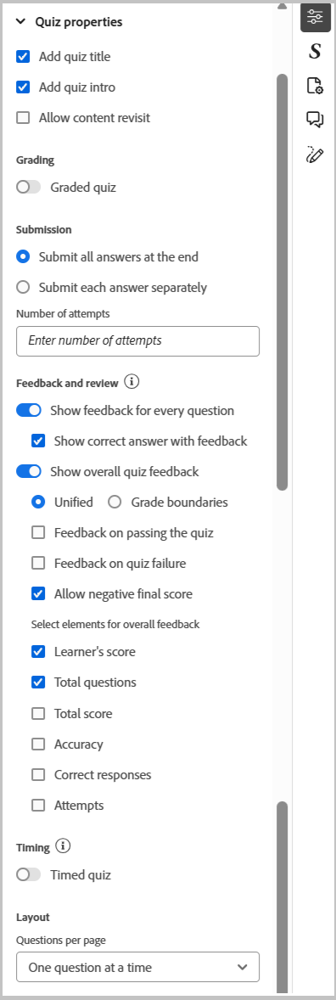

# 测验属性

可以使用以下选项配置测验属性：

- 将光标放在测验标题或测验简介上，然后从右侧面板打开&#x200B;**内容属性**&#x200B;面板。 您可以在此处编辑测验属性。

  {width="650"}

- 确保编写测验时测验标题和简介不留空，因为它们显示在已发布测验的第一张幻灯片上。 如果错误地删除，您可以通过选择&#x200B;**添加测验标题**&#x200B;和&#x200B;**添加测验简介**&#x200B;选项来恢复它们。
- 您可以通过打开&#x200B;**评分测试**&#x200B;切换开关来启用测验的评分。 启用后，您可以选择基于百分比或绝对的评分方法，并相应地定义通过标准。

  {width="350"}

- 您还可以配置其他设置，如答案提交选项、反馈和审核选项、测验时间以及布局偏好设置，如下所示。

  {width="350" height="200"}

- 您可以使用测验属性中的&#x200B;**允许内容重新访问**选项在正在进行的测验期间重新访问课程内容；类似于打开的书籍测试。 但是，启用此选项后，无法配置提交选项，并且测验计时功能被禁用。
  {width="350" height="200"}
