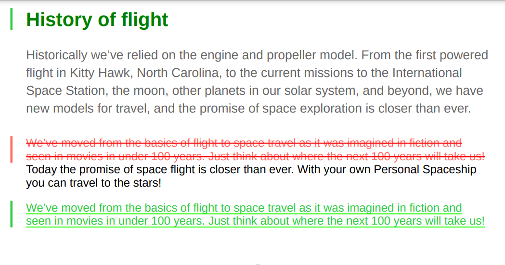
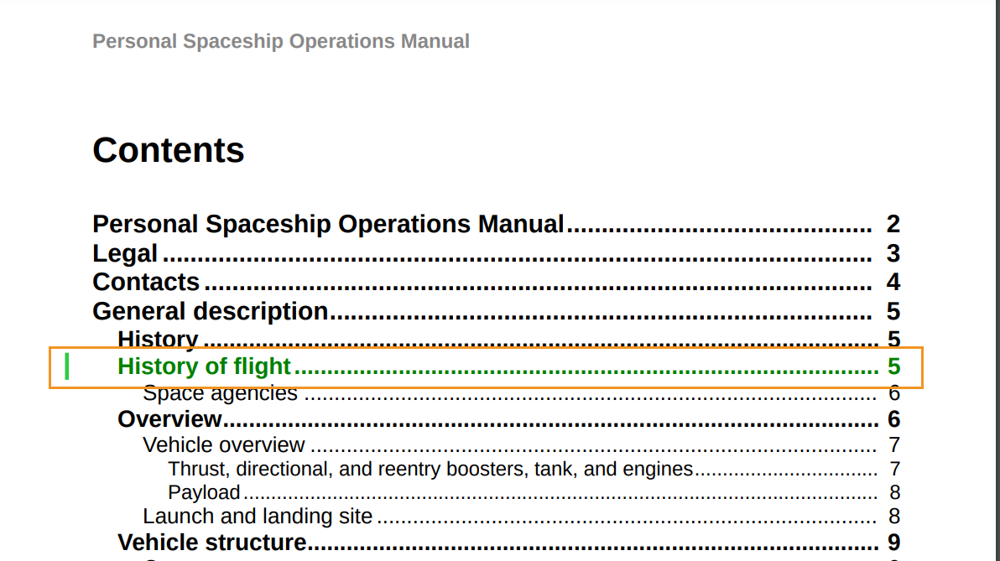

# 使用自定义更改条样式

更改条是一条垂直线，用于直观地标识新内容或修订的内容。 AEM Guides允许您在标题中更改的内容左侧显示更改栏，并且允许您在PDF输出的目录中显示更改的主题。

有关显示更改栏的更多详细信息，请参阅&#x200B;*发布PDF输出*&#x200B;中的[创建发布版本间具有更改栏的PDF](../web-editor/native-pdf-web-editor.md)设置。

## 更改的主题内容

更改栏显示在已插入、更改或删除的主题的内容左侧。

您可以修改以下样式以显示更改的内容以及更改栏。


>[!NOTE]
>
>这些样式是`layout.css`文件的一部分，您可以根据需要编辑它们。

例如，您可以使用`.inserted-block`样式中的color属性来定义插入内容在已发布的PDF输出中的显示方式。


```css
...
.inserted-block { 
  color: #2ECC40; 
  display: inline; 
  -ro-comment-content: " "; 
  -ro-comment-style: underline; 
  -ro-comment-title: "Inserted"; 
  -ro-comment-date: attr(data-time); 
  -ro-comment-dateformat: "yyyy/dd/MM HH:mm:ss"; 
} 
...
```

同样，您可以使用`.deleted-block`样式定义已删除内容在已发布PDF输出中的显示方式。

```css
...
.deleted-block { 
  display: inline; 
  color: #FF6961; 
  text-decoration: line-through; 
  -ro-comment-content: " "; 
  -ro-comment-style: strikeout; 
  -ro-comment-title: "Deleted"; 
  -ro-comment-date: attr(data-time); 
  -ro-comment-dateformat: "yyyy/dd/MM HH:mm:ss"; 
} 
...
```

您可以使用`.inserted-change-bar`和`.deleted-change-bar`样式来修改更新内容左侧的更改条的外观。

例如，您可以使用`-ro-change-bar-color`样式中的`.inserted-change-bar`属性以绿色显示插入的更改栏。 您还可以使用`-ro-change-bar-color`样式中的`.deleted-change-bar`属性以红色显示已删除的更改栏。

```css
...
.inserted-change-bar { 
  -ro-change-bar-color: #2ECC40; 
} 

.deleted-change-bar { 
  -ro-change-bar-color: #FF6961; 
  } 
...
```



## 更改了目录(TOC)中的主题

您还可以在PDF输出的目录中已更改的主题左侧添加更改栏。 您可以使用`-ro-change-bar-color`样式中的`.changed-topic`特性，以所选颜色为目录列表中的更新主题添加更改栏。

例如，可以添加绿色更改栏。

```css
...
.changed-topic { 
 -ro-change-bar-color: #2ECC40; 
}  
...
```


该选项会针对目录中所有已完成更新的主题显示绿色更改栏。 您可以单击目录中已更改的主题并查看详细更改。


