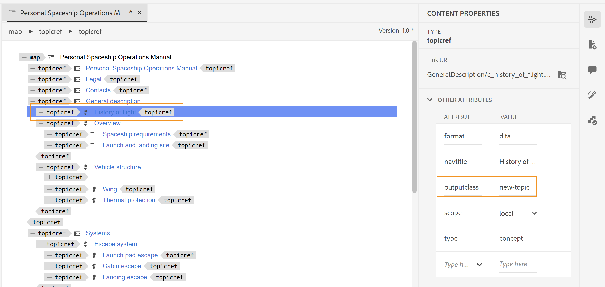
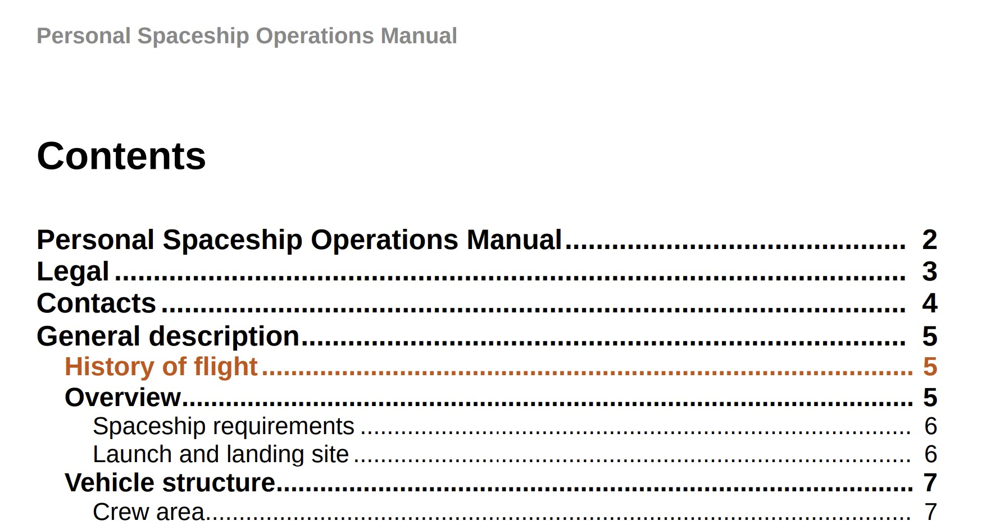

# 对目录条目和主题内容应用自定义样式

您可以在支持的映射元素（如`<topicref>`和`<topichead>`）上使用`outputclass`属性，将自定义样式应用于目录条目、主题头或单个主题。 要将自定义格式应用于整个主题，请在CSS中扩展`outputclass`属性的样式定义。

## 设置通过`<topicref>`引用的主题的样式

您可以对`<topicref>`元素应用`outputclass`来设置所生成PDF中目录条目、主题标题或完整主题内容的样式。

例如，要确定需要审阅的主题，请将outputclass属性添加到DITA映射中的相应`<topicref>`元素，并在CSS中定义关联的样式。

在以下示例中，*航班历史记录*&#x200B;主题已分配了一个值为`new-topic`的`outputclass`属性。



`new-topic`类可用于定义以下对象的样式：

* 目录或迷你目录中的主条目
* 主内容中主题的标题
* 主题的整个内容，包括标题

以下CSS定义会更改目录条目和主题标题的文本颜色：

```css
.new-topic {
  color:#CC5309
}
```

此定义控制目录中的文本颜色和主题标题。 以下PDF输出显示了应用于目录条目的不同颜色：



主题的标题也使用相同的颜色进行样式设置。


如果希望目录条目和主题的标题具有不同的样式，则可以分别定义它们，如下所示：

```css
...
/*for styling TOC entry */
.new-topic {
  color:#CC3509
}

/* for styling topic's title */
.new-topic.title {
  color:#092ACC
}
...
```

要将样式应用于整个主题内容，请将`-content`后缀附加到类名。 以下示例在主题内容中添加了更改栏：

```css
...
/* for styling the topic's content */
.new-topic-content {
  -ro-change-bar-color:#A609CC;
}
...
```

使用上述样式属性，*航班历史记录*&#x200B;主题的左侧添加了更改栏，如下所示：


## 将样式应用到`topichead`元素

您可以使用`<topichead>`元素上的`outputclass`属性将不同的样式应用于目录条目和为`topichead`生成的标题。

例如，如果您在DITA映射中定义以下`topichead`：

```xml
<topichead navtitle="Getting Started" outputclass="new-topichead">
    ...
</topichead>
```

`new-topichead`类应用于目录中的主题标题项和为主题标题生成的标题。

如果要对标题应用不同的样式，请为其定义单独的类，类似于`<topicref>`如何支持目录条目和主题标题的单独样式：

```css
...
/* Style for the topichead TOC entry */
.new-topichead {
  color: #CC5309;
}

/* Style for the topichead heading */
.new-topichead.title {
  color: #092ACC;
}...
```

如果要设置与主题头关联的内容的样式，请将`- content`后缀附加到类名：

```css
.new-topichead-content {
    border-left: 2px solid #cccccc;
    padding-left: 8px;
}
```


## 从目录中删除空行

如果尚未定义任何主题的标题，则此类主题的目录中将出现空行。

要从目录和迷你目录中删除空行，请在`layout.css`中添加以下样式：

```css
.toc-body a:empty,
.chaptoc-body a:empty {
    display: none;
} 
```

