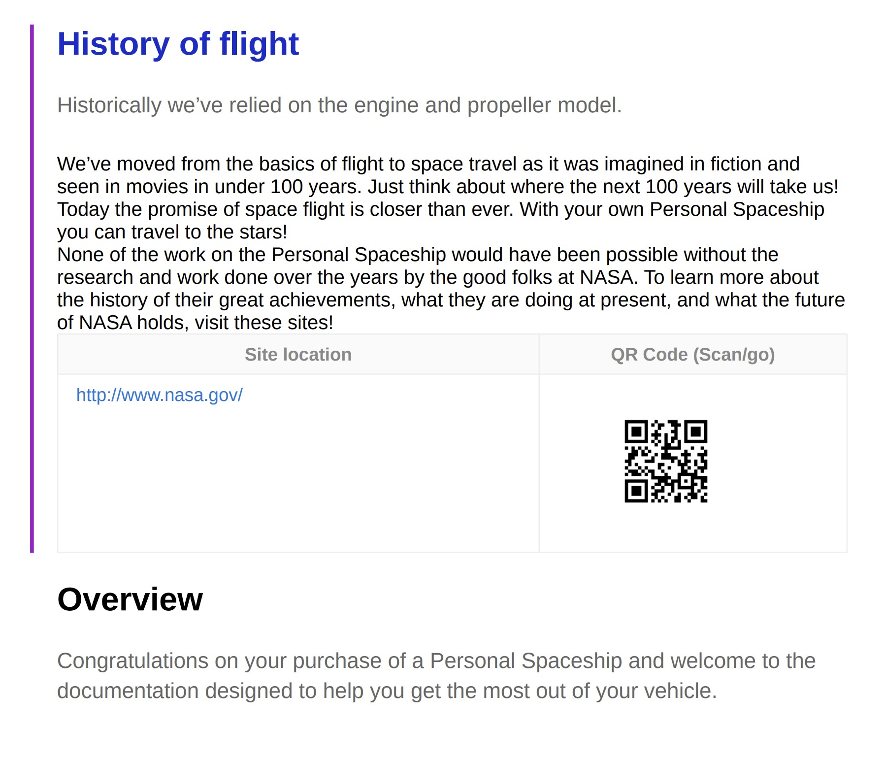

# 对目录条目和主题内容应用自定义样式

有时，您可能希望对目录条目或特定主题应用自定义样式。 可以通过将`outputclass`属性与DITA映射中的`<topicref>`元素关联来做到这一点。 此外，如果要将自定义格式应用于整个主题，则也可以通过在CSS中扩展属性的样式定义来实现该目的。

让我们以您要发送以供审阅的新主题为例。 为便于识别更新的主题，您需要向DITA映射中的`<topicref>`元素添加`outputclass`属性，然后在CSS中为相同元素定义自定义样式。

在以下示例中，*航班历史记录*&#x200B;主题已分配了一个值为`new-topic`的`outputclass`属性。


CSS中`new-topic`的类定义允许您为以下项定义样式：
* 目录或迷你目录中的主条目
* 主内容中主题的标题
* 主题的整个内容，包括标题

让我们看看如何在CSS中定义每种场景。 在`new-topic`类的以下CSS定义中，文本颜色已更改。

```css
…
.new-topic {
  color: #CC5309
}
…
```

此定义控制目录中的文本颜色和主题标题。 以下PDF输出显示应用于目录条目的不同颜色：


主题的标题也使用相同的颜色进行样式设置。


如果希望目录条目和主题的标题具有不同的样式，则可以分别定义它们，如下所示：

```css
...
/*for styling TOC entry */
.new-topic {
  color: #CC3509
}

/* for styling topic's title */
.new-topic.title {
  color: #092ACC
}
...
```

最后，您还可以在主题的整个内容中应用样式。 为此，您需要向类名添加后缀“`-content`”。 在以下示例中，更改栏已添加到主题的整个内容中：

```css
...
/* for styling the topic's content */
.new-topic-content {
  -ro-change-bar-color: #A609CC;
}
...
```

使用上述样式属性，*航班历史记录*&#x200B;主题的左侧添加了更改栏，如下所示：


