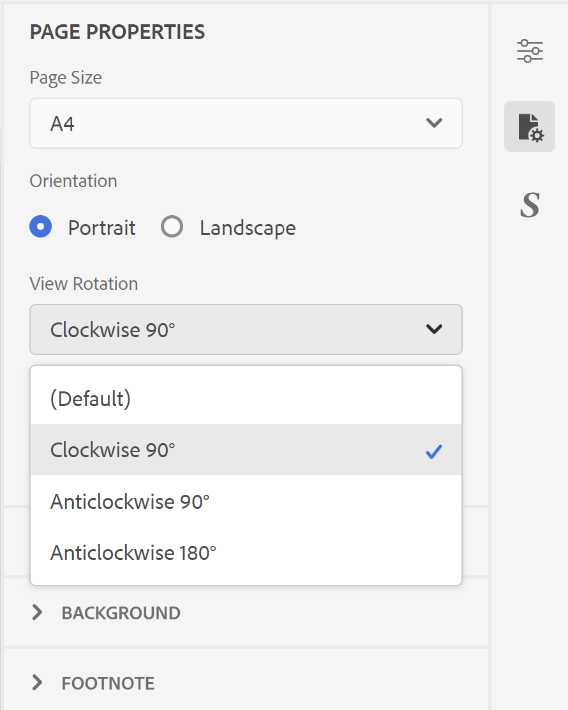
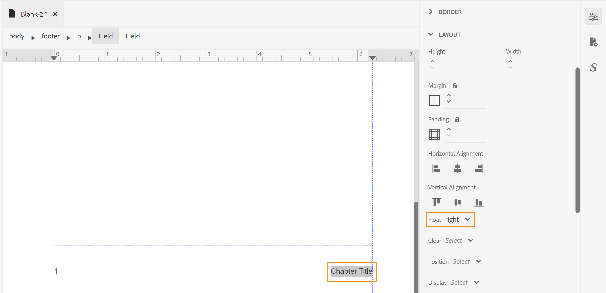
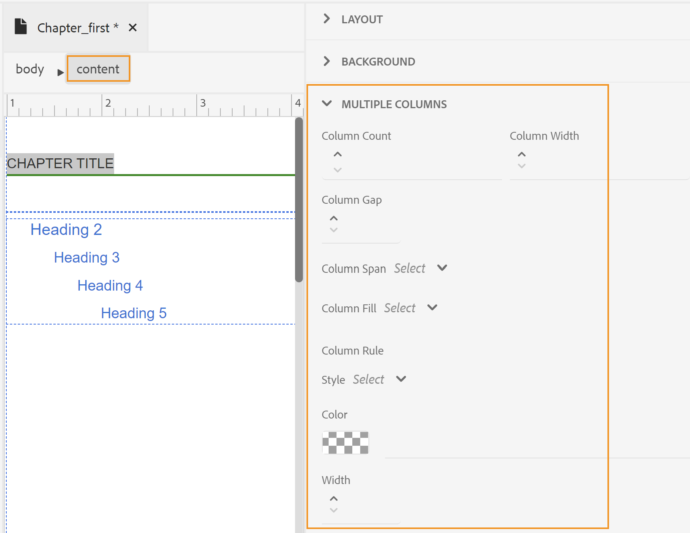

# 设计页面布局 {#design-page-layout}

在创建PDF文档时，您将拥有用于呈现不同类型信息的各个部分。 例如，PDF文档将从头页或封面开始，其中包含您公司的徽标、书籍标题或版本信息。 然后是章节、附录或词汇页。 PDF文档中的每个部分的外观都不一样，具体可以通过创建和自定义页面布局来实现。

设计页面布局时，您可以定义构成页面的各种元素。 例如，可以在页面上定义页面大小、边距、页眉和页脚、方向以及其他页面规范。 本机PDF发布功能允许您根据[页面媒体标准](https://www.w3.org/TR/css-page-3/)设计页面。 使用本机PDF发布功能的用户界面，可轻松自定义分页媒体标准中涵盖的大多数设置。 对于其他高级级格式，您可以使用Source视图编写您自己的CSS代码。

设计页面布局后，需要将这些布局与PDF页面布局设置中各自的节相关联。 有关如何创建和打开要进行自定义的页面布局的详细信息，请参阅[创建和自定义页面布局](components-pdf-template.md#create-customize-page-layout)部分。

## 页面布局类型 {#types-of-page-layout}

PDF文档通常包含以下部分：

* 封面
* 目录
* 数字提升
* 表提升度
* 章节或主题页面
* 术语表
* 索引
* 后页

这些部分将需要相应的页面布局才能以特定格式呈现信息。 此外，您还可以具有空白页，该空白页用作从奇数页或偶数页开始新章节的填充符。 在这种情况下，您可以使用默认页面布局或为空白页面创建页面布局。 有关更多详细信息，请参阅[创建新页面布局](components-pdf-template.md#create-page-layout)。

通过&#x200B;**模板>设置**&#x200B;部分下的“页面布局”设置，您可以定义用于PDF各个部分的页面布局。 每个页面布局还可以有不同的第一页、右页或左页变体。

### 创建第一个、右侧或左侧页面布局变量 {#page-layout-variants}

可通过具有不同第一、右或左页面布局变体，进一步自定义PDF模板中的不同页面布局。 您可以使用页面布局设计器以不同方式设计这些页面。

>[!NOTE]
>
>如果您希望书籍中的某个章节有一个版面布局，则无需创建“首页”、“右页”或“左页”版面布局。

创建页面布局时，请考虑以下几点：

>[!NOTE]
>
>以下几点以章节页面布局为例。 但是，这些点对于其他页面布局也有效。

* 如果要为一个章节中的所有页面使用单个页面布局，则只需创建单个章节页面布局，而无需任何变体。

* 如果您希望书籍中章节的首页具有不同的外观，则需要为章节创建首页布局变体。

* 如果您希望书本的每个左侧和右侧页面都具有不同的外观，则需要为章节页面布局创建左侧和右侧变体。

* 如果您希望章节从奇数页或偶数页开始，则可以选择为空白页创建页面布局。 此页面布局用于填充两章之间的空白以确保章节从所需的奇数页或偶数页开始。

  >[!NOTE]
  >
  >如果不创建单独的空白页面布局，则使用默认页面布局。 若要创建页面布局，请参阅[新建页面布局](components-pdf-template.md#create-page-layout)。

以下示例将指导您完成创建页面布局变体的过程：

1. 使用“创建新页面布局”过程中给出的步骤创建“章节”页面布局。

   在“页面布局”下创建并添加了一个空白的章节页面布局。

   默认情况下，在创建页面布局时，也会打开该布局进行编辑。 以下屏幕快照显示空白（默认）页面布局：

   

   默认情况下，将创建模板中的页眉、页脚和内容区域。 您可以使用用户界面中提供的页面属性、内容属性和各种工具（如插入图像、字段等）轻松自定义这些区域。

   >[!NOTE]
   >
   >对于高级配置，您可以使用Source视图并添加自定义HTML和CSS代码。

1. 将鼠标悬停在&#x200B;**Chapter**&#x200B;布局上，然后单击&#x200B;**选项**&#x200B;以显示上下文菜单。

1. 单击或将鼠标悬停在&#x200B;**添加布局变体**&#x200B;上并选择想要创建的页面布局（第一个、左侧或右侧）。

使用基本章节布局的副本创建选定的页面布局。 这意味着，如果您对默认章节页面布局进行了任何更改，则在创建页面布局时，同样的更改将会复制到变体页面布局中。

## 使用页面布局的页面属性 {#page-props-page-layout}

在设计页面布局时，必须控制各种页面属性。 本机PDF发布功能封装“页面属性”面板下的所有主要页面属性。 “页面属性”面板提供对以下部分下的各种属性的访问权限：

>[!NOTE]
>
>“页面属性”面板封装属性并遵循[页面媒体标准](https://www.w3.org/TR/css-page-3/)下定义的规则。

* **页面大小** ：指定您要用于页面布局的页面大小。 页面大小下拉列表允许您从15种以上的页面大小中进行选择。 您也可以使用自定义页面大小创建页面布局，有关更多详细信息，请参阅[设置页面大小](#set-page-size)。

* **方向** ：指定用于页面布局的页面方向。 您可以从“纵向”或“横向”页面方向中选择。 请注意，您可以选择将不同的方向应用于某个页面布局中的不同页面变体。 例如，如果内容包含宽表格或大图像，则可以创建横向页面布局并将该布局应用于较宽的表格或图像。

* **视图旋转** ：指定旋转后表示原始顶边的边或方向。 您可以选择“顺时针90”、“逆时针90”或“逆时针180度”。 当您希望在输出中使用纵向和横向布局的组合时，这非常有用。 例如，可以将纵向用作一般页面布局，并且可以设置横向页面布局以呈现宽表格。 在这种情况下，可设置为以顺时针90度显示表格内容。 这样，页面将定向为横向，内容将旋转90度以保持视图的连续性。 我们将在本节的后面部分查看如何实现此目标。

* **页码** ：默认情况下，PDF中的页码是连续的。 例如，一个100页的PDF可以具有1到100之间的连续页码。 也可以从所有不同节中的特定编号或第一次出现的节重新开始编号。
   * **从**&#x200B;重新启动：指定此页面布局的起始页码。 例如，您可以将每个章节的页码设置为重新启动。 在这种情况下，您需要将章节页面布局的第一个页面布局变体上的从属性重新启动设置为1。 默认情况下，页面编号会从上一页继续。

   * **仅应用于第一次发生次数**：您也可以仅从第一次发生节的特定数字开始。 例如，您只能从1开始第一个章节，然后继续其他章节的页码。

* **布局** ：指定页边距以及上、下、左、右边的内边距。 下图说明了如何在内容周围呈现边距、边距和边框。 请注意，页面顶部和底部的边距包含页眉和页脚。

  

* **背景** ：包含图像或颜色作为页面布局的背景。 对于图像，可以指定图像的高度和宽度以及重复和位置属性。

* **脚注** ：指定要在输出中显示脚注的属性。 您可以选择指定边距和填充属性以及边框样式。

### 设置页面大小 {#set-page-size}

在页面布局中，需要定义的第一件事就是页面大小。 在“页面属性”中，可以为页面布局选择超过15个页面大小。 您还可以通过执行以下步骤来创建自定义页面大小：

1. 打开所需的页面布局进行编辑。

   >[!NOTE]
   >
   >请参阅[自定义页面布局](components-pdf-template.md#customize-page-layout)节，以打开页面布局进行自定义或编辑。

1. 在右侧面板中，单击&#x200B;**页面属性**。
1. 在&#x200B;**页面大小**&#x200B;下拉列表中，选择&#x200B;**自定义**。

   此时将显示“页面宽度”和“页面高度”字段。

1. 在&#x200B;**页面宽度**&#x200B;和&#x200B;**页面高度**&#x200B;字段中输入所需的页面尺寸。

   >[!NOTE]
   >
   >一些最常用的单位是px（像素）、pt（点）、rem、em、%（百分比）和in（英寸）。

### 使用页面方向和视图旋转 {#page-orientation-rotation}

让我们看一个示例，其中使用了纵向和横向页面方向以及视图旋转属性的组合。 在本例中，我们将创建具有默认纵向的PDF，但表格将以横向呈现，内容以顺时针90度视图显示。 最终输出将与以下内容类似：


在上面的输出中，联系人列表信息以横向模式显示，内容也旋转90度。 其余内容以正常纵向模式显示。

要达到这种输出，我们需要执行以下主要任务：

1. 创建具有横向的页面布局。

1. 将&#x200B;**视图旋转**&#x200B;属性更改为90°渲染内容。

1. 创建自定义样式以使用新页面布局。

1. 在表的outputclass定义中添加样式，以便我们以横向页面布局呈现。

执行以下步骤以完成上述任务：

1. 创建具有横向的页面布局。
   1. 使用“创建新页面布局”过程中给出的步骤创建“横向”页面布局。

   1. 在右侧面板中，单击&#x200B;**页面属性**。

      
   1. 将&#x200B;**方向**&#x200B;更改为&#x200B;**横向**。

1. 更改“视图旋转”属性以顺时针90°方向渲染内容。

   1. 从视图旋转下拉列表中选择&#x200B;**顺时针90°**。

   

   1. 单击&#x200B;**全部保存**&#x200B;可保存更新的页面布局属性。

1. 创建自定义样式以使用新页面布局。
   1. 展开左侧边栏，然后双击要在其中创建样式的模板。

   1. 展开样式表部分。

   1. 将鼠标悬停在布局样式表上，单击（_选项_&#x200B;图标）。..并选择“编辑”。

      将打开布局样式表进行编辑。

   1. 右键单击&#x200B;**其他样式**&#x200B;并选择&#x200B;**新建样式**。

      

   1. 在“添加样式”弹出窗口中，在&#x200B;**classname**&#x200B;中输入&#x200B;**横向样式**。

      

   1. 单击&#x200B;**完成**。

      已创建名为`.landscape-style`的新样式，并将其添加到“其他样式”列表的末尾。

   1. 双击`.landscape-style`样式以将其打开以进行编辑。

   1. 展开&#x200B;**分页**&#x200B;属性。

   1. 在&#x200B;**页面布局**&#x200B;属性中输入`Landscape`。

      

   1. 单击&#x200B;**全部保存**&#x200B;以保存更新的样式属性。

1. 在表的`outputclass`定义中添加样式，以便我们以横向页面布局呈现。
   1. 在DITA文件编辑器中，打开要应用新页面布局的文件。

   1. 查找将在横向模式下呈现的`<table>`元素。

   1. 在痕迹导航中，单击表元素以选择表。

      

   1. 在右侧面板中，单击并打开“内容属性”面板。

   1. 在“内容属性”面板中，添加一个新的&#x200B;**outputclass**&#x200B;属性，该属性具有&#x200B;**横向样式**&#x200B;作为属性值。

      

1. 单击&#x200B;**全部保存**&#x200B;以保存更新的文件。
1. 生成PDF输出。

最终PDF将以横向模式呈现表内容，如示例开头所示。

### 添加背景图像 {#add-bg-image}

根据要求，您可能需要添加一个背景图像，该图像会显示在章节(PDF)输出的每个第一页上。 通过“页面属性”下的“背景”属性，您可以轻松添加背景图像。 您可以选择跨页面复制此图像，并将图像放置在页面的顶部、底部或中心区域的任意位置。

例如，要在内容区域的中心插入背景图像，请执行以下步骤：

1. 打开所需的页面布局进行编辑。

   >[!NOTE]
   >
   >请参阅[自定义页面布局](components-pdf-template.md#customize-page-layout)节，以打开页面布局进行自定义或编辑。

1. 单击内容区域中的任意位置。

1. 在右侧面板中，单击&#x200B;**页面属性**。

1. 展开&#x200B;**背景**&#x200B;部分。

1. 单击&#x200B;**图像路径**&#x200B;位置字段中的浏览按钮。

1. 浏览并选择要用作背景图像的图像。

   插入并复制图像以覆盖整个页面。

1. 通过调整高度和宽度属性来更改图像大小。

   >[!NOTE]
   >
   >可以输入高度或宽度属性中的任何一个，因为图像会自动缩放以保持纵横比。

1. 设置其他属性可调整背景图像的显示方式。

   * **后台重复** ：指定是否要后台重复。

   * **背景位置** ：指定页面上背景图像的位置。

以下屏幕截图显示了背景重复属性设置为&#x200B;_no-repeat_，背景位置属性设置为&#x200B;_center_&#x200B;的背景图像。


## 使用页眉和页脚 {#work-header-footer}

在页面布局的页眉或页脚中包含信息时，该信息会在使用该页面布局的所有页面上重复。 通常，页眉区域用于章节或主题标题，页脚区域用于显示页码。

创建新页面布局时，默认情况下将创建页眉和页脚区域。 您可以在页面布局的页眉和页脚区域中进行许多自定义。 例如，您可以插入图像（如徽标）、变量（包含动态信息）或静态内容。

### 更改页眉和页脚边距和行 {#header-footer-margins}

默认情况下，页眉和页脚边距设置为1英寸。 您可以通过更改“页面属性”面板中的“边距”设置来更改此默认值。 执行以下步骤以更改页眉和页脚大小：

1. 打开所需的页面布局进行编辑。

   >[!NOTE]
   >
   >请参阅[自定义页面布局](components-pdf-template.md#customize-page-layout)节，以打开页面布局进行自定义或编辑。

1. 在右侧面板中，单击&#x200B;**页面属性**。
1. 展开&#x200B;**布局**&#x200B;部分。
1. 单击&#x200B;**边距**&#x200B;属性旁边的锁定图标。
1. 要更改标题大小，请在上边距字段中输入所需的值。

   >[!NOTE]
   >
   >一些最常用的单位是px（像素）、pt（点）、rem、em、%（百分比）和in（英寸）。

1. 要更改页脚大小，请在下边距字段中输入所需的值。

您可以将页眉和页脚区域设计为包含多行。 为此，请使用插入HTML元素()图标在页眉或页脚区域中。

| _开发人员园地_：  |
|---|

如果您希望直接使用CSS和HTML代码，则可以更改边距值，如以下代码片段中所示：

```css
…

<meta name="page-style" content="size:A4 portrait;margin-top:3cm;margin-right:30pt;margin-bottom:1in;margin-left:90px;" />

…
```

>[!NOTE]
>
>在上例中，使用不同的单位来指定边距值。

### 删除页眉和页脚 {#remove-header-footer}

页眉和页脚叠加在顶边距和下边距中。 从技术上讲，这意味着如果要在页面布局中包含页眉和页脚，则必须保留页眉和页脚的上下边距中的所需空间。

如果您不希望页面布局具有页眉和页脚，可以通过两种方式实现这一点：

* 如果要保留顶边距和下边距，请将页眉和页脚区域留空。
* 如果您不想保留上边距和下边距（如设计杂志的前封面和后封面），则可以通过将上边距和下边距属性设置为0来删除边距。 没有页眉和页脚的空间。

### 在标题中添加图像或徽标 {#add-image-header}

根据要求，您可能需要添加显示在页面布局的标题区域（或任何其他部分）中的图像。 您可以通过两种方式在页面布局中添加图像：

* 使用模板资源中的图像。
* 在页面布局编辑器中使用\&lt;添加图像\>工具。

>[!NOTE]
>
>建议使用资源文件夹来管理所有模板资产，如图像或字体。

要在标题区域中插入与公司徽标类似的图像，请执行以下步骤：

1. 打开所需的页面布局进行编辑。

>[!NOTE]
>
>请参阅[自定义页面布局](components-pdf-template.md#customize-page-layout)节，以打开页面布局进行自定义或编辑。

1. 单击编辑标题()图标，将光标置于标题区域。

   或者，在标题区域内部单击。

1. 要添加图像，请选择以下任一方法：
1. 单击&#x200B;**插入图像** (工具栏中的)图标；在&#x200B;**选择路径**&#x200B;弹出窗口中，浏览到图像位置并单击&#x200B;**选择**&#x200B;以将其插入标题区域。
1. 将图像从“资源”文件夹拖放到标题区域。

以下屏幕截图显示了添加到标题区域中的示例图像。


插入图像后，您可以修改其属性，以提供所需的外观和感觉。 要更改页面布局中图像或任何其他元素的外观，最简单的方法是使用“内容属性”面板。 有关可通过用户界面自定义的各种属性，请参阅[使用内容属性面板](#work-with-content-props)。

### 添加字段和元数据 {#add-fields-metadata}

当您要插入一条预定义的信息时，字段非常有用。 例如，您可以在章节的标题区域中包含“章节标题”字段，该字段在发布时将被实际章节的标题替换。

您可以在页面布局中插入以下字段类别：

* 元数据
* 主题标题
* 章节标题
* 地图标题
* 页码
* 章节编号
* 总页数
* 日期
* 用时


这些字段类别中的每一个都包含不同的变化，可在其中插入字段信息。 例如，日期字段可以有不同的变量，如`YYYY-MM-DD`、`MM/DD/YY`、`MM/DD/YYYY`等。 同样，页码可以有罗马字、小数格式或甚至区域设置特定格式的变体，如&#x200B;_阿拉伯语_、_梵文_、_希伯来语_&#x200B;等。


除了预定义字段外，您还可以将元数据信息作为变量或字段添加到页面布局中。 此元数据可以存储在源DITA **映射内容**、**主题内容**&#x200B;中，也可以从DITA **映射文件属性**、**主题文件属性**&#x200B;中提取。

您可以从以下选项中选择元数据：

* **映射内容**&#x200B;包含您在DITA映射的`<topicmeta>`元素中定义的元数据。
* **映射文件属性**&#x200B;包含元数据，您可以从DITA映射的&#x200B;**属性**&#x200B;页面访问这些元数据。
* **主题内容**&#x200B;包含在DITA主题的`<prolog>`元素中定义的元数据，如版权、作者和其他详细信息。 要获取单个`<prolog>`元素，您可以使用简单的XPath表达式（例如，//author作为作者名称）。 对于属性元数据，请在XPath中包含`@`符号(例如，//critdates/revised/@modified表示修改日期)。
* **主题文件属性**&#x200B;包含元数据，您可以从主题的&#x200B;**属性**&#x200B;页面访问该元数据。


可以在单个文档中合并&#x200B;**映射文件属性**&#x200B;和&#x200B;**主题文件属性**&#x200B;中的元数据。 例如，您可以发布PDF，其封面页具有地图标题，而其他页面标题具有主题标题。 为此，您可以将&#x200B;**映射文件属性**&#x200B;中的映射标题元数据添加到封面布局。 然后，将主题标题元数据从&#x200B;**主题文件属性**&#x200B;添加到章节和主题页面布局的标题中。

如果一个主题在一个页面上结束，而另一个主题从同一页面上开始，则选择第一个主题的元数据。 您还可以添加自定义属性，然后将它们作为字段插入到页面布局中。


>[!NOTE]
>
> 元数据字段根据您在&#x200B;**从**&#x200B;下拉菜单中选择的资源或映射显示。


<!--For more information, see [Add fields and metadata](design-page-layout.md#add-fields-and-metadata).-->

在以下示例中，我们将在页面布局的页脚区域插入页码和章节标题。

1. 打开所需的页面布局进行编辑。

   >[!NOTE]
   >
   >请参阅[自定义页面布局](components-pdf-template.md#customize-page-layout)节，以打开页面布局进行自定义或编辑。

1. 单击&#x200B;**编辑页脚** ()图标，将光标置于页脚区域。

   或者，在页脚区域内部单击。

1. 通过单击&#x200B;**插入HTML元素**&#x200B;插入段落元素()图标，并从元素列表中选择“段落”。

1. 单击&#x200B;**插入字段** ()图标。

   出现“Fields（字段）”弹出窗口。

1. 从字段列表中选择&#x200B;**页码**&#x200B;类别，从格式列表中选择&#x200B;**默认(1)**&#x200B;页码格式，然后单击&#x200B;**插入**。

   

   >[!NOTE]
   >
   >您还可以编辑所有字段的格式，默认格式除外。 为此，请单击要编辑的格式旁边的“编辑”图标，进行更改，然后单击“确定”。 有关详细信息，请参阅[添加字段和元数据](#add-fields-metadata)。

   默认页码字段插入页面布局的页脚区域。

   

   顶部痕迹导航列出了存储信息的元素。

1. 在页码字段后输入空格，然后单击&#x200B;**插入字段**&#x200B;图标。

1. 从字段列表中选择&#x200B;**章节标题**&#x200B;类别，从格式列表中选择&#x200B;**章节标题**&#x200B;格式，然后单击&#x200B;**插入**。

   在发布时使用章节标题填充的&#x200B;_章节标题_&#x200B;字段将插入到页脚区域。 此时，页码和章节标题字段以空格分隔。

   

1. 要右对齐章节标题，请执行以下步骤：

   1. 单击痕迹导航上的Field元素以选择Chapter Title字段。

   1. 在右侧面板中，单击&#x200B;**内容属性** ()图标。

   1. 展开&#x200B;**布局**&#x200B;属性部分，并将&#x200B;**浮点**&#x200B;属性值设置为&#x200B;**右**。

      

      章节标题字段朝向页脚的右侧。
      


| _开发人员园地_：  |
|---|

如果您希望直接使用CSS和HTML代码，则还可以通过转到页面布局的Source视图并在代码中进行更改来实现此目的。 以下代码片段显示了通过代码完成的相同页脚设置：

```css
…
<p>

<span data-field="page-number" data-format="default">1</span>

<span data-field="chapter-title" data-format="default" style="float: right">Chapter Title</span>

</p>
…
```

## 使用内容区域 {#content-area}

就内容空间而言，内容区域是最大的区域。 内容区域填充了主题的内容。 在某些特殊情况下，您可以在内容区域中添加样板内容。 此内容将在页面布局中的指定位置发布。 例如，目录、术语表和索引中的标题可以添加为样板内容，该内容在最终输出中“按原样”发布。 另一个示例是章节目录，它通常添加到每个章节的第一页。

内容区域中最常用的自定义设置之一是多列布局。 借助功能强大的页面布局设计器，您可以自定义要在多列中呈现的特定页面，同时将其他页面中的内容保留在一列中。

在以下部分中，我们将介绍自定义内容区域的各种场景。

### 添加章节目录 {#add-chapter-toc}

章节目录可作为一个快速参考，供读者了解章节内容。 通常，章节目录会添加到章节的开头。 因此，如果要使用章节目录，则可以将其添加到主章节页面布局或章节的第一个页面布局变体的内容区域中。

在以下示例中，我们将在章节的第一个页面布局中插入章节目录：

>[!NOTE]
>
>对于此过程，假定您已经为章节页面布局创建了第一个页面变体。 有关如何创建页面变体的说明，请参阅[创建第一个、右侧或左侧页面布局变体](#page-layout-variants)。

1. 打开所需的页面布局进行编辑。

   >[!NOTE]
   >
   >请参阅[自定义页面布局](components-pdf-template.md#customize-a-page-layout)节，以打开页面布局进行自定义或编辑。

1. 将光标置于页面布局的内容区域中。

1. 单击章节目录()图标。

   默认章节TOC插入到内容区域中。

   

   >[!NOTE]
   >
   >默认章节目录包含标题1到4。 在此，标题1是章节标题本身。 因此，您可能不希望目录中再次出现章节标题，或者您可能希望增加目录中所需标题的级别。 您可以通过更改属性来自定义目录。

1. 打开内容属性面板以自定义目录标题级别。

   例如，如果要从标题2开始，则将第一个下拉列表更改为从2开始。

   

   同样，如果您希望标题级别提高到5级，则将第二个下拉列表更改为5。 更新的目录如下所示：

   

   >[!NOTE]
   >
   >最终发布的PDF将仅显示基于章节内容的目录条目。 如果章节中没有级别5标题，它将不会显示在最终输出中。

可以使用样式表自定义默认目录的外观。 以`chaptoc-level-#`开头的样式（如`chaptoc-level-1`、`chaptoc-level-2`等）用于自定义章节目录的样式。<!--For more details on the stylesheet elements used in the TOC and how to customize them, see _Customize default chapter TOC_-->。

>[!IMPORTANT]
>
>目前，如果在样式表中进行了任何样式更新，则可能不会反映在内容预览中。 但是，输出会以更新的样式呈现。

### 使用多列页面布局 {#multi-column-layout}

多列版面配置在出版杂志或书籍索引中非常常见。 利用本机PDF发布功能，可轻松地将文档拆分为多个列。 使用不同的页面布局，您可以选择仅将特定区域分为多个列，同时将其他区域保留在单个列（或普通）布局中。

要创建多列的页面布局，请执行以下步骤：

1. 打开所需的页面布局进行编辑。

   >[!NOTE]
   >
   >请参阅[自定义页面布局](components-pdf-template.md#customize-a-page-layout)节，以打开页面布局进行自定义或编辑。

1. 当多列布局应用于内容（不包括页眉和页脚区域）时，您需要在痕迹导航中选择内容元素。

   选择内容痕迹导航后，“内容属性”面板将显示多列的属性。

   

1. 使用多列属性自定义多列页面布局：

   * **列数：**&#x200B;指定要除以页面的列数。 使用向上和向下箭头图标或输入数字来设置列数。

   * **列宽：**&#x200B;在多列布局中指定列的宽度。 默认情况下，以像素(px)设置大小，也可以以pt、rem、em、%或单位指定大小。

     >[!NOTE]
     >
     >如果不指定大小，则各列将均匀分隔，以适合给定的页面。 在大多数情况下，您无需指定此值。

   * **列间隔** ：指定各列之间的间距。

   * **列跨度** ：如果您希望页面布局中的任何元素跨列跨度，则需要使用此属性。 这是通过使用样式表修改所需元素的样式来实现的。<!--for more information see _Section explaining style customization_-->。

   在页面布局中，如果希望特定文本显示在所有章节页面布局的第一页，则可以将其添加到章节页面布局的第一页变体。

   如以下示例所示，标题文本的“跨度列”属性设置为“全部”。 这样可以确保即使文档是多列的，标题也跨列。

   

   >[!IMPORTANT]
   >
   >可以使用outputclass属性将Span Column属性应用于任何DITA元素。

   * **列填充** ：指定内容填充列的方式。 默认情况下，它被设置为Balance，即用相等数量的内容填充每个列。

   * **列规则** ：如果要在列之间插入一行，则使用此属性定义该行或直线样式。 指定“样式”、“颜色”和“宽度”的值以在列之间添加行。

## 使用内容属性面板 {#work-with-content-props}

通过“内容属性”面板，您可以轻松更新页面布局中元素的外观。 “内容属性”面板下的属性分为以下部分：

* **字体** ：包含与文本相关的属性。 可以设置字体系列、粗细、大小、文本修饰（下划线、上划线、直线）、文本样式（粗体、斜体等）、文本对齐（左、右、居中或两端对齐）、处理空格（预定义格式、无换行、断行符等）、行高、字母间距和文本缩进。

* **边框** ：包含用于向页面布局中的元素添加边框和设置边框格式的属性。 您可以设置边框侧（全部、顶部、底部、右侧或左侧）、边框样式（实线、虚线、虚线等）、边框颜色、宽度和半径来设置曲线边框。 在以下示例中，在页面的标题区域中添加了弯曲边框。

  

* **布局** ：包含用于在页面布局中配置元素布局的属性。 您可以设置“高度”、“宽度”、“边距和填充”（用于顶部、底部、左侧或右侧）、“水平对齐或垂直对齐”、“浮动”（用于左对齐、右侧或无）、“清除”（用于左对齐、右侧对齐、两者均对齐或无）、“元素位置”（用于绝对、固定、相对或更多）、“显示”（用于块、内容、固定或更多）、“Z索引”、“透明度”、“变换”（通过旋转或缩放）以及“变换原点”（通过X和Y偏移）。

* **背景** ：包含用于包含背景图像或颜色阴影的属性。 您可以设置“图像大小”（通过设置“高度”或“宽度”）、“背景重复”（重复、不重复、圆形等）和“背景位置”（左上、右中、中下等）。
* **多列** ：包含用于为页面或任何特定元素（如章节目录）配置多列属性的属性。 有关属性及其使用方式的更多详细信息，请参阅[使用多列页面布局](#multi-column-layout)。
