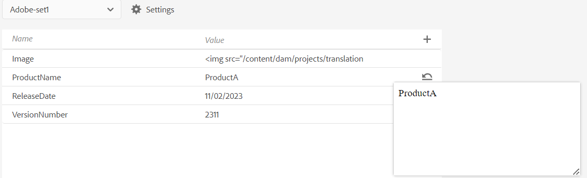

# PDF输出中的变量

变量是一对用作可重用信息的数据的名称值。 这使您的内容可移植且易于更新。 修改变量或其值时，该变量或值的每次出现都将更新。

## 创建新变量

执行以下步骤可创建变量：

{width="800" align="left"}

*创建变量并为其定义值。*

1. 在编辑器中，导航至左侧面板并选择 **变量** 。此选项位于“更多”部分下。
1. 选择“编辑”**&#x200B;** 以打开&#x200B;**变量**&#x200B;编辑器。
变量按字母顺序列出。
1. 在&#x200B;**Name**&#x200B;列中输入变量名称，并在&#x200B;**Value**&#x200B;列中输入其值。
   >[!TIP]
   >
   >您可以使用任何HTML内容作为变量值，以特定格式显示变量值。 例如，您可以向变量值添加 `<b>` 标签，以粗体显示值 **Experience Manager 指南** 。 您还可以将存储库中的图像添加为值。

1. 选择添加 **变量** 以添加新变量。 不能创建与现有变量同名的变量。 显示错误。

   >[!NOTE]
   >
   >如果不选择&#x200B;**添加变量** ，未创建变量并将其添加到列表。

这样，您便可以创建具有默认值的变量。 例如：
* 产品名称：Experience Manager Guides
* 版本号：2300
* 发行日期： 2023年1月1日

### 编辑变量

您可以通过两种方式编辑变量：

从左侧的“变量”面板&#x200B;**&#x200B;**

1. 在&#x200B;**变量**&#x200B;面板中选择一个变量。
1. 将鼠标悬停在变量上以查看&#x200B;**选项**&#x200B;菜单，然后选择&#x200B;**编辑**&#x200B;选项。
1. 在&#x200B;**编辑变量**&#x200B;对话框中，可以编辑所选变量的默认值。
1. 选择&#x200B;**完成**。

通过变量编辑器&#x200B;**&#x200B;**

1. 选择&#x200B;**变量** 左侧面板中的。
1. 选择&#x200B;**编辑** 以打开&#x200B;**变量**&#x200B;编辑器。

1. 在&#x200B;**变量**&#x200B;编辑器中，您可以编辑所选变量的值。

您需要保存从&#x200B;**变量**&#x200B;编辑器所做的任何更改，以便在左侧的&#x200B;**变量**&#x200B;面板中查看这些更改。

>[!NOTE]
>
> 如果您编辑任何变量值，Adobe Experience Manager Guides会同时更新所有引用（如果适用）。

### 搜索和预览变量

您可以搜索和预览变量的值。 在&#x200B;**变量**&#x200B;面板的搜索框中输入字符串。 它同时根据变量名称及其值执行搜索。
您可以通过两种方式预览变量：

变量的预览显示默认值。 例如，如果您已将ProductName变量的默认值定义为“Adobe Experience Manager Guides”，则它会在预览中显示此值。

从左侧的“变量”面板&#x200B;**&#x200B;**

1. 在&#x200B;**变量**&#x200B;面板中选择一个变量。
1. 将鼠标悬停在变量上以查看&#x200B;**选项**&#x200B;菜单，然后选择&#x200B;**预览**&#x200B;选项。

   从变量面板{width="550" align="left"}

*预览变量的默认值。*

通过变量编辑器&#x200B;**&#x200B;**

1. 将鼠标悬停在列表中的变量上以查看&#x200B;**选项**&#x200B;菜单。
1. 选择&#x200B;**预览**。

### 复制变量

您可以复制变量，并根据要求修改值。

1. 将鼠标悬停在列表中的变量上以查看&#x200B;**选项**&#x200B;菜单。
1. 选择&#x200B;**复制**。

变量的默认名称为`<selected variable name>`（如“示例”）。 您可以根据自己的要求更改名称。

### 删除变量

您可以通过两种方式删除变量：

从左侧的“变量”面板&#x200B;**&#x200B;**

1. 在&#x200B;**变量**&#x200B;面板中选择一个变量。
1. 将鼠标悬停在变量上以查看&#x200B;**选项**&#x200B;菜单，然后选择&#x200B;**删除**&#x200B;选项。

**从变量编辑器**

1. 将鼠标悬停在列表中的变量上以查看“ **选项** ”菜单。
1. 选择“删除&#x200B;**”**&#x200B;选项。

将从所有变量集中删除该变量。

## 输出预设的变量集

Adobe Experience Manager Guides还支持变量集，您可以使用变量集为变量分配替代值。 例如，公司可以销售两种产品：A和B。每个模块都有不同的规格。 这些规范可能包括产品名称、版本号和发布日期。 品牌可能还有其他差异。 使用变量集，可以为变量定义一组不同的值。 生成输出时，选择适当的变量集并生成所需的输出。

### 配置变量集

您需要先配置变量集，然后再向其添加任何变量。

1. 选择&#x200B;**设置** 打开&#x200B;**配置变量集**&#x200B;对话框。
   {width="550" align="left"}
1. 在&#x200B;**名称**&#x200B;列中输入变量集名称。
1. 选择&#x200B;**添加变量** 以添加新变量集。 变量集按字母顺序列出。
1. 您可以选择&#x200B;**删除**&#x200B;以删除变量集。

### 变量集操作

所有变量集都具有相同的变量，但可以具有不同的值。

您可以查看、编辑和预览特定变量集的值。 从&#x200B;**变量集**&#x200B;下拉列表中选择一个变量集。 根据所选变量集显示值。
编辑特定变量集中的变量值时，它会覆盖默认值并更改所选变量集的值。
例如，您可以为变量集设置以下值： *Adobe-set1*&#x200B;和&#x200B;*Adobe-set2*。

**变量集1**： *Adobe-set1*

* ProductName： ProductA
* 版本号：2311
* 发行日期： 2023年11月2日

**变量集2**： *Adobe-set2*

* ProductName： ProductB
* 版本号：2310
* 发行日期： 2023年9月7日

每个新变量都会添加到所有变量集中。 当您删除或复制变量时，将会为所有变量集更新该变量。

您还可以预览变量集的值。
例如，对于变量集*Adobe-Set1*，您已将ProductName变量的值定义为“ProductA”，然后在变量编辑器的预览中显示此值。

从变量编辑器预览{width="550" align="left"}

*预览您在所选变量集中定义的值。*

### 重置变量的值

如果编辑了该值，则还可以将变量重置为默认值。
重置 针对值已更改的变量显示。
例如，您可以将ProductName变量的值重置为默认值Experience Manager Guides。

## 在本机PDF模板中使用变量

您可以在生成产品文档输出时添加变量，以使它们可移植且易于更新。 您可以在文档的不同页面中显示的页面布局中插入这些变量。 例如，您可以添加变量ProductName ，该变量显示在页面布局的页眉区域（或任何其他部分，如页脚或正文）中。

要在标题区域中插入诸如ProductName之类的变量，请执行以下步骤：
1. 打开所需的页面布局进行编辑。

   >[!NOTE]
   >
   > 查看[自定义页面布局](../native-pdf/components-pdf-template.md#customize-a-page-layout-customize-page-layout)节，以打开页面布局进行自定义或编辑。

1. 选择标题可使其在插入变量时处于活动状态。

1. 您可以通过两种方式插入变量：

   从左侧的“变量”面板&#x200B;**&#x200B;**

   * 从&#x200B;**变量**&#x200B;面板中拖动一个变量，并将其放到标题区域。

   **从工具栏**

   1. 选择&#x200B;**插入变量/字段** 。
   1. 在&#x200B;**变量**&#x200B;对话框中，选择变量的名称以将其插入标题区域。
   1. 您还可以在文本框中输入搜索字符串。 将过滤包含给定字符串的变量名称，并将其显示在列表中。 选定的变量将插入标题区域。 您可以查看变量的默认值。
   1. 要替换变量，请双击该变量值，然后从 **“变量** ”对话框中选择另一个变量。 变量将被替换。

## 生成带变量的 PDF 输出

您可以使用其他变量的值生成PDF输出。 在生成布局之前，请从输出预设的&#x200B;**变量集**&#x200B;下拉列表中选择一个变量集以选取其值。

{width="550" align="left"}

*从输出预设的下拉列表中选择一个变量集，以便用于生成PDF输出。*

>[!NOTE]
>
> 您还可以从下拉列表中选择“（默认）”以发布所有变量的默认值。

根据所选的变量集，您将获得与变量集中定义的变量值对应的输出。 例如，如果您选择变量集 *Adobe-set1*，则输出将显示此集中定义的变量值。

*使用页面布局中的变量生成 PDF 输出。*

您还可以在需要时快速更新任何变量集的值并重新生成输出。 例如，如果需要更新版本的详细信息，可以在VersionNumber变量中更新版本的值并重新生成输出。
