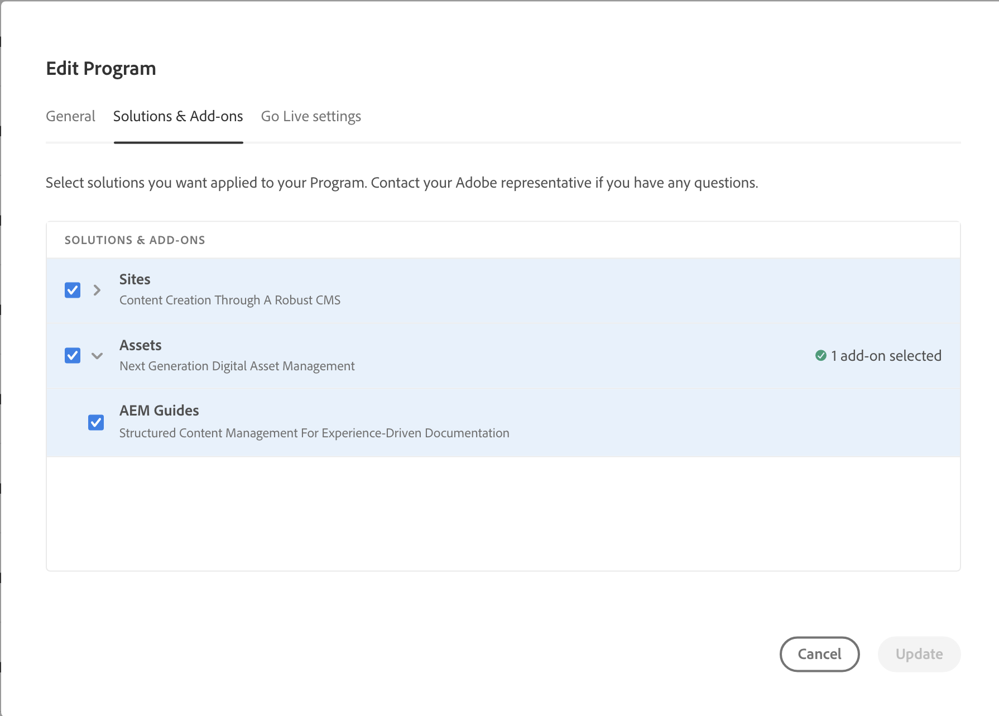

# [!DNL Adobe Experience Manager Guides] as a Cloud Service部署

了解如何将[!DNL Experience Manager Guides]添加到您的[!DNL Experience Manager as a Cloud Service]环境。

>[!NOTE]
>
> 从2024.2.0版本开始，Experience Manager Guides仅作为Experience Manager as a Cloud Service的自动加载项提供。 如果您使用Experience Manager Guides的手动部署，请在为项目启用Experience Manager Guides之前删除cloud manage git代码库中的第`<module>dox.installer</module> from file dox/pom.xml`行。

1. 登录到[!UICONTROL Cloud Manager]。

1. 编辑要为其配置[!DNL Experience Manager Guides]的程序。

1. 切换到&#x200B;**[!UICONTROL 解决方案和加载项]**&#x200B;选项卡。

1. 在&#x200B;**[!UICONTROL 解决方案和加载项]**&#x200B;表中，单击&#x200B;**[!UICONTROL Assets]**。

1. 选择&#x200B;**[!UICONTROL 指南]**&#x200B;并选择&#x200B;**[!UICONTROL 保存]**。

您已成功配置项目以自动配置Experience Manager Guides解决方案。

>[!NOTE]
>
>要在集成程序下的任何环境中安装[!DNL Experience Manager Guides]，必须运行与该环境关联的管道。 在CM Git代码库中无需额外配置即可安装[!DNL Experience Manager Guides]。
