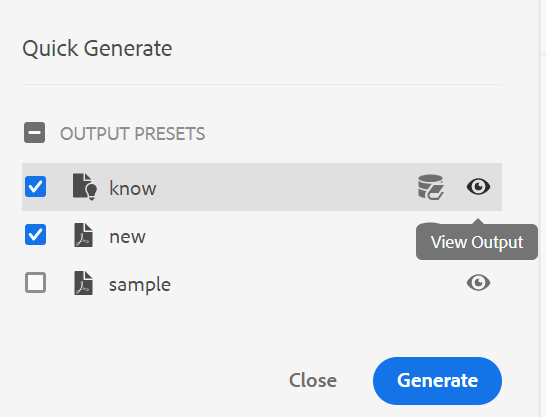

# Adobe Experience Manager Guides as a Cloud Service 10月版

## 升级到10月版

请通过以下步骤升级当前的Adobe Experience Manager Guides as a Cloud Service(以后称为&#x200B;*AEM Guides as a Cloud Service*)安装程序：
1. 检查云服务的Git代码，并切换到在云服务管道中配置的与您要升级的环境对应的分支。
1. 将云服务Git代码的`<dox.version>`文件中的`/dox/dox.installer/pom.xml`属性更新为2022.10.183。
1. 提交更改并运行云服务管道，以升级到AEM Guides as a Cloud Service的10月版。

## 兼容性矩阵

本部分列出了AEM Guides as a Cloud Service 2022年10月版本支持的软件应用程序的兼容性矩阵。

### FrameMaker和FrameMaker Publishing Server

| FMPS | FrameMaker |
| --- | --- |
| 不兼容 | 2020更新4及更高版本 |
| | |

*从2020.2开始的FMPS版本支持在AEM中创建的基线和条件。

### 氧气连接器

| AEM Guides as a Cloud | 氧气连接器窗口 | 氧气连接器Mac | 在氧气窗口中编辑 | 在氧气Mac中编辑 |
| --- | --- | --- | --- | --- |
| 2022.10.0 | 2.7.13 | 2.7.13 | 2.3 | 2.3 |
|  |  |  |  |  |

## 新增功能和增强功能

AEM Guides as a Cloud Service在10月版本中提供了以下增强功能和新功能：

### “快速生成”面板

现在，AEM Guides提供了&#x200B;**快速生成**&#x200B;面板，可帮助您快速生成和查看为DITA映射创建的预设的输出。

在&#x200B;**快速生成**&#x200B;面板中，您可以看到为DITA映射创建的所有输出预设的列表。

选择一个或多个预设并快速生成输出。 您还可以快速查看为预设生成的输出。 成功消息显示在输出的生成中。 如果输出生成失败，则显示错误消息。 您还可以查看错误日志，以了解生成过程中所发生错误的详细信息。

## 修复的问题

修复了多个区域中的错误如下：

* 原生PDF | 从PDF输出中删除仅资源主题时出错。 (10554)
* 原生PDF | PDF输出中显示空的键参照。 (10553)
* 原生PDF | 未对`navtitle`的`topichead`执行操作。 (10509)
* 原生PDF | 支持amd64 JDK风格。 (10465)
* 原生PDF | 无法从目录隐藏主题标题。 (10355)
* 原生PDF | 重新启动章节布局中的页码会从上一章的结尾开始随机进行编号。 (10154)
* Chrome浏览器 | 从UI拖放任何元素时，屏幕变为空白。 例如，从“条件”面板拖动条件时。 (10524)
* 对资产执行复制粘贴操作后，将删除节点属性。 (10053)
* 单击&#x200B;**关闭**&#x200B;用户时，系统会将用户重定向到资源 — 已更正该体验，以将用户转到AEM主页。 (9654)
