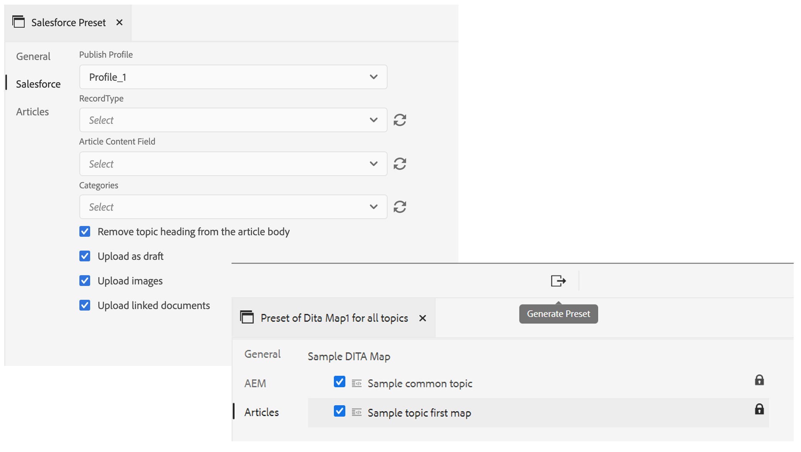
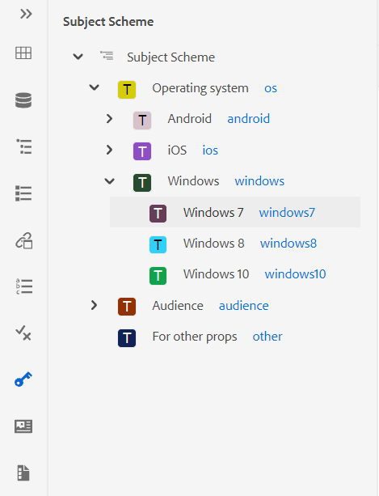
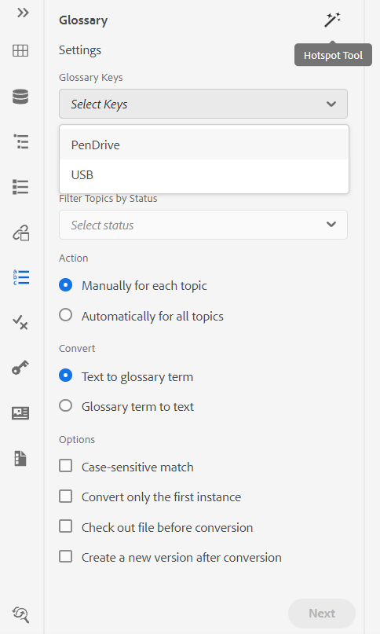
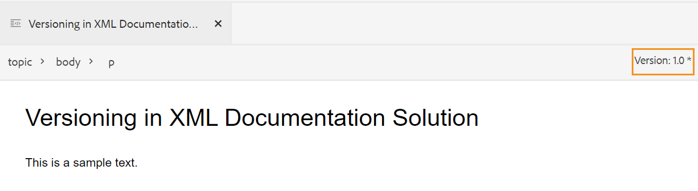
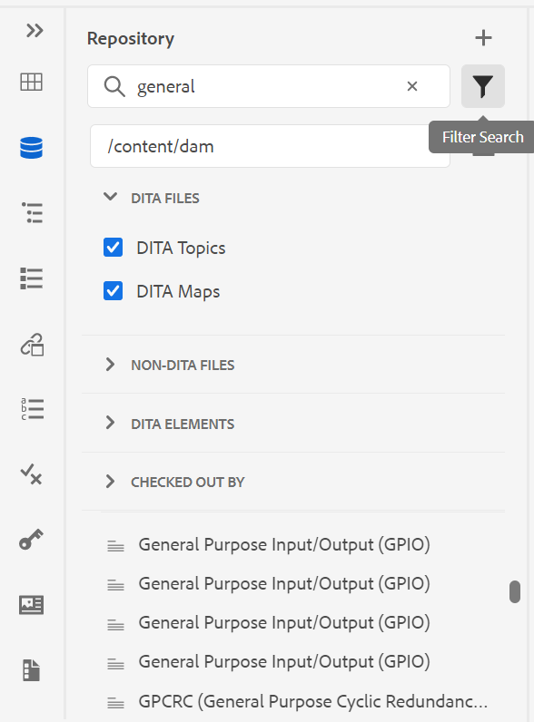
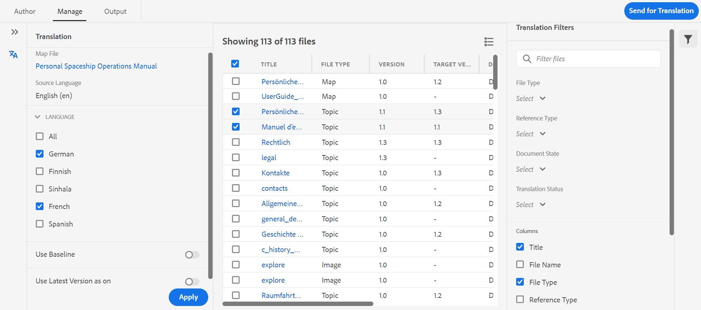
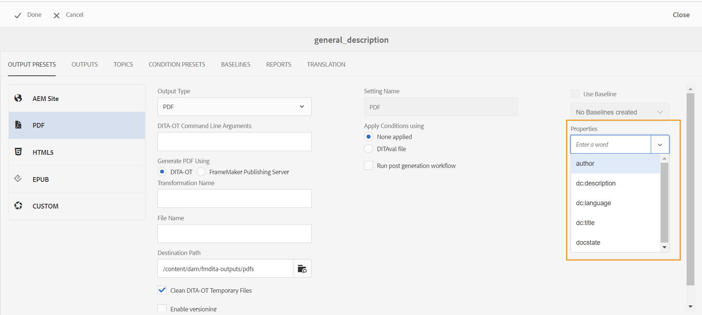
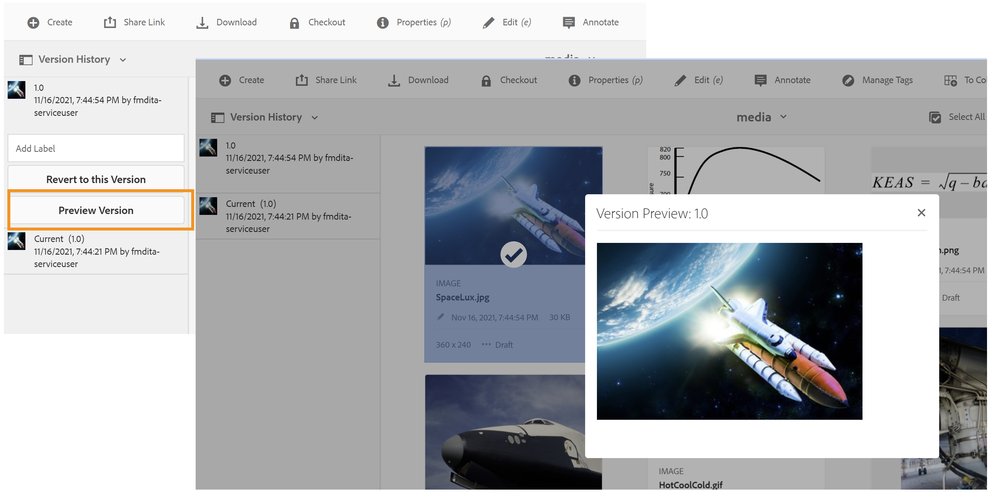
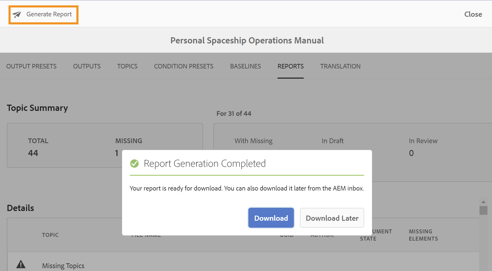

# 发行说明 |Adobe Experience Manager Guides 4.0.x

**免责声明**：

*Adobe Experience Manager Guides*&#x200B;以前称为&#x200B;*XML Documentation for Adobe Experience Manager*。 请注意，文档中的某些引用可能仍引用以前的品牌，但仍适用于当前产品。

本发行说明介绍Adobe Experience Manager Guides版本4.0.x（以后称为AEM Guides）中的升级说明、新增功能和增强功能。

## 4.0.3 |发行说明

### 兼容性矩阵

本部分列出了AEM Guides版本4.0.3支持的软件应用程序的兼容性矩阵。

#### Adobe Experience Manager

- 版本6.5 Service Pack 12、10、11或9

有关更多详细信息，请参阅《安装和配置指南》中的&#x200B;*技术要求*&#x200B;部分。

#### FrameMaker和FrameMaker Publishing Server

| 发行版本 | FMPS 2020 | FMPS 2019 | Fm 2020 | Fm 2019 |
|---|---|---|---|---|
| 非UUID | 2020.2或更高版本* | 2019 | 2020.3或更高版本 | 2019.8（最新更新） |
| UUID | 2020.2或更高版本* | 不兼容 | 2020.4或更高版本 | 不兼容 |

*从FMPS 2020.2版开始，支持在XML Documentation解决方案中创建的基线和条件。*

#### 氧气连接器

| 发行版本 | 氧气连接器窗口 | 氧气连接器Mac | 在氧气窗口中编辑 | 在氧气Mac中编辑 |
|---|---|---|---|---|
| 非UUID | 1.6.8 | 1.6.8 | 1.5 | 1.5 |
| UUID | 2.3.8 | 2.3.8 | 2.2 | 2.2 |

### 修复的问题

修复了多个区域中的错误如下：

- 在AEM中还原文件版本后，氧气会签出不正确版本的主题。 (9661)
- 还原文件版本时，Assets UI中显示不正确的时间戳差异。 (9662)
- 文件在恢复到任何版本时会自动签出。 (9663)
- 如果语言代码为fr-fr或en-us，则已翻译内容将断开。 (9665)
- 在非UUID版本中，当目标语言代码包含5个字符（如fr_ca）时，批准的翻译不会集成到目标语言。 (9666)
- 在启用了创建新版本的情况下完成翻译后，图像的目标版本显示为jcr:root。 (9668)
- 使用基线完成翻译时，将发送错误的图像版本进行翻译。 (9669)

## 4.0.2 |发行说明

### 兼容性矩阵

本部分列出了AEM Guides版本4.0.2支持的软件应用程序的兼容性矩阵。

#### Adobe Experience Manager

- 版本6.5 Service Pack 12、10、11或9

有关更多详细信息，请参阅《安装和配置指南》中的&#x200B;*技术要求*&#x200B;部分。

#### FrameMaker和FrameMaker Publishing Server

| 发行版本 | FMPS 2020 | FMPS 2019 | Fm 2020 | Fm 2019 |
|---|---|---|---|---|
| 非UUID | 2020.2或更高版本* | 2019 | 2020.3或更高版本 | 2019.8（最新更新） |
| UUID | 2020.2或更高版本* | 不兼容 | 2020.4或更高版本 | 不兼容 |

*从FMPS 2020.2版开始，支持在XML Documentation解决方案中创建的基线和条件。*

#### 氧气连接器

| 发行版本 | 氧气连接器窗口 | 氧气连接器Mac | 在氧气窗口中编辑 | 在氧气Mac中编辑 |
|---|---|---|---|---|
| 非UUID | 1.6.8 | 1.6.8 | 1.5 | 1.5 |
| UUID | 2.3.8 | 2.3.8 | 2.2 | 2.2 |

### 修复的问题

修复了多个区域中的错误如下：

- 新创建的审阅文档中插入或删除的文本的位置不正确。 (9454)
- 在某些情况下，在4.0.1升级后，版本1.0未列在&#x200B;**版本历史记录**&#x200B;面板下。 (9441)
- 在&#x200B;**版本历史记录**&#x200B;面板下，在某些情况下，未列出版本1.0下当前版本的标签和注释。 (9440)
- 在编辑器中打开某些内容文件时，编辑器冻结。 (9433)
- 在存储库面板中搜索，在搜索大型内容文件时&#x200B;*topicref*&#x200B;浏览对话框冻结。 (9432)
- 从Web编辑器保存文件一次时，会为文件创建两个版本。 (9428)
- 无法在topicref中插入非DITA和二进制资产。 (9363)
- 加载包含大量键的映射预览时，编辑器挂起。 (9332)
- 使用FM update 4进行创作时，在源文件中移动资产时引用中断。 (9177)

### 已知问题

- 如果&#x200B;**为上载的文件创建新版本**&#x200B;设置打开，则会在某些情况下间歇性地选择&#x200B;**全部保存**&#x200B;时创建一个新版本。
- 在Chrome浏览器上，文件夹配置文件下的“删除用户”功能不会间歇性地工作。 **解决方法**：刷新Chrome浏览器。

## 4.0.1 |发行说明

### 兼容性矩阵

本部分列出了XML Documentation解决方案4.0.1版支持的软件应用程序的兼容性矩阵。

#### Adobe Experience Manager

- 版本6.5 Service Pack 12、11或10
- Java： 11

#### FrameMaker和FrameMaker Publishing Server

| 发行版本 | FMPS 2020 | FMPS 2019 | Fm 2020 | Fm 2019 |
|---|---|---|---|---|
| 非UUID | 2020.2或更高版本* | 2019 | 2020.3或更高版本 | 2019.8（最新更新） |
| UUID | 2020.2或更高版本* | 不兼容 | 2020.4或更高版本 | 不兼容 |

*从FMPS 2020.2版开始，支持在XML Documentation解决方案中创建的基线和条件。*

#### 氧气连接器

| 发行版本 | 氧气连接器窗口 | 氧气连接器Mac | 在氧气窗口中编辑 | 在氧气Mac中编辑 |
|---|---|---|---|---|
| 非UUID | 1.6.8 | 1.6.8 | 1.5 | 1.5 |
| UUID | 2.3.8 | 2.3.8 | 2.2 | 2.2 |

### 修复的问题

修复了多个区域中的错误如下：

- 添加/删除重复的主题引用时，映射的引用树断开。 (8922)
- **版本历史记录**&#x200B;的&#x200B;**当前**&#x200B;版本部分中存在多个问题。 (8909)
- 使用&#x200B;**全选**&#x200B;并将多媒体文件或DITA内容移动到其他文件夹时，引用中断。 (8897)
- 在Web编辑器中，**插入交叉引用** > **文件引用** > **搜索文件** > **筛选器** > **更改搜索路径**&#x200B;对话框出现多个UI问题。 (8889)
- 在映射编辑器(8983)上搜索&#x200B;*topicref*&#x200B;和&#x200B;*ditavalref*&#x200B;时出现问题。
- 在键入内容时进行搜索会导致在“存储库”视图中产生不需要的搜索请求。 (8982)
- 无法删除文件夹配置文件中的管理员用户。 (8926)
- 引用脚注不会滚动到AEM站点输出中的脚注部分。 (9061)
- 无法将更新的文章发布到Salesforce。 (9008)
- 在并排视图中，高亮显示的位置不正确。 (9009)
- 无法对DITA主题拖放条件。 (9031)
- 无法在文件夹配置文件中覆盖css_layout.css。 (9032)
- 上传后查看资产时收到异常。 (9068)
- 在XML编辑器中自定义允许的特殊字符无法正常工作。 (9075)
- 在翻译工作流中，为已翻译资产创建附加版本。 (9107)
- 使用其他主题中的图像作为&#x200B;*conref*&#x200B;的主题进行基线发布，该图像不会显示在输出中。 (9172)
- 在使用下载时，如果下载失败，则不会清理下载映射API临时目录。 (9176)
- 水平对齐方式不可用于4.0版本中的表。 (9207)
- 未显示&#x200B;*glossref*&#x200B;的键属性，因此无法通过插入引用插入缩写表单。 (9213)
- 创建&#x200B;*keydef*&#x200B;仅允许在4.0中选择链接。 (9214)
- 插入键定义/*keyref*&#x200B;功能在4.0中的行为与3.8.10中的行为不同。 (9215)
- 修复了3.8.6到3.8.10版本中存在的Web编辑器问题。 (9219)
- 在选项卡的标题中使用任意关键字时出现问题。 (9317)
- Source视图显示非条件属性的多个错误。 (9278)
- **选择路径**&#x200B;的浏览对话框中存在问题。 (9289)

## 4.0 |发行说明

### 兼容性矩阵

本部分列出了XML Documentation解决方案4.0版支持的软件应用程序的兼容性矩阵。

#### Adobe Experience Manager

- 版本6.5 Service Pack 11、10或9

#### FrameMaker和FrameMaker Publishing Server

| 发行版本 | FMPS 2020 | FMPS 2019 | Fm 2020 | Fm 2019 |
|---|---|---|---|---|
| 非UUID | 2020.2或更高版本* | 2019 | 2020.3或更高版本 | 2019.8（最新更新） |
| UUID | 2020.2或更高版本* | 不兼容 | 2020.4或更高版本 | 不兼容 |

*从FMPS 2020.2版开始，支持在XML Documentation解决方案中创建的基线和条件。*

#### 氧气连接器

| 发行版本 | 氧气连接器窗口 | 氧气连接器Mac | 在氧气窗口中编辑 | 在氧气Mac中编辑 |
|---|---|---|---|---|
| 非UUID | 1.6.8 | 1.6.8 | 1.5 | 1.5 |
| UUID | 2.3.8 | 2.3.8 | 2.2 | 2.2 |

### 新增功能和增强功能

#### 基于文章的发布

在版本4.0中，我们引入了一个集成在Web编辑器中的基于文章的发布功能。 您可以使用基于文章的发布功能递增地生成一个或多个主题的输出，或将内容发布到知识库平台。

此功能允许用户以累加方式构建DITA映射，并在准备就绪时发布主题。 发布映射后，请使用基于文章的发布功能来实现仅更新文章的增量发布。

除了AEM之外，您还可以使用此独特功能将文章发布到任何知识库门户，如Salesforce。 此功能还附带一个OOTB内容模板，它基于AEM核心组件构建，允许您创建技术内容的基于知识的存储库。 此模板的优点在于，它可完全自定义以符合您的组织要求，并且还可支持企业Intranet门户等用例。

这种按需文章发布功能不仅让您能够完全控制内容发布，还可以减少发布更新内容的整体时间。

有关更多详细信息，请参阅《用户指南》中的&#x200B;*从Web编辑器发布基于文章*。

#### 改进了Web编辑器

Web编辑器中引入了许多增强功能和新功能：

- 将核心框架从基于Coral的UI更改为基于频谱的UI。 这提供了一个非常标准化和直观的UI。
- 右侧面板中引入了新的“文件属性”功能。 您可以检查活动文档的属性。 该信息分为两个部分：
   - *常规*：包含常规文件详细信息，如文件名、UUID、元数据标记、语言、创建日期、签出状态和文档状态。
   - *引用*：包含传入和传出引用。

     

- Web编辑器中还添加了主题方案支持。 您现在可以使用“主题方案”面板创建和使用主题方案。 除了主题方案之外，您现在可以使用自己的公司元数据和分类。

  

- 此版本中引入了新的词汇热点工具，用于批量管理词汇表。 使用此工具，您可以快速将选定地图或打开主题的文本转换为术语表，并将术语表批量转换为术语。

  

- 在可重用内容面板中添加了刷新功能，通过该功能可快速刷新引用文件中的可重用内容。
- 新的文件更新指示器显示文件的当前（工作副本）是否与保存的版本同步。

  

- 存储库面板和文件浏览对话框中的搜索筛选器已得到增强，可提供更多可进一步自定义的筛选选项。

  

- 您现在可以从Web编辑器上传.docx文件。
- 用户首选项现在存储在用户配置文件中，而不是浏览器的Cookie中。 这有助于用户在不同浏览器或用户会话间保留其偏好设置。

#### 新建翻译仪表板

Web编辑器中引入了新的翻译功能板，该功能板具有以下功能：

- 对主题列表进行排序、搜索和过滤。
- 按引用类型筛选内容 — 直接或间接引用。
- 轻松导航，以便在启动翻译请求时查找现有项目。
- 引入了多语言翻译机制，以避免在为多种语言启动翻译请求时为每个语言创建多个项目。
- 引入了一种配置，用于在地图仪表板中隐藏翻译选项卡。 默认情况下，它是可见的。 您可以选择使用映射仪表板或Web编辑器翻译内容。

在Web编辑器中

#### 增强型发布

发布过程中现在提供了以下增强功能：

- 通过FrameMaker Publishing Server生成的PDF现在支持基线和条件预设。
- 现在，作者可以将映射和主题级别的元数据传递到DITA-OT发布。 当自定义PDF模板设计为使用文件元数据属性（如标记、作者、文档状态等）时，这非常有用。

  

- 在configMgr中添加了新配置，以允许用户在AEM站点输出生成中使用&#x200B;**删除和创建**&#x200B;选项时保留或删除要删除的主题版本。

#### 改进了文件处理

在AEM Assets中处理文件时，现在可以看到以下改进：

- 引入了新的文件上传体验和用于选择冲突解决策略的新对话框。

  

- 能够创建已上传文件的新版本，并防止覆盖已签出的文件。
- 现在，您可以直接从“版本历史记录”视图中查看图像的预览。 此外，对于DITA和非DITA文件，“版本历史记录”将单独显示当前版本信息。

  

#### 新的报告导出功能

报告在确定内容的运行状况时非常有用。 XML Documentation解决方案提供了各种报告来控制您的内容。 现在，您不仅可以查看报表，还可以将报表数据导出为CSV文件，以便查看和共享更大的团队。 报表数据可以让您快速浏览任何断开的链接或缺少的图像。

#### 改进了氧气DAM刷新体验

在氧气中从AEM服务器刷新文件时，如果在当前氧气会话中有未保存的文件，则会显示警告消息。 您可以选择取消刷新操作以保存任何未保存的文件。 如果没有此功能，用户将丢失其文档中的任何未保存信息。

#### 其他功能增强

- 根据AEM的最佳做法，应用程序数据现已从/content/fmdita、/etc/fmdita/和/content/dxml/迁移到更新的位置。
- DAM资产更新工作流已重新引入，具有更好的处理和优化的性能，可与XML后处理工作流一起运行。
- XML Documentation API包现已可在公开访问的Maven存储库中获取。
- 您现在可以在/apps/projects/templates路径下创建新的Dita项目模板。
- 现在，从文件夹配置文件下载默认的ui_config.json文件。 升级时，可使用此选项合并现有ui_config.json文件中的自定义更改。

### 修复的问题

修复了多个区域中的错误如下：

#### Web编辑器

- conref即使未损坏，也会以红色显示。 (8239)
- 在DITAVAL编辑器中选择&#x200B;**添加所有属性**&#x200B;时，不会自动填充条件属性的值。 (8234)
- 作者无法使用相对路径在主题中插入图像。 (8112)
- 在表格单元格中添加的pH conref以红色显示。 (8083)
- 对于基于UUID的系统，当移动所审阅的文件时，审阅任务中的链接不会更新。 (8080)
- Web编辑器无法正确渲染缩放属性设置为75%或更高的图像。 (8073)
- GIF图像在Web编辑器中呈现为静态图像。 (8024)
- 注释元素中的conkeyref不会显示在Web编辑器预览或输出中。 (8006)
- 在编辑器中不会解析本身为conref的元素的xref。 (7933)
- 在编辑器预览和存储库面板中，包含键的标题无法正确呈现。 (7909)
- 包含特殊字符的代码片段无法正确存储。 (7908)
- 即使存在JS验证问题，仍会将POST请求发送到服务器。 (7989)
- 在格式化MathML公式后保存主题会导致错误。 (7954)
- 在编辑器中无法正确呈现具有(tm)的keydef，并且AEM站点输出包含重复的TM符号。 (7859)
- 根据DTD，拖放代码片段不起作用。 (7758)
- HTML将忽略图形的自定义尺寸。 (7718)
- 移动源文件时，conrefred属性不会更新。 (7698)
- 使用参考主题类型文档会导致多个UI问题。 (7656)
- 当作者在映射中添加ditavalref时，不显示DITAVAL文件。 (7594)
- 将outputclass特性添加到`<tgroup>`元素时，在每个空白`<entry>`元素中发现意外的空格。 (7532)
- Source按钮不适用于通过地图仪表板打开的主题。 (7465)
- Pretty print插入空白行和空格，当文件在FrameMaker或Oxygon中打开时，可以看到这些空格和空格。 (7408)
- 任何主题中带有href=&quot;/&quot;的映射都不会发布在AEM网站上(7405)
- 当根映射包含大量键值时，在编辑器中发现性能问题。 (7400)
- 带有自定义模板的映射的文档状态不会从其相应的状态配置文件继承。 (7359)
- `<tm>`元素错误地呈现为块元素。 (7286)
- 创建新模板时，编辑器模板面板中会显示重复的模板。 (5814)
- 在ui_config中为图像定义的用于设置其他属性的模板不适用于拖放情况。 (5713)
- menucascade中uicontrol的默认外观不正确。 (5483)
- 主题/映射的自定义模板不会在UI中显示新名称。 它将名称显示为“Topic”/“Map”，而不是显示配置的名称(4958)

#### 氧气连接器

- 在Oxygon中加载时，其父文件夹包含特殊字符的文件会出错。 (8054)
- 在Oxygen中打开新创建的文档时，会引发“无法找到GUID”错误。 (7856)
- 将文件从AEM中签出后，使用“在氧气中编辑”禁用签入选项。 (7471)

#### 审阅

- 从AEM收件箱重新分配审核任务时，任务接受者看不到与任务关联的有效负载。 (8003)
- 如果文件名具有空间，则“审阅”任务页不显示（多媒体）文件的内容。 (8111)

#### 映射仪表板

- 在地图仪表板的主题或报表选项卡的主题标题中无法查看conref内容。 (8263)
- AEM Sites输出 更新DITA主题标题时，生成的网站页面的|jcr:title未更新。 (8131)
- 下载MAP不下载主题中使用的视频文件。 (8070)
- 如果AEM bookmap在不同的文件夹中有2个同名主题，则平面层次结构的bookmap下载失败。 如果存在名称相同但大小写不同的文件，则将其视为重复文件。 (8058)
- 通过下载书图API使用对象标记时，不会下载媒体文件。 (8057)
- 如果有任何主题的conref文件标题以conref开头，则“报告”选项卡中显示不正确的报告。 (4698)

#### 发布

- 选择“启用版本控制”后，PDF创建首次失败。 (8053, 8294)
- 对于非UUID内容，conref图像不会显示在AEM网站输出中。 (7907)
- 在AEM站点输出中，空白字符会在“tm；”标记后自动添加。 (7964)
- 无法在AEM站点输出中查看YouTube视频。 (7401)
- 用户单击浏览映射仪表板基线选项卡中的所有主题后，无法按标签筛选引用内容。 (7388)
- 具有属性值SM或reg的元素`<tm>`的发布主题在生成的输出中显示不正确。 (7239)
- 图像的基线发布未在已发布输出中选取图像的最新版本。 (7231)
- “基线”选项卡中显示可引用的主题。 (5424)
- 标题中带有conkeyref的主题的增量发布无法按预期工作。 (4474)
- 页面标题不用于生成输出URL，即使已勾选该设置也是如此。 (8257)
- 基线发布选取图像的当前版本而不是冻结节点。 如果图像文件名中包含空格或特殊字符，也会出现这种情况。 (8274, 8322)
- 对于具有mapref类型主题方案的DITA映射，增量发布失败。 (8218)

#### AEM Assets

- 对Assets UI中的大型内容集执行选择/删除时发现性能问题。 (8238)
- 如果将DITA谓词添加到搜索筛选器，则保存的搜索功能（智能收藏集）将中断。 (8048)
- 将图像还原到旧版本不起作用。 (DXML-7903)
- 删除选项对于没有删除权限的作者也可见。 (7322)
- Assets编辑器的CCMS叠加会中断删除选项的呈现。 (8093)

#### 内容导入

- HTML到DITA的转换 |如果表中的“tr”具有空的“td”条目，则会在输出中导致额外的行。 (8132)
- HTML到DITA的转换 | HTML具有一个带多个主体的表失败，出现异常。 (7940)
- HTML到DITA的转换 |如果源HTML包含注释，则出现错误。 (7937)
- 导入DITA 1.3 DITA文件会导致某些href转换为格式错误的链接。 (8019)

#### 其他

- 在“版本历史记录”视图中，图像的缩略图丢失或损坏。 (7948, 8008)
- 如果内容中的引用发生错误，则zipMapWithDependents API不会提供相关信息。 (7521)
- 对于UUID客户，为数不多的配置更改了默认配置值，例如用于识别UUID文件的正则表达式、使用页面标题生成输出等等。 (8301, 8305)

## 升级说明 {#upgrade-instructions}

您可以轻松地将当前版本的AEM Guides升级到版本4.0.3。 在继续升级到版本4.0.3的AEM Guides之前，必须考虑以下几点：

- 如果您使用的是版本4.0.2，则可以直接升级到版本4.0.3。 在升级到4.0.3之前，您需要升级到4.0.2版。
- 如果您使用的是版本4.0，则可以直接升级到版本4.0.2。
- 如果您使用的是版本4.0.1，则需要卸载它。
- 如果您使用的是版本3.8.5，则需要先升级到版本4.0，然后再升级到4.0.2。
- 如果您使用的版本低于3.8.5，请参阅特定于产品的安装指南中的升级部分。

有关详细信息，请参阅[升级说明](https://helpx.adobe.com/content/dam/help/en/xml-documentation-solution/4-0-3/Adobe-Experience-Manager-Guides_Upgrade-Instructions_EN.pdf)。

