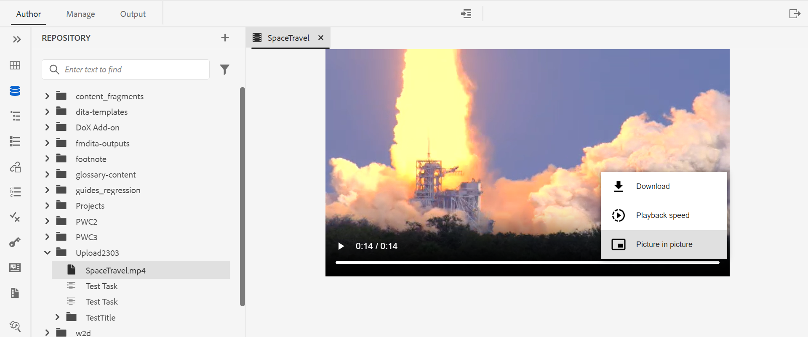

# Adobe Experience Manager Guides as a Cloud Service 2023年3月版的新增功能

本文介绍2023年3月版本的Adobe Experience Manager Guides（以后称为&#x200B;*AEM Guides as a Cloud Service*）中的新增功能和增强功能。

有关升级说明、兼容性矩阵以及此版本中修复的问题的更多详细信息，请参阅[发行说明](release-notes-2023-3-0.md)文章。

## 在Web编辑器中打开并播放视频或音频文件

AEM Guides现在提供在Web编辑器中打开和播放音频或视频文件的功能。 您可以更改视频的音量或视图。 在快捷菜单中，您还可以选择&#x200B;**下载**、更改&#x200B;**回放速度**&#x200B;或查看&#x200B;**画中画**。

