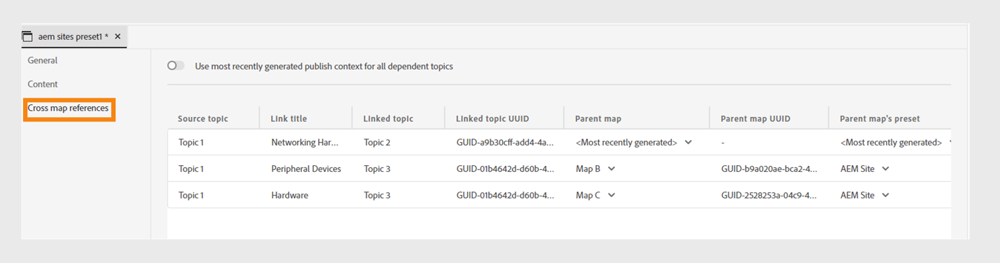

# 2024.10.0版（2024年10月）的新增功能

本文介绍Adobe Experience Manager Guides as a Cloud Service 2024.10.0版本中引入的新增功能和增强功能。

有关此版本中修复的问题列表，请查看 [2024.10.0 版本中已修复的问题](fixed-issues-2024-10-0.md)。

了解2024.10.0版[&#128279;](../release-info/upgrade-instructions-2024-10-0.md)的升级说明。

## 发布增强功能

2024.10.0版本中的内容发布功能进行了以下增强：

### 内容片段发布中的增强

Experience Manager Guides在内容片段中还提供了一些有用的增强功能：

- Experience Manager Guides允许您将主题或其元素发布到内容片段。

- 您可以从&#x200B;**文件属性**&#x200B;的&#x200B;**输出**&#x200B;部分发布和查看主题的内容片段。

- 您可以在发布到内容片段时，通过用条件筛选内容来轻松创建内容片段变体。

- 使用新的映射界面轻松选择元素并将其发布到内容片段。

现在，内容片段发布仅替换映射的内容，而不是覆盖完整的内容片段。 此功能允许内容片段包含来自多个源的数据，如多个主题或内容片段编辑器。

有关详细信息，请查看[Publish内容片段](../user-guide/publish-content-fragment.md)。

### 基于条件筛选器的Publish Experience Fragment变量

Experience Manager Guides允许您将主题或其元素发布到体验片段。 现在，您也可以使用条件或DITAVAL过滤器来创建体验片段变体，并在不同渠道或不同受众中重复使用它们。

详细了解如何[Publish体验片段](../user-guide/publish-experience-fragment.md)。

### 为方便使用，重新组织了AEM Sites预设

这些设置已重新组织，以帮助您快速配置输出预设并生成AEM Sites输出。
您可以通过在&#x200B;**新建输出预设**&#x200B;对话框中选择&#x200B;**使用旧版组件映射**&#x200B;选项来创建现有的AEM Sites预设。

查看AEM Sites预设中的&#x200B;**常规**、**内容**&#x200B;和&#x200B;**交叉映射引用**&#x200B;选项卡：
- **常规**：包含用于生成输出的常规配置。 您可以指定站点和输出路径，删除或覆盖现有的输出页面，删除已删除主题的先前生成的页面，选择设计模板，保留临时文件，以及指定生成后工作流。
- **内容**：包含适用于生成输出的内容的设置。 您可以选择筛选器、DITA映射基线以及要发布的元数据属性。
- **交叉映射引用**：此列表包含主题包含作用域=&quot;peer&quot;的交叉映射引用。 您可以为其他DITA映射中可用的主题的scope=&quot;peer&quot;的交叉映射引用列表指定发布上下文。 如果您使用Experience Manager Guides (UUID)版本，将显示此选项卡。

### Web编辑器中来自AEM Sites预设的交叉映射引用

Experience Manager Guides的最新增强功能在Web编辑器的AEM Sites预设中引入了跨映射引用。
Experience Manager Guides中的交叉映射引用有助于改进内容导航、提高内容重用性和增强用户体验。

您可以为对具有scope=&quot;peer&quot;的其他DITA映射中可用的主题的交叉映射引用列表指定发布上下文。 例如，映射A中的主题1包含对主题2的引用。 主题2可以出现在单个或多个映射中。  您可以选择父映射和特定预设，也可以为每个链接选择最近发布的输出。

如果同一主题在文件中被引用多次，则可以为每个实例添加不同的发布上下文。 这提供了更大的灵活性和对其内容的控制。 例如，主题3同时存在于映射B和映射C中。主题1包含两个对主题3的引用。 您可以选择映射B作为第一个链接的父映射，选择映射C作为第二个链接的父映射。

*从&#x200B;**AEM Sites**&#x200B;预设的&#x200B;**交叉映射引用**&#x200B;选项卡中为链接的主题指定发布上下文。*

了解有关[AEM Sites预设](../user-guide/generate-output-aem-site.md)的更多信息。

### 用于为HTML5输出选择平面或嵌套文件层次结构的选项

现在，通过Experience Manager Guides可保留临时文件的平面文件夹层次结构，其中整个内容以HTML5输出格式发布并保存在单个文件夹中。
如果不选择拼合文件层次结构，则会在嵌套文件夹层次结构中生成HTML5输出。 这意味着内容的原始文件夹结构（其中包含组织到子文件夹中的文件）将在输出中进行复制。 这种嵌套文件夹层次结构使文件的组织和分类更加复杂，更易于管理和导航大量数据。

详细了解如何[生成HTML5输出](../user-guide/generate-output-html5.md)。

## 编辑器增强功能

2024.10.0版本中添加了以下编辑器增强功能：

### 对锁定文件的创作和Source模式的只读访问权限

如果DITA或Markdown文件被其他用户锁定或签出，则无法编辑或更改内容。 除了预览之外，您还可以在“创作”或“Source”模式下以只读文件的形式查看它。
在只读模式下，您可以在&#x200B;**创作**&#x200B;或&#x200B;**Source**&#x200B;模式下查看内容以及标记和属性，并编辑文件属性。

您还可以访问只读DITA映射的&#x200B;**布局**&#x200B;视图。
>[!NOTE]
>
> 您的文件夹配置文件管理员必须更新&#x200B;*ui_config.json*，以便您可以在“创作”、“Source”和“布局”模式下协调访问只读文件。

*在“创作”和“Source”模式下查看锁定的文件。*

了解如何[在创作和Source模式中打开锁定的文件](../user-guide/web-editor-edit-topics.md#open-locked-files-in-author-and-source-modes)。

### 增强的内容组织的分组条件

Experience Manager Guides现在允许您对条件进行分组，并在嵌套层次结构中显示它们，从而允许您向单个组添加多个条件。 通过分组条件，您可以更好地在内容中组织和应用这些条件。

以嵌套层次结构组织的{width="300" align="left"}

在[左侧面板](../user-guide/web-editor-features.md#id2051EA0M0HS)部分中了解有关&#x200B;**条件**&#x200B;功能说明的更多信息。

