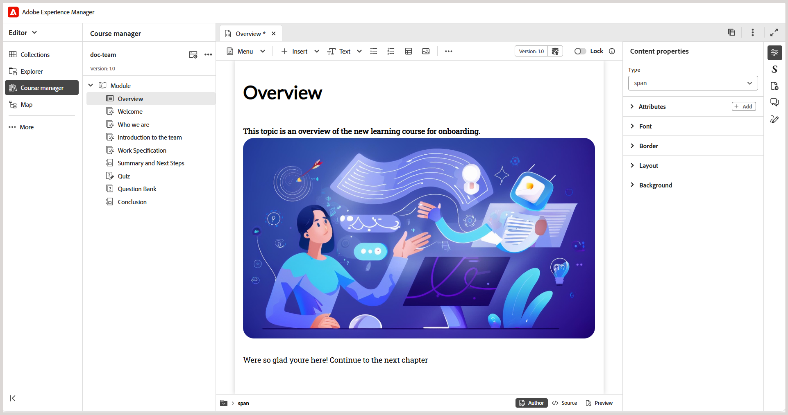

# 2026.03.0版（2026年3月）的新增功能

本文介绍Adobe Experience Manager Guides as a Cloud Service 2026.03.0版本中引入的新增功能和增强功能。

有关此版本中修复的问题列表，请查看 [2026.03.0 版本中已修复的问题](fixed-issues-2026-03-0.md)。

了解2026.03.0版本[的](../release-info/upgrade-instructions-2026-03-0.md)升级说明。

## Experience Manager Guides中的产品培训和学习内容简介

Experience Manager Guides中的&#x200B;**产品培训和学习**&#x200B;内容功能使培训团队和教学设计人员可以直接从Experience Manager Guides界面构建交互式电子学习课程。

通过模板驱动的创作、交互式课程组件和对评估的支持，团队可以开发符合其组织目标的高质量培训内容。

>[!NOTE]
> 
> 默认情况下，所有Experience Manager Guides as a Cloud Service实例的产品培训和学习内容功能保持禁用状态。 管理员可以从&#x200B;**Workspace设置** > **常规**&#x200B;在文件夹配置文件级别启用此功能。

主要功能如下：

- 集中式学习内容管理
- 模板驱动的创作
- 支持内容重用
- 评估创建和管理
- 基于Web的审核工作流
- 业界领先的翻译管理
- 使用现成的SCORM和PDF输出格式的多渠道发布

有关更多详细信息，请参阅[入门指南](../learning-content/course-overview.md)和[配置指南](../lc-config-guide/introduction.md)。

## 编辑器增强功能

作为此版本的一部分，进行了以下编辑器增强：

### 对Schematron验证面板的增强

已对Schematron用户界面进行以下增强，从而提高清晰度、可用性和验证结果：

- 在“验证”面板中，如果未添加Schematron文件，则显示空状态消息，这样可以更好地阐明后续步骤，并指明方向。

  {width="350" align="left"}
- 添加多个Schematron文件后，这些文件将整理在整合的折叠面板下，从而更好地显示配置的Schematron文件。

  {width="350" align="left"}
- 基于Schematron文件中定义的角色属性，验证结果现在被分类为： `Fatal`、`Error`、`Warn`或`Info`。 每个类别都包含一个可见计数以及一个上下文工具提示，以便更清楚地解释。

  {width="350" align="left"}

有关在Experience Manager Guides中使用Schematron文件的更多详细信息，请查看[Schematron文件支持](../user-guide/support-schematron-file.md)。

### 编辑器界面的右侧面板中现在提供了翻译语言副本

右侧面板中编辑器中的&#x200B;**文件属性**&#x200B;下现在有新的&#x200B;*翻译*&#x200B;部分可用。 通过此部分，可以直接访问当前打开的资产的所有可用语言副本（映射、主题、图像等）。 您不再需要导航到Assets UI即可查看或访问这些语言副本。

{width="350" align="left"}

对于每个语言副本，您可以将鼠标悬停在文件上以找到其在存储库中的路径，也可以简单地选择它以在编辑器中打开。 除了打开文件之外，您还可以使用&#x200B;**选项**&#x200B;菜单执行许多操作。 您可以执行的某些操作包括编辑、预览、复制UUID、复制路径、添加到收藏集和属性。

有关详细信息，请在编辑器中查看[右侧面板](../user-guide/web-editor-right-panel.md#file-properties)。

### 在所有日志字段中搜索引文

现在，您可以使用&#x200B;*添加引文*&#x200B;对话框中的&#x200B;*任意字段*&#x200B;选项搜索所有日志字段中的引文，如&#x200B;*标题*、*日志标题*、*作者*、*年份*、*卷*、**数字**&#x200B;和&#x200B;**页面**。 搜索会根据输入的文本返回最接近的匹配引用。

有关在Experience Manager Guides中添加引文的更多详细信息，请查看[在内容中添加和管理引文](../user-guide/web-editor-apply-citations.md)。

{width="350" align="left"}

## 审核增强功能

此版本中的审阅功能提供了以下增强功能：

- 现在，将审阅人分配给审阅任务取决于活动项目选择。 在选择活动项目之前，**创建审核任务**&#x200B;页面上的&#x200B;*分配给*&#x200B;字段保持禁用状态。 选择项目后，**分配给**&#x200B;字段已启用，并且仅列出与该项目关联的用户和用户组。 这可确保仅将审阅任务分配给有效的项目成员，并防止审核者意外选择。

  

- **分配给**&#x200B;字段现在支持预输入搜索，允许您通过键入文本来快速查找用户或用户组。

这些增强功能结合起来，使审阅人选择更准确、更高效，并与特定于项目的审阅工作流程保持一致。

有关更多详细信息，请查看[发送审核主题](../user-guide/review-send-topics-for-review.md)。

## 资产管理增强功能

此版本引入了以下资产管理增强功能：

### 使用“拼合文件层次结构”可下载具有原始文件名和关联元数据的映射

现在，您可以使用“拼合文件层次结构”选项下载具有原始文件名的映射。 此外，下载的包中包含一个`metadata.json`文件，这使得关联的元数据能够在Experience Manager Guides之外轻松访问和可重用。

有关在Experience Manager Guides中下载文件的更多详细信息，请查看[下载文件](../user-guide/authoring-download-assets.md)。

### 使用正则表达式启用或禁用后处理

您现在可以使用正则表达式启用或禁用文件夹的后处理。 通过这项增强功能，管理员可以使用单个配置定义应用于多个文件夹或整个文件夹层次结构的后处理规则，而不是指定单个文件夹路径。

有关详细信息，请查看[使用regex启用或禁用后处理](../cs-install-guide/conf-folder-post-processing.md#use-regex-to-enable-or-disable-post-processing)。
