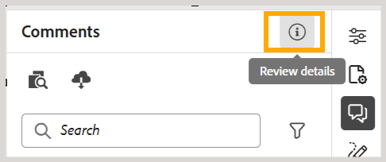

# 2026.08.0版（2026年8月）的新增功能

本文介绍Adobe Experience Manager Guides as a Cloud Service 2026.08.0版本中引入的新增功能和增强功能。

有关此版本中修复的问题列表，请查看[2026.08.0版本中的已修复问题](fixed-issues-2026-08-0.md)。

了解2026.08.0版本[&#128279;](../release-info/upgrade-instructions-2026-08-0.md)的升级说明。

## 用于管理映射和发布输出的新映射集合

新的地图收藏集将地图收藏集管理和输出生成活动整合在单个界面中。 您可以从一个位置管理映射和预设、生成和发布输出、视图生成和发布历史记录等。 通过将相关发布任务整合在一起，可以更轻松地处理地图收藏集并跟踪多个地图及其相关语言的输出活动。 此更新还解决了大型映射集合中存在的性能问题。

有关更多详细信息，请查看[为输出生成](../user-guide/generate-output-use-new-map-collection-output-generation.md)使用新映射集合。

## 使用Git连接器从Git存储库获取内容

Experience Manager Guides现在引入了Git连接器，它允许您将Git存储库中的内容导入Experience Manager Guides。 导入内容后，团队可以继续使用Experience Manager Guides进行创作、审阅、翻译和发布工作流。

为帮助保持导入的内容为最新，Git Connector还支持从源存储库重新获取内容以引入更新。 它包括智能更改检测以识别内容更新，在导入和重新获取操作期间保留主题并映射GUID，并提供冲突解决功能以帮助管理Experience Manager Guides中已提供的存储库内容与内容之间的差异。 有关更多详细信息，请查看[使用Git连接器导入内容](../user-guide/web-editor-git-connector.md)。

## Experience Manager Guides为AI助手集成添加了MCP支持

Experience Manager Guides现在支持MCP（模型上下文协议）集成，从而使Anthropic Claude等AI助手能够直接连接到AEM Guides环境。

通过单个MCP端点，经过身份验证的用户可以管理主题和映射、创建和导出基线，以及使用自然语言生成报表，所有这些操作都是在其现有AEM权限下进行的。 这消除了重复、导航繁重的任务，并允许文档团队在聊天应用程序和支持MCP的开发人员工具（如Cursor和Visual Studio Code）之间更高效地工作。 有关详细信息，请查看[使用Adobe Experience Manager Guides MCP服务器](../install-conf-guide/conf-aem-guides-mcp.md)。

## 审核增强功能

### 将审核任务委派给其他审核者

现在，审阅人可以使用可用于审阅任务的新&#x200B;**委派**&#x200B;选项，在审阅返回到作者之前推荐其他用户加入审阅。 当部分内容不属于“审阅人”的专业知识范围或需要在完成审阅之前提供第二个意见时（无需通过项目管理员发送请求），此功能非常有用。

选择“委派”选项会将推荐发送给作者，由作者决定是否将推荐的审阅人添加到任务。 了解有关[将审核任务委派给其他审核者](../user-guide/review-complete-review-tasks.md#delegate-a-review-task-to-another-reviewer)的详细信息。

{width="350"}

### 任务描述现在显示在审核UI中

现在，审阅人可以直接在审阅体验中查看任务描述，而不是仅依赖通知电子邮件。 创建审核任务时输入的描述现在显示在审核详细信息对话框中，可通过审核UI和编辑器界面中的&#x200B;**信息**&#x200B;图标进行访问。

这使审阅人能够访问审阅过程中的说明、范围和焦点区域。 有关更多详细信息，请查看[发送审核主题](../user-guide/review-send-topics-for-review.md)。

{width="350"}

### 审核期间标记列表中的用户标识

在评论或回复中标记用户时，标记下拉菜单现在显示每个用户的电子邮件地址及其用户ID。 这使得识别和选择正确的查看者更容易，特别是在显示名称本身可能模糊的大型组织中。

如果电子邮件地址不可用，则会显示用户ID。 有关使用审阅UI的详细信息，请在评论[&#128279;](../user-guide/review-topics.md#tag-task-users-in-a-comment)中查看标记任务用户。

### 查看主题的所有审阅任务

现在，作者可以直接从“注释”面板查看与当前打开的主题相关的所有审阅任务（打开或已关闭）。 下拉列表列出主题所属的每个审阅任务，以及每个任务的状态和项目，并允许您在它们之间切换以查看注释，而不会离开主题或切换审阅项目。 了解有关[查看主题](../user-guide/review-address-review-comments.md#view-all-review-tasks-for-a-topic)的所有审阅任务的更多信息。

{width="350"}

### 增强了DITAVAL条件的审阅体验

当审阅任务包含一个或多个附加的DITAVAL文件时，“条件”面板现在将每个条件显示为切换，预先设置以匹配附加的DITAVAL文件，因此审阅人按照审阅发起人的预期方式查看内容。 关闭切换开关会在审阅中隐藏该内容；打开切换开关会恢复审阅。

有关详细信息，请查看具有基于DITAVAL的条件[&#128279;](../user-guide/review-topics.md#conditions-panel-with-ditaval-based-conditions)的条件面板。

{width="350"}

## 发布增强功能

### 将输出预设用作模板

管理员现在可以将输出预设指定为模板，并通过“映射”控制台执行单次操作，跨文件夹配置文件中的所有映射应用标准化配置。 应用模板时，系统会显示受影响的映射数量，从而使管理员在转出之前能够完全查看。 为了保持一致性，模板预设只能由管理员修改，并且模板预设禁止生成输出（除非在将预设设置为模板之前已生成输出）。

有关详细信息，请查看[为输出生成](../install-conf-guide/template-presets-output-generation.md)配置模板预设。

### 通过内容运行状况检查验证内容质量

内容运行状况检查有助于在发布之前验证跨DITA映射的内容质量。 管理员可以通过组合检查断开的链接、重复的ID和架构验证来创建可重用的运行状况检查预设。

作者可以对DITA映射或选定的基线运行运行状况检查，以生成跨相关主题和映射的合并问题报告。 有关详细信息，请查看[对映射](../user-guide/map-editor-other-features.md#run-health-check-on-a-map)运行运行状况检查。

## 翻译增强功能

### 为翻译项目指定自定义文件夹路径

在发送要翻译的内容时，您现在可以选择要在其中创建新翻译项目的文件夹，而不是默认到`/content/projects`下的单个位置的所有项目。 这有助于避免项目结构混乱，并随着翻译项目数的增加而提高页面加载性能。

有关详细信息，请查看[创建翻译项目](../user-guide/translate-documents-web-editor.md#create-a-translation-project)。

## 学习内容增强功能

此版本中的产品培训和学习内容功能提供了以下增强功能：

- SCORM输出配置中现在提供新的&#x200B;**学习者体验**&#x200B;选项卡，允许您配置学习者如何与SCORM输出进行交互和导航。 这些设置按“常规”、“导航”和“测验”进行整理，可让您控制内容辅助功能、导航流程和测验行为，从而量身定制学习体验。

  在&#x200B;**导航**&#x200B;下，您现在可以控制页面上是启用还是禁用&#x200B;**下一步**&#x200B;按钮，从而仅在满足该页面上的指定条件（例如打开所有交互式元素、观看所有媒体等）后才允许学习者进行学习。 有关详细信息，请查看[配置SCORM预设](../learning-content/config-scorm-preset.md)。

  {width="650"}

- 您现在可以在SCORM输出中为学习者启用PDF下载功能。 启用此选项后，已发布的SCORM输出中将添加一个PDF下载图标，以允许学习者下载课程内容的PDF版本以供离线参考。 这提高了学习者访问课程材料的灵活性，同时使作者更能控制已发布的体验。 有关配置详细信息和先决条件，请查看[允许学习者下载课程PDF](../learning-content/config-scorm-preset.md)。

  {width="650"}

- 在已发布的课程输出中，学习者现在在完成测验尝试后可使用&#x200B;**查看答案**&#x200B;选项，以重新访问他们提交的答案并查看哪些答案正确或不正确。 了解有关测验[&#128279;](../learning-content/quiz-insert-questions.md#question-properties)中问题属性的更多信息。

  {width="650"}

- 在课程中的知识检查问题中，当学习者选择错误答案时，会显示&#x200B;**重试**&#x200B;按钮，以允许他们重试问题。 在单选和多选知识检查中，此行为是一致的。 有关详细信息，请在“插入”菜单中查看[其他选项](../learning-content/lc-other-insert-options.md)。

- 将HTML主题添加到学习组映射时，`format="html"`属性现在会自动添加到相应的`topicref`，从而确保在DITA-OT 4.x下正确处理和发布。 有关更多详细信息，请查看[添加课程中的现有内容](../learning-content/manage-course.md#add-existing-content)。

## API增强

此发行版本引入了用于资产管理、翻译和发布的新Swagger API，使得将这些工作流与现有工具和系统连接起来更加容易。 有关详细信息，请在Experience Manager Guides版本[&#128279;](../api-reference/api-update-swagger.md)中查看API更新。

