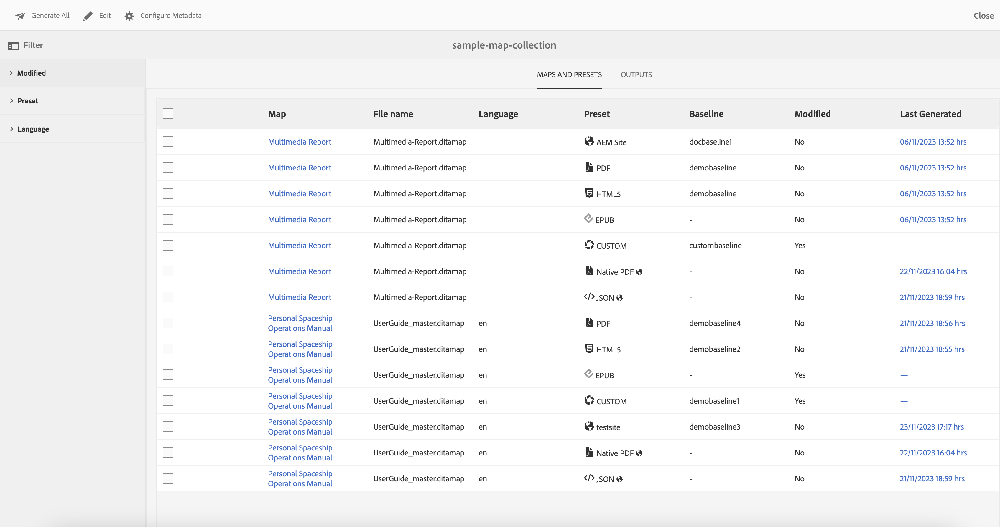

# 4.4.0版本的新增功能（2024年1月）

本文介绍4.4.0版本的Adobe Experience Manager Guides中的新增功能和增强功能。

有关此版本中已修复的问题的列表，请查看 [修复了4.4.0版本中的问题](../release-info/fixed-issues-4-4.md).

了解 [4.4.0版本的升级说明](../release-info/upgrade-instructions-4-4.md).

## Web编辑器中改进的版本历史记录功能

现在，《Experience Manager指南》提供了增强的版本历史记录功能，允许您比较一段时间内对文档所做的更改。 在新的并排视图中，您可以轻松地将当前版本的内容和元数据与同一文档的任何先前版本进行比较。 您还可以查看比较版本的标签和注释。 作为管理员，您可以控制主题版本元数据及其值显示在 **版本历史记录** 对话框。

{width="800" align="left"}
*预览主题不同版本中的更改。*

了解关于 **版本历史记录** 中的功能描述 [左侧面板](../user-guide/web-editor-features.md#id2051EA0M0HS) 部分。

## 管理条件预设

您可以在DITA主题中定义条件属性。 然后，使用条件预设中的条件属性发布DITA映射中的内容。 Experience Manager指南现在还在Web编辑器中提供了丰富的体验，可帮助您更有效地创建和管理条件预设。 您还可以轻松地编辑、复制或删除它们。

{width="550" align="left"}

有关详细信息，请查看 [使用条件预设](../user-guide/generate-output-use-condition-presets.md).

## 改进了编辑属性的体验

现在，您可以从以下位置获得改版后的体验：添加或编辑元素的属性， **内容属性** 面板。

{width="300" align="left"}

*从“内容属性”面板添加属性。*

您还可以轻松地编辑和删除属性。
欲知更多详情，请参见 **内容属性** 中的功能描述 [右侧面板](../user-guide/web-editor-features.md#id2051EB003YK) 部分。

## 创作时编辑元数据

现在，在创作时，您可以使用中的下拉菜单更新文件元数据标记 **文件属性** 在右侧面板中。 您还可以选择 **编辑更多属性** 以更新更多元数据。

{width="300" align="left"}

*从右侧面板更新元数据和编辑文件属性。*

欲知更多详情，请参见 **文件属性** 中的功能描述 [右侧面板](../user-guide/web-editor-features.md#id2051EB003YK) 部分。

## 在映射视图中查看关键属性

为主题或映射引用定义键属性时，还可以在左侧面板中查看标题、相应图标和键。 键显示为 `key=<key-name>`.

 {width="300" align="left"}

*在“映射视图”中查看键属性。*

欲知更多详情，请参见 **映射视图** 中的功能描述 [左侧面板](../user-guide/web-editor-features.md#id2051EA0M0HS) 部分。

## 能够根据标签复制基线

Experience Manager指南现在为从Web编辑器创建基线提供了增强的用户体验。
选项 **手动更新** 和 **自动更新** 更加直观，并帮助您轻松选择创建静态基线还是根据标签自动更新它。

 {width="300" align="left"}
*从Web编辑器创建基线。*

它还允许您根据标签复制基线。 复制时根据给定的标签（如果存在）选取引用版本，否则从复制的基线中选取版本。

 {width="300" align="left"}

*复制基于标签的基线或创建精确副本。*

详细了解如何 [通过Web编辑器创建和管理基线](../user-guide/web-editor-baseline.md).

## 增强地图收藏集仪表板

《Experience Manager指南》提供了一个增强的“地图收集”功能板。 在映射集合中，可以快速为DITA映射批量配置元数据属性。 此功能非常方便，因为您不必分别更新每个DITA映射的元数据属性。

现在，您可以查看DITA映射的文件名。 您还可以查看基线。 这有助于快速找到用于预设的基线。

{width="800" align="left"}

*从地图集合仪表板查看、编辑和生成输出。*

了解如何 [使用映射集合生成输出](../user-guide/generate-output-use-map-collection-output-generation.md).

## 增强的翻译面板

此 **翻译** 面板已得到改进。  您可以查看 **可用语言** 列表并快速选择要翻译项目的区域设置。 通过单个选择，您还可以选择 **全选** 将您的项目翻译为所有可用的语言。

{width="300" align="left"}

*选择要翻译项目的区域设置。 选择要翻译的文件的默认、基线或最新版本。*

详细了解如何 [翻译内容](../user-guide/translation.md).

## 改进了“插入元素”对话框中的搜索逻辑

现在，可以在“插入元素”对话框中轻松查找元素。  您可以在搜索框中键入一个字符串，并获取以输入的字符串开头的所有有效元素的列表。

例如，在编辑要插入元素的段落时，您可以搜索字符“t”以获取以“t”开头的所有有效元素。

{width="300" align="left"}

*键入字符以搜索以该字符开头的所有有效元素。*

有关更多详细信息，请查看 **插入元素** 中的功能描述 [左侧面板](../user-guide/web-editor-features.md#id2051EA0M0HS) 部分。

## 能够在同一级别拆分列表

现在，您可以在Web编辑器中轻松拆分列表。 选择 **拆分列表** 列表项的上下文菜单中的选项以拆分当前列表。 将从您为拆分选择的列表项开始，在同一级别创建新列表。

{width="300" align="left"}

*选择用于拆分当前列表的选项。*

有关更多详细信息，请查看 **插入列表** 中的功能描述 [左侧面板](../user-guide/web-editor-features.md#id2051EA0M0HS) 部分。

## 轻松解包DITA元素

现在，您可以使用Web编辑器中元素上下文菜单中的选项轻松展开元素。 这有助于轻松地将元素的文本与其父元素合并。
有关更多详细信息，请查看 **取消包裹元素** 部分，从 [Web编辑器中的其他功能](../user-guide/web-editor-other-features.md).

## 在创作源模式下访问文件属性

现在，您可以访问右侧面板的 **文件属性** 在所有四种模式或视图中都具有该功能：“布局”、“作者”、“源”和“预览”。  这有助于您在不同的模式之间切换时查看文件的属性。

有关更多详细信息，请查看 **文件属性** 中的功能描述 [右侧面板](../user-guide/web-editor-features.md#id2051EB003YK) 部分。

## 按标题或文件名查看文件

现在，您可以选择在Web编辑器中查看文件的默认方式。 您可以在“创作”视图中按各个面板的标题或文件名查看文件列表。

{width="550" align="left"}

*更改默认的文件查看方式&#x200B;**用户首选项**对话框。*

## 刷新浏览器时恢复文件选项卡

Experience Manager指南会在您刷新浏览器时恢复Web编辑器中打开的文件标签的状态。 有关更多详细信息，请查看 **编辑文件时刷新浏览器** 部分在 [在Web编辑器中编辑主题](../user-guide/web-editor-edit-topics.md).

## 能够使用键盘快捷键导航

Experience Manager指南现在还允许您使用键盘快捷键在Web编辑器中移动光标。 您可以使用键盘快捷键快速左右移动一个单词。 您还可以在键盘快捷键的帮助下移动到行的开头或结尾。
现在，您还可以使用键盘快捷键将光标移动到下一个元素的开头或上一个元素的结尾。
了解关于 [Web编辑器中的键盘快捷键](../user-guide/web-editor-keyboard-shortcuts.md).

## 解析AEM网站输出中的交叉映射链接

现在，可以按照为生成映射设置的发布上下文的文件标题，解析在AEM站点输出中渲染的交叉映射链接（具有范围对等的XREF）。

## 配置AEM站点输出的URL以使用文档标题

Experience Manager指南允许您作为管理员配置AEM Site输出的URL。 如果文件名不存在或包含所有特殊字符，则可以配置以在AEM Site输出的URL中使用分隔符替换它们。 您也可以使用第一个子主题名称替换它们。 了解如何 [配置AEM站点输出的URL以使用文档标题](../cs-install-guide/conf-output-generation.md#configure-the-url-of-the-aem-site-output-to-use-the-document-title).

## 并行发布多个输出预设

“Experience Manager”提供的功能通过根据应用于主题的主题标签自动选择主题来创建基线。 现在，您还可以使用同一DITA映射的自动基线无缝发布多个输出预设。 您不必一次只发布一个预设，但可以轻松地同时发布多个输出预设。

详细了解如何 [通过Web编辑器创建和管理基线](../user-guide/web-editor-baseline.md).

## 本机PDF增强功能

4.4.0版本中完成了以下本机PDF增强：

### 在PDF输出中使用变量

您可以使用变量动态插入和管理可重用信息。 Experience Manager参考线可帮助您在生成PDF输出时创建、编辑和预览变量。 您可以快速修改变量的值，使您的文档可移植且易于更新。

{width="800" align="left"}

*在Web编辑器中创建和管理变量。*

您还可以创建变量集，以覆盖默认值并为变量分配替代值。 在页面布局中插入这些变量并使用相同的PDF布局，则无需为每个值集创建单独的布局。 例如，您可以为每个产品版本创建一个变量集。 此变量集可以由适用于不同产品详细信息（如产品名称、版本号和发行日期）的变量组成。 然后，您可以为这些变量添加不同的值。

**变量集1：Adobe集1**

* ProductName：Experience Manager指南
* 版本号：2311
* 发行日期： 2023年11月2日

**变量集2：Adobe集2**

* ProductName：Experience Manager指南
* 版本号：2310
* 发行日期： 2023年9月27日

*使用PDF布局中的变量生成PDF输出。*

您可以应用样式并使用HTML标记来设置变量的格式。  您还可以在需要时快速更新任何变量的值并重新生成输出。 例如，如果需要更新版本的详细信息，可以在VersionNumber变量中编辑版本值并重新生成输出。

详细了解如何使用 [PDF输出中的变量](../native-pdf/native-pdf-variables.md).

### 将资源元数据传播到PDF输出

Experience Manager现在提供将资源的元数据属性从DITA映射传输到PDF输出的功能。
从本机PDF输出预设中，可以选择要传播到PDF发布过程的元数据。 您可以选择自定义属性和默认属性。  选定的元数据属性将传输到使用本机PDF生成的PDF文件。

此功能非常方便，因为它有助于保持资源属性（如作者、创建日期或文档标题）的一致性。 这样可以更轻松地组织、搜索和分类您的文档。

有关更多详细信息，请查看 **高级** 中的设置 [发布PDF输出](../web-editor/native-pdf-web-editor.md).

### 使用添加到中的元数据 `topicmeta` PDF输出的元素

本机PDF发布中的元数据功能有助于内容管理，并有助于在Internet上搜索文件。

*选择一个选项以添加和自定义元数据选项。*

现在，Experience Manager指南提供了使用您在中添加的元数据的选项 `topicmeta` dita映射的元素，用于填充PDF输出的元数据字段。 默认情况下，该选项处于选中状态。

此功能有助于更好地管理文档，确保一致性，并使您的文档可搜索。

要了解更多信息，请查看 **元数据** 选项卡 [发布PDF输出](../web-editor/native-pdf-web-editor.md).

### 使用和复制现成的PDF模板

Experience Manager指南提供现成或出厂预装的PDF模板。 复制工厂PDF模板以创建自定义PDF模板。

现在，您还可以在创建和复制模板时预览模板的缩略图图像。 您还可以编辑或删除此图像。 此功能对于标记或区分具有相似名称的模板很有用。
了解关于 [PDF模板](../native-pdf/pdf-template.md).

{width="550" align="left"}

*复制现有PDF模板。*

### 更改页面的顺序并发布每张页面的多个页面

除了根据源文档发布页面外，您还可以在发布多页文档时更改PDF中的页面顺序。  这让您能够灵活地按各种顺序发布页面，例如先发布所有奇数页面，或先发布所有偶数页面。 您还可以以小册子的形式发布，并像读书一样阅读页面。 您还可以决定要在单张纸上发布的页数。 有关更多详细信息，请查看 [页面组织](../native-pdf/components-pdf-template.md#page-organization) 部分。

### 根据排序键对术语进行排序

现在，您还可以根据排序键对术语表进行排序。 您可以使用标记“sort-as”来定义术语的排序键。 然后，您可以根据排序键来排序它们，而不是术语。 这允许您根据不同语言中使用的术语对术语表术语进行排序。 您还可以为具有短语或一组单词的术语定义单个排序键。
有关更多详细信息，请查看 [高级PDF设置](../native-pdf/components-pdf-template.md#advanced-pdf-settings).

### 改进了本机PDF模板的资源管理

Experience Manager指南现在改进了本机PDF模板的资源管理。 您现在可以在多个本机PDF模板之间共享和重用资源，如图像、CSS文件和字体文件。 通过这种改进，管理大量模板的资源变得更加简单。 您无需为每个模板创建重复资源，可以将这些资源保存在共享文件夹中，并在所有本机PDF模板中使用它们。
有关详细信息，请查看 [PDF模板](../native-pdf/pdf-template.md).

