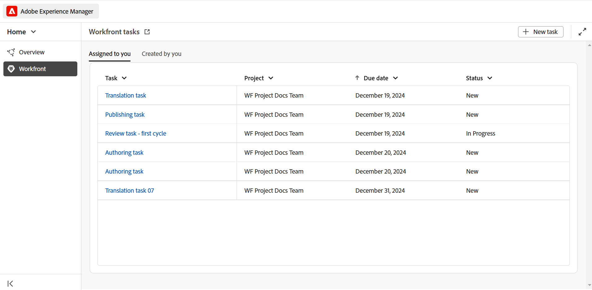

# 5.0.0版本的新增功能（2025年3月）

本文介绍Adobe Experience Manager Guides版本5.0.0中引入的新增功能和增强功能。

有关此版本中已修复的问题的列表，请查看[5.0.0版本](../release-info/fixed-issues-5-0-0.md)中已修复的问题。

了解5.0.0版](../release-info/upgrade-instructions-5-0-0.md)的[升级说明。

## 对Experience Manager Guides UI进行了改版，以提高工作效率和体验

Adobe Experience Manager Guides现在提供经过改进的设计和增强的功能，帮助您比以往更快更高效地工作。 新UI通过全新的主页、更简洁且更有条理的编辑器工具栏、专用映射控制台以及增强功能，提供更直观且增强的用户体验。

主要亮点如下：

- **主页简介**：Experience Manager Guides现在提供一个主页，它提供了直观的欢迎屏幕体验，包括您最近访问的文件、收藏集等的快速视图。

  有关详细信息，请查看[Adobe Experience Manager Guides主页体验](../user-guide/intro-home-page.md)。

  {width="800" align="left"}

- **新编辑器体验**：现在，以新外观体验编辑器。 改版后的编辑器界面具有更清晰、更有条理的工具栏、无缝导航和全面的直观体验，可帮助更快、更高效地创作文档。

  访问[了解编辑器功能](../user-guide/web-editor-features.md)。

  {width="800" align="left"}

- **专用映射控制台**：正在引入映射控制台，这是一个包含所有映射管理和发布功能的专用控制台。 现在，您可以在一个界面中获取用于生成输出、翻译内容、创建报告等功能的选项。

  了解有关[映射管理和发布](../user-guide/map-console-overview.md)的详细信息。

  {width="800" align="left"}

## 与Adobe Workfront集成，提供强大的工作管理功能

Experience Manager Guides现在与Adobe Workfront无缝集成，除了Experience Manager Guides核心CCMS功能之外，您还可以访问强大的项目管理功能。

利用此集成，您可以直接从Experience Manager Guides创建和管理Adobe Workfront任务。 例如，作为作者，您可以直接在Experience Manager Guides界面中创建审阅任务（添加了一个或多个DITA主题或映射），并将其分配给审阅者。 作为审阅人，您可以在Experience Manager Guides审阅UI中处理分配的任务，并将它们返回给具有注释的作者。 同样，您可以创建一个发布和翻译任务，然后将其分配给需要对其进行处理的用户。

该集成还允许您监视工作队列，确保您保持有条不紊并控制所有任务（已分配的任务）。 它还使项目经理能够利用Adobe Workfront的强大功能在Experience Manager Guides中进行深入的项目管理。

有关详细信息，请参阅[Workfront集成](../user-guide/workfront-integration.md)。

{width="800" align="left"}

## 更快且可扩展的新AEM Sites发布引擎

使用全新的发布引擎，通过复合组件映射进行优化，可加快页面创建和渲染速度，从而体验到AEM Sites中更快、可扩展的发布。 它随新的现成可编辑模板一起提供，这些模板可以根据您的要求使用AEM模板编辑器进行自定义。 这些模板结合了WCM核心组件和专用的Guides组件，可确保最终用户在AEM Sites页面上获得最佳体验。 您还可以自定义现有模板，以利用此新发布引擎的强大功能。

了解有关[AEM Sites发布](../user-guide/generate-output-aem-site-web-editor.md)的更多信息。

{width="500" align="left"}

## 通过发布单一主题，无缝地将独立内容发布到AEM Sites

将单个主题发布引入AEM Sites页面，允许您直接将单个主题发布到AEM Sites页面，而无需发布整个地图。  这会简化发布流程，使其在处理独立内容（如营销内容、技术公告或任何其他独立内容）时更加高效。 它还简化了内容维护，无需创建映射来发布单个主题。

有关详细信息，请查看[发布AEM Sites页面](../user-guide/publish-aem-sites.md)。

{width="500" align="left"}

## 全新的Markdown编辑器，提供丰富的创作体验

现在，体验一种更清晰、更高效且功能强大的方式来创作Markdown主题。 Experience Manager Guides引入了一个新的Markdown编辑器界面，该界面具有组织良好的工具栏和高级功能，包括一个&#x200B;**并排视图**，可同时创作和预览内容。 它还支持将地图中包含的Markdown主题无缝发布到多个渠道。

有关详细信息，请参阅[Markdown创作](../user-guide/web-editor-markdown-topic.md)。

{width="800" align="left"}

## 编辑器增强功能

作为新版本的一部分，进行了以下编辑器增强：

**表插入的增强功能**

- 能够在表或简单插入对话框中配置标题行、正文行和列的默认值。
- 能够配置表设置以将从外部源复制的表粘贴为简单表或表。

  有关更多详细信息，请在[了解编辑器功能](../user-guide/web-editor-features.md#content-insertion-options)中查看“表”部分。

**增强了DITA元素的友好名称功能**

DITA元素的友好名称功能已得到改进。 现在，当为元素分配友好名称时，会保留默认枚举值，并且更新的名称会反映在痕迹导航、内容属性、可重用内容面板、术语表面板和其他相关位置中。

**已筛选搜索的增强体验**

Adobe Experience Manager Guides存储库中已过滤搜索结果的资源显示限制已提高。 搜索结果现在会返回与搜索条件匹配的所有相关资源或文件。 您可以滚动列表以加载更多结果，而无需执行重复搜索来查找所需资源。

**图像的替换文本现已添加为元素**

图像现在使用`<alt>`元素作为替换文本，具体取决于最新的DITA标准。 已弃用`@alt`属性作为替换文本，但在早期的DITA版本中仍受支持。

**在编辑器工具栏中自定义交叉引用**

现在，为&#x200B;**交叉引用**&#x200B;创建自定义工具栏按钮以直接访问其中一个菜单选项。 例如，您可以根据需要将此选项配置为直接跳转到Web链接、电子邮件链接、文件引用或任何其他可用选项。

有关更多详细信息，请查看[自定义顶栏和工具栏](../guides-ui-extensions/customisations/toolbar-topbar.md)。

## 审核增强功能

作为新版本的一部分，进行了以下审核增强：

- 现在，在创建审核任务时，您可以键入项目名称以快速找到并在项目下拉列表中选择它。 此增强功能消除了对冗长的项目列表的滚动需要，使得分配审核任务更加快速有效，尤其是在管理多个项目时。

- 在编辑器和审核UI中，审核&#x200B;**回复**&#x200B;框现在支持多行条目。 您可以使用&#x200B;**Shift**+**Enter**&#x200B;转到下一行。 您也可以在编写注释时展开注释框。

  有关更多详细信息，请查看[查看主题](../user-guide/review-topics.md)。

- 现在，即使审阅任务标记为已关闭，作者仍可以在编辑器中访问审阅注释。 通过最新的增强功能，“审阅”面板在编辑器中同时具有每个项目的活动审阅任务和已关闭审阅任务。 选择已关闭的审阅任务时，相应的注释将显示在右侧的“注释”面板中，确保即使在任务关闭后，也能持续访问重要的审阅注释。

  有关更多详细信息，请查看[了解编辑器功能](../user-guide/web-editor-features.md)的“审阅”部分。

## 发布增强功能

作为新版本的一部分，进行了以下发布增强：

**对原生PDF的增强**

- 生成本机PDF输出时，能够将主题`prolog`元素中的元数据（如版权、作者和其他详细信息）包含在页面布局中。 这可确保生成的PDF更加详细，并提供重要的上下文，从而让读者了解更多相关信息。

  有关详细信息，请查看[在页面布局](../native-pdf/design-page-layout.md#add-fields-and-metadata-add-fields-metadata)中添加字段和元数据。

  {width="300" align="left"}

- 引入了一个选项，用于启用或禁用Native PDF输出的DITA-OT预处理。 如果内容在处理期间需要基于DITA-OT的规范化或自定义DITA-OT插件，则启用此选项。 这使您能够更好地控制为PDF生成处理内容的方式。 默认情况下，该设置设置为&#x200B;**已启用**。

  有关详细信息，请查看[使用PDF输出预设](../user-guide/generate-output-pdf.md)

  {width="500" align="left"}

- 为获得更好的可用性，本机PDF输出生成的打印设置已从&#x200B;**模板**&#x200B;设置移至&#x200B;**本机PDF输出预设**。 现在，您可以使用相同的模板来在线打印具有不同打印设置的PDF，例如颜色配置文件。

  有关更多详细信息，请查看[Native PDF输出预设](../web-editor/native-pdf-web-editor.md)

- 能够在本机PDF输出中为目录页面添加书签以实现无缝页面导航，尤其是在长的PDF中。

  有关详细信息，请查看[在PDF输出中添加自定义书签](../native-pdf/add-custom-bookmark.md)。

## 内容管理增强功能

作为新版本的一部分，进行了以下内容管理增强：

**报表中的自定义元数据字段**

此功能允许您通过&#x200B;**设置**&#x200B;为报表配置自定义元数据字段。 配置完毕后，您可以在报告的“筛选器”面板中的&#x200B;**列**&#x200B;下查看这些字段，您可以在其中选择或取消选择这些字段以控制其可见性。

有关更多详细信息，请参阅映射控制台](../user-guide/reports-web-editor.md)中的[DITA映射报告。

翻译UI中的&#x200B;**刷新按钮**

在翻译UI中引入刷新按钮，以便您能够使用更新的文件和状态刷新翻译仪表板。

**资产后处理工作流的增强功能**

通过REST API以及API SDK提供了对资产后处理的支持。 现在，将触发资产处理事件，并且可以通过侦听来定义进一步的工作流。

有关详细信息，请查看[后处理事件处理程序](../api-reference/post-process-event.md)。

## 已弃用的功能

**快速生成**

Experience Manager Guides不再支持&#x200B;**快速生成**&#x200B;功能以直接从存储库视图或映射视图生成输出。

此功能已从“存储库”和“地图”视图面板中删除。 建议对所有映射管理和发布相关操作使用&#x200B;**映射控制台**。

有关更多详细信息，请查看[映射管理和发布](../user-guide/map-console-overview.md)。

**将根映射元数据参数传递到DITA-OT命令行**

作为发行版本的一部分，已弃用通过DITA-OT命令行传递根映射元数据参数的功能。 现在，建议在预设中使用&#x200B;**文件属性**&#x200B;或&#x200B;**元数据**&#x200B;字段来传递所需的DITA-OT元数据。

要继续在DITA-OT命令行中传递元数据，您需要更新`Config.Manager`中的`pass.metadata.args.cmd.line`。

有关详细信息，请查看[配置输出生成设置](../cs-install-guide/conf-output-generation.md#configure-the-dita-ot-command-line-argument-field-to-accept-root-map-metadata)。
