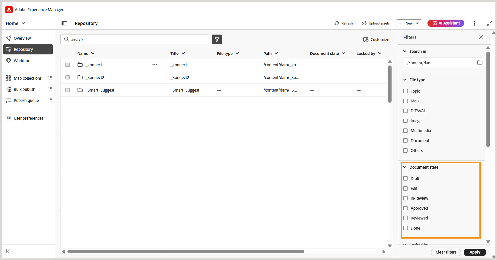

# 5.2.0版本的新增功能（2026年5月）

本文介绍Adobe Experience Manager Guides as a Cloud Service 5.2.0版本中引入的新增功能和增强功能。

有关此版本中修复的问题列表，请查看[5.2.0版本](../release-info/fixed-issues-5-2-0.md)中的已修复问题。

了解5.2.0版本](../release-info/upgrade-instructions-5-2-0.md)的[升级说明。

## Editor 2.0简介

Editor 2.0（又称“新编辑器”）提供了简化的创作过程，使您能够更直观地跨标记模式和非标记模式更高效地创建内容。 此版本提高了性能，页面加载速度更快，编辑更顺畅，即使对于大型复杂主题也是如此。 它还通过解决关键的创作差距（尤其是围绕导航和光标行为的差距）提供了增强的稳定性。 此外，现代化界面提供了更新后且用户友好的UI，实现了功能与易用性的平衡。 有关详细信息，请查看[编辑器简介](../user-guide/web-editor.md)。

以下是一段概述视频，重点介绍Editor 2.0的功能。

>[!VIDEO](https://video.tv.adobe.com/v/3484007)

以下是使创作更容易、更高效的增强功能。

### 重新设计用户界面和体验

刷新的界面提高了整体可用性，使导航和内容创作更加直观和一致。

- **创作和预览模式下元素的CSS更丰富**：元素的默认CSS增强了，在创作和预览模式下样式更佳，视觉一致性更好。

  {width="650"}

- **深色主题支持**：支持内容编辑区域中的深色主题，可为喜欢使用深色界面的用户增强创作体验。

  {width="650"}

- **统一的用户级编辑器设置**：新的集中式设置面板，它使作者更好地控制编辑器行为，允许用户从单个位置更轻松地管理首选项。 配置选项包括启用/禁用功能：

   - 创作模式中的不间断空格
   - 具有属性或不具有属性的标记可见性设置
   - 创作模式中的XML注释
   - 在编辑器中插入元素的快速插入菜单

  {width="350"}

  有关如何配置编辑器设置的详细信息，请查看[编辑器设置](../user-guide/config-editor-settings.md)。

- **在创作模式下更好地表示条件内容**：在创作模式下可更清楚地显示条件内容，从而帮助作者更有效地识别和管理变体。 有关详细信息，请在编辑器的左侧面板中查看[条件](../user-guide/web-editor-left-panel.md#conditions)。

  {width="650"}

### 增强的创作功能

提供了改进的工具和灵活性，以简化内容创建和编辑工作流。

- **在标记模式下查看属性以及元素**：作者现在可以使用标记模式查看元素属性，从而更好地查看和控制结构化内容。 要配置此功能，请查看[编辑器设置](../user-guide/config-editor-settings.md)。

  {width="650"}

- **快速插入菜单**：在创作模式下编辑光标位置时可直接添加元素，而无需导航到工具栏。 也可以通过“编辑器”设置在“收藏夹”部分中配置常用元素，以便更快地进行访问。 有关详细信息，请查看[编辑主题](../user-guide/web-editor-edit-topics.md)。

  {width="650"}

- **在创作模式下查看、编辑和插入XML注释的功能**：使作者能够在创作模式下直接查看、编辑和插入XML注释，以便在内容中提高可见性。 要配置此功能，请查看[编辑器设置](../user-guide/config-editor-settings.md)。

  {width="650"}

- **并排模式**：允许同时查看“创作”模式和“Source”模式，两个视图保持完全同步，以便更轻松地比较、编辑和验证内容更改。 有关详细信息，请查看[编辑器视图](../user-guide/web-editor-views.md)。

  {width="650"}

- **改进了表创作**：通过更直观、更高效的交互来创建和管理表，增强了整个表创作体验。

   - 流畅而直观的交互：可轻松插入行和列，并且支持拖放以重新排列行和列。
   - 上下文工具栏：直接在表中访问特定于表的操作，例如格式设置、对齐、合并和其他附加操作。
   - 配置表：在单个操作中添加多个行或列，从而减少重复步骤并提高效率。

  {width="650"}

  有关详细信息，请查看[使用表](../user-guide/web-editor-other-features.md#work-with-tables-in-the-new-editor)。

### 改进了大型主题的性能

新编辑器通过提供更快的内容渲染、更可靠的撤消和重做功能以及脏标记来明确指示未保存的更改，增强了处理大型复杂主题的体验。

## 在主页中引入新存储库并增强搜索体验

存储库现在可直接从主页访问，它用作集中空间，以改善文件夹和文件的可发现性。 它具有专用的&#x200B;**文件夹导航面板**&#x200B;以及可自定义的存储库&#x200B;**的**&#x200B;表格视图。 改版后的搜索和筛选体验使查找和查找文件变得非常容易。 有关详细信息，请查看[了解存储库界面](../user-guide/home-page-repository-view.md)。

在编辑器中，文件的搜索和筛选体验现在与主页一致。 在编辑器界面底部引入了新的[搜索面板](../user-guide/search-panel-explorer.md)以显示搜索结果。 此外，存储库现在在编辑器中重命名为&#x200B;**资源管理器**，允许您像以前一样浏览文件夹和文件。

### 支持文档状态过滤器

您还可以根据文件的当前文档状态筛选存储库搜索结果。 通过文档状态筛选器，您可以使用文件夹配置文件内`ui_config.json`文件中定义的可用筛选器值来缩小搜索范围。

“文档”状态可用的默认筛选器值为：“草稿”、“编辑”、“正在审阅”、“已批准”、“已审阅”和“完成”。

<!-- For details on customizing the default document state filters values, view [Configure document state filters](../install-conf-guide/conf-doc-state-filters.md).  -->

>[!NOTE]
>
> 如果您正在为`ui_config.json`使用自定义设置，请确保在升级之前对这些设置进行备份。 更新后，查看并调整您的设置，以与最新版本中引入的更改保持一致。

### 多媒体的缩略图图标

所有多媒体文件都以缩略图图标显示，这样可以更轻松地在&#x200B;**存储库**&#x200B;中直观地识别和定位图像。 在&#x200B;**搜索面板**&#x200B;中搜索文件时，此增强功能也适用，可帮助您快速区分多媒体资源和其他文件类型。

## 在“查找和替换”中引入Source模式搜索

Experience Manager Guides在编辑器界面的左侧面板中提供的查找和替换功能中引入了几项增强功能。 除了改进用户界面以提高可用性外，此版本还在&#x200B;**查找和替换**&#x200B;面板中引入了新的&#x200B;**使用源模式**&#x200B;切换开关。

启用此模式后，您不仅可以对可见内容执行全局搜索，还可以对搜索字符串的基础源内容（XML结构，包括元素、标记和属性值）执行全局搜索。 此模式可确保跨整个内容进行全面的搜索。

{width="650"}

在此模式下，您可以应用过滤器以按文件类型、文档状态、上次修改日期等缩小搜索范围。 您还可以选择在执行“全部替换”操作后下载详细的CSV报表，该操作提供所执行的所有替换操作及其成功和失败状态的快照。

有关更多详细信息，请在编辑器&#x200B;_的_&#x200B;左侧面板中查看[查找和替换](../user-guide/web-editor-left-panel.md#find-and-replace)部分。

>[!NOTE]
>
> 对于“查找和替换”面板中的&#x200B;**使用源模式**&#x200B;功能，必须首先完成重新索引。

## 增强的文件和文件夹浏览体验

此版本引入了更清晰、更直观的界面，用于浏览Experience Manager Guides中的文件和文件夹路径。

浏览文件时，改版的&#x200B;**选择文件**&#x200B;对话框现在具有带两个视图的选项卡式布局 — **存储库**&#x200B;用于以表格格式导航整个内容存储库，以及&#x200B;**收藏集**&#x200B;用于快速访问常用主题、映射和图像。

{width="650"}

关键增强功能包括：

- 用于有组织导航的文件和文件夹的表格视图。
- 痕迹导航和文件夹导航面板，可轻松地在文件夹中移动。
- 支持对可重用内容、主题引用、架构、输出预设（使用DITAVAL）和Workfront进行多文件选择。
- 预览所选文件以便于查看；对于多个选择，根据需要预览所有文件并从“预览”面板中删除任何文件。
- 搜索和筛选选项可按名称、标题、文件类型、文档状态和标记缩小结果的范围。

**选择路径**&#x200B;对话框还为文件夹导航提供了改进的树状结构视图，从而确保在内容存储库中选择路径的方式更加有组织和高效。

{width="350"}

有关更多详细信息，请在编辑器的&#x200B;_其他功能_&#x200B;中查看[浏览Experience Manager Guides](../user-guide/web-editor-other-features.md#browse-files-and-folders-in-experience-manager-guides)中的文件和文件夹。

## 创作增强功能

在此版本中，进行了以下创作增强：

### 从内容属性面板访问文件中引用的路径和UUID

现在，您可以使用&#x200B;**Link path**&#x200B;查看所选引用的相对路径，使用&#x200B;**Link UUID**&#x200B;从“内容属性”面板查看其唯一标识符。 您还可以使用链接路径和链接UUID旁边的图标直接从界面复制完整的绝对路径和关联的UUID，从而更易于跟踪和重用链接资源。

有关详细信息，请查看[内容属性](../user-guide/web-editor-right-panel.md#content-properties)。

### 元数据更改的工作副本指示器

对&#x200B;**文件属性**&#x200B;下可用或在后端应用的元数据字段的任何更改也会触发文档版本的星号(*)。 添加、删除或修改任何默认或自定义元数据字段时，文档版本将被标记为_dirty (*)_。 要防止系统生成的元数据更新影响此指示器，管理员可以为元数据属性配置忽略列表。 有关如何配置元数据属性的详细信息，请查看[配置元数据属性的忽略列表](../install-conf-guide/conf-metadata-prop.md)。

### 对Schematron验证面板的增强

已对Schematron用户界面进行以下增强，从而提高清晰度、可用性和验证结果：

- 在“验证”面板中，如果未添加Schematron文件，则显示空状态消息，这样可以更好地阐明后续步骤，并指明方向。

  {width="350"}

- 添加多个Schematron文件后，这些文件将整理在整合的折叠面板下，从而更好地显示配置的Schematron文件。

  {width="350"}

- 基于Schematron文件中定义的角色属性，验证结果现在被分类为： `Fatal`、`Error`、`Warn`或`Info`。 每个类别都包含一个可见计数以及一个上下文工具提示，以便更清楚地解释。

  {width="350"}

有关在Experience Manager Guides中使用Schematron文件的更多详细信息，请查看[Schematron文件支持](../user-guide/support-schematron-file.md)。

### 编辑器界面的右侧面板中现在提供了翻译语言副本

右侧面板中编辑器中的&#x200B;*文件属性*&#x200B;下现在有新的&#x200B;**翻译**&#x200B;部分可用。 通过此部分，可以直接访问当前打开的资产的所有可用语言副本（映射、主题、图像等）。 您不再需要导航到Assets UI即可查看或访问这些语言副本。

{width="350"}

对于每个语言副本，您可以将鼠标悬停在文件上以找到其在存储库中的路径，也可以简单地选择它以在编辑器中打开。 除了打开文件之外，您还可以使用&#x200B;**选项**&#x200B;菜单执行许多操作。 您可以执行的某些操作包括编辑、预览、复制UUID、复制路径、添加到收藏集和属性。

有关详细信息，请在编辑器中查看[右侧面板](../user-guide/web-editor-right-panel.md#file-properties)。

### 在预览模式下刷新主题或映射

>[!NOTE]
>
>此行为仅适用于旧编辑器。 在新编辑器中，预览内容将自动刷新。

为已在预览模式下打开的映射引入新的&#x200B;**刷新**&#x200B;功能。 通过此新功能，您可以轻松刷新整个映射的内容或其中存在的单个主题。

- 为了刷新整个映射（包括所有主题），在编辑器的左上角引入了一个新的&#x200B;**刷新**&#x200B;按钮。

  {width="600"}

- 为了刷新单个主题的内容，在上下文菜单中引入了新的&#x200B;**刷新主题**&#x200B;选项。

  {width="600"}

有关详细信息，请查看[映射编辑器功能](../user-guide/map-editor-advanced-map-editor.md)。

### 主题和地图的字数

您现在可以跟踪映射或主题文件中出现的字数。 右侧面板中新增的&#x200B;**单词数**&#x200B;字段将显示主题（或地图）中存在的单词总数，其中以空格分隔的单词将计为单个单词。 每次保存更改时，它都会自动刷新。 对于交叉引用，只包含显示文本，而排除键。

{width="350"}

有关详细信息，请在编辑器](../user-guide/web-editor-right-panel.md#file-properties)中查看[右侧面板。

### 在创作视图的主题和映射中轻松识别和修复重复ID

Experience Manager Guides现在在编辑器中包含&#x200B;**重复ID**&#x200B;按钮，以帮助您快速识别和修复单个主题或映射中存在的重复ID。 检测到重复的ID时，此按钮将出现在&#x200B;**创作**&#x200B;视图的编辑器界面的左下角。 选择按钮后，弹出框中会显示具有重复ID的所有实例的列表。 选择实例会突出显示主题或地图中的相应内容，使您能够从右侧面板中查找和修复重复的ID。

有关更多详细信息，请在编辑器中查看[其他功能](../user-guide/web-editor-other-features.md)。

{width="350"}

### 增强存储库和报告过滤器

存储库高级筛选器下的&#x200B;**锁定者**&#x200B;筛选器和DITA map报表中的&#x200B;**作者**&#x200B;筛选器现在会在您滚动时逐渐加载用户列表，而不是一次加载所有列表。 这种分页加载提高了速度，并使处理大型用户数据集更加高效和无缝。

### 在所有日志字段中搜索引文

现在，您可以使用&#x200B;**添加引文**&#x200B;对话框中的&#x200B;**任意字段**&#x200B;选项搜索所有日志字段中的引文，如&#x200B;*标题*、*日志标题*、*作者*、*年份*、*卷*、*数字*&#x200B;和&#x200B;*页面*。 搜索会根据输入的文本返回最接近的匹配引用。

有关在Experience Manager Guides中添加引文的更多详细信息，请查看[在内容中添加和管理引文](../user-guide/web-editor-apply-citations.md)。

{width="350"}

### “设置”现已重命名为“Workspace设置”，可从主页访问

为了提高导航和可用性，已引入以下增强功能：

- 编辑器中位于&#x200B;**更多操作**&#x200B;菜单中的&#x200B;**设置**&#x200B;已重命名为&#x200B;**Workspace设置**。
- 现在，可以从[主页](../user-guide/intro-home-page.md)访问&#x200B;**更多操作**&#x200B;菜单（三点菜单），该菜单以前只能在“编辑器”和“映射”控制台界面中使用。

  

### AI助手中智能建议的增强索引

现在，您可以使用新的状态指示器在AI Assistant中轻松跟踪智能建议的每次索引尝试的状态：索引已完成、不同步、正在进行中，以及索引失败。 现在，在文件夹配置文件级别记录上次索引时间戳，以便更好地进行跟踪。 此外，在为索引指定文件夹或文件路径时，会强制实施父子文件夹限制。

有关更多详细信息，请查看[为智能帮助和创作配置AI助手](../install-conf-guide/conf-profiles.md#configure-ai-assistant-for-smart-help-and-authoring-only-for-cloud-service)。

## 审核增强功能

此版本中包含以下审核增强功能：

### 审核任务的自动提醒

您现在可以启用&#x200B;**自动提醒**，以便在审核任务的到期日之前和到期之后，为审核者安排AEM通知和电子邮件提醒。 您可以为每个案例配置多个提醒，根据配置的提醒计划，按定义的顺序发送预过期提醒，并在任务标记为过期后触发过期提醒。 有关详细信息，请查看[发送审阅主题](../user-guide/review-send-topics-for-review.md)。

### 版本历史记录

查看者现在可以访问所查看主题的版本历史记录，从而允许他们在以前的查看任务中查看和比较同一主题的先前已查看版本和更新版本。 这有助于审阅人通过审阅当前审阅上下文中的注释、标签和其他相关详细信息，来验证自早期审阅周期以来所做的更改并保持连续性。 有关详细信息，请查看审阅者](../user-guide/review-topics.md#version-history-for-the-reviewer)的[版本历史记录。

### 直接从审阅面板访问审阅任务的状态

作为审阅任务的发起者，您现在可以直接从“审阅”面板检查审阅任务的状态。 通过最新的增强功能，“审阅”面板中的&#x200B;**更新任务**&#x200B;对话框包含一个新的&#x200B;**检查审阅状态**&#x200B;选项。 选择此选项将直接转到审阅仪表板，可在其中查看每个审阅者的任务状态，从而无需切换上下文即可更快地访问任务进度。

有关更多详细信息，请查看[请求重新审阅或关闭审阅任务作为作者](../user-guide/review-close-review-task.md)。

{width="350"}

### 基于活动项目选择的审阅人分配

- 现在，将审阅人分配给审阅任务取决于活动项目选择。 在选择活动项目之前，*创建审核任务*&#x200B;页面上的&#x200B;**分配给**&#x200B;字段保持禁用状态。 选择项目后，**分配给**&#x200B;字段已启用，并且仅列出与该项目关联的用户和用户组。 这可确保仅将审阅任务分配给有效的项目成员，并防止审核者意外选择。

  

- **分配给**&#x200B;字段现在支持预输入搜索，允许您通过键入文本来快速查找用户或用户组。

这些增强功能结合起来，使审阅人选择更准确、更高效，并与特定于项目的审阅工作流程保持一致。

有关更多详细信息，请查看[发送审核主题](../user-guide/review-send-topics-for-review.md)。

### 修改正在进行的审阅任务

您可以将新主题添加到正在进行的审阅任务中（如果先前未发送这些主题以供审阅），或从正在进行的审阅任务中删除主题而不影响审阅工作流。 在&#x200B;**任务详细信息**&#x200B;页面上，您只需选择或取消选择主题以修改主题列表即可。 查看者会通过AEM和电子邮件收到通知，告知其通过AEM和电子邮件通知所分配的主题有任何变化。 有关更多详细信息，请查看[发送审核主题](../user-guide/review-send-topics-for-review.md)。

{width="650"}

## 翻译增强功能

此版本中包含以下翻译增强功能：

### 已发送以进行翻译的无版本化资产的指示器

在管理翻译时，请务必确保在发送内容以进行处理之前对所有内容进行版本控制。 为了帮助解决此问题，Experience Manager Guides现在为已保存更改但尚未进行版本控制的主题提供明确的指示符。

如果文件包含不带版本的更改（未在地图中另存为新版本），则文件旁边会显示一个&#x200B;_信息_&#x200B;图标，指示存在更新。 要快速关注这些文件，请在“筛选器”面板中启用&#x200B;**仅显示具有无版本更改的资源**&#x200B;选项。

有关更多详细信息，请从映射控制台查看[翻译文档](../user-guide/translate-documents-web-editor.md)。

{width="650"}

## 资产管理增强功能

此版本引入了以下资产管理增强功能：

### 使用“拼合文件层次结构”可下载具有原始文件名和关联元数据的映射

现在，您可以使用“拼合文件层次结构”选项下载具有原始文件名的映射。 此外，下载的包中包含一个`metadata.json`文件，这使得关联的元数据能够在Experience Manager Guides之外轻松访问和可重用。

有关在Experience Manager Guides中下载文件的更多详细信息，请查看[下载文件](../user-guide/authoring-download-assets.md)。

### 只读文件的元数据属性不再可编辑

在此版本中，启用`Disable edit without locking the file`设置后，如果文件处于&#x200B;**只读**&#x200B;模式，则无法再编辑文件属性。

此限制适用于所有可修改DITA和Markdown文件属性的入口点，包括：

- 编辑器界面的&#x200B;**右侧面板**
- 文件上下文菜单中的&#x200B;**属性**&#x200B;选项
- 地图的元数据报表
- ASSETS UI

对于非DITA资产（例如图像和多媒体），即使处于只读模式，元数据属性也保持可编辑状态。

如果文件是只读文件，则必须先签出该文件，然后再对其属性进行任何更改。 此更改强制实施更严格的权限控制，并确保属性更新遵循与内容编辑相同的签出和锁定规则。

### 使用正则表达式启用或禁用后处理

您现在可以使用正则表达式启用或禁用文件夹的后处理。 通过这项增强功能，管理员可以使用单个配置定义应用于多个文件夹或整个文件夹层次结构的后处理规则，而不是指定单个文件夹路径。

有关详细信息，请查看[使用regex启用或禁用后处理](../install-conf-guide/conf-folder-post-processing.md)。

### 自动B树清理以获得最佳性能

为了保持系统效率并防止资源拥塞，一个新的后台进程定期清理系统级别的B树。 这可确保不再存在或临时添加的资产不会占用不必要的空间。

系统智能地识别要清理的候选者，并执行自动删除。 此外，此功能是可配置的，可让管理员根据操作需求控制其行为。

有关详细信息，请查看[配置B树清理](../install-conf-guide/conf-btree-cleanup.md)。

### 改进了对具有大量键的DITA映射的处理

现在，您可以无缝地处理包含大量密钥的DITA映射。 此增强功能可确保更快的加载和改进的性能，从而更轻松地管理复杂的地图而不会出现中断。

在版本升级后，系统可能会遇到负载临时增加的情况，从而导致新上传数据的后处理出现延迟。 这是由于后台运行的一次性自动脚本(OTS)造成的。 脚本完成后，系统性能将恢复正常。

### 改进了资产处理

- 引入了自动流程以使`/content/dam`中的资产保持最新。 系统每15分钟触发一次资产重新处理。 在每个周期中，都会提取并重新处理最近的15分钟间隔内新添加或未处理的资产，从而提高内容存储库的效率和一致性。
- 在文件夹和单个文件级别运行资产处理
- 通过选择特定的资源类型（如主题、映射、Markdown、HTML/CSS、DITAVAL或其他支持的文件）来筛选资源，以仅处理您需要的文件。
- 应用基于日期的筛选器以限制指定时间范围内的处理范围。
- 使用“存储库”视图和“资源管理器”面板中文件和文件夹的上下文菜单中提供的新选项（**重新处理资源**）直接重新处理资源。

有关处理资源的详细信息，请查看[处理资源](../user-guide/asset-processor.md)。

## 发布增强功能

在此版本中做出了以下发布增强：

### 为特定输出预设配置自定义图像演绎版

您现在可以使用`renditionmapping.xml`中的`outputName`属性为同一输出类型下的各个输出预设配置不同的图像演绎版。 此增强功能让您在发布需要针对不同场景采用不同图像分辨率的内容时拥有更大的灵活性。 例如，您可能希望主HTML5输出使用高分辨率图像，同时为轻型预设使用较小的缩略图。

有关更多详细信息，请查看[处理输出生成](../install-conf-guide/conf-output-generation.md#handle-image-rendition-during-output-generation)中的图像演绎版。

### 下载生成的输出的日志

在生成输出和查看日志时，现在有新的&#x200B;**下载日志**&#x200B;按钮可用，通过该按钮可将日志下载到本地设备，以便更轻松地访问和查看。

### 本机PDF输出中交叉引用的语言变量

发布本机PDF输出时，您可以使用[语言变量](../native-pdf/native-pdf-language-variables.md)来翻译静态交叉引用文本，如&#x200B;_参阅章节_&#x200B;或&#x200B;_参阅页面_。 变量通过`xml:lang`属性使用主题中定义的语言。

有关配置Native PDF输出预设和交叉引用设置的详细信息，请查看[Native PDF输出预设](../web-editor/native-pdf-web-editor.md)。

### 在AEM Sites（使用复合组件映射）发布中支持元素级组件映射

Experience Manager Guides现在支持AEM Sites输出中的元素级别组件映射（使用复合组件映射），从而让团队能够精确控制DITA元素使用`componentmapping.json`呈现的方式。 通过将`topicref`、标题、图像、表等映射到适当的AEM核心组件，您可以获得更简洁的结构，而不是默认使用文本组件的所有内容。 这可以提高性能，并解锁更丰富、更现代的Sites体验。

有关详细信息，请查看AEM Sites](../install-conf-guide/component-mapping.md)的[组件映射。

## Experience Manager Guides中引入的新基线体验

借助基于重新设计的基线体系结构构建的&#x200B;**新基线体验**，管理大型复杂基线现在更快、更稳定且更易于扩展。 此更新解决了长期存在的性能和可靠性难题，同时保留了现有的工作流。

此更新作为测试版增强功能提供，通过增强对自动化和大规模基线操作的支持，可提供更快、更稳定和可预测的基线体验，从而为解决常见的棘手问题（如加载缓慢、基线状态不一致和可管理性受限）提供了解决方案。 主要改进包括：

- 改进的性能和可扩展性
- 更强的UI和后端一致性
- 扩展的筛选、导航和依赖项可见性

有关详细信息，请在Experience Manager Guides](../user-guide/web-editor-baseline-v2.md)中查看[新的基线体验(Beta)。

## API增强功能

作为此版本的一部分，进行了以下API增强：

- 引入新API以创建新翻译项目并跟踪其状态。 这些API有助于自动化翻译过程，减少手动工作并提高效率。 有关详细信息，请查看[创建翻译项目](../api-reference/translation-project.md)
- 增强了资源处理API，提高了文件和文件夹的过滤能力。 有关详细信息，请查看[处理资源](../api-reference/bulk-assets-processing.md)。
- 新API可用于跟踪单个资源和文件夹的后处理状态。这对于使用自动化工作流的团队特别有用，因为在这些团队中，发布需要仅在内容经过完全处理之后进行。API提供了一种确认就绪性的可靠方式，从而降低了因处理不完整而导致发布失败的风险。此外，通过引入此API，资产后处理事件将不会自动触发。管理员现在可以通过`fmdita config manager`中的设置启用此事件。
有关详细信息，请查看[API以跟踪单个资源和文件夹的后处理状态](../api-reference/track-post-processing-status.md)和[fmdita配置管理器中的后处理事件处理程序设置](../api-reference/post-process-event.md)

## Experience Manager Guides中的产品培训和学习内容简介

Experience Manager Guides中的&#x200B;**产品培训和学习**&#x200B;内容功能使培训团队和教学设计人员可以直接从Experience Manager Guides界面构建交互式电子学习课程。

通过模板驱动的创作、交互式课程组件和对评估的支持，团队可以开发符合其组织目标的高质量培训内容。

>[!NOTE]
> 
> 默认情况下，所有Experience Manager Guides as a Cloud Service实例的产品培训和学习内容功能保持禁用状态。 管理员可以从&#x200B;**Workspace设置** > **常规**&#x200B;在文件夹配置文件级别启用此功能。

主要功能如下：

- 集中式学习内容管理
- 模板驱动的创作
- 支持内容重用
- 评估创建和管理
- 基于Web的审核工作流
- 业界领先的翻译管理
- 使用现成的SCORM和PDF输出格式的多渠道发布

有关更多详细信息，请参阅[入门指南](../learning-content/course-overview.md)和[配置指南](../lc-config-guide/introduction.md)。