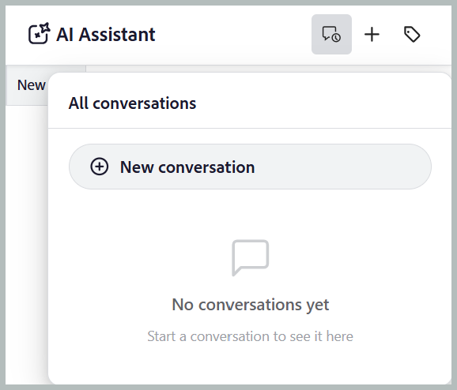
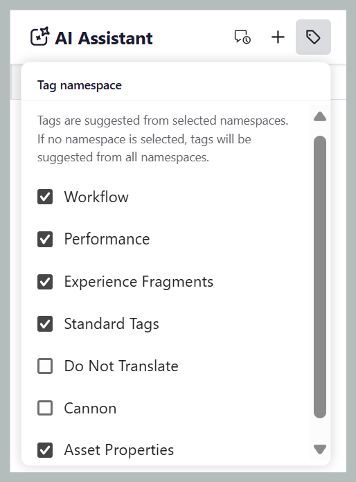
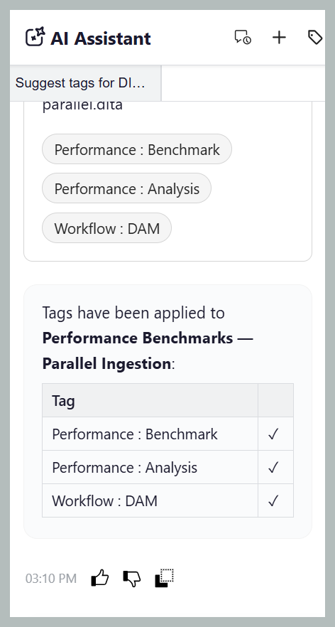
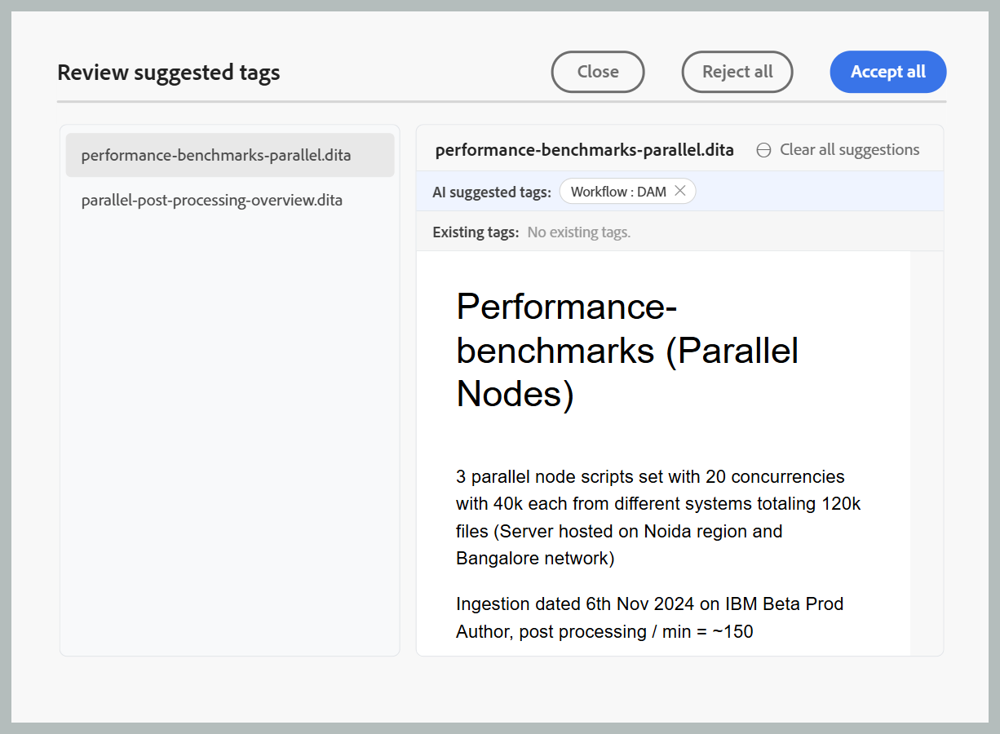

# 在代理模式下使用AI助手

>[!NOTE]
>
> 从2026.09.0版本开始，Experience Manager Guides as a Cloud Service中提供代理模式的AI助手。 它要求贵组织登记到CX Enterprise Coworker；登记后，请联系您的客户成功团队以启用该功能。 有关配置详细信息，请查看[在代理模式下配置AI助手](../install-conf-guide/configure-ai-assistant-agentic-mode-cs.md)。

代理模式中的AI助手可以更快、更轻松且更一致地标记您的内容。 使用Adobe CX Enterprise Coworker的代理智能标记技能，AI Assistant会分析您的内容并根据您组织的分类推荐相关标记，而不是您手动阅读内容以决定应用哪些标记。 要保持控制，请检查建议的标记，然后在确认选择之前选择应用或拒绝它们，从而减少手动操作量，提高标记准确性，并确保文档中的元数据一致。

## AI助手面板

AI助手面板提供生成、查看和应用AI建议标记所需的所有工具。

{width="650"}

在代理模式下，AI Assistant的以下组件可帮助您添加文件、配置标记推荐和管理智能标记工作流：

- **(A)**&#x200B;对话历史记录：查看并重新打开以前的对话，以查看以前的标记建议和操作。

  {width="350"}

- **(B)**&#x200B;新聊天：为其他主题、映射或文件集启动新的标记会话。
- **(C)**&#x200B;标记命名空间：选择AI助手从中生成标记推荐的分类命名空间。 仅考虑来自选定命名空间的标记。

  {width="350"}

- **(D)**&#x200B;响应空间：查看AI生成的标记建议，并在应用标记之前选择接受、拒绝或修改这些建议。
- **(E)**&#x200B;提示空间：输入提示请求，以便为所选内容生成标记推荐。
- **(F)**&#x200B;附加文件或添加上下文：从本地系统添加主题、映射或外部文件，以提供AI Assistant分析标记建议的内容。
- **(G)**&#x200B;模型：显示用于分析内容和生成标记推荐的AI模型。 有多个OpenAI和Anthropic Claude模型可供选择。 默认情况下，**使用清单默认值**&#x200B;选项处于选中状态，该选项使用为所选助理配置的模型。
- **(H)**&#x200B;发送：提交提示和附加的内容以生成AI支持的标记推荐。

## 使用智能标记技能将标记应用于单个或多个主题

执行以下步骤，使用AI Assistant通过智能标记技能将标记应用于单个或多个主题：

1. 登录到Experience Manager Guides。
1. 在主页上，从导航栏中选择&#x200B;**AI助手**。 确保管理员已启用代理模式下的AI助手。
1. 使用下列方法之一添加要为其生成标记推荐的主题：

   - **使用建议的提示**：对于“响应”区域中的第一次聊天，请选择&#x200B;**为文件建议标记**&#x200B;提示。 该提示将自动添加到提示空间。 选择`[file]`，然后从&#x200B;**选择文件**&#x200B;对话框中的存储库或收藏集中选择主题。 您可以从&#x200B;**选择文件**&#x200B;对话框中选择一个主题。

     {width="650"}

   - **使用快捷方式**：在“提示”字段中键入`/`，然后选择&#x200B;**添加存储库引用**&#x200B;以从存储库中选择主题（或&#x200B;**从设备添加文件**&#x200B;以从您的计算机上传主题），然后为文件输入提示，如&#x200B;*建议标记*。

   - **拖放**：将单个主题或多个主题拖放到提示空间，然后输入提示，例如&#x200B;*为文件建议标签*。

     通过拖放主题或地图{width="650"}

   - **指定主题路径**：键入`@`，后跟相同或不同映射中多个主题的逗号分隔路径，并为文件输入类似于&#x200B;*建议标记*&#x200B;的提示。

     {width="650"}

1. 选择&#x200B;**发送**。

1. AI Assistant分析主题的内容并生成标记推荐。

   分析和思考时{width="650"}

1. 查看建议的标记，如下所示：

   >[!NOTE]
   >
   > 对于已包含标记的主题，AI Assistant会显示现有标记。 这些标记是只读的，无法修改或删除。

   - 对于单个主题，您可以&#x200B;**接受**&#x200B;要应用它们的建议，或者如果不需要它们，可以&#x200B;**拒绝**。

     分析内容后{width="650"}

   - 对于多个主题：
     1. 选择&#x200B;**预览**&#x200B;以查看AI生成的标记推荐。

        {width="650"}

     1. 查看每个主题的建议标记，然后选择以下操作之一：
        - **全部接受**&#x200B;以应用所有主题的所有建议标记。
        - **拒绝所有**&#x200B;以放弃所有主题的所有建议标记。
        - **清除所有建议**&#x200B;以移除特定主题的所有建议标记。
        - 选择标记旁边的&#x200B;**X**&#x200B;图标可删除单个标记建议。

          {width="650"}

1. 接受建议的标记后，“智能标记”技能会将AI生成的标记添加到已应用于内容的标记中。

完成审阅后，AI助手会显示应用于该主题的标记以及任何拒绝的标记推荐的摘要。

{width="650"}

## 使用智能标记技能将标记应用于映射的多个主题

执行以下步骤，使用AI Assistant通过智能标记技能将标记应用于映射的多个主题：

1. 登录到Experience Manager Guides。
1. 在主页上，从导航栏中选择&#x200B;**AI助手**。 确保管理员已启用代理模式下的AI助手。
1. 使用主题中讨论的以下任一方法添加要为其生成标记推荐的映射：

   - **使用建议的提示**：对于“响应”区域中的第一次聊天，请选择&#x200B;**为文件建议标记**&#x200B;提示。 提示将自动添加到提示空间。 选择`[file]`，然后从&#x200B;**选择文件**&#x200B;对话框中的存储库或集合中选择映射。

   - **拖放**：将地图拖放到提示空间，然后输入提示，例如&#x200B;*为文件建议标签*。

   - **使用快捷方式**：在“提示”字段中键入`/`，然后选择&#x200B;**添加存储库引用**&#x200B;以从存储库中选择映射（或&#x200B;**从设备添加文件**&#x200B;以从您的计算机上传映射），然后输入提示，如&#x200B;*为文件建议标记*。

     {width="650"}

1. 选择&#x200B;**发送**。
一条消息指示所选映射包含多个主题。 选择**选择主题**&#x200B;以选择要为其标记推荐的主题。

   {width="650"}

1. 在&#x200B;**选择主题**&#x200B;对话框中，选择要为其标记推荐的主题。\
   **选择主题**&#x200B;对话框提供以下内容：

   - **主题列表：**&#x200B;显示选定映射中的所有主题。 选择要为其生成标记推荐的主题。
   - **预览窗格：**&#x200B;显示所选主题的预览及其现有标记。
   - **筛选器：**&#x200B;筛选主题以仅显示已添加&#x200B;**个标记的主题**&#x200B;或未添加标记&#x200B;**的主题**。

     {width="650"}

1. 选择&#x200B;**确认**。 AI Assistant分析所选主题并显示为每个主题生成的标记推荐数。
1. 选择&#x200B;**预览**&#x200B;以查看AI生成的标记推荐。
1. 查看每个主题的建议标记，然后选择以下操作之一：
   - **全部接受**&#x200B;以应用所有主题的所有建议标记。
   - **拒绝所有**&#x200B;以放弃所有主题的所有建议标记。
   - **清除所有建议**&#x200B;以移除特定主题的所有建议标记。
   - 选择标记旁边的&#x200B;**X**&#x200B;图标可删除单个标记建议。

     >[!NOTE]
     >
     > 对于已包含标记的主题，AI Assistant会显示现有标记。 这些标记是只读的，无法修改或删除。

   {width="650"}

1. 接受建议的标记后，智能标记技能会将AI生成的标记添加到已应用于内容的标记中。

完成审阅后，AI Assistant将显示应用于每个主题的标记以及任何拒绝的标记推荐的摘要。

