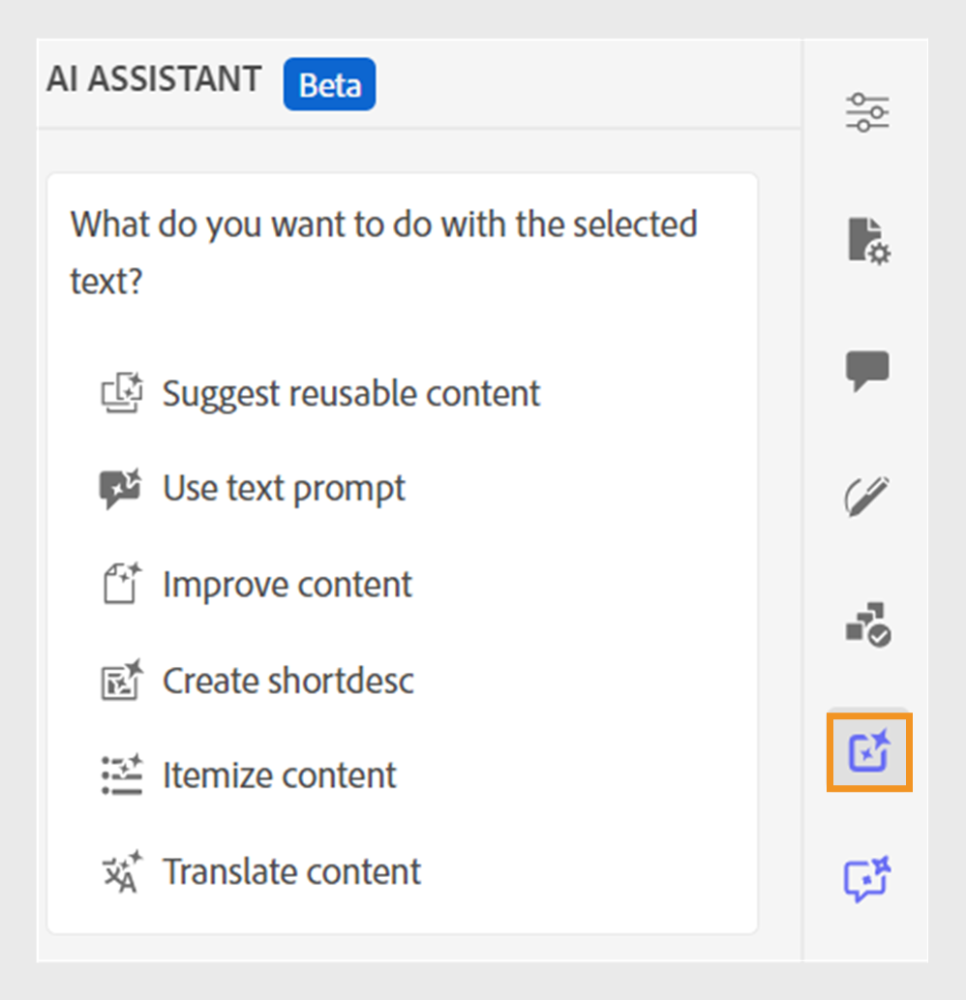
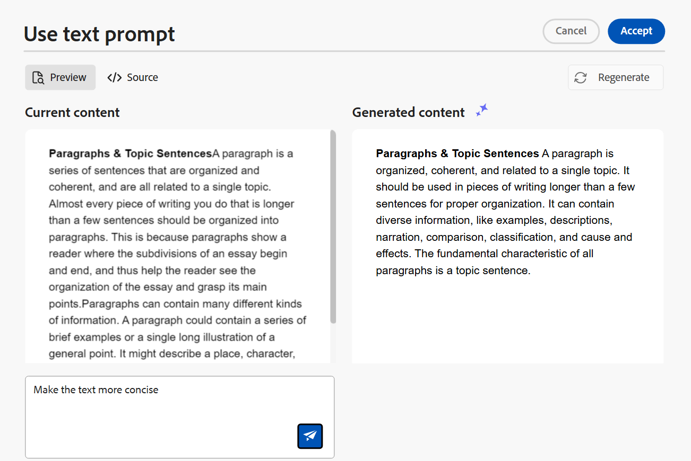

# 使用AI助手(Beta)智能地创作文档

Adobe Experience Manager Guides提供了一个AI助手工具，可帮助您更智能、更快速地创作。 使用此工具，查看智能建议以重用现有内容存储库中的内容。 使用文本提示功能提供提示，并根据您的要求更改内容。 使用AI助手可智能地将段落转换为列表。 您可以根据所选内容为当前主题创建简短描述。 此功能还可帮助您轻松改进和翻译所选内容。

>[!NOTE]
>
> 此创作功能仅适用于DITA主题，并且只能从编辑器界面访问。 在主页和地图控制台上，仅显示&#x200B;**帮助**&#x200B;面板。 “创作”功能下可用的选项由管理员使用编辑器设置在文件夹配置文件级别进行配置。

在主题中选择文本后，您可以选择执行任何AI助手操作：

{width="300" align="left"}

## 建议可重用内容

使用&#x200B;**推荐可重用内容** 功能以一致和准确地创作内容。 您可以选择内容，Experience Manager Guides提供了有关如何重用存储库中现有内容的建议。
了解有关使用[AI支持的智能建议创作内容](authoring-ai-based-smart-suggestions.md)的详细信息。

## 使用文本提示

文本提示是一种指令、问题或语句，可指导AI助手生成特定响应。

您可以使用文本提示来更改内容。 例如，您可以选择当前主题的内容并使用提示&#x200B;*使文本更加简洁*。 同样，您可以使用文本提示将属性添加到所选内容中使用的标记中。

1. 选择要为其使用文本提示的文本。
1. 从&#x200B;**创作**&#x200B;面板中选择 **ai使用文本提示图标**。
1. 通过以下方式之一发出提示：

   - 从建议的提示中选择一个提示。
   - 根据您的要求，修订或编辑建议的提示以创建自定义提示。

     >[!NOTE]
     >
     > 建议提示由管理员在`ui_config.json`中配置。

   - 在文本框中输入提示。

1. 根据您的提示为其他响应或输出选择&#x200B;**重新生成** 。

1. （可选）选择&#x200B;**展开** 以打开&#x200B;**使用文本提示**&#x200B;编辑器。 它显示当前内容和生成的内容。 您可以编辑源布局内容并检查预览。

   

   >[!NOTE]
   >
   > 根据所选内容生成响应。

1. 您还可以在编辑器中编辑提示并重新生成响应。 例如，您可以更改提示使文本更加简洁，大约为40个单词。

1. 您可以验证所生成内容的源，并根据需要对其进行编辑。

1. 选择&#x200B;**接受**&#x200B;以使用生成的内容替换主题中的选定内容。
1. **取消**：取消文本提示操作。 返回到“创作”面板。

   >[!NOTE]
   >
   > 在“创作”面板中选择&#x200B;**消除**&#x200B;图标可使您进入AI助理的初始状态。

## 改进内容

使用&#x200B;**改进内容**&#x200B;功能提高当前主题的选定内容的质量。 您可以选择内容以检查拼写、语言和语法结构，并提供更好的内容版本。 它还可以提高句子的质量。

1. 选择内容。
1. 选择&#x200B;**改进内容** 以查找有关改进内容的建议。
1. 选择&#x200B;**重新生成**，以获取其他改进内容的建议。

1. （可选）选择&#x200B;**展开**&#x200B;以打开改进的内容编辑器。 它可显示当前内容和生成的内容。 您可以在源布局中编辑内容并查看预览。

   

接受建议，在接受之前编辑源视图中的响应，重新生成其他响应，或取消操作以返回到以前的状态。

## 创建短描述

根据所选内容创建主题的简短描述（约30-50字）。 简短描述可帮助用户搜索和查找相关内容。
例如，您可以列出系统要求并相应地生成简短说明。

1. 选择内容。
1. 选择&#x200B;**创建shortdesc** 为当前主题创建简短说明。
1. 选择&#x200B;**接受**&#x200B;以创建新的简短描述（如果简短描述尚不存在）。 如果存在简短说明，则需要先确认该说明，然后再将其替换为新的简短说明。

您还可以执行以下操作：

- 选择&#x200B;**重新生成**&#x200B;为您的主题生成另一个简短描述。
- 选择&#x200B;**展开**&#x200B;以打开&#x200B;**创建shortdesc**&#x200B;编辑器。

  

## 逐项列出内容

此功能可智能地将选定段落转换为列表。  它分析内容并创建项目的逻辑列表。 您无需手动创建项目。 例如，如果您有一个详细说明创建用户帐户步骤的段落，则该工具可以将其转换为分步列表，而无需逐一手动创建项目。

1. 选择内容。
1. 选择&#x200B;**逐项显示内容** 以将所选内容转换为列表。
AI助手面板中的创作工具可智能地将内容转换为项目列表。
1. （可选）选择&#x200B;**展开**&#x200B;以打开&#x200B;**明细内容**&#x200B;编辑器。
1. 列表准备就绪后，接受所生成内容中的更改。 然后，生成的内容将替换所选内容。

## 翻译内容

使用此智能功能可将所选内容翻译为目标语言，使其在添加不同语言的注释时非常有用。 例如，您可以添加英语内容并快速将其翻译为阿拉伯语。

执行以下步骤来翻译内容：

1. 选择要翻译的内容。
1. 从&#x200B;**创作**&#x200B;面板中选择 **ai翻译内容图标**。
1. 从下拉列表中选择目标语言。 翻译后的内容将显示在“AI助手”面板中。

1. （可选）选择&#x200B;**展开**&#x200B;以打开&#x200B;**翻译内容**&#x200B;编辑器。
1. 您还可以从下拉菜单中选择其他语言，然后使用所选语言重新生成内容。 例如，如果您选择“法语”，然后选择“**重新生成**”，则内容将转换为法语。

