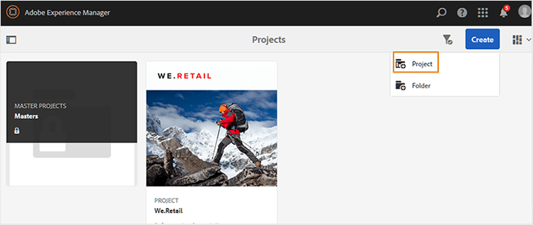
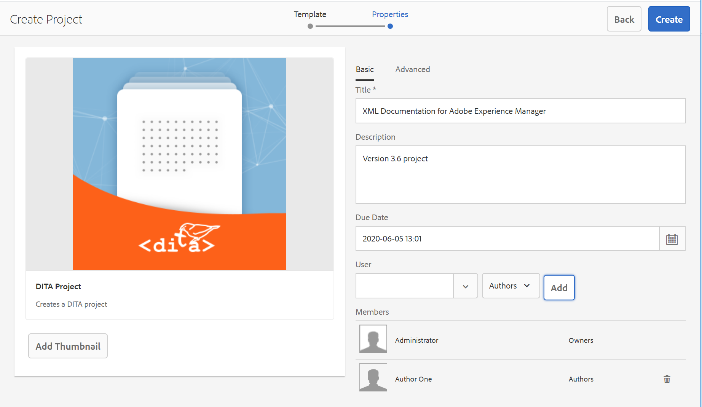

# 创建DITA项目 {#id1645HA00NM6}

Adobe Experience Manager Guides提供了一个DITA项目模板，您可以使用它来创建和管理审阅任务。

您可以创建一个DITA项目，然后使用该项目启动审核。 通过项目，可定义截止日期并控制完成已创建项目的审核任务所需的任务和时间。

您可以将团队成员添加到项目中，然后可为这些成员分配各种角色 — 作者、审阅者和发布者。

创建DITA项目后，可以从编辑器或Assets UI启动审核。 有关更多详细信息，请查看[发送审核主题](review-send-topics-for-review.md#)。

同样，每当作者启动任何审阅工作流时，项目的选定成员都会收到电子邮件通知。 要配置电子邮件通知，请在安装和配置Adobe Experience Manager Guides as a Cloud Service中查看&#x200B;*自定义电子邮件模板*。

执行以下步骤以创建DITA项目：

1. 打开项目控制台。

   您还可以使用以下URL访问“项目”控制台：

   ```http
   http://<server name>:<port>/projects.html
   ```

1. 选择&#x200B;**创建** \> **项目**&#x200B;以启动创建项目向导。

   {width="650"}

1. 在“创建项目”页面上，选择&#x200B;**DITA项目**&#x200B;模板，然后选择&#x200B;**下一步**。

1. 在“项目属性”页上，输入以下详细信息：

   **基本**&#x200B;选项卡中的信息：

   {width="650"}

   - 输入项目的&#x200B;**标题**、**描述**&#x200B;和&#x200B;**截止日期**。

   - 您可以选择项目的缩略图。

   - 默认情况下，您成为项目的所有者。 要向此项目添加更多用户，请执行以下操作：

   1. 从&#x200B;**用户**&#x200B;下拉列表中选择一个用户。

   1. 选择用户类型 — “作者”、“审阅者”或“发布者”。

      >[!NOTE]
      >
      >您将在此下拉列表中查看其他用户类型，但对于DITA项目，您应仅从“作者”、“审阅者”或“发布者”用户类型中进行选择。 即使添加其他类型的用户，该用户也无法访问Experience Manager Guides中提供的任何DITA特定功能。

   1. 选择&#x200B;**添加**。

      >[!NOTE]
      >
      >如果您使用的是Experience Manager Guides 3.5或更低版本，则显示一个选项，用于选择DITA映射文件以解决主题编辑、预览和审阅工作流的关键引用。 在3.6及更高版本中，您可以通过编辑器设置根映射。 有关详细信息，请在编辑器中查看[用户首选项](web-editor-features.md#id2087G0P40SB)。 设置根映射的另一种方法是在全局或文件夹级别配置文件中对其进行配置。 有关更多详细信息，请查看《安装和配置指南》中的&#x200B;*配置全局或文件夹级别的配置文件*。

   **高级**&#x200B;选项卡中的信息：

   - 输入项目的名称。 此名称用于创建此项目的URL。

1. 选择&#x200B;**创建**。

   此时将显示已创建项目对话框。

1. 选择&#x200B;**打开**&#x200B;以打开您的项目页面。


**父主题：**&#x200B;[&#x200B;要审阅的简介](review.md)
