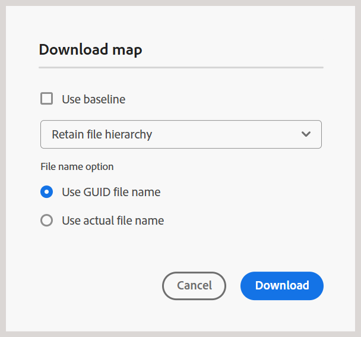

# 下载文件 {#id216MC0H0BE8}

您可以下载包括DITA和非DITA文件的资源。 您可以通过多种方式下载资源，有些方法是Adobe Experience Manager的固有方法，而其他方法受Adobe Experience Manager Guides支持。 有关本机Adobe Experience Manager资源下载信息，请查看Adobe Experience Manager文档中的[从Adobe Experience Manager下载资源](https://experienceleague.adobe.com/docs/experience-manager-cloud-service/assets/manage/download-assets-from-aem.html)。 以下部分将介绍在Experience Manager Guides中下载文件的机制。

## 从编辑器下载DITA映射文件

执行以下步骤以从编辑器下载DITA映射文件：

1. 导航到要下载的DITA映射。
1. 选择DITA映射以在编辑器中将其打开。

1. 在“映射”视图中，选择&#x200B;**选项**&#x200B;图标，然后从列表中选择&#x200B;**下载映射**。

   

   显示&#x200B;**下载映射**&#x200B;对话框。

   {width="300"}

1. 在“下载映射”对话框中，您可以选择以下选项：

   - **使用基线**：选择此选项可获取为DITA映射创建的基线列表。 如果要根据特定基线下载映射文件及其内容，请从下拉列表中选择基线。 有关使用基线的更多详细信息，请查看[使用基线](generate-output-use-baseline-for-publishing.md#)。

   - **文件层次结构选项**：您还可以使用文件层次结构下拉列表选择如何处理下载的映射文件的文件夹结构。 可用的选项为：

      - **保留文件层次结构**：从下拉列表中选择此选项，以保留已下载文件的现有文件夹结构。
      - **平面化文件层次结构**：从下拉菜单中选择此选项，可将所有引用的主题和媒体文件下载到单个文件夹中。

     对于每个选项，您可以进一步指定如何处理已下载文件的文件名。 以下文件名选项可用：

      - **使用GUID文件名**：下载具有GUID的映射文件作为文件名。
      - **使用实际的文件名**：下载具有原始文件名的映射文件。 当此选项与Flatten文件层次结构一起使用时，通过附加数字后缀（_2、_3等）来自动解析映射中的任何重复文件名，以确保唯一的文件名。

   >[!NOTE]
   >
   > 您也可以在不选择任何选项的情况下下载映射文件。 在这种情况下，将下载引用的主题和媒体文件的最新保留版本。

1. 选择&#x200B;**下载**。

   映射下载请求已排入队列。

   

   一旦地图可供下载，您将收到以下通知。

   {width="550"}

1. 选择&#x200B;**下载**&#x200B;以`.zip`格式下载映射文件。 或者，稍后从AEM收件箱中下载。

   >[!NOTE]
   >
   > 默认情况下，下载的地图会在Adobe Experience Manager通知收件箱中保留五天。

下载地图后，您可以选择地图并使用顶部的打开图标打开下载的内容。 要查看下载地图的关联元数据，请打开下载内容中包含的`metdata.json`文件。 此文件同时适用于&#x200B;*文件层次结构*&#x200B;选项 — 拼合文件层次结构和保留文件层次结构。

## 从映射仪表板下载DITA映射文件

在Adobe Experience Manager存储库中拥有DITA映射文件后，即可下载映射文件及其依赖项。 这使您能够灵活地共享完整的映射文件，以便进行离线编辑、验证、审阅或只是创建备份。

执行以下步骤下载DITA映射文件及其依赖文件：

1. 在Assets UI中，导航到要下载的DITA映射。

1. 选择DITA映射以在DITA映射控制台中将其打开。

1. 选择&#x200B;**主题**&#x200B;选项卡以查看DITA映射中可用的主题列表。

1. 在主工具栏中，选择&#x200B;**下载映射**。

   出现“Download Map（下载映射）”对话框。

   {width="300"}

1. 选择&#x200B;**下载**。 在“下载映射”对话框中，您可以选择以下选项：

   - **使用基线**：选择此选项可获取为DITA映射创建的基线列表。 如果要根据特定基线下载映射文件及其内容，请从下拉列表中选择基线。 有关使用基线的更多详细信息，请查看[使用基线](generate-output-use-baseline-for-publishing.md#)。

   - **平面化文件层次结构**：选择此选项可将所有引用的主题和媒体文件保存在单个文件夹中。

   >[!NOTE]
   >
   > 您也可以在不选择任何选项的情况下下载映射文件。 在这种情况下，将下载引用的主题和媒体文件的最新保留版本。

1. 选择&#x200B;**下载**&#x200B;按钮后，映射下载请求将排入队列。 一旦地图可供下载，您将收到以下通知。

   {width="550"}

   - 选择&#x200B;**下载**&#x200B;以.zip格式下载映射文件。

   - 选择&#x200B;**稍后下载**&#x200B;稍后下载映射文件。 可以从Adobe Experience Manager通知收件箱访问下载链接。 在收件箱中选择生成的映射通知，以.zip格式下载映射。

   >[!NOTE]
   >
   > 默认情况下，下载的地图会在Adobe Experience Manager通知收件箱中保留五天。

{width="300"}

下载地图后，您可以选择地图并使用顶部的打开图标打开下载的内容。

**父主题：**&#x200B;[&#x200B;管理内容](authoring.md)
