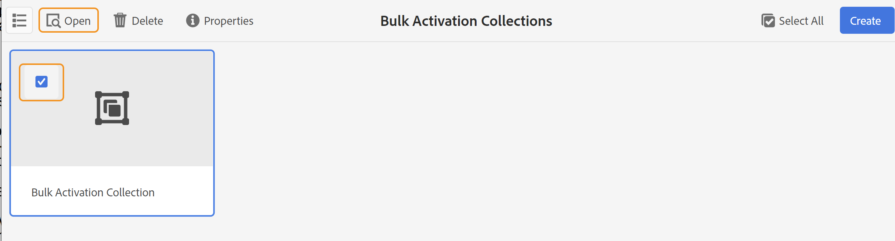
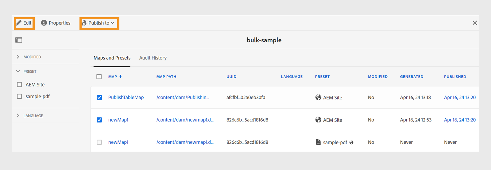
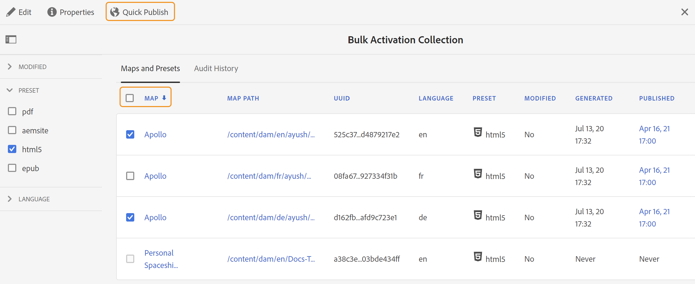

# 激活输出 {#id214GGF00V5U}

创建用于批量激活的映射收藏集后，下一步是在发布实例上激活您的内容。 要激活内容，请执行以下步骤：

1. 选择顶部的Adobe Experience Manager徽标，然后选择&#x200B;**工具**。

1. 在&#x200B;**工具**&#x200B;面板中，选择&#x200B;**指南**。

1. 选择&#x200B;**批量发布仪表板**&#x200B;磁贴。

   此时将显示批量发布功能板，其中包含批量激活映射集合列表。 您还可以从[Adobe Experience Manager Guides主页](intro-home-page.md)的左侧面板访问此仪表板。

1. 选择要发布的收藏集，然后选择&#x200B;**打开**。

   

1. \（*可选*\）应用左边栏中的必需筛选器，以根据其修改的\(status\)、输出预设或语言对映射进行筛选。

   >[!NOTE]
   >
   >在地图集合中激活输出预设之前，使用输出预设生成地图的输出。

查看根据您的设置激活收藏集的不同方式。

 云服务 

{width="650"}

您可以激活输出到&#x200B;**预览**&#x200B;或&#x200B;**发布**&#x200B;实例。

**预览**

* 要激活所选映射的输出，请选择预生成的映射输出，然后选择&#x200B;**发布到** > **预览**。
* 要激活所有DITA映射及其配置预设的输出，请选中&#x200B;**映射**&#x200B;列旁边的复选框，然后选择&#x200B;**发布到** > **发布**。

**发布**

* 要激活所选映射的输出，请选择预生成的映射输出，然后选择&#x200B;**发布到** > **发布**。

* 要激活所有DITA映射及其配置预设的输出，请选中映射（列）旁边的复选框，然后选择&#x200B;**发布到** > **发布**。

>[!NOTE]
> 
> 仅当已生成映射的输出时，才会启用映射输出的复选框。

当映射输出排队等待发布时，会显示一条成功消息。

为所选映射文件激活输出后，将更新审核历史记录选项卡，并且最新激活的输出将显示在顶部。 **已发布**&#x200B;列已更新发布日期和时间。

    

  内部部署软件 

执行下列操作之一：

* 要激活所选映射的输出，请选择预生成的映射输出，然后选择&#x200B;**快速发布**。
* 要激活所有DITA映射及其配置预设的输出，请选中“映射”（列）旁边的复选框，然后选择&#x200B;**快速发布。**
  {width="650"}

  >[!NOTE]
  > 
  >仅当已生成映射的输出时，才会启用映射输出的复选框。

当映射输出排队等待发布时，会显示一条成功消息。

为所选映射文件激活输出后，将更新审核历史记录选项卡，并且最新激活的输出将显示在顶部。 **已发布**&#x200B;列已更新发布日期和时间。

**父主题： **[批量激活已发布的内容](conf-bulk-activation.md)
