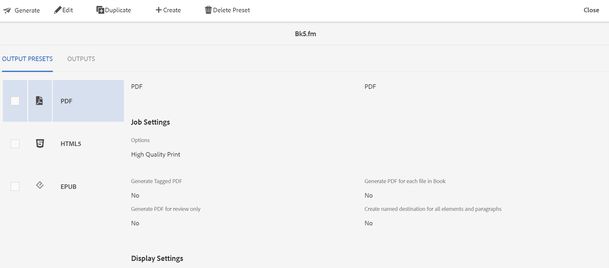

# 生成.book或.fm文件的输出 {#generating_output_fm_docs}

执行以下步骤以生成FrameMaker文档的输出：

1. 在Assets UI中，导航到要发布的`.book`或`.fm`文件并将其选定。

   此时将显示DITA映射控制台，其中显示了可用于生成输出的输出预设列表。

   

1. 选择一个或多个要用于生成输出的输出预设。

1. 选择“生成”图标以启动输出生成流程。

>[!NOTE]
>
> 通过选择输出，可以查看输出生成请求的当前状态。 有关详细信息，请参阅[查看输出生成任务的状态](fm-output-view-status.md)。

**父主题：**[&#x200B;生成FrameMaker文档的输出](fm-output-generatation.md)
