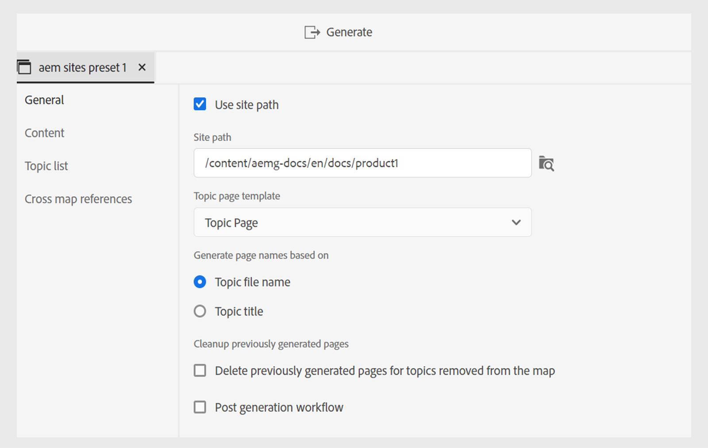
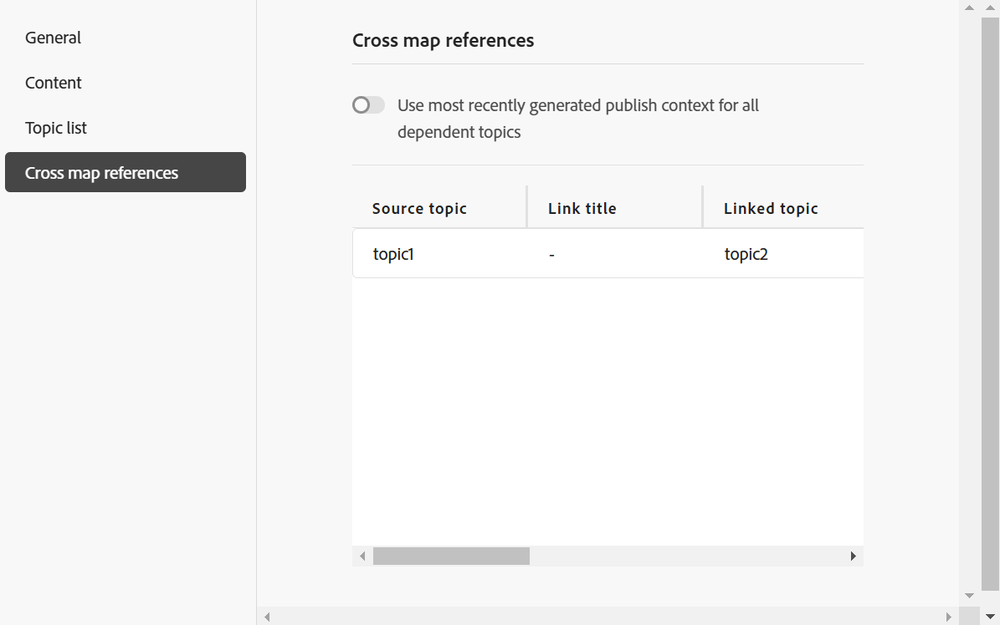

# “地图”控制台中的AEM Sites预设

您可以从“地图”控制台中创建AEM Sites预设，并将其配置为生成AEM Sites输出。 有两种方法可创建AEM Sites输出：

- [使用复合组件映射](#use-composite-component-mapping)
- [使用旧版组件映射](#use-legacy-component-mapping)

>[!TIP]
>
> 建议您使用Experience Manager Guides 2502发行版及更高版本中提供的复合组件映射来增强性能。

## 使用复合组件映射

与旧版组件映射相比，复合组件映射提供了更快且可扩展的发布到AEM Sites的功能。 它随附现成的可编辑模板，这些模板可以根据您的要求使用AEM模板编辑器进行自定义。 这些模板将WCM核心组件和专门的`guides-components`结合使用，以确保最终用户在您的AEM Sites页面上获得最佳体验。 也可使用复合元件映射方法定制现有模板。

Experience Manager Guides提供了用于创建AEM Sites的预定义模板。 这些模板可帮助您确保内容布局和结构的一致性。
- [根据这些预定义的模板创建主页](../cs-install-guide/download-install-aem-sites-templates-cs.md#create-a-home-page-using-the-template)。
- 您可以[编辑主题模板](../cs-install-guide/download-install-aem-sites-templates-cs.md#package-installation)并根据您的要求应用样式。
- 您也可以[自定义现有AEM Sites模板](../cs-install-guide/download-install-aem-sites-templates-cs.md#customize-existing-aem-sites-templates)。

**创建AEM Sites预设**

执行以下步骤，使用复合组件映射创建AEM Sites预设：

1. [在映射控制台](./open-files-map-console.md)中打开DITA映射文件。
1. 在&#x200B;**输出预设**&#x200B;面板中，选择+图标以创建输出预设。
1. 从&#x200B;**新建输出预设**&#x200B;对话框的&#x200B;**类型**&#x200B;下拉列表中选择&#x200B;**AEM Sites**。
1. 取消选择&#x200B;**使用旧版组件映射**&#x200B;选项。
1. 选择&#x200B;**添加到当前文件夹配置文件**&#x200B;选项可在当前文件夹配置文件中创建输出预设。 表示文件夹配置文件级别的预设。

   了解有关[管理全局和文件夹配置文件输出预设](./web-editor-manage-output-presets.md)的更多信息。

1. 选择&#x200B;**添加**。

   将创建AEM Sites的预设。

   {width="300" align="left"}

<!-----------------------
### Generate the AEM Sites output using the templates

Once, the preset is created, you can configure the various options available for AEM Sites output generation. Experience Manager Guides allows you to use the out of the box templates or add your own AEM Sites templates.

You can configure the Out-of-the-box Sites template  in two ways:

- In the **Sites** field, select the AEM sites where you want to publish your output.  For example, `AEMG Docs`.

    The **Publish path** and the **Topic page template** options are automatically set in the dropdown.  For example,  `AEMG-Docs-Site/en/docs/product1` and `Topic page` are set respectively. You can also choose the other options from the dropdown.

- Or, Select the **Use Sites path** option to select the complete Sites path, and then select a **Map page template**. 

    You can browse a predefined Sites path or specify a custom path even if the specified path has not been pre-created within the AEM Sites structure. In such cases, the system creates the necessary structure during the publishing process by using the selected map homepage template.

   For example, you can specify the path `/content/AEMG-Docs-Site/en/docs/product4` where the `product4`does not exist in the strcuture. In this case, the system automatically creates `product4` using the selected **Map page template** and publish the output within this newly created page. 
   
   The **Topic page template** is automatically set as `Topic Page`. However, you can choose to select other available options in the dropdown.

--->

### 用于复合组件映射的AEM Sites预设配置

>[!NOTE]
>
> 在为Experience Manager Guides配置AEM Sites预设之前，管理员需要使用模板创建AEM Sites结构。

- **内部部署软件**：了解有关如何[下载并安装内部部署软件的AEM Sites模板](../install-guide/download-install-aem-sites-templates.md)的详细信息。
- **Cloud Service**：了解有关如何[下载并安装适用于Cloud Service的AEM Sites模板](../cs-install-guide/download-install-aem-sites-templates-cs.md)的更多信息。

在“映射”控制台中，复合组件映射的预设配置选项被组织在以下选项卡下：

- 常规
- 内容
- 主题列表
- 交叉映射引用

{width="650" align="left"}

**常规**

**常规**&#x200B;选项卡包含以下配置选项：

| AEM Sites选项 | 描述 |
| --- | --- |
| 使用站点路径 | 使用此选项可将您的内容发布到Experience Manager站点。 |
| 站点路径 | **如果您选择**&#x200B;使用站点路径&#x200B;**选项**，则会显示此选项。 浏览预定义的Experience Manager站点路径，或指定要发布输出的自定义路径。 通过&#x200B;**使用站点选项**，可以指定整个发布路径，即使尚未在AEM Sites结构中预先创建指定的路径也是如此。 在这种情况下，系统在发布过程中使用选定的映射主页模板创建必要的结构。 |
| 映射页面模板 | **如果您选择**&#x200B;使用站点路径&#x200B;**选项**，则会显示此选项。 选择要应用于映射主页的模板。 |
| 站点 | 要将内容发布到的Experience Manager Sites的名称。 下拉列表中的选项会根据AEM Sites中可用的站点列表进行填充。  选择&#x200B;**刷新** 以获取新选项列表并反映更新的数据。 |
| 发布路径 | AEM存储库中存储输出的路径。 发布路径中填充了所有路径，这些路径包含根据主页模板创建的页面。 DITA映射的AEM Sites输出在此路径下生成。  例如，如果您将站点指定为`AEMG-Docs`，将发布路径指定为`aemg-docs-en/docs/product-abc.`，则将在`crx/de`中的`aemg-docs-en/docs/product-abc/`节点下生成AEM Sites输出。 |
| 主题页面模板 | 选择要应用于所有输出主题的模板。 |
| 根据生成页面名称 | **主题文件名**：使用DITA主题的文件名创建站点URL。  **主题标题**：使用DITA主题的标题创建Experience Manager站点名称。 |
| 清理以前生成的页面 | - **删除从映射中删除的主题先前生成的页面**：如果DTIA映射的结构发生更改，则可以使用此选项为已删除的主题删除先前生成的页面。 此功能仅适用于完全映射发布。  假设您已发布一个DITA映射，其中包含主题a.dita、b.dita和c.dita。 再次发布映射之前，您已从映射中删除了b.dita主题。 现在，如果您选择了此选项，则与b.dita相关的所有内容都将从AEM Sites输出中删除，并且仅发布a.dita和c.dita。  **注意**：输出生成日志中还捕获了有关已删除页面的信息。 有关访问日志文件的详细信息，请[查看并检查日志文件](generate-output-basic-troubleshooting.md#id1821I0Y0G0A__id1822G0P0CHS)。   **警告**：删除主题时，已发布站点中的页面将不可用。 因此，在删除主题之前，会出现警告。 您必须确认删除它们。  - **删除此路径上其他源创建的所有页面**：如果选择此选项，则将从其他映射、单个主题或任何其他源中删除此路径上发布的所有页面。 已发布的站点中的页面也将不可用。 因此，在删除主题之前，会出现警告。 您必须确认删除它们。 |
| 后期生成工作流 | 选择此选项时，将显示一个新的生成后工作流下拉列表，其中包含在AEM中配置的所有工作流。 必须选择要在输出生成工作流完成后执行的工作流。 |

**内容**

**内容**&#x200B;选项卡包含以下配置选项：

| AEM Sites选项 | 描述 |
| --- | --- |
| 使用基线 | 如果已为所选DITA映射创建了基线，请选择此选项以指定要发布的版本。  查看[使用基线](generate-output-use-baseline-for-publishing.md#id1825FI0J0PF)以了解更多详细信息。 |
| 条件筛选 | 选择以下选项之一：  **无**：如果不想对已发布的输出应用任何条件，请选择此选项。 **使用DITAVAL**：选择DITAVal文件以生成条件化内容。 可使用浏览对话框或键入文件路径来选择多个DITAVal文件。 使用文件名旁边的交叉图标可将其删除。 DITAVal文件将按指定的顺序进行计算，因此第一个文件中指定的条件优先于后续文件中指定的匹配条件。 您可以通过添加或删除文件来维护文件顺序。 如果将DITAVal文件移动到其他位置或将其删除，则不会从映射操控板中自动将其删除。 如果移动或删除了文件，则需要更新位置。 您可以将鼠标悬停在文件名上以查看存储该文件的AEM存储库中的路径。 您只能选择DITAVal文件，如果选择了任何其他文件类型，则会显示错误。 **条件预设**：从下拉列表中选择条件预设，以在发布输出时应用条件。 如果为DITA映射文件添加了条件，则此选项可见。 条件设置在DITA映射控制台的条件预设选项卡中可用。 要了解有关条件预设的更多信息，请查看[使用条件预设](generate-output-use-condition-presets.md#id1825FL004PN)。 |
| 其他DITA-OT命令行参数 | 指定在生成输出时希望DITA-OT处理的其他参数。 有关DITA-OT中支持的命令行参数的详细信息，请查看[DITA-OT文档](https://www.dita-ot.org/)。 |
| 元数据   文件(Assets)属性 | 选择要作为元数据处理的属性。 这些属性是从DITA映射或书签文件的属性页面设置的。 您从下拉列表中选择的属性显示在&#x200B;**文件属性**&#x200B;字段下。 选择资产旁边的交叉图标以将其删除。   **注意**：元数据属性区分大小写。  *如果已选择基线，则属性的值将基于所选基线的版本。 *&#x200B;如果您未选择基线，则属性的值将基于最新版本。  您还可以使用DITA-OT发布将元数据传递到输出。 有关更多详细信息视图，[使用DITA-OT](pass-metadata-dita-ot.md#id21BJ00QD0XA)将元数据传递到输出。  **注意**：如果您尚未在“属性”选项中定义`cq:tags`，那么即使您选择了基线进行发布，也会从当前工作副本中提取`cq:tags`的值。 |
| 元数据   使用映射属性作为回退 | 如果选中，为映射文件定义的属性也会复制到未定义此类属性的主题中。 使用此选项时，请考虑以下几点：  *只能将字符串、日期或长（单值和多值）属性传递到AEM网站页面。 *&#x200B;字符串类型属性的元数据值不支持任何特殊字符（如`@, #, " "`）。 *此选项应与`Properties`选项一起使用。 |

**主题列表**

**主题列表**&#x200B;选项卡显示DITA映射的当前工作副本中存在的主题列表。 默认情况下，包含所有主题。 您可以选择特定主题，并仅为其生成AEM Sites输出。 例如，您已更新了某些主题，以便可以仅发布这些主题，而不是发布整个DITA映射。

 {align="left"}

>[!NOTE]
>
> 在&#x200B;**内容**&#x200B;选项卡中选择基线时，主题列表将显示附加基线中的主题及其版本。 此外，仅当映射的结构未发生更改时，才应使用主题列表中的增量发布。 如果地图结构/目录发生变化，则整个地图应发布一次以更新目录。

**交叉映射引用**

此列表包含的主题包含`scope =”peer”`的交叉映射引用。 您可以为其他DITA映射中可用的主题的`scope=”peer”`交叉映射引用列表指定发布上下文。 如果您使用Experience Manager Guides (UUID)版本，将显示此选项卡。

有关更多详细信息，请参阅下面的[使用链接的主题](#working-with-linked-topics)部分。

配置完毕后，将所做的更改保存到预设，然后选择&#x200B;**生成**&#x200B;为相应的映射生成AEM Sites。

>[!NOTE]
>
> 如果您是首次将内容发布到AEM网站，则建议在网站级别发布页面。 这将确保输出在&#x200B;**Publish**&#x200B;实例上正确显示，不会出现任何CSS中断。

## 使用旧版组件映射

使用旧版组件映射创建AEM Sites预设的步骤与上面[复合组件映射](#use-composite-component-mapping)部分中列出的步骤相同。 但是，在创建预设时，请确保在&#x200B;**新建输出预设**&#x200B;对话框中选择&#x200B;**使用旧版组件映射**&#x200B;选项。

 {width="300" align="left"}

在“映射”控制台中，旧版组件映射的预设配置选项将在以下选项卡下组织：

- 常规
- 内容
- 交叉映射引用

{width="500" align="left"}

**常规**

**常规**&#x200B;选项卡包含以下配置选项：

| AEM Sites选项 | 描述 |
| --- | --- |
| Site 名称 | 将输出存储在AEM存储库中的网站名称。  AEM存储库中的节点将使用此处指定的名称创建。 如果未指定站点名称，则使用DITA映射文件名创建站点节点。  您在此指定的网站名称也用作浏览器选项卡中的标题。  您还可以在设置网站名称时使用变量。 |
| 输出路径 | AEM存储库中存储输出的路径。 在生成最终输出时，站点名称和输出路径将组合在一起。 例如，如果您将站点名称指定为`user-guide`，将输出路径指定为`/content/output/aem-guides`，则最终输出将在`/content/output/aem-guides/user-guide`节点下生成。  您还可以在设置输出路径时使用变量。 |
| 现有输出页面 | 选择&#x200B;**覆盖内容**&#x200B;选项可覆盖现有页面中的内容。 此选项仅覆盖页面内容和标题节点下存在的内容。 此选项允许混合发布内容。 选择此选项将提供一个选项，用于从已发布的输出中选择删除孤立页面。 这也是用于创建AEM Sites输出的&#x200B;*默认*&#x200B;选项。  选择&#x200B;**删除并创建**&#x200B;选项以在发布期间强制删除任何现有页面。 此选项会删除页面节点及其内容和其下的所有子页面。 如果您已更改输出预设的设计模板，或者希望删除目标中已存在的任何额外页面，请使用此选项。 |
| 为从映射中删除的主题删除以前生成的页面 | 如果DTIA映射的结构发生更改，可以使用此选项为已删除的主题删除先前生成的页面。 此功能仅适用于完全映射发布。  假设您已发布一个DITA映射，其中包含主题a.dita、b.dita和c.dita。 再次发布映射之前，您已从映射中删除了b.dita主题。 现在，如果您选择了此选项，则与b.dita相关的所有内容都将从AEM Sites输出中删除，并且仅发布a.dita和c.dita。  **注意**：输出生成日志中还捕获了有关已删除页面的信息。 有关访问日志文件的详细信息，请[查看并检查日志文件](generate-output-basic-troubleshooting.md#id1821I0Y0G0A__id1822G0P0CHS)。   **警告**：删除主题时，已发布站点中的页面将不可用。 因此，在删除主题之前，会出现警告。 您必须确认删除它们。 |
| 设计 | 选择要用于生成输出的设计模板。  有关如何使用自定义设计模板生成输出的详细信息，请与发布管理员联系。 |
| 后期生成工作流 | 选择此选项时，将显示一个新的生成后工作流下拉列表，其中包含在AEM中配置的所有工作流。 必须选择要在输出生成工作流完成后执行的工作流。 |
| 保留临时文件 | 选择此选项可保留由DITA-OT生成的临时文件。 如果在通过DITA-OT生成输出时遇到错误，请选择此选项以保留临时文件。 然后，您可以使用这些文件来排查输出生成错误。   生成输出后，选择&#x200B;**下载临时文件** 图标以下载包含临时文件的ZIP文件夹。   **注意**：如果在生成期间添加文件属性，则输出临时文件还包括包含这些属性的&#x200B;*metadata.xml*&#x200B;文件。 |

**内容**

**内容**&#x200B;选项卡包含以下配置选项：

| AEM Sites选项 | 描述 |
| --- | --- |
| 使用基线 | 如果已为所选DITA映射创建了基线，请选择此选项以指定要发布的版本。  查看[使用基线](generate-output-use-baseline-for-publishing.md#id1825FI0J0PF)以了解更多详细信息。 |
| 条件筛选 | 选择以下选项之一：  **无**：如果不想对已发布的输出应用任何条件，请选择此选项。 **使用DITAVAL**：选择DITAVal文件以生成条件化内容。 可使用浏览对话框或键入文件路径来选择多个DITAVal文件。 使用文件名旁边的交叉图标可将其删除。 DITAVal文件将按指定的顺序进行计算，因此第一个文件中指定的条件优先于后续文件中指定的匹配条件。 您可以通过添加或删除文件来维护文件顺序。 如果将DITAVal文件移动到其他位置或将其删除，则不会从映射操控板中自动将其删除。 如果移动或删除了文件，则需要更新位置。 您可以将鼠标悬停在文件名上以查看存储该文件的AEM存储库中的路径。 您只能选择DITAVal文件，如果选择了任何其他文件类型，则会显示错误。 **条件预设**：从下拉列表中选择条件预设，以在发布输出时应用条件。 如果为DITA映射文件添加了条件，则此选项可见。 条件设置在DITA映射控制台的条件预设选项卡中可用。 要了解有关条件预设的更多信息，请查看[使用条件预设](generate-output-use-condition-presets.md#id1825FL004PN)。 |
| 元数据   文件(Assets)属性 | 选择要作为元数据处理的属性。 这些属性是从DITA映射或书签文件的属性页面设置的。 您从下拉列表中选择的属性显示在&#x200B;**文件属性**&#x200B;字段下。 选择资产旁边的交叉图标以将其删除。   **注意**：元数据属性区分大小写。  *如果已选择基线，则属性的值将基于所选基线的版本。 *&#x200B;如果您未选择基线，则属性的值将基于最新版本。  您还可以使用DITA-OT发布将元数据传递到输出。 有关更多详细信息视图，[使用DITA-OT](pass-metadata-dita-ot.md#id21BJ00QD0XA)将元数据传递到输出。  **注意**：如果您尚未在“属性”选项中定义`cq:tags`，那么即使您选择了基线进行发布，也会从当前工作副本中提取`cq:tags`的值。 |
| 元数据   使用映射属性作为回退 | 如果选中，为映射文件定义的属性也会复制到未定义此类属性的主题中。 使用此选项时，请考虑以下几点：  *只能将字符串、日期或长（单值和多值）属性传递到AEM网站页面。 *&#x200B;字符串类型属性的元数据值不支持任何特殊字符（如`@, #, " "`）。 *此选项应与`Properties`选项一起使用。 |

**交叉映射引用**

此列表包含的主题包含`scope =”peer”`的交叉映射引用。 您可以为其他DITA映射中可用的主题的`scope=”peer”`交叉映射引用列表指定发布上下文。 如果您使用Experience Manager Guides (UUID)版本，将显示此选项卡。

有关更多详细信息，请参阅下面的[使用链接的主题](#working-with-linked-topics)部分。

## 使用链接的主题

Experience Manager Guides允许您使用`peer @scope`创建主题引用。 然后，您可以从AEM Sites预设中定义这些引用的发布上下文，最后生成链接主题的输出。

有关更多详细信息，请查看[从其他映射生成链接主题的输出](../user-guide/generate-output-aem-site.md#generate-output-linking-topics-from-other-maps)。

执行以下步骤可指定交叉链接文件的发布上下文：

1. 打开&#x200B;**交叉映射引用**&#x200B;选项卡。 要查看此选项卡，请确保`<xrefs>`具有唯一ID。 如果`<xrefs>`的唯一ID不存在，则在编辑/保存旧内容时将自动生成ID。

   在以下情况中，您将无法查看交叉图链接：
   - 对于4.6版本之前创建的预设，交叉引用选项卡处于禁用状态，并且会显示工具提示&#x200B;**请参阅映射功能板**。
   - 对于从映射仪表板创建的预设，**请参阅映射仪表板**&#x200B;工具提示出现。
   - 对于OOTB预设，**请参阅映射仪表板**&#x200B;工具提示。
   - 对于全局预设，请创建此全局预设的本地副本以设置交叉映射引用。

1. 此时将显示主题及其引用的列表

   >[!NOTE]
   >
   >**交叉映射引用**&#x200B;选项卡仅显示使用`scope=”peer”`链接的主题。 对于具有`scope=”local”`的链接，无需指定发布上下文。

   默认情况下，所有链接的主题都会选择其最新的输出预设和映射。 默认情况下，所有链接主题的发布上下文均设置为`<Most recently generated>`映射。

   

1. 如果要使用映射中每个依赖文件的最近发布的输出，请选择&#x200B;**为所有依赖主题使用最近生成的**&#x200B;发布上下文。
在发布包含链接主题的映射之前，您应该发布选定作为父映射的映射。 如果未发布包含链接主题的映射，则在AEM Sites输出中，链接将显示为普通文本而非超链接。
您应为链接的主题选择相同类型的AEM Sites预设。 例如，如果当前AEM Sites预设使用旧版组件映射，则为链接的主题选择类似的AEM Sites预设。
1. 在“父映射”下拉列表中，选择要为其输出链接当前映射输出的映射文件。
选择映射文件会在“父映射UUID”列中显示映射的UUID。 与所选映射关联的输出预设列在父映射的预设列表中。 例如，映射A中的主题1包含对主题2的引用。 主题2可以出现在单个或多个映射中。 您可以选择父映射和特定预设，也可以为每个链接选择最近发布的输出。

1. 如果同一主题在文件中被引用多次，则可以为每个实例添加不同的发布上下文。 这提供了更大的灵活性和对其内容的控制。 例如，主题3同时存在于映射B和映射C中。主题1包含两个对主题3的引用。 您可以选择映射B作为第一个链接的父映射，选择映射C作为第二个链接的父映射。

1. 在父映射的预设下拉列表中，选择要与当前映射的输出链接的输出预设。
   >[!NOTE]
   >
   > 下拉列表中将显示当前映射的其他AEM Sites预设。 如果未选择预设，则会出现警告图标，并且输出生成会失败。

1. 为所有源主题选择所需的映射及其输出预设，然后选择&#x200B;**生成**。

**父主题：** [了解输出预设](generate-output-understand-presets.md)