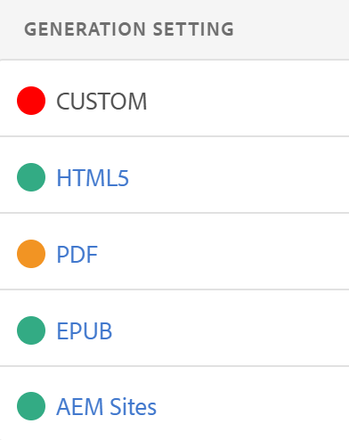

# 基本疑难解答 {#id1821I0Y0G0A}

使用Adobe Experience Manager Guides时，在发布或打开文档时可能会遇到错误。 此类错误可能位于DITA映射、主题或Experience Manager Guides进程本身中。 本节提供了有关如何访问和分析输出生成日志文件中的信息的信息。 此外，如果DITA主题太大，则可能会查看JSP编译错误。 本节还提供了有关如何解决JSP编译错误的信息。

## 查看并检查日志文件 {#id1822G0P0CHS}

执行以下步骤以查看并检查输出生成日志文件：

1. 启动输出生成过程后，在DITA映射控制台中选择&#x200B;**输出**。

   **生成的输出**&#x200B;的&#x200B;**生成设置**&#x200B;列显示该颜色，可提供有关不同输出预设的输出生成成功或失败的可视提示。

   {width="300" align="left"}

   在上面的屏幕截图中：

   - 红色表示输出生成失败。
   - 绿色表示输出生成成功。
   - 琥珀色表示生成的输出成功，但出现错误。

   >[!NOTE]
   >
   > **输出**&#x200B;选项卡上的颜色（表示各种输出结果的状态）不同于用来对日志文件中的各种错误类型进行分类的颜色。

1. 作业完成后，在&#x200B;**生成时间**&#x200B;列中选择链接。

   日志文件将在新选项卡中打开。

   {align="left"}

1. 应用以下筛选器以高亮显示日志文件中的文本：
   - **致命**：以深红色突出显示日志文件中的严重错误。
   - **错误**：以红色突出显示日志文件中的错误。 例外会被视为错误，并以红色同样突出显示。
   - **警告**：以琥珀色突出显示日志文件中的警告。
   - **信息**：以绿色突出显示日志文件中的信息消息。

1. 使用向上和向下导航按钮跳转到日志文件中突出显示的文本。 或者，滚动浏览日志文件并检查消息。

1. 您可以对日志文件执行以下操作：

   - **下载日志**：如果日志列表很长，请选择&#x200B;**下载日志**&#x200B;以将日志文件下载到您的设备，以便于访问和查看。
   - **复制日志**：将日志列表复制到剪贴板，以便快速将其粘贴到某个文本编辑器。

## 在文本编辑器中复制并检查日志文件

执行以下步骤，在文本编辑器中复制并检查输出生成日志文件：

1. 启动输出生成过程后，在DITA映射控制台中选择&#x200B;**输出**。

1. 作业完成后，在&#x200B;**生成时间**&#x200B;列中选择链接。

   日志文件将在新选项卡中打开。

1. 选择&#x200B;**复制日志**&#x200B;按钮。 日志文件将复制到剪贴板中。
1. 打开文本编辑器并在编辑器中粘贴日志文件。

1. 滚动浏览日志文件并检查消息。

   以下信息将帮助您确定DITA文件或Experience Manager Guides进程中是否存在错误：

   - *与DITA映射文件相关的错误*：如果在DITA映射文件或DITA映射中包含的任何其他文件中发现错误，则日志文件将包含字符串“BUILD FAILED”。 您可以检查日志文件中提供的信息以找到错误文件并修复问题。

   在以下示例日志文件片段中，您可以查看`BUILD FAILED`消息以及错误原因。

   {width="650" align="left"}

   - *与Experience Manager Guides相关的错误*：您可以在日志文件中识别的其他错误类型与Experience Manager Guides进程本身相关。 在这种情况下，已成功解析DITA映射文件，但输出生成过程会由于Experience Manager Guides中的一些内部错误而失败。 对于此类错误，您必须寻求技术支持团队的帮助。

   在以下示例日志文件片段中，您可以查看`BUILD SUCCESSFUL`消息，随后是其他技术错误。

   {width="650" align="left"}

## 解决JSP编译错误

如果DITA主题太大，则可以在浏览器中查看JSP编译错误\(`org.apache.sling.api.request.TooManyCallsException`\)。 打开主题进行编辑、审阅或发布时，可能会显示此错误。

执行以下步骤以解决此问题：

1. 在“全局导航”中，选择“工具”，然后选择“操作”\>“Web控制台”。

   此时将显示“Adobe Experience Manager Web控制台配置”页面。

1. 搜索并选择&#x200B;*Apache Sling主Servlet*&#x200B;组件。

   此时将显示Apache Sling主Servlet的可配置选项。

1. 根据您的要求，增加每个请求&#x200B;*调用数*&#x200B;参数的值。

**父主题：**&#x200B;[&#x200B;输出生成](generate-output.md)
