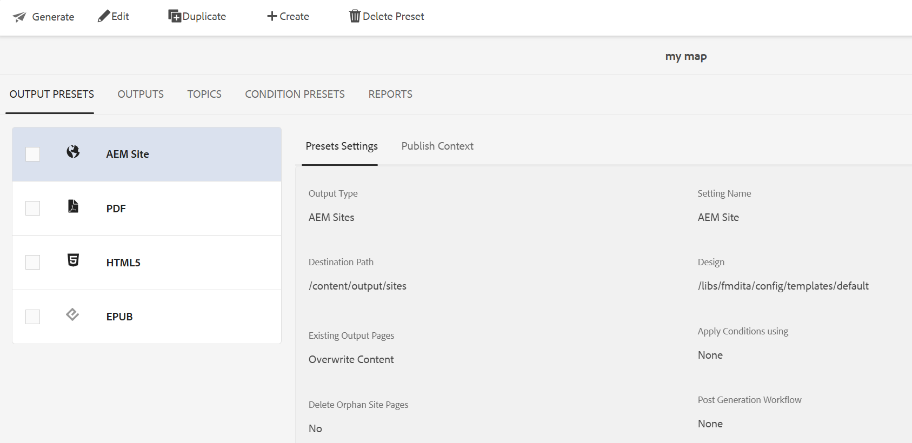

# 编辑、复制或删除输出预设 {#id205BEH0K09Z}

您可以从“地图”控制台和“地图”仪表板管理输出预设。 通过这两种方法，您都可以获得编辑、复制和删除输出预设的选项，如下节所述。

## 使用地图控制台

通过直接将必填字段更改为所需的预设设置，可以编辑选定的输出预设。

此外，您还可以使用&#x200B;**选项**&#x200B;下拉菜单复制或删除输出预设，如下所示。

## 使用地图仪表板

您可以使用地图仪表板编辑、复制和删除输出预设，方法是从顶部栏中选择所需的选项卡，如下所示。

**父主题：**&#x200B;[&#x200B;输出生成](generate-output.md)
