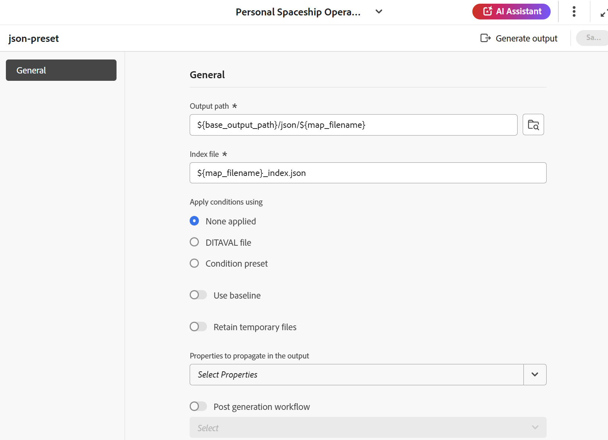

# JSON {#id231KK0180T4}

执行以下步骤以从“映射”控制台创建JSON预设：

1. [在映射控制台](./open-files-map-console.md)中打开DITA映射文件。

   您还可以从&#x200B;**概述部分**&#x200B;中的[最近使用的文件](./intro-home-page.md#overview)构件访问映射文件。 选定的映射文件将在映射控制台中打开。
1. 在&#x200B;**输出预设**&#x200B;选项卡中，选择+图标以创建输出预设。
1. 从&#x200B;**新建输出预设**&#x200B;对话框的“类型”下拉列表中选择&#x200B;**JSON**。
1. 在&#x200B;**名称**&#x200B;字段中，提供此预设的名称。
1. 选择&#x200B;**添加到当前文件夹配置文件**&#x200B;选项可在当前文件夹配置文件中创建输出预设。 表示文件夹配置文件级别的预设。

   了解有关[管理全局和文件夹配置文件输出预设](./web-editor-manage-output-presets.md)的更多信息。

1. 选择&#x200B;**添加**。

   将创建JSON预设。

   {width="300" align="left"}

创建预设后，您可以配置可在“常规”选项卡下找到的以下预设配置。

- 输出路径
- 索引文件
- 使用\（如果为映射定义了条件\）应用条件
- 使用基线\（如果为映射创建了基线\）
- 保留临时文件
- 要在输出中传播的属性
- 后期生成工作流

有关详细信息，请参阅[JSON配置](#json-configuration)。

{align="left"}

## JSON配置

以下选项可用于JSON预设：

>[!NOTE]
>
> 您还可以在编辑器中编辑JSON文件。

| JSON选项 | 描述 |
| --- | --- |
| 输出路径 | AEM存储库中存储JSON输出的路径。 输出路径是通过管理员配置的变量`${base_output_path}`设置的。 要配置输出路径，请查看[为云服务配置基本输出位置](../native-pdf/configure-base-location-cs.md)或[根据您使用的服务为本地服务配置基本输出位置](../native-pdf/configure-base-output-location.md)。 |
| 索引文件 | 您可以为要为JSON输出创建的索引文件命名。 默认情况下，它选取DITA映射的文件名并添加后缀（如`map_filename_index.json`）。  您还可以在设置索引文件时使用变量。 有关使用变量的更多详细信息，请查看[使用变量设置目标路径、站点名称或文件名选项](generate-output-use-variables.md#id18BUG70K05Z)。 |
| 使用以下方式应用条件 | 选择以下选项之一：  * **未应用任何项**：如果不想对已发布的输出应用任何条件，请选择此选项。 * **DITAVAL文件**：选择DITAVAL文件以生成个性化内容。 可使用浏览对话框或键入文件路径来选择多个DITAVAL文件。 使用文件名旁边的交叉图标可将其删除。 DITAVAL文件将按指定的顺序进行计算，因此第一个文件中指定的条件优先于后续文件中指定的匹配条件。 您可以通过添加或删除文件来维护文件顺序。 您还可以在DITAVAL文件中应用标记以直观地标记内容。 每个标记可以包含图像，并使用粗体或斜体等格式设置样式。 有关自定义标记样式或解决格式冲突的更多详细信息，请查看[使用DITAVAL编辑器](../user-guide/ditaval-editor.md)。 如果将DITAVAL文件移动到其他位置或将其删除，则不会从映射操控板中自动将其删除。 如果移动或删除了文件，则需要更新位置。 您可以将鼠标悬停在文件名上以查看存储该文件的AEM存储库中的路径。 您只能选择DITAVAL文件，如果已选择任何其他文件类型，则会显示错误。 * **条件预设**：从下拉列表中选择条件预设，以在发布输出时应用条件。 如果您在DITA映射控制台的条件预设选项卡中添加了条件，则该选项可见。 要了解有关条件预设的更多信息，请查看[使用条件预设](generate-output-use-condition-presets.md#id1825FL004PN)。 |
| 使用基线 | 如果已为所选DITA映射创建了基线，请选择此选项以指定要发布的版本。  查看[使用基线](generate-output-use-baseline-for-publishing.md#id1825FI0J0PF)以了解更多详细信息。 |
| 保留临时文件 | 选择此选项可保留由DITA-OT生成的临时文件。 如果在通过DITA-OT生成输出时遇到错误，请选择此选项以保留临时文件。 然后，您可以使用这些文件来排查输出生成错误。   生成输出后，选择&#x200B;**下载临时文件** 图标以下载包含临时文件的ZIP文件夹。 下载的文件还将包括`system_config.xml`文件，该文件为您提供了有关作者URL、本地URL和发布URL的信息。 这些URL是在AEM外部化设置中配置的，并反映在`system_config.xml`文件中。   **注意**：如果在生成期间添加文件属性，则输出临时文件还包括包含这些属性的&#x200B;*metadata.xml*&#x200B;文件。 |
| 要在输出中传播的属性 | 选择要作为元数据处理的属性。 这些属性是从DITA映射或书签文件的属性页面设置的。 从下拉列表中选择的属性列在属性字段的下方。  **注意**：您还可以定义自定义属性，并使用DITA-OT发布将元数据传递到输出。 有关更多详细信息视图，[使用元数据](metadata-dita.md#id21BJ00QD0XA)。 |
| 后期生成工作流 | 选择此选项时，将显示一个新的生成后工作流下拉列表，其中包含在AEM中配置的所有工作流。 必须选择要在输出生成工作流完成后执行的工作流。  **注意**：有关创建自定义输出后生成工作流的详细信息，请在“安装和配置Adobe Experience Manager Guides as a Cloud Service”指南中查看&#x200B;_自定义输出后生成工作流程_。 |

**父主题：**&#x200B;[&#x200B;了解输出预设](generate-output-understand-presets.md)
