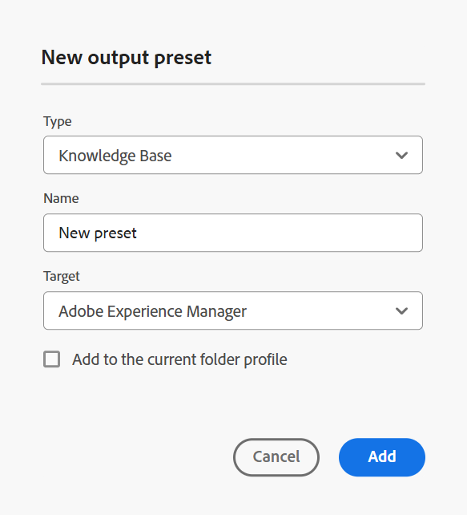
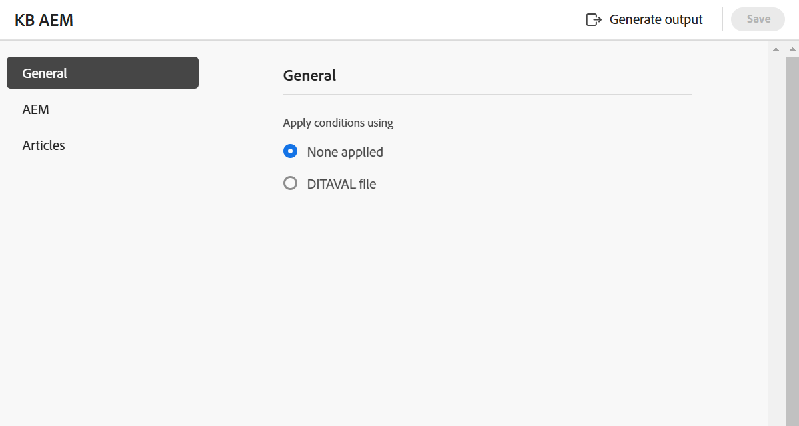

# 知识库 {#knowledge-base}

执行以下步骤以从“地图”控制台创建&#x200B;**知识库**&#x200B;预设：

1. [在映射控制台](./open-files-map-console.md)中打开DITA映射文件。

   您还可以从&#x200B;**概述部分**&#x200B;中的[最近使用的文件](./intro-home-page.md#overview)构件访问映射文件。 选定的映射文件将在映射控制台中打开。
1. 在&#x200B;**输出预设**&#x200B;选项卡中，选择+图标以创建输出预设。
1. 从&#x200B;**新建输出预设**&#x200B;对话框的“类型”下拉列表中选择&#x200B;**知识库**。
1. 在&#x200B;**目标**&#x200B;字段中，为生成的输出选择目标。 可用选项为：**Adobe Experience Manager**、**Salesforce**&#x200B;和&#x200B;**ServiceNow**。

   {width="350" align="left"}

1. 选择&#x200B;**添加到当前文件夹配置文件**&#x200B;选项可在当前文件夹配置文件中创建输出预设。 表示文件夹配置文件级别的预设。

   了解有关[管理全局和文件夹配置文件输出预设](./web-editor-manage-output-presets.md)的更多信息。

1. 选择&#x200B;**添加**。

   将创建知识库预设。

## 知识库配置{#knowledge-base-configuration}

知识库预设配置选项在&#x200B;**常规**、**文章**&#x200B;和所选目标(**AEM**/**ServiceNow**/**Salesforce**)选项卡下组织。

{width="550" align="left"}

### 常规

**常规**&#x200B;选项卡下提供了以下配置选项：

| 知识库选项 | 描述 |
| --- | --- |
| 使用以下方式应用条件 | 选择以下选项之一：  * **未应用任何项**：如果不想对已发布的输出应用任何条件，请选择此选项。 * **DITAVAL文件**：选择DITAVAL文件以生成个性化内容。 您可以使用浏览对话框或键入文件路径来选择多个DITAVAL文件。 使用文件名旁边的交叉图标可将其删除。 DITAVAL文件将按指定的顺序进行计算，因此第一个文件中指定的条件优先于后续文件中指定的匹配条件。 您可以通过添加或删除文件来维护文件顺序。 如果将DITAVAL文件移动到其他位置或将其删除，则不会自动将其从预设中删除。 如果移动或删除了文件，则需要更新位置。 您可以将鼠标悬停在文件名上以查看存储该文件的Adobe Experience Manager存储库中的路径。 您只能选择DITAVAL文件，如果您选择任何其他文件类型，则会显示错误。   **注意**：在对&#x200B;**Salesforce发布**&#x200B;使用DITAVAL筛选时，请考虑以下事项：   — 每个DITAVAL属性仅支持`Include`和`Exclude`操作。  — 不支持标记以直观地标记或高亮显示输出中的条件内容。  — 在输出预设中，只能选择单个DITAVAL文件进行发布；Salesforce发布不支持多个DITAVAL文件选择。 不支持内容中的 - `ditavalref`引用。   **条件预设**：从下拉列表中选择条件预设，以在发布输出时应用条件。 如果您在DITA映射控制台的条件预设选项卡中添加了条件，则该选项可见。 要了解有关条件预设的详细信息，请查看[使用条件预设](generate-output-use-condition-presets.md#id1825FL004PN)。 |
| 使用基线 | 如果已为所选DITA映射创建了基线，请选择此选项以指定要发布的版本。  查看[使用基线](generate-output-use-baseline-for-publishing.md#id1825FI0J0PF)以了解更多详细信息。 |
| 后期生成工作流 | 选择此选项时，将显示一个新的生成后工作流下拉列表，其中包含在Adobe Experience Manager中配置的所有工作流。 必须选择要在输出生成完成后执行的工作流。  **注意**：了解有关如何[自定义云服务的安装和配置指南中的输出后生成工作流](../cs-install-guide/customize-workflows.md#id17A6GI004Y4)部分的更多信息。 |

### 文章

此选项卡显示映射的树或分层视图。 选择要发布到知识库的主题。 展开目录节点并选择要发布的主题。

### Target - Adobe Experience Manager/ServiceNow/Salesforce

配置选项会根据您选择的目标而发生更改。

**Adobe Experience Manager**

为&#x200B;**Adobe Experience Manager**&#x200B;显示以下配置选项作为目标：

>[!NOTE]
>
>只有在管理员已配置Adobe Experience Manager知识库预设的情况下，您才可以使用。

| Adobe Experience Manager选项 | 描述 |
| --- | --- |
| 使用文章路径 | 选择此选项可查看包含知识库模板的文件夹的&#x200B;**文章路径**。 |
| 文章路径 | 如果您选择选项&#x200B;**使用文章路径**，则会显示此字段。 浏览以选择Adobe Experience Manager存储库中存储输出的知识库网站。 |
| 网站 | 使用此字段选择所需的Adobe Experience Manager知识库。 您可以在Adobe Experience Manager站点中配置知识库，以根据权限存储内容。 可以将此DITA映射中的文章发布到这些知识库。 |
| 类别 | 从下拉列表中选择一个类别，以在Adobe Experience Manager站点上发布该类别中目录的主题。 |
| 区域模板和文章模板 | 这些是用于组织输出内容的结构组件。 这些是在Adobe Experience Manager站点模板中预定义的。 |
| 后期生成工作流 | 选择此选项时，将显示一个新的生成后工作流下拉列表，其中包含在Adobe Experience Manager中配置的所有工作流。 必须选择要在输出生成工作流完成后执行的工作流。 了解有关如何[自定义输出后生成工作流](../install-guide/customize-workflows.md#id17A6GI004Y4)部分的详细信息，请参阅安装和配置指南。 |

>[!TIP]
> 
>选择&#x200B;**刷新**&#x200B;图标以根据您选择的知识库模板在字段中填充相应的模板。

**ServiceNow**

为&#x200B;**ServiceNow**&#x200B;显示以下配置选项作为目标：

| ServiceNow选项 | 描述 |
| --- | --- |
| 发布个人资料 | 使用下拉菜单从管理员配置的ServiceNow连接配置文件中进行选择。 要了解有关管理员如何创建发布配置文件的更多信息，请在&#x200B;**左侧面板**&#x200B;部分中查看&#x200B;**Workspace设置**（显示为&#x200B;**内部部署**&#x200B;的[设置](./web-editor-features.md#id2051EA0M0HS)）功能说明。 |
| 知识库 | 使用此字段选择所需的ServiceNow知识库。 您可以在ServiceNow站点中配置知识库，以根据权限存储内容。 可以将此DITA映射中的文章发布到这些知识库。 |
| 类别和子类别 | 类别类似于用于查找和分类ServiceNow Knowledge Base文章的分层树。 添加类别和子类别，将目录的主题和子主题发布到ServiceNow站点上的该类别和子类别中。 |

**Salesforce**

为&#x200B;**Salesforce**&#x200B;显示以下配置选项作为目标：

| Salesforce选项 | 描述 |
| --- | --- |
| 发布个人资料 | 使用下拉菜单从管理员配置的Salesforce连接配置文件中进行选择。 要了解有关管理员如何创建发布配置文件的详细信息，请在&#x200B;**选项卡栏**&#x200B;中查看&#x200B;**Workspace设置**（显示为&#x200B;**内部部署**&#x200B;的[设置](./web-editor-tab-bar.md)）功能说明。 |
| 记录类型 | 根据基于用户配置文件的可见性设置，使用下拉菜单从Salesforce中设置的记录类型中进行选择。 Salesforce记录类型是一种对该对象进行多种类型记录分组的方法。 它们定义出版物的组织方式。 例如，您可以选择常见问题解答记录类型，并根据常见问题解答页面布局和字段进行发布。 |
| 文章内容字段 | 每个记录类型模板可以有不同的字段和唯一的布局。 使用这些字段可根据文章类型输入特定信息。 例如，您可以查看常见问题解答文章的标题、答案和方程式。 |
| 类别 | 从下拉列表中选择一个类别，以在Salesforce站点上发布该类别中目录的主题。 |

**其他选项**

您还可以在Salesforce和ServiceNow预设中查看以下选项：

| 选项 | 描述 |
| --- | --- |
| 从文章正文中删除主题标题。 | 选择此选项可从已发布输出中的文章中删除主题标题。 |
| 上载为草稿 | 选择此选项可上传主题，以将其共享为草稿，然后再提供给用户。 |
| 上传图像 | 如果希望主题中的任何图像包含在已发布的输出中，请选择此选项。 |
| 上传链接的文档 | 选择此选项可在已发布输出中包括主题中链接的文档。 |

**父主题：** [了解输出预设](generate-output-understand-presets.md)
