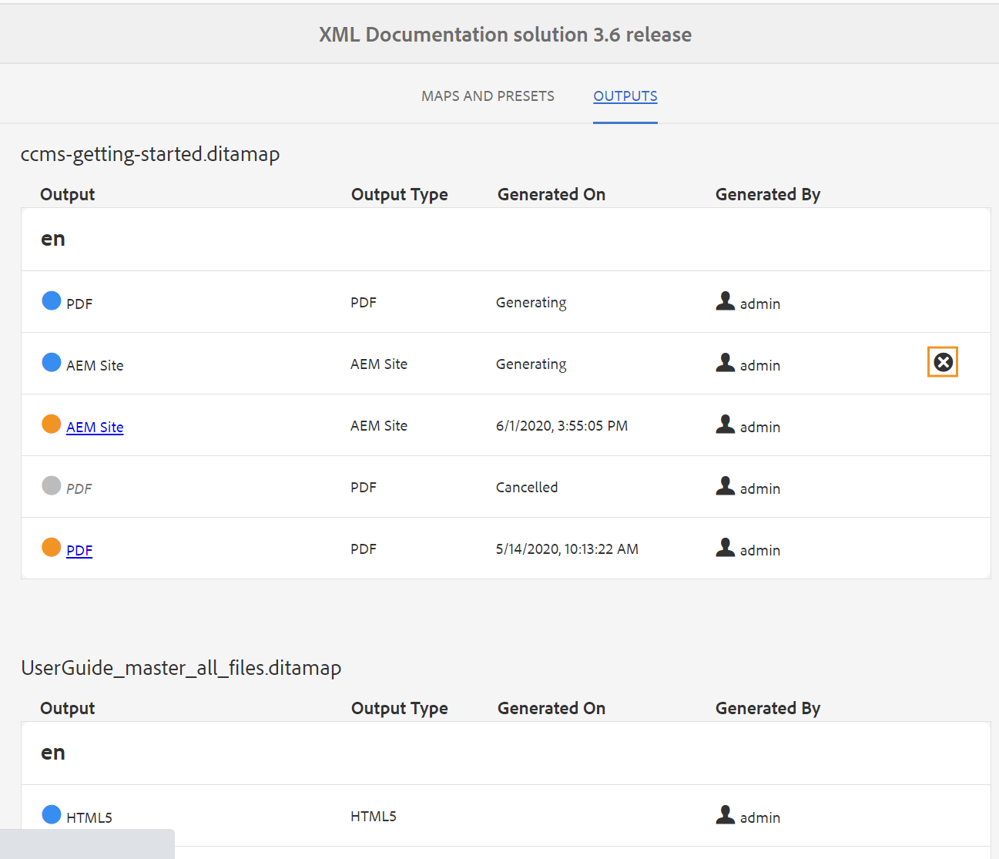

# 使用映射集合生成输出 {#id1723F20G0HS}

在任何组织中，一个产品都可以有多种类型的文档。 作为发布专家，您希望控制要为哪个文档生成什么输出。 此外，应提供一种方法，可一次性批量发布多个文档。

通过Adobe Experience Manager Guides，您可以使用称为“地图收集”的功能板来组织内容以供发布。 地图收藏集允许您在一个单元中组合所有不同类型的文档。 您可以选择要为地图集合中的每个文档生成的输出类型。 此外，您还可以从发布仪表板生成输出并查看输出生成进度。

通过映射收藏集，您可以选择查看与上次发布输出相比任何映射是否发生任何更改。 您可以在映射集合的映射和预设选项卡中查看详细信息，然后根据需要重新发布输出。

## 创建映射集合并添加DITA映射

要创建映射收藏集并将DITA映射添加到收藏集，请执行以下步骤：

1. 打开[Experience Manager Guides主页](./intro-home-page.md#map-collections)并选择&#x200B;**映射收藏集**。

   **映射收藏集**&#x200B;页面将在新选项卡中打开。

   {width="350" align="left"}

   >[!NOTE]
   >
   > 您还可以打开Assets UI并选择&#x200B;**映射收藏集**。 如果“映射收藏集”页面不可用，请在左边栏中选择&#x200B;**导航**&#x200B;选项，然后选择&#x200B;**映射收藏集**。

1. 在&#x200B;**映射收藏集**&#x200B;页面上，选择右上角的&#x200B;**创建**，并为您的映射收藏集提供&#x200B;**收藏集标题**。
1. 选择&#x200B;**创建**。

   创建地图收藏集时会显示一条成功消息。

1. 在成功消息上选择&#x200B;**关闭**。

   新创建的映射文件将显示在映射收藏集页面上。

1. 在要编辑的收藏集的拼贴中选择灰色框。
1. 选定的映射集合将在映射集合功能板中打开。
1. 选择&#x200B;**编辑**，然后选择&#x200B;**添加映射**。
1. 查找并添加要添加到映射集合中的DITA映射。

   默认情况下，会自动添加与映射关联的所有预设和区域设置。

1. 通过打开或关闭滑动按钮选择所需的输出。
1. 选择&#x200B;**完成**。

   DITA映射文件将添加到您的映射集合中。

   {align="left"}

**筛选选项**

收集页面上会显示以下筛选选项和映射详细信息：

- **筛选器：**&#x200B;左边栏显示以下筛选器：
   - **已修改**：您可以选择“是”或“否”。 如果选择“是”，则只有修改的DITA映射才会显示在“映射和预设”表中。
   - **预设**：选择要过滤掉映射文件的预设。 例如，如果选择&#x200B;*AEM Site*&#x200B;预设，则仅显示上面配置了&#x200B;*AEM Site*&#x200B;输出预设的映射。
   - **语言**：您可以选择任何可用的语言代码，并在“映射和预设”表中仅显示选定的语言。
- **映射和预设**&#x200B;表：“映射和预设”表显示以下列的信息：
   - **映射**：显示DITA映射文件的标题。
   - **文件名**：显示DITA映射的文件名。
   - **语言**：显示DITA映射的语言。
   - **预设**：显示在映射文件上配置的输出预设类型。
   - **基线**：显示输出预设使用的基线。  如果未使用基线，则显示连字符“ — ”
   - **已修改**：指示在上次发布后是否更新DITA映射。 根据此信息，您可以决定是否要重新发布此DITA映射的输出。
   - **上次生成的输出**：显示上次生成的输出的日期和时间。

## 使用映射集合配置和生成输出

要使用“Map Collection（映射收集）”配置和生成输出，请执行以下步骤：

1. 打开地图收藏集。 您可以查看各种输出预设，如AEM Sites、PDF(包括本机PDF)、HTML5、EPUB和自定义预设。 您还可以查看管理员创建的全局配置文件预设和文件夹配置文件预设。

   图标表示文件夹配置文件级别预设。
1. \（可选\）根据您的要求执行以下任一操作：
   - 应用左边栏中的筛选器以筛选修改后的映射、输出预设或语言。
   - 如果需要，请选择&#x200B;**编辑**，并通过打开或关闭滑动按钮来更改所需的输出。

   >[!NOTE]
   >  
   > 默认情况下，将禁用任何新预设。

1. 您可以通过以下方式为DITA映射启用预设：

   - 启用任何单个预设。
   - 为DITA映射启用&#x200B;**所有预设**&#x200B;以一次性选择所有预设。 默认禁用此选项。
   - 为DITA映射启用&#x200B;**文件夹配置文件预设**&#x200B;以为其选择所有文件夹配置文件预设。 默认禁用此选项。

{align="left"}

1. 执行下列操作之一：

   - 要生成选定映射的输出，请选择映射文件，然后选择&#x200B;**生成选定项**。
   - 要生成所有DITA映射及其配置的预设的输出，请选择&#x200B;**生成所有**。

   >[!IMPORTANT]
   >
   > 如果预设或DITA映射的输出生成过程处于队列中或正在进行中，则无法启动同一预设或映射的其他输出生成任务。

## 配置元数据属性

在映射集合中，可以为DITA映射批量配置元数据属性。 选择&#x200B;**配置元数据**&#x200B;以打开&#x200B;**资源元数据**&#x200B;页面。 在&#x200B;**资产元数据**&#x200B;页面上，收藏集中存在的所有映射都列在左侧。

{align="left"}

执行以下步骤可配置元数据属性：

1. 您可以选择要为其更新元数据的映射。 默认情况下，将选择所有存在的DITA映射。

1. 选择DITA映射后，您可以查看元数据、计划（取消）激活、引用、文档状态等属性。

1. 更新元数据属性。

1. 选择顶部的&#x200B;**保存并关闭**&#x200B;以保存更新。
1. （可选）更新标记时，您还可以在&#x200B;**保存并关闭**&#x200B;下拉列表中选择“附加”以将新标记附加到现有列表。
1. 从&#x200B;**保存并关闭**&#x200B;下拉列表中选择&#x200B;**提交**。
将为您从映射集合中批量选择的DITA映射更新元数据属性。

>[!NOTE]
> 
>对于&#x200B;**文档状态**&#x200B;下拉列表，您只能选择所有选定DITA映射共同允许的文档状态。 若要了解详细信息，请查看&#x200B;[**文档状态**](./web-editor-document-states.md)。

元数据属性与文件属性同步。 更新后，可以从编辑器的&#x200B;**文件属性**&#x200B;面板中查看这些文件。

## 从映射收藏集中删除映射收藏集或DITA映射

- 要删除地图集合，请在“地图集合”页面中选择一个集合，然后选择&#x200B;**删除**。
- 要从映射集合中删除DITA映射，请在编辑模式下打开映射集合，选择DITA映射文件，然后选择&#x200B;**从集合中删除**。

这还将从映射集合中删除与DITA映射关联的任何预设或区域设置。

## 从映射集合中取消输出生成任务

与从[DITA映射控制台](generate-output-for-a-dita-map.md#id2061H100T5Z)或[发布仪表板](generate-output-publish-dashboard.md#)取消输出生成任务的方法类似，您可以从映射集合中取消输出生成任务。 访问映射集合的“输出”选项卡，转到要取消的发布任务，并选择&#x200B;**取消此作业**&#x200B;图标以取消发布任务。

{align="left"}

**父主题：**&#x200B;[&#x200B;输出生成](generate-output.md)
