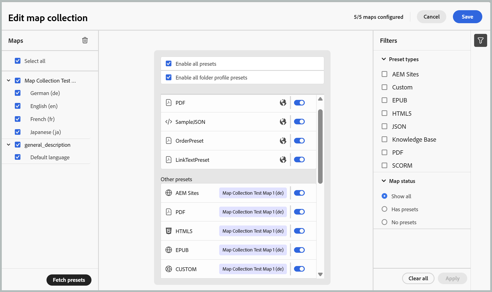
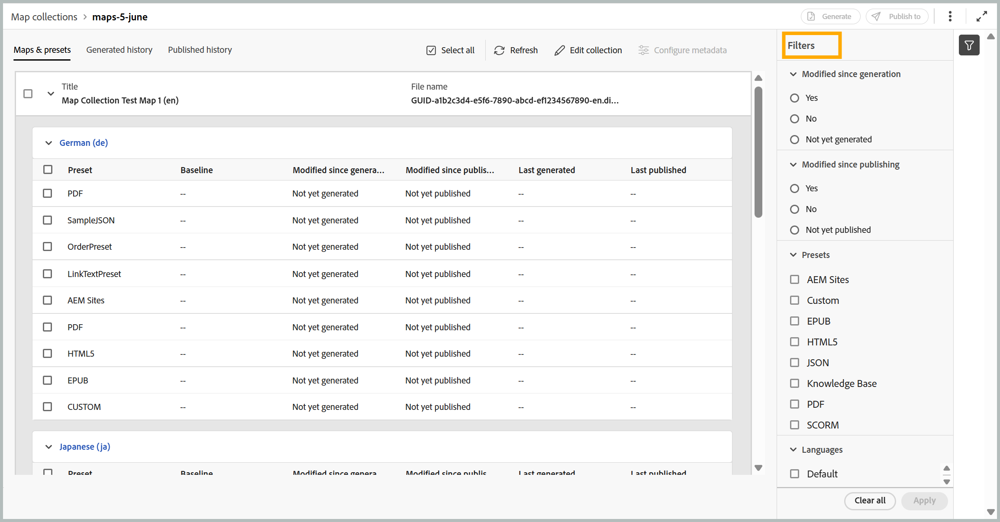
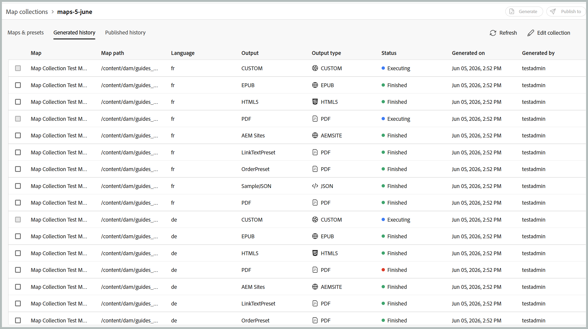
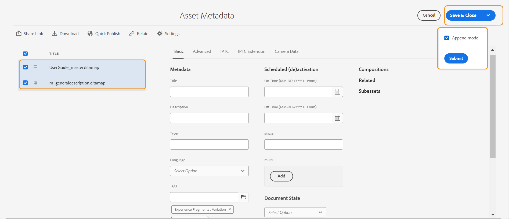

# 使用新的映射集合生成输出(Beta)

>[!IMPORTANT]
>
> 从2026.06.0版本开始，Experience Manager Guides as a Cloud Service中提供了新的地图收藏集。 请联系您的客户成功团队以启用此功能。

Adobe Experience Manager Guides中的映射收藏集使发布专家能够将多个文档整理到单个收藏集中，控制为每个文档生成的输出，以及从集中式仪表板高效地批量生成和发布输出。 它还提供输出生成进度的可见性，突出显示自上次发布输出以来对映射所做的更改，并允许您在需要时重新发布内容。

新的地图收藏集将以前分布于旧地图收藏集的功能整合到单个统一界面中。 启用后，您可以从一个位置管理映射、预设、层代历史记录、发布历史记录、元数据和收藏集成员资格。

## 创建映射集合并添加DITA映射

要创建映射集合并将映射添加到其中，请执行以下步骤：

1. 打开Experience Manager Guides主页并选择&#x200B;**新建地图收藏集**。

   将打开&#x200B;**映射收藏集**&#x200B;页面。

   {width="650"}

1. 在&#x200B;**映射收藏集**&#x200B;页面上，选择右上角的&#x200B;**创建**，并为您的新映射收藏集提供&#x200B;**名称**。

   {width="350"}

1. 选择&#x200B;**创建**。

   创建地图收藏集时会显示一条成功消息。

1. 打开要将映射添加到的所需映射集合。

   

   将鼠标悬停在地图收藏集标题上时，您可以执行以下操作：

   - **生成历史记录**：将您直接导航到“已生成的历史记录”选项卡，该选项卡列出了所有映射，以及已生成的已定义预设输出。
   - **发布历史记录**：将您直接导航到“已发布的历史记录”选项卡，该选项卡列出了已定义预设的所有已发布输出的映射。
   - **重命名**：重命名映射集合。

1. 选择&#x200B;**编辑收藏集**，然后选择&#x200B;**添加映射**。

   

1. 选择所需映射并启用&#x200B;**选择可用翻译**&#x200B;切换功能，以将该映射的所有可用翻译副本自动添加到映射收藏集。 如果地图没有任何翻译副本，则默认语言将添加到地图中。

   

1. 选择&#x200B;**添加**。

   将列出映射文件及其所有可用的已翻译副本。 对于没有任何已翻译副本的映射，将显示默认语言。

   

1. 选择所需的映射或列出的所有映射，然后选择&#x200B;**获取预设**&#x200B;按钮以检索所选映射的可用预设。

   您会看到选定映射的所有可用预设列表，这些预设分为两个类别：**文件夹配置文件预设**&#x200B;和&#x200B;**其他预设**。 **文件夹配置文件预设**&#x200B;对所有选定的映射通用，而&#x200B;**其他预设**&#x200B;特定于单个映射。 对于&#x200B;**其他预设**&#x200B;下的预设，相应的切换旁会显示关联的映射。

   

1. 根据需要选择&#x200B;**启用所有预设**&#x200B;或&#x200B;**启用所有文件夹配置文件预设**。 您还可以使用右侧的过滤器图标来缩小列表范围。 该筛选器提供两个筛选级别：**预设类型**&#x200B;用于缩小列出的预设，以及&#x200B;**映射状态**&#x200B;用于从“映射”面板中选择任何特定映射。

   

1. 选择&#x200B;**保存**。

您将获得所有所需映射的列表，以及映射标题、对应的文件名、提供的语言和配置的预设。

**映射和预设**&#x200B;选项卡在以下列中显示基于特定语言选定映射的信息：

- **预设**：显示在映射文件上配置的输出预设类型。
- **基线**：显示输出预设使用的基线。  如果未使用基线，则显示连字符`-`。
- **自生成**&#x200B;以来已修改：指示是否在生成后更新DITA映射。 根据此信息，您可以决定是否要发布此DITA映射的输出。
- **自发布后已修改**：指示在上次发布后是否更新DITA映射。 根据此信息，您可以决定是否要重新发布此DITA映射的输出。
- **上次生成时间**：显示上次生成输出的日期和时间。
- **上次发布时间**：显示上次发布输出的日期和时间。

**筛选选项**

以下筛选选项在地图和预设页面的右侧面板中可用：

- **自生成**&#x200B;以来已修改：您可以选择“是”、“否”或“尚未生成”。 如果选择“是”，则只有生成后修改的映射才会显示在“映射和预设”选项卡中。
- **自发布以来已修改**：您可以选择“是”、“否”或“尚未生成”。 如果选择“是”，则只有发布后修改的映射才会显示在“映射和预设”选项卡中。
- **预设**：选择要过滤掉映射文件的预设。 例如，如果选择&#x200B;*AEM Site*&#x200B;预设，则仅显示上面配置了&#x200B;*AEM Site*&#x200B;输出预设的映射。
- **语言**：您可以选择任何可用的语言代码，并在“映射和预设”选项卡中仅显示选定的语言。

  

## 使用映射集合生成输出

要使用“Map Collection（映射收集）”生成输出，请执行以下步骤：

1. 打开地图收藏集。 您可以根据配置查看各种输出预设，如AEM Sites、PDF（包括本机PDF）、HTML5、EPUB和自定义预设。

1. 要为所选映射生成输出，请选择所需的映射文件和特定预设，然后选择&#x200B;**生成**。

   >[!IMPORTANT]
   >
   > 如果预设或DITA映射的输出生成过程处于队列中或正在进行中，则无法启动同一预设或映射的其他输出生成任务。

1. 生成输出后，导航到&#x200B;**生成的历史记录**&#x200B;选项卡以查看所有生成的映射的列表。 您可以在&#x200B;**Status**&#x200B;列中跟踪生成进度，该列指示生成过程是正在执行还是已完成。

   

1. 选择&#x200B;**刷新**&#x200B;以查看生成过程的最新状态。 状态列将更新以反映每个映射及其关联预设的当前状态：

   - **已完成（绿色）**：已成功完成生成。
   - **已完成（红色）**：生成已完成，但出现错误。 可在日志中查看错误详细信息。
   - **正在执行（蓝色）**：正在生成。

   

1. 您还可以通过选择&#x200B;**取消生成**&#x200B;图标，在执行任务状态之前取消输出生成任务。

   

1. 此外，您还可以通过选择将鼠标悬停在映射名称上时显示的&#x200B;**打开输出**&#x200B;图标，来查看已完成输出生成的映射，或通过选择相邻的&#x200B;**日志**&#x200B;图标来查看生成日志。

   

## 使用映射集合发布输出

要使用“Map Collection（映射收集）”发布输出（如果已配置），请执行以下步骤：

1. 从&#x200B;**映射和预设**&#x200B;选项卡或&#x200B;**生成的历史记录**&#x200B;选项卡中选择所需的映射，然后选择&#x200B;**发布到**。
1. 选择要发布输出的目标环境： **预览**&#x200B;或&#x200B;**发布**&#x200B;实例。

   

1. 切换到&#x200B;**已发布的历史记录**&#x200B;选项卡以监视发布任务的状态。

   

1. 选择&#x200B;**刷新**&#x200B;以查看任务的最新状态。
1. 一旦状态更改为&#x200B;**成功**，请验证所选目标实例中的已发布内容。

## 配置元数据属性

在映射集合中，可以为DITA映射批量配置元数据属性。 从&#x200B;**映射和预设**&#x200B;选项卡中选择&#x200B;**配置元数据**&#x200B;图标以打开&#x200B;**资产元数据**&#x200B;页面。 在&#x200B;**资产元数据**&#x200B;页面上，收藏集中存在的所有映射都列在左侧。

执行以下步骤可配置元数据属性：

1. 您可以选择要为其更新元数据的映射。 默认情况下，将选择所有存在的DITA映射。

1. 选择DITA映射后，您可以查看元数据、计划（取消）激活、引用、文档状态等属性。

1. 更新元数据属性。

1. 选择顶部的&#x200B;**保存并关闭**&#x200B;以保存更新。
1. （可选）更新标记时，您还可以在&#x200B;**保存并关闭**&#x200B;下拉列表中选择“附加”以将新标记附加到现有列表。
1. 从&#x200B;**保存并关闭**&#x200B;下拉列表中选择&#x200B;**提交**。
将从映射集合中选择的DITA映射批量更新元数据属性。

>[!NOTE]
> 
>对于&#x200B;**文档状态**&#x200B;下拉列表，您只能选择所有选定DITA映射共同允许的文档状态。 若要了解详细信息，请查看&#x200B;[**文档状态**](./web-editor-document-states.md)。

元数据属性与文件属性同步。 更新后，可以从编辑器的&#x200B;**文件属性**&#x200B;面板中查看这些文件。

**父主题：**&#x200B;[&#x200B;输出生成](generate-output.md)
