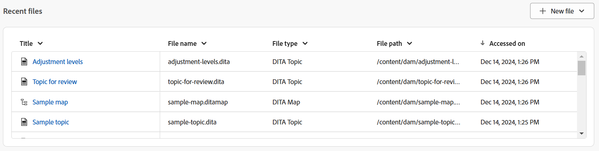

# Experience Manager Guides主页体验

主页是您登录Experience Manager Guides时查看的第一个屏幕。 它为您提供了统一且直观的欢迎屏幕体验，包括您最近访问的文件、收藏集等的快速视图。

{align="left"}

Experience Manager Guides主页分为以下部分：

- 标题栏
- 导航栏
- 左侧面板

## 标题栏

标题栏是主页的顶部栏，用于显示Adobe Experience Manager徽标(如果您将Unified Shell用作Experience Manager Guides UI，则为Unified Shell)。 当您选择徽标时，它会将您定向到Experience Manager导航页面。

{align="left"}

## 导航栏

导航栏会显示一些工具，用于切换导航、自定义概览布局和调整页面视图。 它还会显示当前使用的文件夹配置文件。

>[!NOTE]
>
> 如果使用Adobe Experience Manager Guides as a Cloud Service，则导航栏中会显示一个标记为&#x200B;**AI助手**&#x200B;的附加功能。

{align="left"}

导航栏中可用的功能说明如下：

- **导航切换器**：允许无缝导航到其他页面：
   - **主页**：登录Experience Manager Guides时查看的默认页面。
   - **编辑器**：一种易于使用的基于Web的编辑器，允许您在Experience Manager Guides中创建和管理结构化文档。 [了解编辑器界面](./web-editor.md)。
   - **映射控制台**：为您提供专用工作区以处理映射管理和发布的各个方面。 [了解地图控制台界面](./map-console-overview.md)。
- **AI助手**：一款功能强大的AI驱动工具，旨在通过智能帮助功能提高您的工作效率。 此外，在编辑器界面中工作时，您可以利用AI Assistant的智能创作功能，通过内容重用和优化的智能建议，使创作过程更智能、更快。

  [AI助手](./ai-assistant.md)功能当前仅适用于Adobe Experience Manager as Cloud Service。
- **自定义概述部分**：允许您隐藏或显示小组件部分中的小组件。
- **正在使用的文件夹配置文件**：显示当前正在使用的文件夹配置文件。
- **更多操作**：提供对其他选项的访问权限。 选择此按钮将打开一个菜单，其中包含以下选项：

   - **Assets**：根据您的设置将您转到目标。
      - **Cloud Services**：如果您使用的是Cloud Services，则选择&#x200B;**Assets**&#x200B;选项会转到AEM导航页面。

      - **内部部署软件**：如果您使用的是Adobe Experience Manager Guides（4.2.1及更高版本），则选择&#x200B;**Assets**&#x200B;选项会将您转到Assets UI中的当前文件路径。
   - **Workspace设置**：转到&#x200B;**Workspace设置**&#x200B;对话框。 有关详细信息，请查看[配置Workspace设置](../cs-install-guide/workspace-settings.md)。

     >[!NOTE]
     >
     > 在主页上，Workspace设置选项仅可用于Cloud Services设置。 在On-Premise设置中，主页上的更多操作选项不可用。 但是，您仍然可以通过“编辑器”界面和“映射”控制台访问相关设置，方法是导航到更多选项>设置。

- **展开视图**：允许您使用&#x200B;**展开**&#x200B;图标展开页面视图。 在此视图中，标题栏是隐藏的，从而最大化内容空间。 要返回到标准视图，请使用&#x200B;**退出扩展视图**&#x200B;图标。

## 左侧面板

通过左侧面板，可快速访问概述、映射收藏集、批量发布、发布队列和用户首选项功能。 您可以通过选择位于界面左下角的&#x200B;**展开**&#x200B;图标来展开面板。 展开后，使用&#x200B;**折叠**&#x200B;图标折叠面板。

{width="300" align="left"}

您在此面板上查看的内容取决于您的用户角色。 下表列出了左侧面板中显示的角色和相应的部分。

- **管理员和发布者**：能够查看面板中的所有部分。
- **作者**：能够查看除发布以外的所有节。 作者无权访问“映射收藏集”、“发布队列”和“批量发布”部分。
- **查看者**：只能查看概述部分。 选择概述部分会根据是否配置了Workfront，显示默认的空状态消息或Adobe Workfront任务小组件。

左侧面板中提供的功能说明如下：

- [概述](#overview)
- [映射收藏集](#map-collections)
- [批量发布](#bulk-publish)
- [发布队列](#publish-queue)
- [用户首选项](#user-preferences)

>[!NOTE]
>
> 此外，如果管理员在系统中配置了Adobe Workfront集成，则左侧面板中还会显示&#x200B;**Workfront**&#x200B;选项。 了解Experience Manager Guides中的[Adobe Workfront集成](./workfront-integration.md)。

### 概述

**概述**&#x200B;的作用类似于旨在提高生产力的个性化仪表板。 它配备了不同的小部件，可帮助您保持井然有序和专注。

这些小组件还为您提供了排序列和调整列大小的选项。 要查看这些选项，请选择列标题，这些选项将显示在列表中。

“小组件”部分中存在以下小组件：

- **最近打开的文件**：小组件为您提供最近打开的文件（您在编辑器中访问的文件列表）的快照，以及关键文件详细信息，包括标题、文件名、文件类型、文件路径和日期访问。

  {align="left"}

  您可以通过从列下拉菜单中选择选项来对列进行排序和调整大小。 默认情况下，数据会根据上次访问的日期和时间排序。

  {align="left"}

  在[用户首选项](#user-preferences)中，您可以设置此构件可显示的最大文件数。 默认情况下，此限制设置为&#x200B;**20**。

  将鼠标悬停在文件上时，可以使用以下选项：

   - **在编辑器中打开**：允许您在编辑器中打开文件。 也可以通过简单地选择文件来打开文件。
   - **固定/取消固定**：允许您将一个或多个文件固定到“最近使用的文件”小组件。 固定文件显示在小组件列表的顶部。 要取消固定文件，请使用&#x200B;**取消固定**&#x200B;选项。
   - **删除**：允许您从“最近使用的文件”小组件中删除该文件。

  **从“新建文件”下拉菜单创建新文件**

  **新建文件**&#x200B;下拉菜单允许您直接从&#x200B;**最近使用的文件**&#x200B;构件创建主题或DITA映射。 成功创建文件后，您将被重定向到编辑器界面，以便处理文件。

- **收藏集**：如果您处理一组文件或文件夹，则可以将其添加到此构件以快速访问它们。 添加后，您可以按标题以及其他关键详细信息（例如，所有者和创建日期）查看文件。 在选择列下拉列表时，您可以查看用于排序列和调整列大小的选项。

  {align="left"}

  所选收藏集的痕迹导航显示在收藏集小部件的顶部。 您可以选择它以返回到层次结构中的特定文件夹。

  {align="left"}

  当您将光标悬停在收藏集上并选择“更多”图标时，以下选项可用：

   - **重命名**：允许您重命名集合。
   - **删除**：允许您删除收藏集。
   - **在Assets UI中查看**：允许您在Assets UI中打开收藏集。

  您可以通过选择收藏集标题来打开收藏集。 将光标悬停在收藏集文件并选择“更多”图标时，以下选项可用：

   - **在编辑器中打开**：允许您在编辑器中打开文件。 或者，可以选择文件标题以打开文件。
   - **在映射控制台中打开**：允许您在映射控制台中打开映射文件。 （仅适用于DITA映射文件）。
   - **添加到收藏集**：允许您将文件添加到新的或现有的收藏集。
   - **从收藏集中删除**：允许您从收藏集列表中删除文件。
   - **在Assets UI中查看**：允许您在Assets UI中查找文件。

  **从“新建收藏集”下拉菜单中创建新收藏集**

  **新建收藏集**&#x200B;下拉菜单允许您创建新收藏集并将其添加到&#x200B;**收藏集**&#x200B;构件。

>[!NOTE]
>
> 此外，如果管理员在系统中配置了Adobe Workfront集成，则&#x200B;**您的任务**&#x200B;构件也会显示在构件部分中。 详细了解Experience Manager Guides中的[Adobe Workfront集成](./workfront-integration.md#working-with-the-your-tasks-widget)。

### 映射收藏集

Experience Manager Guides允许您使用名为&#x200B;**映射收藏集**&#x200B;的功能板来组织内容以供发布。 若要使用此功能，请从左侧面板中选择&#x200B;**映射收藏集**。 它会将您转到&#x200B;**Assets UI**&#x200B;中的“映射集合”页面，您可以在其中使用[映射集合生成输出。](./generate-output-use-map-collection-output-generation.md)

### 批量发布

批量激活功能允许您快速轻松地激活内容，从创作到发布实例。 若要使用此功能，请从左侧面板中选择&#x200B;**批量发布**。 系统会将您转到Assets UI中的“批量激活收藏集”页面，您可以在其中创建和管理[已发布内容的批量激活](./conf-bulk-activation.md)。

### 发布队列

当系统中运行大量发布任务时，几乎不可能单独检查每个DITA映射以监视其发布任务。 Experience Manager Guides为管理员和发布者提供系统中运行的所有发布任务的统一视图。

若要使用此功能，请从左侧面板中选择&#x200B;**发布队列**。 它会将您转到Assets UI中的“发布”仪表板页面，在该页面中，您可以[使用发布仪表板](./generate-output-publish-dashboard.md)管理发布任务。

### 用户首选项

“用户”首选项可供所有作者使用。 使用首选项，您可以配置以下设置：

- **常规**：“常规”选项卡允许您配置以下设置：

  {align="left"}

   - **文件夹配置文件**：文件夹配置文件控制与条件属性、创作模板、输出预设和编辑器配置相关的各种配置。 默认情况下，将显示全局配置文件。 此外，如果您的管理员在系统中配置了文件夹配置文件，则这些文件夹配置文件也会显示在文件夹配置文件列表中。
   - **基本路径**：默认情况下，当您从编辑器访问Experience Manager Guides存储库时，您会看到来自/content/dam位置的资源。 您的工作文件夹很可能是/content/dam/文件夹中的几个文件夹。 您可以设置工作文件夹的基本路径，然后存储库视图会预先显示来自该位置的内容。 这可以缩短访问工作文件夹的时间。 此外，在主题中插入任何引用或媒体文件时，文件浏览位置将以Base路径中设置的文件夹开始。
   - **选择根映射**：选择一个DITA映射文件以解析键引用或术语表条目。 解析关键引用时，所选根映射的优先级最高。 有关详细信息，请查看[解析键引用](./map-editor-other-features.md)。
   - **最近使用文件的最大数目**：使用此字段可设置最近使用文件小部件中显示文件的最大限制。
   - **打开映射的首选项**：在此处，您可以选择系统在打开DITA映射文件时将遵循的默认行为。

- **外观**：“外观”选项卡为您提供了选择应用程序主题和内容编辑区域源视图的选项。 使用此选项卡可配置以下设置：

  {align="left"}

   - **应用程序主题和Source视图**：您可以从应用程序和源视图的浅色或深色主题中进行选择。 在浅色主题的情况下，工具栏和面板使用浅灰色背景。 在深色主题的情况下，工具栏和面板使用黑色背景。 选择&#x200B;**使用设备**&#x200B;主题，以允许Experience Manager Guides根据设备主题选择浅色和深色主题。

     在所有主题中，内容编辑区域在创作视图中以白色背景显示。

   - **编辑器文件显示配置**：选择在编辑器中查看文件的默认方式。 您可以在“创作”视图中按各个面板的标题或文件名查看文件列表。 默认情况下，文件在编辑器中按标题显示。

   - **始终在存储库中查找文件**：选择此选项可在编辑器中编辑文件时显示文件在存储库中的位置。
