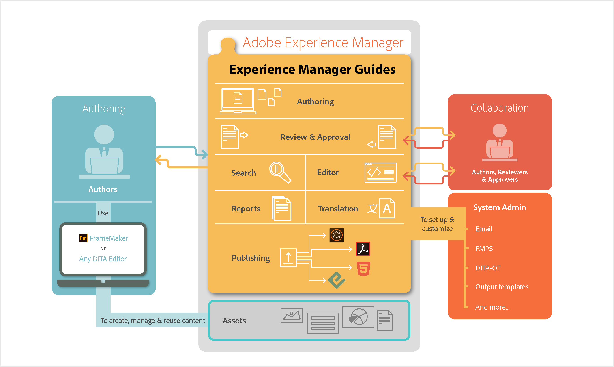

# Adobe Experience Manager Guides的工作原理 {#id167G9A00DO4}

下图说明了Experience Manager Guides如何与AEM和任何DITA编辑器配合使用，以在企业场景中启用内容管理、重用、翻译和审查。

{align="center"}

在处理任何工作流时，如果会话长时间保持不活动状态，则会触发会话超时提示以防止内容丢失。 有关详细信息，请查看[会话超时](./session-timeout-prompt.md)。

**父主题：**[&#x200B;关于Adobe Experience Manager Guides as a Cloud Service](intro.md)
