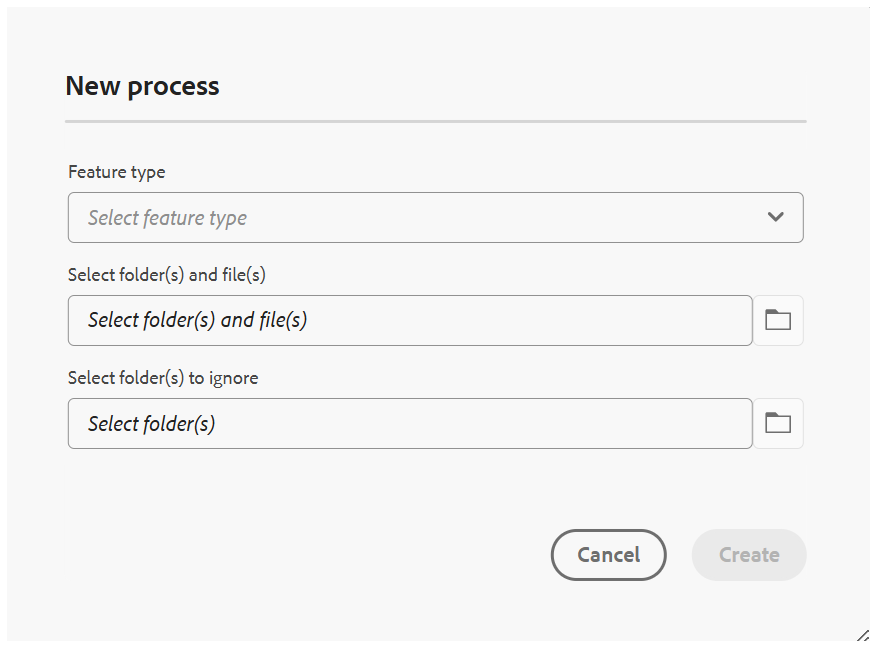

# 将旧映射集合迁移到新映射集合

如果您已经以旧格式设置了地图收藏集，则在迁移到新Experience时，不需要从头开始重建它们。 您可以手动重新创建它们，也可以使用内置的迁移工具一步完成所有操作。

在&#x200B;**批量处理器**&#x200B;中添加了迁移工具作为新的进程类型，该工具读取您现有的旧映射集合并自动为您创建匹配的新映射集合。 本文将引导您了解如何运行迁移，并重点介绍在使用迁移之前应该了解的一些关键行为。

>[!NOTE]
>
> 批量激活功能未迁移到新映射收藏集体验。 如果需要，可在新建映射集合体验中重新创建用于批量激活的任何映射集合。

## 迁移到新映射集合

执行以下步骤以将旧映射集合迁移到新映射集合：

1. 选择Adobe Experience Manager徽标，然后选择&#x200B;**工具**。
1. 在&#x200B;**工具**&#x200B;面板中，选择&#x200B;**指南**。
1. 选择&#x200B;**批量处理器**&#x200B;磁贴。

   

1. 将打开“参考线”“批量处理器”窗口，其中包含以下详细信息：

   - **功能类型**：显示正在执行的进程的功能。

   - **执行ID**：它是您执行的每个迁移任务的唯一ID。

   - **创建者**：显示任务创建者。

   - **开始时间**：显示启动迁移的日期和时间。

   - **结束时间**：显示迁移结束的日期和时间。

   - **状态**：将迁移状态显示为“进行中”、“已完成”或“失败”。

   

1. 选择窗口右上角的&#x200B;**新建进程**&#x200B;选项卡以启动新的迁移任务。

   **新进程**&#x200B;对话框打开。

    {width="350"}

1. 从&#x200B;**功能类型**&#x200B;下拉列表中选择&#x200B;**映射收藏集**。

   迁移任务的 {width="350"}

1. 选择&#x200B;**创建**。

这将运行一个作业，将所有现有的旧映射集合迁移到新映射集合中。 无需其他配置。

>[!NOTE]
>
> 如果迁移任务失败，您可以通过将鼠标悬停在执行ID上来检查&#x200B;**查看日志**&#x200B;选项。

## 重要注意事项

- **重新运行迁移：**&#x200B;如果再次运行迁移进程，则不会检查源（旧）映射集合中的更改。 它将无条件重新迁移或覆盖新的映射集合。
- **时间戳和唯一性：**&#x200B;每个迁移的映射集合存储了首次迁移时间戳时的时间戳。 此时间戳用于保持迁移记录的唯一性。 因此，已迁移的映射集合将不会反映以后对原始（源）映射集合所做的更新，而是仅捕获迁移时的状态。

