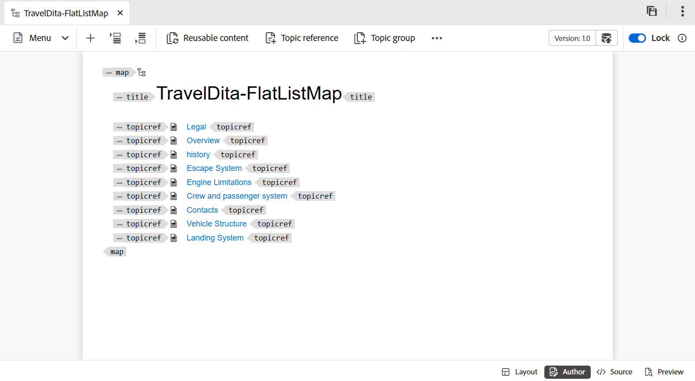
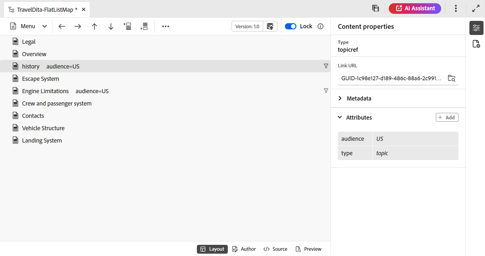

# 映射编辑器功能 {#id1942D0S0IHS}

映射编辑器中的工具栏与主题编辑器类似。 切换左侧面板、保存映射、创建新版本的映射、撤消/重做上一个操作以及删除所选元素等基本操作在两个编辑器中都是通用的。 有关这些操作如何工作的详细信息，请查看[了解编辑器功能](web-editor-features.md#)部分。

您在编辑器工具栏中查看的选项基于映射编辑器视图。 地图编辑器中提供了四个视图：

- [布局](#layout-view)
- [创作](#author-view)
- [源](#source-view)
- [预览](#preview)

以下部分介绍了地图编辑器的不同视图中可用的工具栏选项：

## 布局视图

打开映射进行编辑时，将打开映射编辑器的“布局”视图。 “布局”视图以树视图显示映射层次结构，并允许您在映射中组织主题。

>[!NOTE]
>
> “布局”视图仅显示地图中存在的引用。 如果任何参照被断开，则参照左侧会显示一个小十字符号

“布局”视图的工具栏上提供了以下选项：

**主题引用** - 

显示主题搜索对话框。 导航到要插入的主题/映射文件，然后选择&#x200B;**选择**&#x200B;以将其添加到映射中。

{width="800" align="left"}

**主题组** - 

插入`topicgroup`元素。 有关分组主题的更多信息，请查看OASIS DITA语言规范中的[主题组](https://docs.oasis-open.org/dita/v1.0/langspec/topicgroup.html)文档。

**键定义** - 

显示“插入Keydef”对话框。 使用此对话框可定义要在映射中使用的任何键定义。

{width="300" align="left"}

**此项前插入/此项后插入** -  / 

显示插入元素对话框。 选择要插入到映射中的元素。 根据操作，新元素会插入到映射中当前元素之前或之后。

**插入前置内容** - 

打开书签进行编辑时，将显示此图标。 您可以在书籍的开头插入组件，如目录、索引和表列表。

**插入后置内容** - 

打开书签进行编辑时，将显示此图标。 您可以在书籍的结尾处插入的组件，如索引、术语表和数字列表。

**将选定项左/右移动** -  / 

选择向左箭头将主题移动到层级中的左侧。 这实际上是将相应主题在层次结构中提升一级。 例如，在选择子主题时选择向左箭头，使其成为其上主题的同级。 同样，如果您选择向右箭头，则会将主题推到右侧，使其成为上面主题的子项。

**将选定项上移/下移**  - / 

选择向上或向下箭头图标，在层次结构中向上或向下移动主题。

>[!NOTE]
>
> 您还可以拖放引用以在地图中移动它们。

**锁定/解锁**

获取对映射文件的锁定并释放该锁定。 如果映射文件中有未保存的更改，则在释放锁定时，系统会提示您保存映射文件。 更改将保存在映射文件的当前版本中。

**合并** - 

有关从同一或不同文件的不同版本合并内容的更多详细信息，请在编辑器中查看[合并](web-editor-features.md#menu-dropdown)。

**版本历史记录** - 

检查活动主题上的可用版本和标签，并从编辑器本身还原到任何版本。

**版本标签** - 

显示版本标签管理对话框。 从下拉列表中选择一个版本。 选择要应用于所选版本的标签，然后选择&#x200B;**添加标签**&#x200B;以添加该标签。

**显示文件名**

显示主题标题的文件名。

>[!NOTE]
>
> 将指针悬停在主题标题上时，会显示文件路径。

**显示行号**

显示或隐藏每个主题的行号。 行号的显示取决于层次结构中的级别。

**显示复选框**

显示或隐藏每个主题的复选框。 您可以使用该复选框选择主题，并使用“选项”菜单执行各种任务。

布局视图中的&#x200B;**选项菜单**

除了在映射文件中组织主题外，您还可以使用选项菜单执行以下操作，该菜单出现在将鼠标悬停在文件上或在布局视图的编辑器中右键单击时：

{width="650" align="left"}

- **添加**：您可以从映射编辑器中选择添加新主题或空引用：
   - **空引用**：此选项允许您在DITA映射中添加空引用。 您可以稍后双击插入的空引用并添加主题详细信息。
   - **新主题**：当您选择从菜单创建新主题时，您会获得&#x200B;**新主题**&#x200B;对话框。 在&#x200B;**新建主题**&#x200B;对话框中，提供所需的详细信息，然后选择&#x200B;**创建**。
- **移动**：您可以选择在层次结构中上下左右移动主题。 您还可以将主题或地图从存储库面板拖放到在地图编辑器中打开的图中。
- **撤消**：撤消布局视图中的上一个操作。
- **重做**：重做布局视图中的上一个操作。
- **复制**：从映射文件中复制所选引用。

  >[!NOTE]
  >
  > 可显示，然后选中复选框以复制多个引用。

- **粘贴**：将复制的引用粘贴到层次结构中的当前位置。
- **删除**：从映射文件中删除选定的引用。

  >[!NOTE]
  >
  > 可显示，然后选中复选框以删除多个引用。

**查看基于条件筛选器的主题**

如果您已对主题应用了任何条件，则会在主题的右侧显示一个过滤器图标。 将指针悬停在过滤器图标上时，将显示应用的条件及其属性值。

## 作者视图

**作者**&#x200B;视图允许您在编辑器中编辑DITA映射。 这会显示映射编辑器的WYSIWYG视图，并且在“创作”视图中显示的某些图标与在“布局”视图中显示的图标相同。

{width="800" align="left"}

此外，您还可以从“作者”视图中查看以下图标并执行相关任务：

**此项前插入/此项后插入** -  / 

显示**在之前插入元素或**在之后插入元素对话框。 选择要插入到映射中的元素。 根据操作，新元素会插入到映射中当前元素之前或之后。

**元素** - 

显示&#x200B;**插入元素**&#x200B;对话框。 选择要插入的元素。 可以使用键盘滚动元素列表，然后按Enter插入所需的元素。 或者，可以选择元素以将其插入到映射中。

<!-----------------------------------------------------------

**Relationship table** - 

Inserts a relationship table in the map.

Perform the following steps to work with relationship tables in the Basic Map Editor:

1.  In the Assets UI, navigate to the DITA map in which you want to create the relationship table.

1.  Select the DITA map to open it in DITA map console.

1.  Select the **Topics** tab to view a list of topics available in the DITA map.

    >[!TIP]
    >
    > The Topics tab gives you an option to download the map file with its dependents. For more details, view [Export a DITA map file](authoring-download-assets.md#id218UBA00IXA).

1.  In the main toolbar, select **Edit**.

    The map file is opened in the Advanced Map Editor.

1.  Select **Reltable** from the toolbar.

    {width="650" align="left"}

1.  Drag-and-drop topics from the topic list to the Reltable editor.

    >[!NOTE]
    >
    > You can add topics from any folder in the References rail.

    {width="550" align="left"}

1.  To add a header to your relationship table, click **Add Relheader**.

1.  To add a column to your relationship table, click **Add a Column**.

    {width="550" align="left"}

1.  Click **Save**.

You can also perform the following actions from the relationship table editor:

**Delete rows or columns**

If you want to delete a column from your table, select the checkbox in the column header and click Delete. If you want to remove a row from table, select the checkbox in the first column of the respective row and click Delete.

**Delete a topic**

If you want to delete a topic from your table, click the cross icon next to the topic.

**Delete the relationship table**

If you want to delete the relationship table, click anywhere outside the relationship table and click Delete. For details, view [Work with relationship tables in the Map Editor](map-editor-basic-map-editor.md).
----->

**可重复使用的内容** - 

显示&#x200B;**重用内容**&#x200B;对话框。 使用此对话框可插入要在映射中重复使用的内容。

**刷新导航标题属性** - 

将映射中引用文件的`title`元素与其`@navtitle`属性中指定的值同步。 可以在映射中添加不同类型的引用文件，例如主题、引用、任务、\(sub\)映射等。 这些文件中的大多数都支持`@navtitle`属性。 如果文件包含`@navtitle`属性，则映射中相同文件的`@navtitle`属性将更新。 如果`@navtitle`属性不存在，则`@navtitle`属性将添加到该引用文件，并且其`title`也会更新为显示`@navtitle`。

>[!NOTE]
>
> 您的管理员可以配置自动向添加到映射的每个引用文件添加`@navtitle`属性。 有关配置自动添加`@navtitle`属性的更多详细信息，请在“安装和配置Adobe Experience Manager Guides as a Cloud Service”中查看&#x200B;*默认情况下包含@navtitle属性*。

选择“刷新导航标题属性”图标以同步`title`元素和`@navtitle`属性的值。

**标记**

显示或隐藏XML标记。 标记用作指示元素边界的可视提示。 在此模式下，如果要插入主题/映射引用，请将所需文件拖放到标记之前或之后。 在“标记视图”模式下不会显示水平条。

**跟踪更改** - 

通过启用“跟踪更改”模式，您可以跟踪在映射文件中进行的所有更新。 启用跟踪更改后，文档将捕获所有插入和删除。 有关详细信息，请在编辑器中查看[跟踪更改](web-editor-features.md#track-changes)。

**创建审核任务** - 

可直接从编辑器创建当前主题的审阅任务或映射文件。 打开要为其创建审阅任务的文件，然后选择&#x200B;**创建审阅任务**&#x200B;以启动审阅创建流程。 请按照[简介中的说明查看](review.md#)，以了解更多详细信息。

## Source视图

通过此视图，可编辑原始格式的内容，从而完全控制结构和格式。

{width="800" align="left"}

在此视图中，工具栏提供了&#x200B;**菜单**&#x200B;下拉菜单下可用的基本内容编辑和插入选项，包括“剪切”、“复制”、“撤消”、“重做”、“删除”、“查找和替换”、“版本标签”、“合并”、“另存为新版本”、“锁定”和“解锁”。

## 预览

预览模式将呈现将在最终输出中显示的内容，这使您可以在发布内容之前查看布局和格式。

除了能够查看地图中每个主题文件的位置之外，还希望在一个连续流中查看地图内容。 预览映射功能允许您通过单击查看映射文件的整个内容。 您不必生成映射文件的输出即可查看整个映射在发布后的外观。 您只需访问映射的预览即可，所有主题和子映射将以书籍的形式呈现。

{width="800" align="left"}

>[!NOTE]
>
> 在“预览”模式下，工具栏中没有可用的内容编辑或插入选项。 您无法编辑此视图中的内容。 但是，您可以使用&#x200B;**另存为新版本**&#x200B;和&#x200B;**锁定**&#x200B;或&#x200B;**解锁**&#x200B;功能。

您可以在预览模式下执行以下附加任务：

- 右键单击主题，然后选择&#x200B;**编辑**&#x200B;以打开该主题并在新选项卡中进行编辑。

  >[!NOTE]
  >
  > 如果您没有编辑权限，则该主题将以只读模式打开。

- 通过选择映射树中的主题标题\（在左侧面板中），跳转到所需主题。

- 地图预览中的当前主题也会在地图树中突出显示。

**预览地图文件的其他方式**

您可以从以下位置访问地图的预览：

- **Assets UI**：在Assets UI中，导航到映射位置，选择映射文件，然后在工具栏中选择&#x200B;**预览映射**。 映射的预览将显示在新选项卡中。 您可以在预览模式下查看所有主题的内容。 在此视图中，不能编辑任何主题。

  >[!NOTE]
  >
  > 如果&#x200B;*预览图*&#x200B;选项在主工具栏中不可见，则它可能已移动到&#x200B;**更多**&#x200B;工具栏菜单下。

- **映射编辑器**：在映射编辑器中，从“选项”菜单中选择“预览”****&#x200B;以查看当前映射的预览。

  {width="650" align="left"}

  地图的预览显示在弹出框中。

  {width="500" align="left"}

**映射属性**

显示“映射属性”对话框，在其中可以设置映射的属性和元数据信息。

## 通过DITA映射编辑主题 {#id17ACJ0F0FHS}

编辑单个主题不会为作者提供完整的上下文。 作者不会了解有关主题在DITA映射中的放置位置的信息。 如果没有这些上下文信息，作者创建内容会变得有点困难。

Experience Manager Guides允许作者在编辑器中打开DITA映射并查看主题在映射中的位置。 这有助于作者准确地了解主题在地图中的放置位置并创建更相关的内容。 此外，如果有多位作者在一个项目上工作，则他们可以知道地图中所有的主题都可用，并可以根据需要重用内容。

要通过DITA映射编辑主题，请执行以下步骤：

1. 在“存储库”面板中，导航到要编辑的DITA映射文件并将其打开。

   映射文件在“映射”视图中打开。

>[!NOTE]
>
> 您还可以使用Assets UI打开DITA映射文件。 导航到包含要编辑的主题的DITA映射文件，然后在主工具栏中选择&#x200B;**编辑主题**&#x200B;以启动编辑器。

1. 选择任意主题链接，以在编辑器中打开该链接进行编辑。

   可在编辑器中打开多个主题，每个主题都将在编辑器的新选项卡中打开。 即使DITA映射包含子映射，子映射中的主题也将在新选项卡中打开以进行编辑。 如果要查看子映射下的主题，可以选择并展开子映射。

   {width="800" align="left"}

   如果选择映射文件，则该映射将在编辑器的新选项卡中打开。

1. 编辑完主题后，可以执行以下操作：

   - 您可以单独保存它们。 如果关闭而不保存主题，您将看到一个对话框，提示您保存未保存的主题：

     {width="300" align="left"}

     您可以选择保存所有选定的主题，也可以取消选择不想保存的主题。

   - 您可以使用&#x200B;**另存为新版本**&#x200B;选项解锁该主题。 在保存主题的一个版本时，将创建一个新版本，同时也会释放锁定。

     建议在解锁文件之前保存更改。  在保存更改时，将验证XML文件。

   - 您还可以从&#x200B;**另存为新版本**&#x200B;对话框中查看主题的进度。 当文件解锁时，将显示一条成功消息。

   - 如果管理员启用了关闭时解锁文件的选项，则每当关闭锁定的文件时，系统都会提示您保存文件。 启用此选项后，在关闭包含已更改文件的编辑器时，将显示需要保存的已锁定文件列表。 锁定的文件会显示一个锁定图标：

     {width="350" align="left"}

## 地图编辑器中的右侧面板

右侧面板在地图编辑器的布局视图中显示内容属性和地图属性。

**内容属性**

“内容”属性面板包含有关地图中当前选定主题的类型、其链接URL及其属性的信息。 有关详细信息，请在编辑器中查看[内容属性](web-editor-features.md#right-panel)。

- **其他属性**&#x200B;如果管理员为属性创建了配置文件，则您将获得这些属性及其配置值。 使用“内容属性”面板，您可以选择这些属性，并将它们分配给主题中的相关内容。 您还可以在编辑器设置的&#x200B;**显示属性**&#x200B;选项卡下分配管理员配置的属性。 为元素定义的属性将显示在“布局”和“大纲”视图中。 这有助于快速查看映射中为其定义了特定属性的所有主题。 例如，所有具有`audience`属性的主题都定义为`US`。

  {width="650" align="left"}

  有关详细信息，请在[编辑器](web-editor-features.md#main-toolbar)中查看&#x200B;*设置*&#x200B;功能描述中的&#x200B;*显示属性*。

- **元数据**&#x200B;您可以使用元数据设置元数据信息。 您可以定义导航标题、链接文本、简短说明和关键字。

有关标准主题属性和元数据的详细信息，请参阅OASIS DITA语言规范中的[topicref](https://docs.oasis-open.org/dita/v1.2/os/spec/langref/topicref.html)文档。

**父主题：** [映射编辑器简介](map-editor.md)
