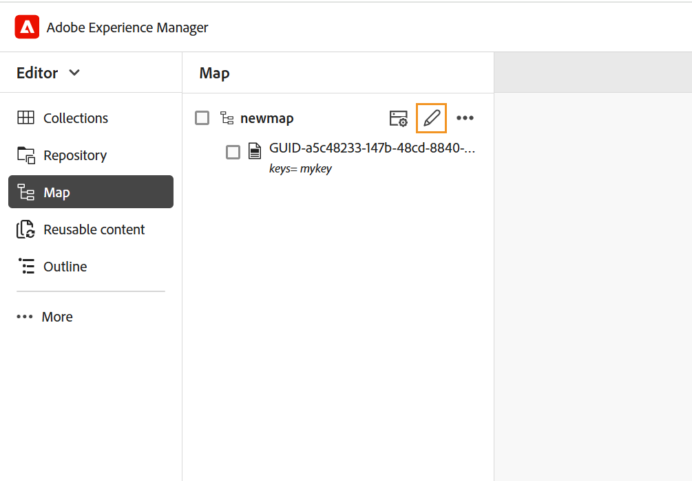
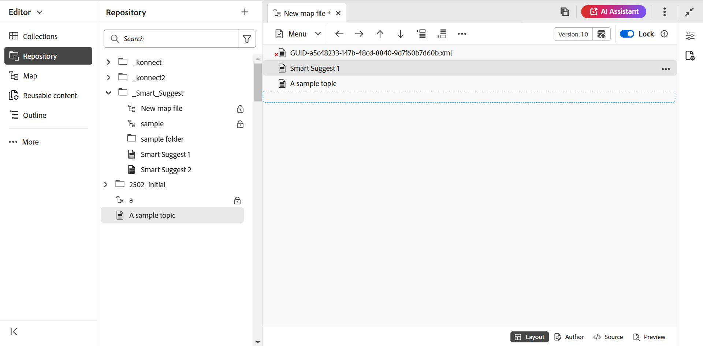

# 创建映射 {#id176FEN0D05Z}

Adobe Experience Manager Guides提供两个现成的映射模板 — DITA映射和Bookmap。 您还可以创建自己的映射模板并与作者共享这些模板以创建映射文件。

执行以下步骤以创建映射：

1. 在存储库面板中，选择&#x200B;**新建文件**&#x200B;图标，然后从下拉菜单中选择&#x200B;**DITA映射**。

   {align="left"}

   您还可以从[Experience Manager Guides主页](./intro-home-page.md)以及存储库视图中文件夹的选项菜单访问此选项。

2. 显示&#x200B;**新建映射**&#x200B;对话框。

3. 在&#x200B;**新建映射**&#x200B;对话框中，提供以下详细信息：
   - 地图的标题。
   - \（可选\）*映射的文件名。 根据主题“标题”自动建议文件名。 如果管理员启用了基于UUID设置的自动文件名，则您将不会查看名称字段。
   - 主题所基于的模板。 对于映射文件，可用选项为&#x200B;**Bookmap**、**Map**&#x200B;和&#x200B;**主题方案**。
   - 保存映射文件的路径。 默认情况下，存储库中当前选定文件夹的路径将显示在路径字段中。

   {width="300" align="left"}

4. 选择&#x200B;**创建**。

将在指定的路径创建映射。 此外，将在映射编辑器中打开映射进行编辑。

{align="left"}

## 将主题添加到映射文件

除了直接从编辑器编辑映射文件外，还可以在映射中打开主题文件以编辑编辑器。 可以将主题添加到映射文件中。

执行以下步骤，从“映射”控制台将主题添加到映射文件：

1. 在“存储库”视图中，导航到要编辑的映射文件并将其打开。
1. 选择&#x200B;**编辑**&#x200B;图标。

   {width="450" align="left"}

1. 将在映射编辑器中打开映射文件。 如果您已打开新的映射文件，则编辑器中只显示映射的标题。

   {align="left"}

   - **A** - \（*选项卡栏*\）：这与编辑器的选项卡栏类似。 在编辑器中查看[选项卡栏](./web-editor-tab-bar.md)以了解更多详细信息。

   - **B** - \（*工具栏*\）这是允许您处理映射文件的工具栏。 有关通过工具栏提供的功能的详细信息，请查看地图编辑器工具栏中的[可用功能](#features-available-in-the-map-editors-toolbar)。

   - **C** - \（*映射视图*\）：允许您在布局、创作、Source和预览之间切换映射编辑器。 **布局**&#x200B;视图允许您在DITA映射中组织主题。 这将给出该映射的树或分层视图。 **作者**&#x200B;视图允许您在映射编辑器中编辑主题。 这还可以提供映射文件的WYSIWYG视图。 **Source**&#x200B;视图允许您使用映射文件的基础XML。 预览为您提供了映射文件中所有主题和子映射的统一视图。

   - **D** - \（*左侧面板*\）：允许您访问左侧面板，该面板允许您访问收藏集、存储库、映射、大纲和其他功能。 您可以通过选择“展开/折叠”图标来展开或折叠它。 有关左侧面板中可用功能的更多详细信息，请在编辑器中查看[左侧面板](./web-editor-left-panel.md)。

   - **E** - \（*中间区域*\）：映射内容编辑区域。

   - **F** - \（*右侧面板*\）：授予对“属性”面板的访问权限。 您可以查看所选主题或映射的内容属性和映射属性。 有关此面板中可用功能的更多详细信息，请在编辑器中查看[右侧面板](web-editor-right-panel.md)。

1. 在左侧面板中，切换到&#x200B;**存储库**&#x200B;视图。

1. 在Adobe Experience Manager存储库中，导航到包含要添加的主题或子映射的文件夹。

1. 在&#x200B;**存储库**&#x200B;视图中选择主题或映射文件，并将其拖放到\(middle\)映射内容编辑区域。

   该主题即添加到映射中。

   {align="left"}

1. 要添加后续主题或子映射，请将主题或子映射拖放到映射中的所需位置。

   构建映射文件时请考虑以下几点：

   - 该文件被添加到地图编辑区域中虚线矩形栏出现的位置。 在以下屏幕截图中，将在&#x200B;*智能建议1*&#x200B;和&#x200B;*智能建议2*&#x200B;主题之间添加&#x200B;*示例主题*。

     {align="left"}

   - 要替换主题，请将新主题拖放到要替换的主题上。 将其放到上面时，表示该主题将被放在上面的主题替换。

   - 如果将子映射添加到DITA映射，则该子映射在DITA映射中显示为链接。 要查看子映射的所有主题，请按Ctrl +单击子映射链接。 子映射的内容将显示在新选项卡中。 同样，要从DITA映射中打开主题，请按Ctrl +单击主题链接，该链接将在新选项卡中打开。

   - 您可以使用快捷键CTRL+Z和CTRL+Y或它们在工具栏中的相应图标来撤消或重做映射中的任何更改。

   - 要更改主题的位置，请选择主题\（通过选择主题图标\），然后将其拖放到映射文件中的所需位置。 在下面的屏幕截图中，主题&#x200B;*智能建议1*&#x200B;将移动到&#x200B;*示例主题*&#x200B;之后。

     {align="left"}

   - 要检查映射文件的属性，请右键单击映射编辑区域中的任意位置，然后从上下文菜单中选择&#x200B;**属性**。 根据您的Adobe Experience Manager版本，您可以查看元数据、计划\(de\)激活、引用、文档状态等属性。

1. 选择&#x200B;**保存**。

## 从Assets UI创建映射

您还可以从Assets UI创建映射文件，并在映射编辑器中打开该文件以进行编辑。

执行以下步骤，从Assets UI创建映射：

1. 在Assets UI中，导航到要创建映射文件的位置。

1. 选择&#x200B;**创建** \> **DITA映射**。

1. 在Blueprint页面上，选择要使用的映射模板类型，然后选择&#x200B;**下一步**。

   >[!NOTE]
   >
   > 在映射文件中引用主题的方式取决于映射模板。 例如，如果选择“映射”模板，则使用主题引用\(`topicref`\)来引用主题。 如果是Bookmap，则使用DITA中的`chapter`元素创建主题引用。

   {align="left"}

1. 在“属性”页面上，指定映射&#x200B;**标题**。

1. \（可选\）指定文件&#x200B;**名称**。

   如果管理员已根据UUID设置配置了自动文件名，则您将不会查看用于指定文件名的选项。 基于UUID的文件名会自动指定给该文件。

   如果文件命名选项可用，则也会根据地图的标题自动建议名称。 如果要手动指定映射文件名，请确保文件名不包含任何空格、撇号或大括号，并且以`.ditamap`结尾。

1. 选择&#x200B;**创建**。

   出现“Map Created（映射已创建）”消息。

   您从Assets UI或编辑器创建的每个新映射文件都会分配一个唯一的映射ID。 此外，新映射还会另存为DAM中的最新工作副本。 在保存新创建的映射的修订版之前，您不会在“版本历史记录”中查看任何版本号。 如果打开映射进行编辑，则版本信息将显示在映射文件选项卡的右上角：

   {align="left"}

   新创建的映射的版本信息显示为&#x200B;*none*。 保存新版本时，会为其分配一个版本号1.0。有关保存新版本的更多信息，请查看[另存为新版本](web-editor-features.md#save-as-new-version)。

   您可以选择在配置的映射编辑器中打开映射进行编辑，或将映射文件保存在Adobe Experience Manager存储库中。

   >[!NOTE]
   >
   > 要使用高级映射编辑器，请在编辑器中访问映射文件。 如果管理员已将高级映射编辑器配置为映射文件中的默认编辑器，则直接在高级映射编辑器中打开映射文件以进行编辑。 查看&#x200B;*在安装和配置Adobe Experience Manager Guides as a Cloud Service中将高级映射编辑器设置为默认值*&#x200B;部分。

### 从Assets UI将主题添加到映射文件

执行以下步骤，从Assets UI将主题添加到映射文件：

1. 在Assets UI中，导航到要编辑的映射文件。

   >[!NOTE]
   >
   > 确保尚未启用资产选择模式。

1. 要获得映射文件的独占锁定，请选择映射文件，然后选择顶部的&#x200B;**签出**&#x200B;选项。

   >[!NOTE]
   >
   > 一旦您对映射文件进行了独占锁定，其他用户将无法编辑该映射。 但是，他们能够处理映射文件中的主题。 如果管理员已将编辑器配置为在编辑之前锁定文件，则在锁定文件之前，您将无法编辑文件。

1. 选择映射文件后，选择&#x200B;**编辑主题**。

   {align="left"}

   或者，您也可以从映射文件的操作菜单中选择&#x200B;**编辑主题**&#x200B;选项：

   {align="left"}

   将在编辑器中打开映射文件进行编辑。 若要将主题添加到映射文件，请按照[将主题添加到映射文件](#add-topics-to-a-map-file)中的步骤(4-8)操作。

**父主题：[映射编辑器简介](map-editor.md)
