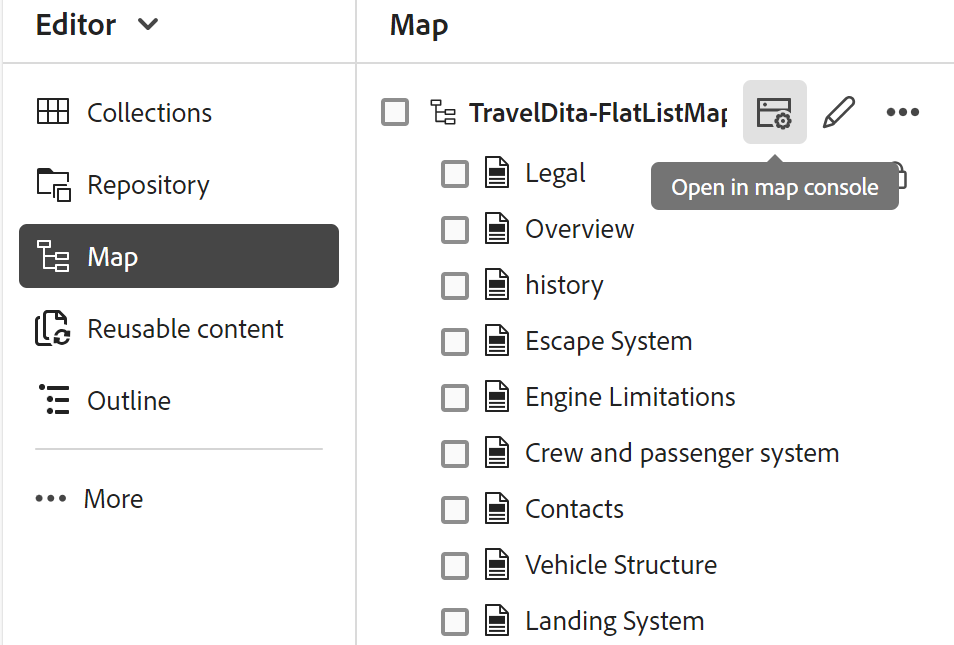

# 在“映射”控制台中打开文件

执行以下步骤以在“映射”控制台中打开DITA映射文件：

1. 从主页打开&#x200B;**映射控制台**。

   {width="800"align="left"}

2. 由于未选择映射文件，因此系统会提示您选择映射文件以使用映射管理和发布功能。

   

3. 选择&#x200B;**选择映射**，然后选择DITA映射文件所在的路径。

   映射文件将在“映射”控制台中打开。 默认情况下，**输出预设**&#x200B;选项卡处于选中状态。

   {width="800"align="left"}

   >[!NOTE]
   >
   >  在映射控制台中打开的映射与编辑器中可用的映射视图同步。

## 从编辑器中打开映射文件

您还可以从编辑器在映射控制台中打开现有的映射文件。

1. 在“存储库”视图中导航到并选择DITA映射文件。

   映射文件在“映射”视图中打开。

2. 选择&#x200B;**在地图控制台中打开**&#x200B;图标。

   映射文件将在“映射”控制台中打开。

   {align="left"}
