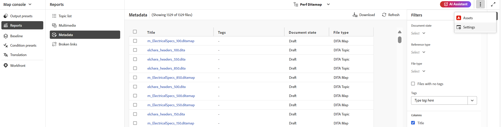
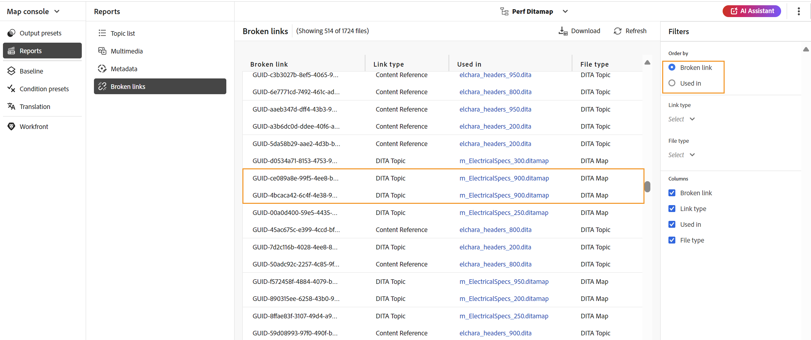

# 映射控制台中的DITA映射报表 {#id231HF0Z0NXA}

Adobe Experience Manager Guides在映射控制台中提供了一个功能，允许您检查映射的整体完整性并为其生成报告。

您可以从“映射控制台”的&#x200B;**报告**&#x200B;选项卡中查看主题列表、管理所有引用的元数据、查看多媒体列表并修复当前映射的所有断开链接，访问方式如下：

1. 在&#x200B;**存储库**&#x200B;面板的“映射”视图中打开DITA映射文件。

   >[!NOTE]
   >
   > 您还可以从主页左上角的下拉菜单中直接在&#x200B;**映射控制台**&#x200B;选项卡中打开DITA映射。

1. 选择&#x200B;**在地图控制台中打开**&#x200B;图标。

   {width="600" align="left"}

1. 从左侧面板中选择&#x200B;**报表**。

您可以从&#x200B;**报告**&#x200B;面板中找到所有四个报告。 根据您的要求，您可以选择此处所示的任何报表。

{align="left"}

通过“报告”面板可访问四种不同类型的报告。 下文将详细讨论每个报告及其辅助功能和特性。

## 主题列表报告

**主题列表**&#x200B;报告提供了有关您的主题的详细信息，如引用类型、文档状态和作者。

可通过执行以下步骤来查看映射的主题列表报告：

1. 从“报告”面板中选择&#x200B;**主题列表**。 将显示DITA映射中存在的主题列表。

   {align="left"}

1. 从&#x200B;**筛选器**&#x200B;面板中，您可以根据&#x200B;**引用类型** \（直接或间接\）、**文档状态** \（例如，如果您的主题处于“编辑”、“审阅”或“已审阅”状态，则将列出这些内容\）或主题的&#x200B;**作者**&#x200B;来筛选主题。

   >[!NOTE]
   >
   > 所有过滤器都提供了系统中存在的选项的详尽列表。

1. 您还可以使用以下主题过滤选项来选择在列表中显示以下列：

   - **标题**&#x200B;在DITA映射中指定了主题的标题。 您可以选择要编辑的主题。
   - **文件名**&#x200B;文件的名称。
   - **UUID**&#x200B;文件的通用唯一标识符\(UUID\)。
   - **文件位置**&#x200B;主题的完整路径。
   - **引用类型**&#x200B;引用类型 — 直接或间接引用。
   - **文档状态**&#x200B;主题的状态。
   - **作者**&#x200B;上次处理该主题的用户。 该列表以异步方式分页并加载，一次显示一组有限的用户，并在滚动或导航时获取更多内容。 这提高了加载速度和整体性能，尤其是在处理大量用户时。
   - **父映射**&#x200B;直接引用主题的所有映射的列表。
   >[!NOTE]
   >
   > 选择&#x200B;**刷新**&#x200B;以获取新的主题列表，并查看映射文件中的任何更改或主题文件中的任何引用是否已更新。

1. 选择&#x200B;**下载**&#x200B;可下载DITA映射中所有主题的快照。 Excel工作表包含在&#x200B;**主题列表**&#x200B;视图中过滤的选定列和主题。

## 元数据报表

**元数据报表**&#x200B;提供了您在当前DITA映射中的引用的详细报表，如引用类型、文档状态、标记、文件位置等。

可通过执行以下步骤来查看映射的元数据报表：

1. 从“报表”面板中选择&#x200B;**元数据**。 此时将显示映射的所有引用列表及其元数据，例如标记、文档状态、自定义元数据。 要添加新的自定义元数据列，请参阅[添加自定义元数据列](#add-custom-metadata-columns)部分。

   {align="left"}

1. 从&#x200B;**筛选器**&#x200B;面板中，您可以根据&#x200B;**文档状态**&#x200B;筛选主题\（例如，如果主题处于编辑、审核中或审核状态，则将列出\）、**引用** \（直接或间接引用）、**文件类型** \（映射、主题、文档、图像、视频及其他\）。

   >[!NOTE]
   >
   > 所有过滤器都提供了系统中存在的选项的详尽列表。

1. 您还可以选择仅查看没有标记的&#x200B;**文件**，或者也可以从&#x200B;**标记**&#x200B;筛选器中选择特定标记以查看与其关联的文件。
1. 您还可以使用以下主题过滤选项来选择在元数据列表中显示以下列：
   - **标题** \（默认选中\）在DITA映射中指定引用文件的标题。 您可以选择要编辑的文件。

     >[!NOTE]
     >
     > 签出图标也会出现在签出文件的标题附近。 您可以将鼠标悬停在图标上以查看用户的名称。

   - **文件名**&#x200B;文件的名称。
   - **文件位置**&#x200B;文件的完整路径。
   - **UUID**&#x200B;文件的通用唯一标识符\(UUID\)。
   - **标记** \（默认选中\）应用于文件的标记。

     >[!NOTE]
     >
     > 默认情况下，您可以查看文件的两个标记。 要查看更多标记，请选择&#x200B;**显示更多**。 选择&#x200B;**显示更少**&#x200B;以再次约定列表。

   - **文档状态** \（默认选中\）引用文件的当前状态。
   - **引用类型**&#x200B;引用类型 — 直接或间接引用
   - **文件类型** \（默认选中\）源文件的类型。 可用的选项有“映射”、“主题”和“图像”。
   - **锁定者**&#x200B;已锁定文件的用户。

1. 选择&#x200B;**下载**&#x200B;可下载DITA映射中所有引用的快照。 Excel工作表包含在&#x200B;**元数据**&#x200B;视图中过滤的选定列和引用。

### 从元数据报表批量管理元数据

可以在单个主题中应用标记，或者使用批量标记功能在多个主题、DITA映射或子映射中应用多个标记。 您也可以将所有选定主题的文档状态更改为下一个可能的公共文档状态。

### 更新元数据

要更新元数据，请执行以下步骤：

1. 要更新元数据，请选择要更新的文件。 通过选中显示在&#x200B;**Title**&#x200B;旁边的复选框，可以选择出现在元数据面板中的文件。 如果要选择所有记录，请使用标题栏上方的&#x200B;**全选**&#x200B;选项卡，如下所示。

   >[!NOTE]
   >
   > 您不能选择任何已签出的文件。 签出图标也会出现在签出文件的标题附近。 您可以将鼠标悬停在图标上以查看用户的名称。

   {align="left"}

1. 从顶部选择&#x200B;**管理**。

   {width="350" align="left"}

1. 如果要添加任何新标记，请从下拉列表中选择新标记，以将其应用于所有选定主题。 您还可以通过选择标记旁边的交叉图标来删除任何标记。

   >[!NOTE]
   >
   > 列出了应用于所有选定主题的通用标记。

1. 如果要更改所有选定参照的文档状态，请选择新文档状态。 下拉列表显示所有选定主题的常见可能状态。 例如，如果主题的当前状态为“正在审阅”，则可以查看“草稿”、“已批准”或“已审阅”状态。
1. 选择&#x200B;**更新**&#x200B;以更新元数据。 将显示元数据更新成功还是更新失败的确认消息。 您还可以选择&#x200B;**下载报表**&#x200B;来下载报表的快照。 此快照包含所选引用的已更新状态的详细信息。

### 添加自定义元数据列

此功能允许您根据需要添加自定义元数据列，这些列随后显示在元数据报表中。 它还提高了元数据报表的灵活性。 要添加新的自定义元数据列，请执行以下步骤：

1. 要添加自定义元数据列，请从元数据页面右上角的三个圆点中选择&#x200B;**Workspace设置** （显示为&#x200B;**内部部署**&#x200B;的&#x200B;**设置**）。

   {width="600" align="left"}

1. 在出现的弹出窗口的左侧面板上选择&#x200B;**元数据**。
1. 根据需要使用&#x200B;**添加**&#x200B;选项卡添加新的自定义元数据字段。

   {width="600" align="left"}

1. 为要在元数据报表的列中添加的特定元数据路径和适当的标题。 例如，添加了具有标题语言和特定路径的自定义元数据。

   >[!NOTE]
   >
   > 如果要删除特定元数据列，可以从显示的列表中将其删除。 此外，您还可以编辑&#x200B;**标签**&#x200B;以更改列的显示标题。

   {width="600" align="left"}

1. 选择&#x200B;**保存**&#x200B;和&#x200B;**刷新**&#x200B;元数据视图。 新的自定义列&#x200B;**语言**&#x200B;已添加到筛选器面板的列列表中。

   >[!NOTE]
   >
   > 添加新元数据列也会反映在编辑器的&#x200B;**版本历史记录**&#x200B;面板中。 有关详细信息，请查看&#x200B;**[元数据](web-editor-features.md)**。

   {width="600" align="left"}

同样，您可以按照上述步骤，根据元数据报表中所需的要求，添加任何新的自定义元数据字段。

## 多媒体报告

**多媒体**&#x200B;报告提供了地图中使用的多媒体的详细信息，如标题、类型\（音频、视频和图像\）、在其中使用多媒体的文件以及在其中使用多媒体的文件的引用类型。 您还可以查看存储库中的UUID和多媒体位置。 您可以通过执行以下步骤来查看多媒体的报告：

1. 从报告面板中选择&#x200B;**多媒体**。 显示DITA映射中存在的多媒体列表。
1. 从&#x200B;**筛选器**&#x200B;面板中，您可以按多媒体或引用中使用的名称对列表进行排序。

   - 按&#x200B;**多媒体**&#x200B;排序时，多媒体的名称显示在第一列中，而使用它们的所有引用的名称则显示在同一行的另一列中。 例如，以下屏幕截图显示了第一列的多媒体testSong.mp3以及使用该多媒体的两个引用在同一行的第三列中显示。

     {width="650" align="left"}

   - 如果按&#x200B;**用于**&#x200B;列进行排序，您将查看转换视图，其中已使用多媒体的引用的名称列在第一列，而多媒体名称列在单独行上的另一列。 例如，以下屏幕截图显示了第一列中两个引用\（testing_indirect和Video content Topic\）的名称，多媒体testSong.mp3显示在第三列中两个单独的行。

     {width="650" align="left"}

1. 您可以根据&#x200B;**多媒体类型**&#x200B;和&#x200B;**引用类型**&#x200B;筛选多媒体。 根据您在下拉菜单中的选择，将显示多媒体文件列表。 例如，您可以选择仅显示DITA映射中的音频引用，而文件仅显示其中使用的音频引用。

1. 您还可以使用以下筛选选项来选择在列表中显示以下列：

   - **多媒体** \（默认选中\）在DITA映射中指定多媒体的标题。 您可以选择要编辑的多媒体。
   - **多媒体位置**&#x200B;多媒体的完整路径。
   - **多媒体UUID**&#x200B;文件的通用唯一标识符\(UUID\)。
   - **多媒体类型** \（默认选中\）多媒体类型。 可用的选项有“音频”、“视频”或“图像”。
   - **在**&#x200B;中使用\（默认选中\）已使用多媒体的引用。 可选取参照对其进行编辑。
   - **引用类型** \（默认选中\）引用的类型 — 直接或间接引用。
   >[!NOTE]
   >
   > 选择&#x200B;**刷新**&#x200B;以获取新的多媒体列表，并查看映射文件中的任何更改或DITA映射中的任何多媒体是否已更新。

1. 选择&#x200B;**下载**&#x200B;下载DITA映射中所有多媒体的快照。 Excel工作表包含在&#x200B;**多媒体**&#x200B;视图中过滤的选定列和多媒体。

## “断开的链接”报表

**断开的链接**是一个有用的报表，可为您提供当前映射中存在的断开链接的详细信息。 您可以查看断开的链接，这些链接可用于DITA主题、多媒体文件引用、内容键引用等。 你也可以自己在这里修复它们。
报告提供详细信息，例如断开的链接、链接类型、使用引用的文件以及使用的文件类型。
您可以通过执行以下步骤来查看断开链接报表：

1. 从“报表”面板中选择&#x200B;**断开的链接**。 将显示DITA映射中存在的断开链接或引用列表。
1. 从&#x200B;**筛选器**&#x200B;面板中，您可以按链接或引用中使用的名称对列表进行排序。

    — 当您按&#x200B;**断开链接**&#x200B;排序时，断开链接的路径将显示在第一列中，而使用它们的所有引用的名称将显示在单独行上的另一列中。 如果在多个文件中使用了相同的断开链接，则它们将显示在一行中，并显示为分组行或子行。 例如，以下屏幕截图显示第一列中两个断开的链接以及使用这些链接的引用，`m_ElectricalSpecs_900.ditamap`显示在第三列中两个单独的行中。

   {align="left"}

    — 如果按&#x200B;**在**&#x200B;列中使用，您将查看变换视图，其中已使用断开链接的引用的名称在第一列中列出，而断开的链接在同一行的另一列中列出。 例如，以下屏幕截图显示了第一列中的引用（使用了断开的链接） `m_ElectricalSpecs_900.ditamap`，并且断开的链接显示在同一行的第三列中。

   {align="left"}

1. 您可以根据&#x200B;**文件类型**&#x200B;和&#x200B;**链接类型**&#x200B;筛选断开的链接。 系统会根据您在下拉列表中的选择，显示断开的链接列表。 例如，您可以选择仅显示DITA映射中的内容引用，而文件仅显示其中使用的已断开的内容引用。

   DITA主题、DITA映射、文件引用、键引用、内容引用、内容键引用、图像引用、多媒体文件引用和多媒体键引用是&#x200B;**链接类型**&#x200B;下拉菜单的可用值，而DITA主题、DITA映射、文档、图像、视频、音频和其他是&#x200B;**文件类型**&#x200B;下拉菜单的可用值。
1. 您还可以使用以下筛选选项来选择在列表中显示以下列：

   - **断开的链接**（默认选中）断开的链接的路径在DITA映射中指定。

   - **链接类型**（默认选中）链接的类型。 可用选项为“DITA主题”、“DITA映射”、“文件引用”、“键引用”、“内容引用”、“内容键引用”、“图像引用”、“多媒体文件引用”和“多媒体键引用”。

   - **在**&#x200B;中使用（默认选中）已使用断开链接的引用。 您可以选择引用以在创作模式下查看它。

   - **文件类型**（默认选中）引用类型 — DITA主题、DITA映射、文档、图像、视频、音频和其他。

   选择&#x200B;**刷新**&#x200B;以获取断开链接的新列表，并查看映射文件中的任何更改或DITA映射中的任何断开链接是否已更新。
1. 您可以在&#x200B;**修复链接**&#x200B;图标()上选择修复断开的链接。

   >[!NOTE]
   >
   > 将鼠标悬停在“断开链接”列下的断开链接路径上，以查看修复链接()图标。

   您可以修复两个视图中的链接 — 当您按&#x200B;**断开的链接**&#x200B;或&#x200B;**在**&#x200B;中使用的链接进行排序时。

   >[!NOTE]
   >
   > 如果在按断开链接排序时修复断开的链接，则将在使用该链接的所有文件（这些文件在一行中分组）中修复该链接。

1. 您需要在&#x200B;**更新链接**&#x200B;对话框中更新所需的引用详细信息。 **更新链接**&#x200B;对话框中所需的详细信息将取决于引用的类型。\
   修复链接后，该链接不会显示在断开链接列表下。 而是可以在“主题列表”或“元数据”下查看它。

1. 选择&#x200B;**下载**&#x200B;可下载DITA映射中所有断开链接的快照。 excel文件包含在“断开链接”视图中过滤的选定列和断开链接。

**父主题：**[&#x200B;报告简介](reports-intro.md)
