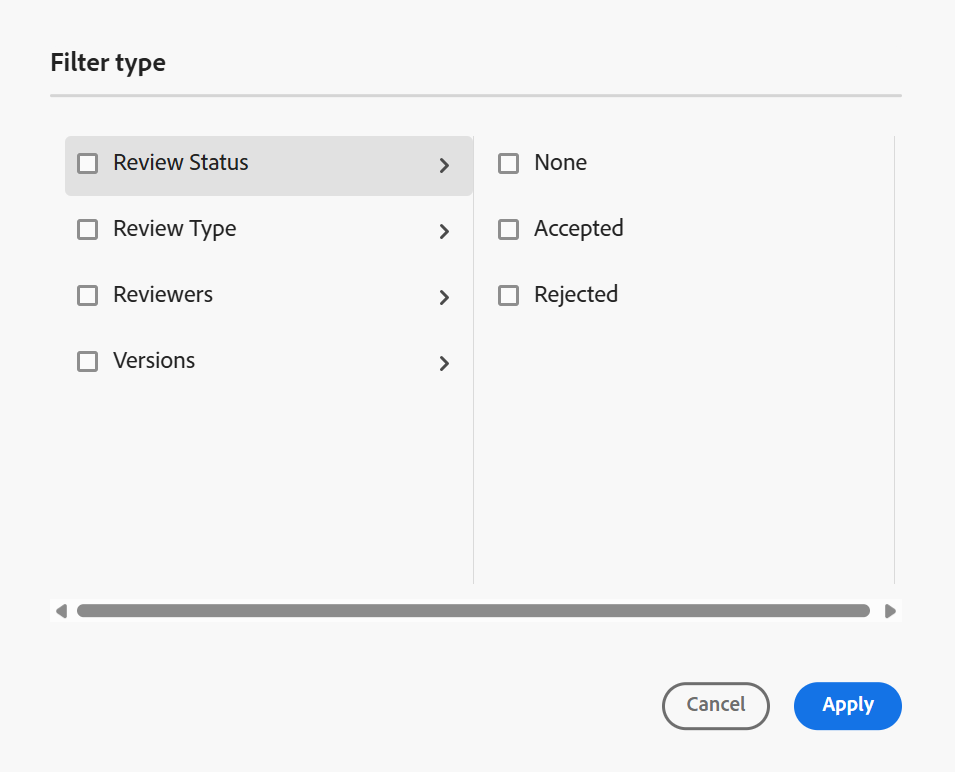

# 地址审核注释 {#id2056B0X0KBI}

作为作者，您可以使用编辑器在主题中处理注释。 根据在“审阅”面板中选择的审阅任务载入注释。 有关更多详细信息，请在&#x200B;**左侧面板**&#x200B;部分中查看审阅[面板](../user-guide/web-editor-features.md#id2051EA0M0HS)功能说明。

以下各节介绍在编辑器中处理注释的方法。

作者可以在编辑器中处理文档中的注释。 提供了视觉指示器，用于指示已插入\(text\)、删除还是高亮显示注释。 每个注释条目的顶部还会提及注释的类型。

>[!NOTE]
>
> 处理审阅注释\（对于活动审阅文档\）时，请确保不要在启用了完整标记视图的多个选项卡中打开审阅中主题，并且不要在“创作”和“Source”视图模式之间切换。

{align="left"}

在编辑器中，右侧面板包含审阅和跟踪更改图标。 “审阅”面板显示审阅者在您的文档中所做的所有注释。 **跟踪更改**&#x200B;面板显示文档中所有插入和删除的注释的状态。

- **A**：选择一个审阅任务以查看审阅注释。 如果您的主题已在多个审阅任务中共享以供审阅，您将查看此下拉列表中列出的那些任务。

  从列表中选择审阅任务时，您可以查看审阅人在该任务中所做的注释。 您可以在任务中单独处理审阅注释，这意味着对注释的任何更新仅对相应任务的审阅者可见。

- **B：**&#x200B;在&#x200B;**注释**&#x200B;面板中选择审阅详细信息&#x200B;****&#x200B;以查看有关审阅任务的更多信息：

   - **名称**：审核任务的名称。
   - **审核版本**：显示与所选审核任务关联的版本。 这有助于跟踪您共享以供审阅的版本
   - **状态**：审核任务的当前状态。

  >[!NOTE]
  >
  > 如果审核任务的根映射与创作根映射不同，则会显示有关该任务的信息，以指示创作根映射与审核根映射不匹配。

- **C**：如果在启动审阅后更新了主题，则选择&#x200B;**将主题还原为审阅版本**&#x200B;图标会将工作副本还原为共享以供审阅的版本。 这样，您就可以更轻松地直接将审阅反馈合并到共享以供审阅的版本中。 在合并反馈后，可将更改保存在还原版本中或创建主题的新修订版本。 如果选择创建主题的新修订版本，则会从共享以供审阅的主题版本创建一个新分支。 例如，如果在当前创作版本为`1.2`时共享了某个主题的`1.3`版本以供审阅，则可以使用此图标切换回版本`1.2`以合并审阅注释。 如果您选择在将更改合并到版本`1.2`之后创建新的修订版本，则会为该主题创建一个版本为`1.2.0`的新分支。

  通常，在合并审阅反馈后，您希望合并来自主题最新版本的更改。 为此，请使用[合并](web-editor-features.md#id205DF04E0HS)功能获取在共享主题以供审阅后所做的所有更新。

- **D**：打开并排视图，以显示该主题的注释版本。 如上面的屏幕快照所示，最左边的部分是可在其中进行更改的主题的最新版本。 下一部分是该主题的注释版本。 在主题中的注释之间导航时，侧视图会更改并显示在其中添加注释的主题版本。 评论面板中的每个评论都链接到此部分中的相应文本。 它有助于您识别注释的文本。 注释按文档中注释文本的顺序显示。

  您可以在侧视图顶部查看版本号。 再次选择此图标将隐藏该主题的注释版本。

- E：直接在主题中导入插入和删除的\（或删除线\）注释。 选择“导入”图标后，所有文本插入和删除都将显示在主题的工作副本中。 现在，可以通过两种方式接受或拒绝评论。

  如果要一次合并一个建议的更改\（插入或删除\），只需右键单击内容中的注释并选择“接受更改”或“拒绝更改”。 根据您的选择，可接受或拒绝评论。 如果接受评论，内容会添加到内容中；如果拒绝，则会从内容中删除。 此外，评论的状态在“审阅”面板中更改。

  {align="left"}

  您还可以使用“跟踪更改”面板接受或拒绝注释。 选择任何注释会突出显示文档中的注释。

  {align="left"}

  >[!IMPORTANT]
  >
  > 导入注释功能仅适用于那些自共享以供审阅后未更改的文档。 如果在发送文档以供审阅后进行了任何更改，您将收到警报，提醒您&#x200B;**强制将**&#x200B;注释导入文档。 但是，这样做会导致丢失您在文档中所做的所有更新。 如果在外部创建文档，然后共享该文档以供审阅，则也会显示&#x200B;**强制导入**&#x200B;警报。 您可以导入注释。

  当您接受或拒绝注释时，会将其从“跟踪的更改”列表中删除。 这还可以作为文件中需要处理多少评论的指标。

- **F**：从“更多选项”菜单中，下载评论主题中可用的所有附件。
- **G**：在评论中搜索文本。
- **H**：接受或拒绝评论。

- **I**：对评论应用筛选器。 您可以根据审阅类型\（全部、高亮显示、已删除、已插入或附注\）、审阅状态\（全部、已接受、已拒绝或无\）、审阅者\(全部或特定审阅者\(s\)\)或主题版本来筛选以查看注释。 默认情况下，不选择任何过滤器。

  {width="350" align="left"}
  **通过标记其他用户回复评论**

作为审阅任务的作者和发起者，您可以回复审阅注释，并标记同一审阅任务中涉及的其他用户，以引起他们的注意或分配跟进。 此功能仅适用于活动审阅任务。

>[!NOTE]
>
> 要查看分配给审阅任务的用户列表并在评论中标记这些用户，您必须对&#x200B;*节点具有*&#x200B;读取`/home/users and /home/groups`访问权限。 有关详细信息，请查看[用户管理和安全性](../cs-install-guide/user-admin-sec.md#additional-notes-on-user-groups)。  如果在确认访问后标记仍然不可用，则您的管理员可能需要分配`user-admin`许可证才能启用此功能。

{width="350" align="left"}
*Caption:Tag用户作为发起人/作者*

标记的用户会收到电子邮件和AEM通知，确保他们及时获得通知。 有关如何触发审阅通知的更多详细信息，请查看[了解审阅通知](./review-understanding-review-notifications.md)。

**使用审阅UI访问审阅注释**

如果您是审阅任务的发起者或作者，并从&#x200B;**项目控制台**&#x200B;中打开它，则该主题将在审阅UI中启动。 由于此任务未分配给您，因此您可以查看和回复注释，但不能执行任何审阅操作。 对于未分配给任务的用户，“注释”工具栏保持禁用状态。

{width="350" align="left"}

**父主题：**[&#x200B;要审阅的简介](review.md)
