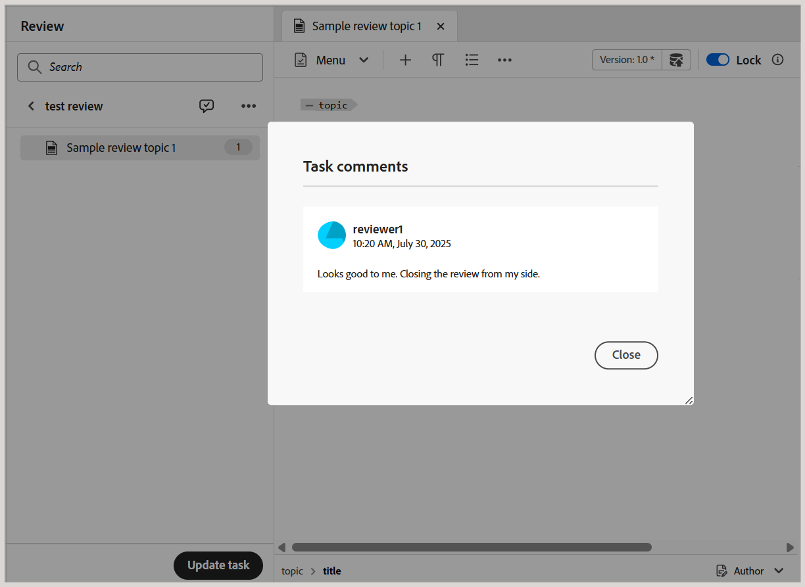

# 以作者身份请求重新审阅或关闭审阅任务

>[!IMPORTANT]
>
> 默认情况下，在2508版的Experience Manager Guides as a Cloud Service中启用了本文中描述的新功能。 在迁移之前创建的审阅不会受到影响，并将继续使用之前的工作流。 如果您希望在不进行这些更新的情况下继续使用现有功能，请联系您的客户成功团队以禁用新功能。

当审阅任务被审阅人标记为已完成时，会向任务发起人触发通知，使他们能够访问和审阅任务及相关任务级别的注释。

作为审阅任务的发起者，您可以根据反馈决定如何继续。 可用的选项为：

- 请求重新审阅
- 关闭审核任务

## 请求重新审阅或关闭审阅任务

执行以下步骤可请求重新审阅或关闭审阅任务：

1. 从编辑器的左侧面板中打开&#x200B;**审阅面板**。
2. 从&#x200B;**活动任务**&#x200B;列表中选择要关闭或重新提交以进行审阅的审阅任务。

   >[!NOTE]
   >
   > 您还可以在任务仪表板中打开任务以获取更全面的视图。 要执行此操作，请从任何活动审阅任务的“选项”菜单中选择&#x200B;**在任务仪表板中打开**。 这将在项目控制台中打开任务详细信息。

   
3. 选择&#x200B;**任务注释**&#x200B;图标以访问和审阅审阅审阅人添加的任务级别注释。

   。

   **任务备注**&#x200B;对话框显示在右侧。

   {width="350" align="left"}。
4. 选择&#x200B;**更新任务**&#x200B;以对所选审阅任务执行进一步的操作。
5. 在&#x200B;**更新任务**&#x200B;对话框中，选择以下操作之一：

   - **请求重新审阅**：启动另一轮审阅。 您可以选择主题的其他版本进行审阅。 默认情况下，将选择发送以供审阅的主题或映射文件的最新（或上次编辑的）版本。 您还可以根据需要使用&#x200B;**编辑版本**&#x200B;选项将所选主题的版本设置为&#x200B;**最新版本**&#x200B;或&#x200B;**基线**。  完成上一次审阅的审阅人将收到通知，就更新的版本提供反馈。 对于未将审阅任务标记为完成的其他审阅人，将会收到有关主题更新的通知。

   - **关闭审阅**：关闭审阅任务。 审核面板底部的&#x200B;**更新任务**&#x200B;按钮更改为&#x200B;**已关闭**，并且会向参与审核任务的所有用户发送一个通知，指示其关闭。

   有关审阅通知如何触发的详细信息，请查看[了解审阅通知](./review-understanding-review-notifications.md)。

   {width="350" align="left"}

   您也可以[使用“更新任务”对话框中提供的](./review-manage-tasks-review-dashboard.md#check-the-status-of-a-review-task)检查审阅状态&#x200B;**选项来检查审阅任务的状态**。 选择此选项将转到“审阅”仪表板，其中显示审阅任务的状态报告。

   {width="650" align="left"}

6. 选择&#x200B;**确认**。

作为审阅任务的作者或发起人，当您关闭任务时，“审阅”面板底部的&#x200B;**更新任务**&#x200B;按钮将更改为&#x200B;**已关闭**，这表示任务不再处于活动状态。

{width="350" align="left"}

此外，对于审阅任务的其他用户，审阅面板中存在的&#x200B;**更新任务**&#x200B;按钮保持禁用状态。 例如，作为审阅任务的审阅人之一，如果您在编辑器中打开该任务，则将禁用“更新任务”按钮，并显示消息&#x200B;**您无权处理该任务**。 只有审阅任务的发起者才有权从编辑器中更新任务。

{width="350" align="left"}

