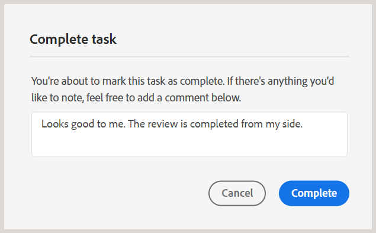

# 以审阅者身份完成审阅任务

作为审阅人，您可以在审阅完所有内容并想要通知作者后，将审阅任务标记为完成。 您还可以在此阶段留下任何最终注释。

执行以下步骤以完成审阅任务：

1. 打开分配给您的审阅任务。
2. 从顶部选择&#x200B;**标记为完成**，如下所示：

   {width="350"}

   显示&#x200B;**完成任务**&#x200B;对话框。
3. 在&#x200B;**完成任务**&#x200B;对话框中，为作者添加最终注释并选择&#x200B;**完成**。

   >[!NOTE]
   >
   > 任务级注释用作摘要或最终注释，与主题审阅期间添加的文本级注释不同。 在此对话框中，您可以概述诸如请求作者处理特定评论并重新发送任务以供审阅之类的后续操作，或者指示审阅已完成。

   例如，作为查看者，您可以添加注释作为作者的跟进操作：

   {width="350"}

   或者，添加注释以指示任务已完成，如下所示：

   {width="350"}

您已成功将任务标记为“已完成”，其状态现在设置为&#x200B;**已完成**。 将任务标记为完成后，不允许执行进一步的操作。 通知将发送给审阅任务的作者或发起人，以立即引起他们的注意。 有关如何触发审阅通知的更多详细信息，请查看[了解审阅通知](./review-understanding-review-notifications.md)。

{width="350"}

根据反馈，如果任务的作者或发起者决定[关闭审核任务](./review-close-review-task.md)，则审核UI上的任务状态将更改为&#x200B;**已关闭**。

{width="350"}

>[!NOTE]
>
> 审阅UI和AEM收件箱之间的任务同步可用，默认情况下处于启用状态。 当审核者在审核UI中将审核任务标记为&#x200B;**完成**&#x200B;时，相应的任务将自动完成并从审核者的AEM收件箱中删除。 同样，从AEM收件箱中完成任务会在“审阅”UI中自动将其标记为完成。
>
> 作者或任务发起者仍可以审核反馈并重新分配任务（如果需要进行其他审核）。 重新分配任务后，将为审阅人生成新的AEM收件箱通知，以便再次审阅任务。
>
> 如果要使用之前的行为（已完成的审阅任务将保留在审阅者的AEM收件箱中，直到作者或任务发起者审阅反馈并关闭审阅任务），请联系您的客户成功团队以禁用任务同步。

## 查看任务级注释

所有任务级注释都显示在&#x200B;**任务注释**&#x200B;对话框中，该对话框在只读模式下可用。 当您使用最终注释完成审阅任务时，您的输入将记录在此对话框中，以供将来参考。

要从“审阅”UI访问任务级评论，请导航到左侧面板并选择&#x200B;**任务评论**&#x200B;图标。

{width="350"}

**任务备注**&#x200B;对话框显示在右侧。

{width="350"}

对话框中的注释按时间顺序显示，最近的注释显示在最前，最旧的注释显示在最后。 此顺序可帮助您跟踪一段时间内正在进行的对话。

参与审阅任务的所有用户（包括审阅任务的作者或发起者以及其他审阅者）都可以访问&#x200B;**任务注释**&#x200B;对话框。 因此，来自其他审阅人（如果涉及）的注释也可能出现在任务注释对话框中。 这有助于确保在整个审核过程中进行清晰且可跟踪的通信。

在审阅任务级反馈后，作者可以请求重新审阅或关闭审阅任务。 在这两种情况下，审阅过程中捕获的所有注释在&#x200B;**任务注释**&#x200B;对话框中仍可用，以供参考。

## 将审核任务委派给其他审核者

>[!IMPORTANT]
>
> 此功能默认处于启用状态。 如果您不希望在您的环境中使用此功能，请联系您的客户成功团队。

作为审阅人，您有时可能希望另一用户在审阅返回到作者之前加入审阅。 例如，如果部分内容超出了您的专业知识范围，或者您希望在将任务标记为&#x200B;**完成**&#x200B;之前再发表一次意见。 您可以使用&#x200B;**委派**&#x200B;选项直接从审阅任务中推荐审阅人，而不是通过项目管理员进行路由。

选择&#x200B;**委派**&#x200B;不会代表您完成审阅任务。 它会将您的推荐发送给作者（任务的发起者），由作者决定是否将推荐的审阅者添加到任务。

执行以下步骤以委派审阅任务：

1. 打开分配给您的审阅任务。
2. 查看内容后，选择&#x200B;**标记为完成**&#x200B;旁边的&#x200B;**委派**。

   {width="350"}

3. 显示&#x200B;**推荐审阅者**&#x200B;对话框。 从下拉列表中选择一个用户，以推荐其作为此任务的审阅者。

   {width="350"}

4. *（可选）*&#x200B;为作者添加评论，以访问上下文。
5. 选择&#x200B;**委派**。

系统会向作者发送通知，表明您已请求将审阅人添加到任务。 有关作者如何响应此请求的详细信息，请查看[请求重新审阅或关闭审阅任务](./review-close-review-task.md)。

