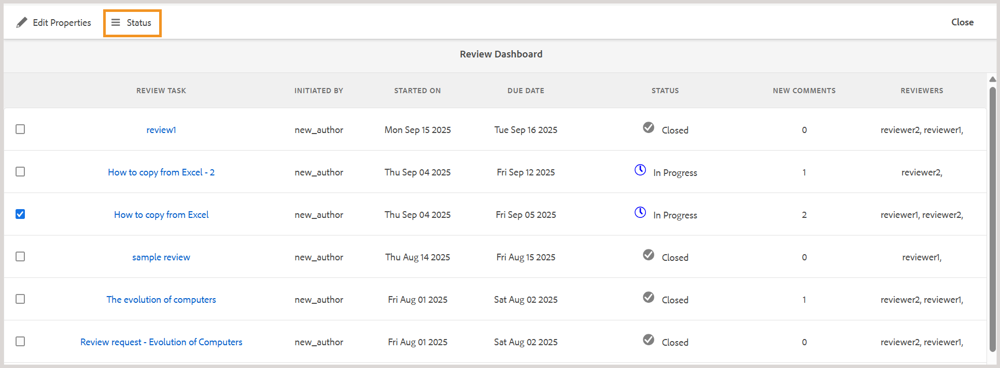

# 使用审阅功能板管理审阅任务 {#id2056B0Y70X4}

审核管理工作流程可以包括各种任务。 例如，您可能希望为特定主题添加审阅人或延长审阅截止日期。 如果您认为所有利益相关者都提供了反馈，则您可能还希望将审阅任务标记为完成。 可以使用“审阅仪表板”管理这些任务。

执行以下步骤以访问和使用“审阅仪表板”：

>[!NOTE]
>
> 您只能管理您是作者\（或发起人\）的项目的审阅任务。 即使您是查看者或发布者\（用户\），您也无法访问任何项目任务。

1. 在&#x200B;**项目**&#x200B;控制台中，选择要管理的审阅项目。

   此时将显示一个带有任务拼贴的“项目”面板。

   {align="left"}

   >[!NOTE]
   >
   > 或者，您也可以从编辑器的左侧面板直接访问项目仪表板。 打开[审阅面板](./web-editor-left-panel.md#review)并使用针对审阅面板中列出的每个审阅项目放置的&#x200B;**打开项目仪表板**&#x200B;图标。

1. 选择&#x200B;**审核**&#x200B;拼贴中的三个点。

   此时将显示“审阅仪表板”。 仪表板列出了您已创建的所有审阅任务。

   {align="left"}

   “审阅仪表板”显示有关审阅任务的详细信息，如任务名称、开始审阅的人员、开始审阅的日期、截止日期、状态、尚未被作者接受或拒绝的新注释的数量以及审阅者的姓名。 这些任务按新建任务到旧任务的顺序列出。

   在“审阅”仪表板中，**状态**&#x200B;字段可以显示以下值之一：
   - **正在进行**：这表示审阅仍在进行中。
   - **已关闭**：这表示审阅任务已完成。

   >[!NOTE]
   >
   > 如果选择“审阅任务”链接，则会打开发送供审阅的主题或映射文件。

1. 选择审核任务。

   工具栏中显示了“编辑属性”和[状态](#check-review-status-id199RF0A0UHS)选项。

1. 如果选择&#x200B;**编辑属性**，则会显示“任务详细信息”页面。

   “任务详细信息”页面上有三个选项卡 — “任务”、“内容”和“审阅者”。 以下各节说明了每个选项卡下可用的各种功能。

## “任务”选项卡

{align="left"}

您可以在&#x200B;**任务**&#x200B;选项卡下执行以下操作：

- 在&#x200B;**标题**&#x200B;字段中修改任务的标题。
- 在&#x200B;**分配给**&#x200B;下拉列表中添加默认被分配人。 从此处添加的审阅人有权审阅属于此审阅任务的所有主题。 您可以从[“审阅者”选项卡](#Reviewer-tab-id199RF0N0MUI)中，选择移除或选择性地向特定主题添加更多审阅者。
- 在&#x200B;**描述**&#x200B;字段中更新任务的描述。
- 修改&#x200B;**到期日期**。 您可以提前或推迟完成任务的截止日期。
- 选择选项可限制用户仅查看分配给他们的那些主题。
- 选择&#x200B;**更新**&#x200B;以更新修改后的详细信息。

  将显示一个toast消息以确认更新是否成功。
- 选择&#x200B;**完成**&#x200B;以在到期日期之前将审阅任务标记为完成。 当单个主题的任务标记为“完成”时，将关闭对选定主题的复查。 但是，对于通过DITA映射共享以供审阅的主题，将DITA映射任务标记为完成将关闭对映射中共享以供审阅的所有主题的审阅。
- 选择&#x200B;**复制**&#x200B;以创建审阅任务的副本。 创建重复审阅任务的过程与创建新审阅任务的过程类似。 启动复制任务工作流后，您会看到“创建审阅任务”页面。 您需要提供新任务详细信息，如[发送主题以供审阅](review-send-topics-for-review.md#)中所述。

  如果您选择了从DITA映射创建的审阅任务，则会显示属于该映射的主题。 然后，可以选择要包括在新审阅任务中的主题。

  如果审核任务与一个或多个主题审核重复，则审核任务列表中只显示这些主题。 您可以选择将这些主题共享给一组不同的审阅人进行审阅。

- 选择&#x200B;**关闭**&#x200B;以转到收件箱页面。

## “内容”选项卡

{align="left"}

您可以在&#x200B;**Content**&#x200B;选项卡下执行以下操作：

- 更改发送以供审阅的主题版本。 您可以选择主题的最新版本、按日期显示的版本、具有特定标签的版本或具有特定基线的版本\（对于DITA映射\）。

- 选择&#x200B;**更新**&#x200B;以与审阅人共享主题的更新版本。 审阅人将收到电子邮件通知，说明已将较新版本的主题发送审阅。 下次Reviewer打开主题时，他们将查看主题的更新版本。

  >[!NOTE]
  >
  > 如果主题有更新版本，则旧注释也会保留在较新版本中。 审阅者还可以查看两个版本之间的差异。

- 选择&#x200B;**完成**&#x200B;以在到期日期之前将审阅任务标记为完成。 当单个主题的任务标记为“完成”时，将关闭对选定主题的复查。 但是，对于通过DITA映射共享以供审阅的主题，将DITA映射任务标记为完成将关闭对映射中共享以供审阅的所有主题的审阅。

- 选择&#x200B;**复制**&#x200B;以使用当前任务作为基础来创建新的审阅任务。

## “审阅者”选项卡 {#Reviewer-tab-id199RF0N0MUI}

{align="left"}

您可以在&#x200B;**审阅者**&#x200B;选项卡下执行以下操作：

- **全选**：选择主题列表中的所有主题。 选择所有主题后，可以轻松执行批处理操作。
- **清除选择**：取消选择主题列表中选定的主题。

  >[!NOTE]
  >
  > 您还可以通过选中主题旁边的复选框来单独选择或取消选择主题。

- **添加**：显示“添加审阅者”对话框。 您可以键入要作为审阅者添加到所选主题的审阅者或用户角色\（或组\）的名称。
- **删除**：显示“删除审阅者”对话框。 您可以键入要从所选主题中移除作为审阅者的审阅者或用户角色\（或组\）的名称。
- **重新分配**：显示“重新分配审阅者”对话框。 您可以键入要为其分配审阅任务的审阅人或用户角色\（或组\）的名称。 这将从所选主题中删除所有现有审阅人，并将新选择的审阅人分配给这些主题。
- **导出**：允许您以CSV文件格式导出审核任务详细信息。 该文件包含详细信息，例如主题的路径和标题、审阅者的名称和发送审阅的主题版本。
- **编辑审阅人**：选择主题列表中的图标，将显示“编辑审阅人”对话框。 可以在此对话框中添加或删除所选主题的审阅者。

## 检查审核任务的状态 {#check-review-status-id199RF0A0UHS}

在Experience Manager Guides中，每个审核任务都有一个反映其当前状态的状态。 在“审阅仪表板”中，您可以通过选择任务并选择&#x200B;**状态**&#x200B;选项来访问此信息。

{width="650" align="left"}

这将打开审阅任务的状态报告，如下所示：

{width="650" align="left"}

或者，您也可以直接从编辑器中的[审阅面板](./web-editor-left-panel.md#review)访问状态报告。 从“审阅”面板中打开一个活动审阅任务，选择&#x200B;**更新任务**，然后选择&#x200B;**检查审阅状态**。

审阅任务的状态报告包含以下详细信息：

- 审阅任务被分配到的审阅人的姓名。
- “状态”列指示审阅状态。 “状态”可以是以下状态之一：
   - **未启动**：审核者尚未打开审核任务。
   - **进行中**：审阅人已打开审阅任务，正在审阅主题。
   - **完成**：审阅人已完成审阅，并在审阅UI中将任务标记为完成。 审核任务位于每个审核者的AEM通知收件箱中。
- 当审阅人打开审阅链接并导航到特定主题时，该主题将添加到“已审阅主题”列表中。 这有助于作者确定查看者是否打开了各自的部分。 如果提供了任何注释，则这些注释会显示在括号中。
- 在所有主题上发表的评论总数。 若有多个正在审查的主题，则每个主题的评论数都以\（在方括号中\）的形式与主题名称相对应。
- 查看者上次访问任何主题的日期。

**父主题：**&#x200B;[&#x200B;要审阅的简介](review.md)
