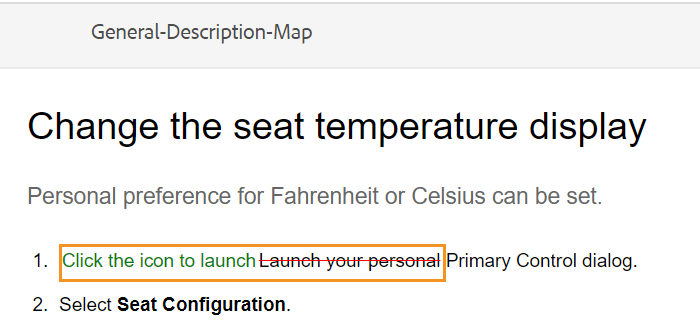
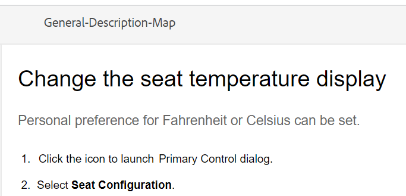
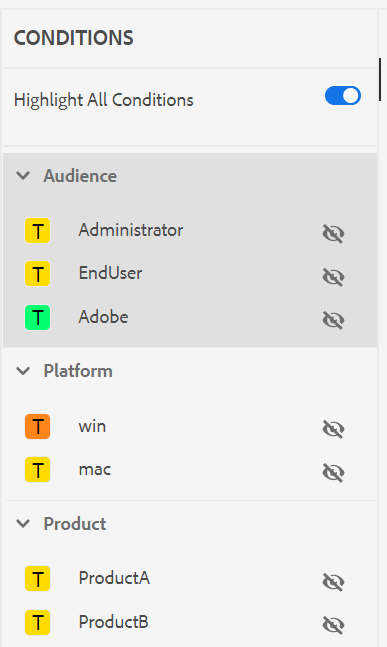

# 查看主题 {#id2056B0W0FBI}

如果您是审阅人，则会收到一封包含审阅主题链接的审阅请求电子邮件。 使用此链接，您可以访问审阅页面，可在其中添加有关共享主题的反馈。

执行以下步骤以查看主题：

1. 选择审核请求电子邮件中提供的直接链接。

   将在浏览器中打开主题或映射链接。

   >[!NOTE]
   >
   > 您还可以从Adobe Experience Manager用户界面的收件箱通知区域访问主题查看链接。

1. 根据主题审阅的启动方式，您可以查看以下两个屏幕中的任何一个：

   >[!NOTE]
   >
   > 如果您是在以下位置创建审阅的，则UI可能会不同：
   >
   > - Adobe Experience Manager Guides as a Cloud Service 2022年11月版或更早版本
   > - Adobe Experience Manager Guides版本4.1或更低版本

   使用DITA映射启动审阅工作流时，将显示以下屏幕：

   {align="left"}

   此屏幕上提供以下选项：

   - **A**：审核任务的名称。
   - **B**：选择“主题视图”图标以显示或隐藏主题面板。

   - **C**：您可以在搜索栏中输入标题或文件路径的部分文本来搜索所需主题。

     选择搜索栏附近的以选择查看所有主题或查看包含注释的主题。 默认情况下，可以查看审阅任务中存在的所有主题。

   - **D**：通过从此处选择所需的筛选器选项，可以筛选由&#x200B;***F***&#x200B;突出显示的数字。 您可以按注释的类型、状态、审阅者或版本来筛选注释。 例如，如果您要查看在每个审核主题中发表了多少删除线注释，请选择过滤器图标，然后选择&#x200B;**审核类型** \> **删除**。

     >[!NOTE]
     >
     > 应用过滤器时，注释面板中仅显示与所选过滤器匹配的注释。 过滤的评论数显示在主题面板的左侧。

   - **E**：分配给当前审阅人的审阅主题以黑色显示，可以选择。 当查看者选择主题链接时，该主题将出现在屏幕顶部。
   - **F**：无法查看的主题灰显。 该主题以只读模式显示，不允许在此类主题中添加任何审阅注释。

   - **G**：收到有关某个主题的评论数。 此数字会根据您应用的过滤器而发生更改。

   映射中的所有主题都显示为单个复合文档。 允许查看者查看的主题正常显示。 不允许审阅的主题不显示。

   {align="left"}

   在上面的屏幕截图中，将共享“常规”描述主题以供当前审阅者审阅，该主题正常显示。 但是，下一个主题“外部测试版的历史记录”内容不会共享以供审阅，并且会以只读模式显示。 目录中也突出显示了当前关注的专题。

   选择并共享一个或多个主题以进行审阅时，将显示以下屏幕：

   {align="left"}

   >[!NOTE]
   >
   > 如果有多个主题，它们会在文档视图中显示为一个复合文档。 上面的屏幕截图突出显示了在单个视图中一个接着另一个呈现的两个不同主题。

1. 选择工具栏右上角的&#x200B;**注释**&#x200B;图标，打开“注释”面板。

   通过从工具栏中选择适当的评论类型来提供评论并按Enter键提交您的评论。
评论框支持多行条目，并允许用户根据需要展开以提供详细反馈。 您可以在编写评论时使用&#x200B;**Shift** + **Enter**&#x200B;转到下一行。

   >[!NOTE]
   >
   > “注释”面板仅显示有关当前主题的注释。 将焦点移动到其他主题时，将显示针对该主题给出的注释。

1. 完成审阅主题后，选择&#x200B;**关闭**&#x200B;按钮。 选择&#x200B;**关闭**&#x200B;按钮时，您将被重定向到访问评论主题的页面。

## 查看屏幕上可用的其他功能

**文档视图和主题视图** — 默认情况下，如果共享多个主题以供审阅，则会向审阅人显示主题的复合文档视图。 在DITA映射审阅中，映射中的所有主题都以单个文档的形式呈现，类似于书籍视图。 如果需要，您还可以选择特定主题，然后审阅屏幕上只显示该主题。

当您查看单个主题时，您会获得一个附加选项，用于切换回文档视图。 在以下屏幕截图中，将打开映射文件中的特定主题进行审阅。 突出显示的选项 — **显示文档视图**&#x200B;允许用户切换回映射文件的文档视图。

>[!NOTE]
>
> 宽度大于1600像素的任何屏幕分辨率都与默认面板宽度（左和右）兼容，从而确保不会出现水平滚动条并且内容在文档视图中保持正确对齐。 此外，您始终可以调整屏幕大小以在“审阅”UI中保持适当的文档视图。

{align="left"}

**使用不同类型的注释工具** — 您可以通过突出显示文本、突出显示文本、插入文本或添加注释注释来添加内联注释。 “注释”工具栏中提供的不同类型的注释工具如下所述：

{width="350" align="left"}

- **高亮显示** \(\)：若要添加高亮显示评论，请选择文本并选择“高亮显示”图标。 或者，您可以先选择“高亮”图标，然后选择所需的文本。

  {width="650" align="left"}

  “注释”面板中会显示一个弹出窗口，您可以在此处为突出显示的内容添加注释。

- **删除线** \(\)：如果要建议删除内容，可以通过选择内容，然后选择“删除线”图标来执行此操作。 或者，您可以先选择所需的文本，然后选择Delete键。

  “注释”面板中会显示一个弹出窗口，您可以在此处为已删除的内容添加注释。

- **插入文本** \(\)：如果要插入文本，请选择“插入文本”图标，并将光标置于要插入文本的位置，然后键入信息。 或者，将光标放在要插入文本的位置并开始键入。 添加的信息以绿色字体显示。

- **添加评论**\(\)：如果要添加注释类型的便笺，请选择“添加评论”图标并在弹出窗口中输入评论。

**上下文工具栏**

您还可以使用上下文工具栏快速高亮显示或删除文本。 执行以下步骤以使用上下文工具栏进行评论：

1. 选择要加亮或删除的文本。 此时会出现上下文工具栏。

   {width="550" align="left"}

1. 选择&#x200B;**突出显示**&#x200B;或&#x200B;**删除线**&#x200B;图标。
1. 可以在注释面板中为高亮或删除线操作添加注释。

**使用“注释”面板进行审阅** — “注释”面板显示有关当前主题的注释列表。 如果将主题发送给多个审阅人，则此面板还会列出来自其他审阅人的注释。 评论面板中的每个评论都链接到当前主题中的相应文本。 它有助于您识别注释的文本。 每个注释都显示已添加注释的审阅人的姓名以及时间戳。

注释按文档中注释文本的顺序显示。 例如，在第一句上有高亮文本注释，在第一段中的第二句上插入文本注释，然后高亮文本注释显示在插入的文本注释之前。

使用“注释”面板可以执行的任务如下所述：

- 选择注释会突出显示并显示相应注释在文档中的位置。
- 您可以向评论添加回复。
- 您可以在“注释”面板中选择注释文本，然后从“选项”菜单中选择&#x200B;**编辑**，以编辑自己的注释。
- 您可以在“注释”面板中选择注释，然后从“选项”菜单中选择“**删除**”选项来删除自己的注释。

  {width="300" align="left"}

  >[!NOTE]
  >
  > 仅当您将鼠标悬停在您自己的注释上时，才会显示“选项”菜单。 对于其他审阅人的注释，不会显示它。

- 所有参与的用户都可以对其他用户提交的注释做出响应。 在评论上，选择&#x200B;**回复**，然后按Enter提交回复。 回复框为多行且可扩展，可帮助用户为评论提供详细的回复。 您可以在编写回复时使用&#x200B;**Shift** + **Enter**&#x200B;转到下一行。

**预览模式**

- 在预览模式下打开主题会显示应用所有更改后作者查看主题时的显示方式。 例如，所有插入的文本均显示为普通文本，并且所有删除的\(deleted\)文本都将从内容中删除。

- 以下屏幕截图显示了&#x200B;*审阅*&#x200B;模式下的内容：

{width="550" align="left"}

以下屏幕截图显示了&#x200B;*预览*&#x200B;模式下的内容：

{width="550" align="left"}

**向评论添加附件** -   如果想通过提供其他文件中提供的附加信息来补充您的评论，您可以将其与您的评论一起附加。 作为审阅者，您可以轻松地将本地系统中的一个或多个文件添加到您的注释中。 可以将文件添加到所有受支持的注释形式 — 高亮、删除线、插入文本或注释。

插入任何注释时，将出现注释弹出窗口。 在弹出窗口中提供其他注释或信息后，可通过按Enter键提交注释。 添加注释后，您可以选择将附件添加到该注释。

{align="left"}

在上述屏幕快照中，文档包含高亮注释的弹出窗口，并且注释也添加到“注释”面板中。 文件附件图标与注释一起在两个位置都可用。

执行以下步骤以将附件添加到注释：

1. 选择要添加附件的评论上的&#x200B;*添加附件*&#x200B;图标。

   此时将显示文件“打开”对话框。

1. 选择一个或多个要附加的文件。

   所选文件与注释一起显示在“注释”面板中。

   在“注释”面板中，可以查看文件名和文件大小。 您还可以选择与文件名关联的删除图标来删除文件。

1. 选择&#x200B;**提交**。

   附件将上传并添加到注释中。

**有关使用附件的其他注释：**

- 默认情况下，仅显示两个附加了注释的文件。 如果有更多文件，则右侧的&#x200B;**查看附件**&#x200B;按钮将显示与评论关联的所有附件\（两个以上\）的数量。 您可以选择编号以查看所有附件。 例如，如果您有四个带有注释的附件，则会在按钮上查看+2。

{width="550" align="left"}

- 将鼠标指针悬停在附件上时，可以下载或删除附件。 仅当当前查看者已添加该注释时，才可移除附件，如下面的屏幕快照所示：

{width="550" align="left"}

其他审阅人或作者将仅获得下载附件选项。

{width="550" align="left"}

- 您可以从&#x200B;**查看附件**&#x200B;对话框下载与评论关联的所有附件。 选择附件并在评论级别选择&#x200B;**下载**&#x200B;图标。

- 您还可以从&#x200B;**查看附件**&#x200B;对话框删除与评论关联的附件。 选择附件并选择&#x200B;**删除**&#x200B;图标。

{width="550" align="left"}

**条件面板** -   如果您的主题包含条件内容，则会在右侧查看&#x200B;**条件** \(\)图标。 选择&#x200B;**条件**&#x200B;图标会打开“条件”面板，该面板允许您根据主题中的可用条件突出显示内容。

：   默认情况下，**高亮显示所有条件**&#x200B;选项已启用，所有条件都已选中，显示整个内容，并且条件化内容在审核和预览模式下均以高亮显示显示。

：   您可以禁用&#x200B;**高亮显示所有条件**&#x200B;选项，并将主题中存在的所有内容作为不带任何高亮显示的普通文本查看。

{width="350" align="left"}

您可以选择隐藏或显示特定条件。

- 如果隐藏条件，则审阅模式中不会突出显示具有该条件的内容。
- 如果显示条件条件化内容，则审阅模式会高亮显示条件。 例如，在以下屏幕截图中，仅内容使用两个条件 — `win`和`mac`突出显示。

{width="650" align="left"}

在预览模式下，会显示非条件化内容和使用两个显示条件（`win`和`mac`）的条件化内容。 不会显示隐藏条件的其余条件化内容。

**实时审核** -   “评论”面板会通过评论以及作者对评论采取的反馈或操作实时更新。

- 多个审阅人将能够在同一文档上同时留下注释或回复注释。 通过将鼠标悬停在屏幕右上角的用户图标上，可以找到当前正在查看文档的用户。

- 如果某个主题是多个审阅任务的一部分，则在一个任务中所做的注释不会显示在另一个任务中。

- 选择过时的注释图标\(\)将显示文档最新版本与注释版本之间的差异。 版本号\（正在比较的版本\）显示在文档顶部。

  {align="left"}

  >[!NOTE]
  >
  > 将鼠标悬停在“过时的评论”图标上时，将显示添加评论的主题版本号。 例如，如果在1.0版上提供了注释，则会显示相同的注释。

- 选择过时的注释会在左侧面板中打开该注释的版本。 左侧面板中显示的是以前的版本，右侧面板中显示的是当前的版本。 过期版本上的所有注释都会在左侧导入。 您可以将以前的版本与当前版本进行比较。

**筛选注释** -   您可以筛选文档中的注释以根据需要查看特定注释。 要筛选注释，请选择“注释”面板中“搜索注释”文本框右侧的菜单中显示的&#x200B;**筛选器**&#x200B;图标\(\)。

从&#x200B;**筛选器类型**&#x200B;对话框中选择以下一个或多个筛选选项，然后选择&#x200B;**应用**。

- **审阅类型** — 根据注释类型进行筛选 — Highlight、Deletion、Insertion或Comment。
- **审阅状态** — 根据评论的状态（如“已接受”、“已拒绝”或“无”）进行筛选。
- **审阅人** — 根据审阅人的姓名进行筛选。

- **版本** — 根据收到的有关特定主题版本的注释进行筛选。

  使用过滤器时，右侧面板上的注释将根据所选内容进行过滤，左侧面板中的注释数量将相应地更新。

若要移除筛选器并查看所有注释，请从&#x200B;**筛选器类型**&#x200B;对话框中取消选择所有筛选器，然后选择&#x200B;**应用**。

**父主题：**&#x200B;[&#x200B;要审阅的简介](review.md)
