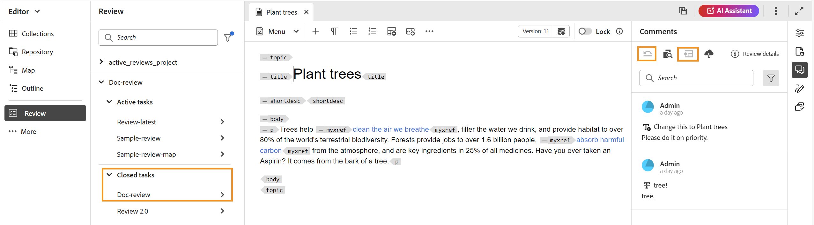

# 查看已完成的审核任务

对于您是作者（或发起人）的项目，您可以完成审阅任务。 审核任务完成后，您和所有审核者都可以在只读模式下访问它。

## 作为审阅者

作为审阅人，您可以在注释面板中查看指示器，以显示审阅已结束。 注释工具栏不显示，因此您无法高亮显示、删除线、插入文本或添加注释。 您可以读取注释，但无法编辑或删除任何注释。 您也无法向评论添加回复。 您无法查看上下文工具栏（用于高亮显示或删除任何文本）。 已完成的审阅任务中也不会显示过时的注释图标。

但是，您可以搜索或过滤任何注释。 您还可以选择显示或隐藏条件，并相应地显示条件化内容。 您可以下载任何附件，但不能上载或删除注释的任何附件。

{align="left"}

## 作为作者

您可以从&#x200B;**已关闭任务**&#x200B;部分在项目级别的&#x200B;**审阅**&#x200B;面板中查看已完成的审阅任务，如屏幕快照中所示。 您可以根据项目搜索或筛选审阅任务。 例如，您可以在&#x200B;**筛选器**&#x200B;对话框中选择特定项目，并将它们显示在活动审阅面板中。 您可以使用我发起的&#x200B;**任务**&#x200B;和&#x200B;**仅显示活动任务**&#x200B;选项进一步筛选结果。

{align="left"}

对于已关闭的审阅任务，您可以读取注释，但不能接受或拒绝注释。 不能编辑或删除任何注释。 您也无法为该评论添加任何回复。 对于已完成的审阅任务，不会显示已过期的注释图标和将注释导入到作者视图图标。 审阅任务完成后，还原主题图标和导入图标将被禁用，如屏幕快照中所示。

您还可以搜索或过滤“审阅”面板中存在的任何注释。 您可以下载任何附件，但不能上载或删除注释的任何附件。

{align="left"}

因此，无论是作为审阅人还是作者，您都可以查看审阅的内容以及注释，但不能在已完成的审阅任务中进行任何更改。
