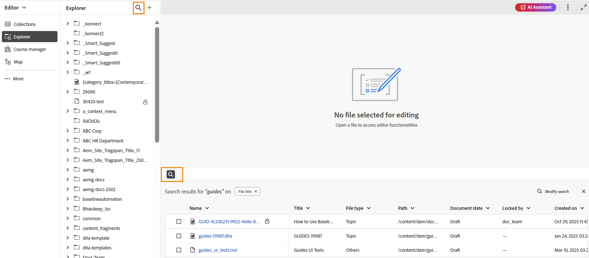
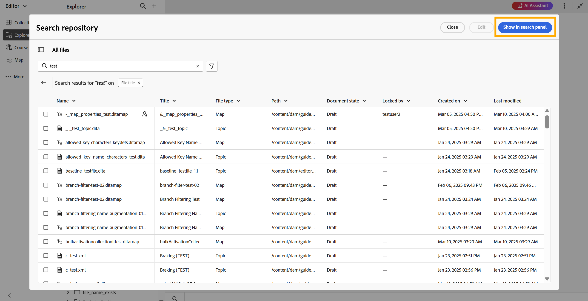

# 搜索面板

>[!INFO]
>
>本主题适用于新编辑器和旧编辑器。 虽然核心功能保持一致，但内容中使用适用的选项卡和标注，指出用户界面、术语和交互中的差异。

编辑器中的“搜索”面板提供了对文件子集的快速访问，从而提高工作效率，在编辑内容时，该子集是根据搜索词或应用的过滤器显示的。 它只需拖放到主题或映射中，即可帮助您轻松打开一个或多个搜索的文件或在现有文件中使用它们。 您可以在编辑器底部找到&#x200B;**搜索面板**。

可通过以下方式访问“搜索”面板：

- **编辑器界面**：从&#x200B;**资源管理器面板**&#x200B;中选择&#x200B;**搜索图标**，或使用&#x200B;**内容编辑区域**&#x200B;左下角的&#x200B;**搜索图标**。 有关详细信息，请在“资源管理器”面板](#search-from-the-explorer-panel)中查看[搜索。

  

- **主页**：从主页上的存储库界面导航时，使用&#x200B;**在搜索面板中显示**&#x200B;选项。 有关详细信息视图，[从存储库](#search-from-the-repository-interface-on-the-home-page)中搜索。

  

## 主要优势

- 集中查看所有搜索结果以方便参考。
- 使用拖放功能将引用直接插入当前主题或映射中。
- 灵活的选项，用于修改或优化搜索而不离开编辑器。

## 从资源管理器面板中搜索

在编辑器界面中工作时，可筛选文件集以查看所需相关文件的子集。 执行以下步骤以从Explorer搜索文件：

1. 从&#x200B;**资源管理器面板**&#x200B;的右上角选择&#x200B;**搜索**&#x200B;图标，或选择&#x200B;**内容编辑区域**&#x200B;左下角的&#x200B;**搜索**&#x200B;图标。 这将打开&#x200B;**搜索存储库**&#x200B;对话框，该对话框提供与主页上的存储库界面相同的搜索和筛选体验。

   >[!NOTE]
   >
   >如果当前会话中已存在某些搜索结果，则在资源管理器中选择&#x200B;**搜索图标**&#x200B;或内容编辑区域左下角的图标将打开显示这些先前结果的面板。 要更新或优化搜索，请选择&#x200B;**修改搜索**。

   

2. 执行搜索并根据需要应用过滤器。 有关搜索和筛选选项的详细说明，请查看[搜索和筛选体验](./home-page-repository-view.md#search-and-filter-experience)。

3. 搜索完成后，选择&#x200B;**在搜索面板中显示**。 您最近的搜索随后将显示在编辑器底部的“搜索”面板中。

   

4. 要更新搜索结果，请在“搜索”面板中选择&#x200B;**修改搜索**&#x200B;选项并更新条件以获取新结果。

   

搜索结果显示在“搜索”面板中后，您可以通过直接从该面板打开并编辑一个或多个文件，或者将选定的文件拖放到现有主题或映射中来添加引用来对其进行处理。

>[!BEGINTABS]

>[!TAB 新编辑器]

>[!TAB 旧编辑器]

>[!ENDTABS]

## 从主页的“存储库”界面中搜索

在主页的“存储库”界面中执行搜索并应用筛选器时，选择&#x200B;**在搜索面板中显示**&#x200B;会将您重定向到编辑器界面。 您的所有搜索结果都将镜像到编辑器界面底部的搜索面板中。

从“搜索”面板中，您可以&#x200B;**将**&#x200B;文件拖放到当前主题中以无缝附加引用，或同时编辑多个文件。 此外，您还可以使用“搜索”面板中提供的&#x200B;**修改搜索**&#x200B;选项来优化搜索结果。

