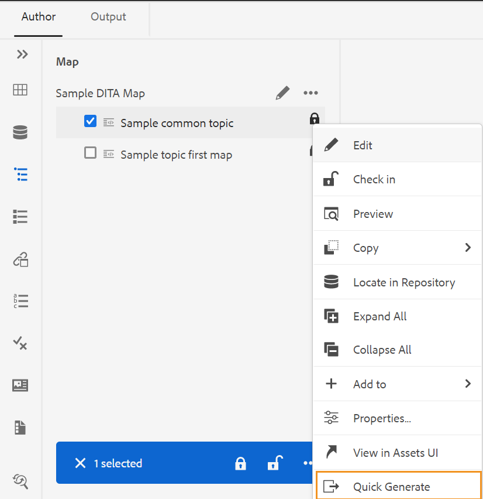
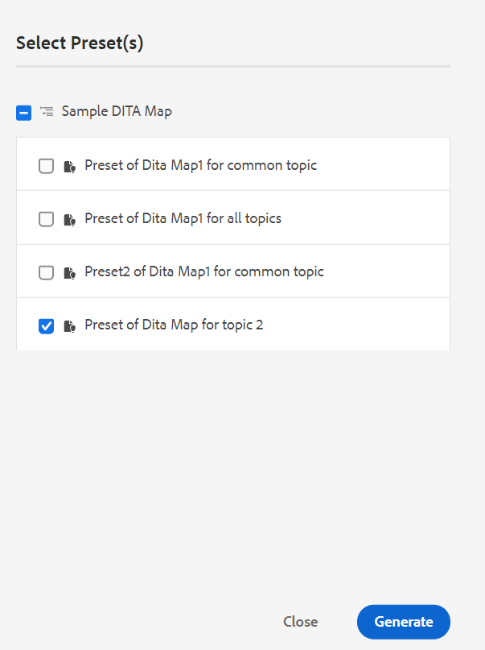
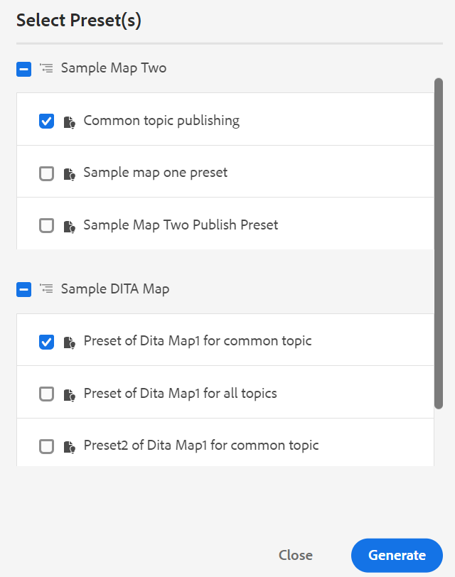
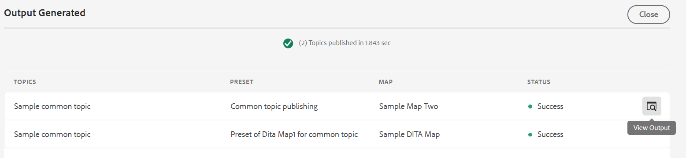
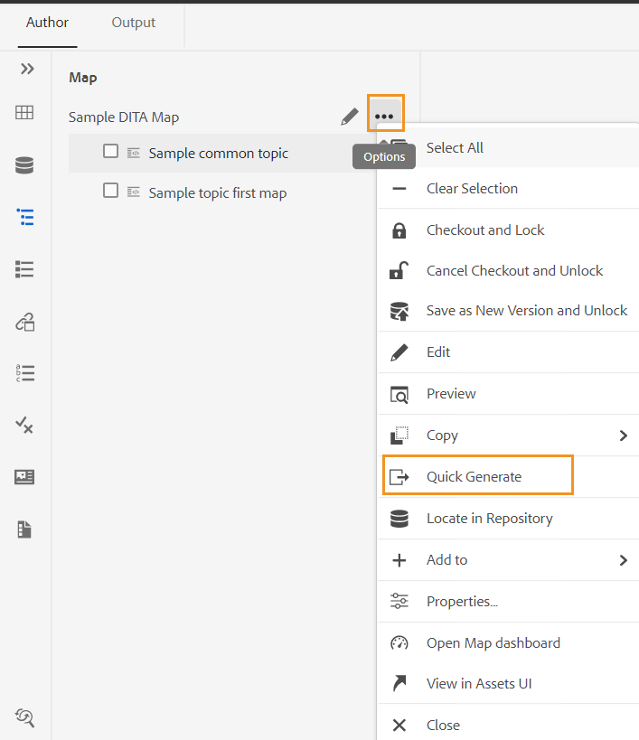
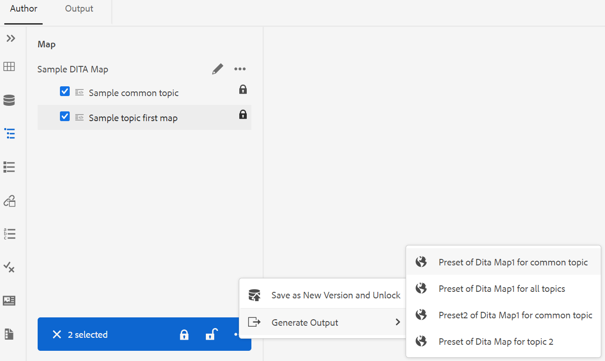

# 从“存储库”面板或“映射视图”面板生成输出 {#id218CL6010AE}

>[!NOTE]
>
> 从版本4.0到2502开始，已弃用之前在Adobe Experience Manager Guides中提供的快速生成面板。 您不能访问“快速生成”面板以从“存储库”面板或“地图”视图面板生成输出。

也可以使用为DITA映射创建的输出预设从“存储库”面板或“映射视图”面板生成输出。

- 使用“存储库”面板或“映射视图”面板中的&#x200B;**快速生成**&#x200B;功能生成所选单个主题或整个DITA映射的输出。

  >[!NOTE]
  >
  > 您还可以从“收藏夹”面板或“搜索”面板访问&#x200B;**快速生成**&#x200B;功能。

- 使用“映射视图”面板中的&#x200B;**生成输出**&#x200B;功能生成所选多个主题的输出。

## 发布在一个或多个DITA映射中使用的主题

执行以下步骤为DITA映射中的一个或多个主题生成输出：

1. 在&#x200B;**作者**&#x200B;选项卡中，选择要发布的DITA映射中的主题。

1. 从所选主题的“选项”菜单中选择“快速生成”**&#x200B;**。
   {width="650"}

1. 要发布单个DITA映射中使用的主题，请选择要发布的映射的输出预设，然后单击&#x200B;**生成**。
   {width="350"}

1. 您将看到输出生成过程的状态。 要查看输出，请将鼠标指针悬停在主题上，然后单击“查看输出”。

1. 如果您有一个在多个主题中使用的公共主题，请选择各种DITA映射以及要用于发布的输出预设，然后单击&#x200B;**生成。**

   {width="350"}

1. 您将看到输出生成过程的状态。

   - **主题**：列出正在为其生成输出的选定主题。
   - **预设**：显示包含所选主题的输出预设。
   - **映射**：列出包含选定主题的DITA映射。
   - **状态**：显示每个主题的发布状态。
要查看输出，请将鼠标指针悬停在主题上，然后单击“查看输出”。
     

## 从Web编辑器生成DITA映射的输出

执行以下步骤可生成整个DITA映射的输出：

1. 在&#x200B;**作者**&#x200B;选项卡中，选择要发布的DITA映射。

1. 从DITA映射的“选项”菜单中选择“快速生成”**&#x200B;**。

   {width="650"}

1. 选择要用于发布的DITA映射的输出预设，然后单击&#x200B;**生成。**

1. 您将看到输出生成过程的状态。 要查看输出，请将鼠标指针悬停在主题上，然后单击“查看输出”。

## 生成多个主题的输出

从“映射视图”面板执行以下步骤来为DITA映射中的多个主题生成输出：

1. 在&#x200B;**作者**&#x200B;选项卡中，选择要发布的主题。

1. 从底部的“选项”菜单中选择&#x200B;**生成输出**。

1. 选择要用于发布的DITA映射的输出预设。

   >[!NOTE]
   >
   > 您将只看到包含所有选定主题的当前DITA映射的输出预设。

   {width="650"}

1. 您将看到输出生成过程的状态。要查看输出，请将鼠标指针悬停在主题上，然后单击“查看输出”。

**父主题：**&#x200B;[&#x200B;从Web编辑器中基于文章的发布](web-editor-article-publishing.md)
