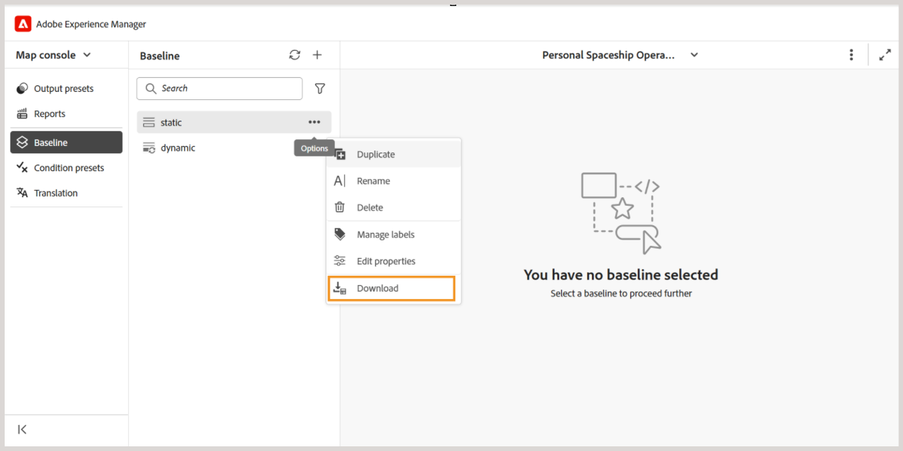

# Experience Manager Guides中的新基线(Beta)

>[!NOTE]
>
> 本文适用于新基线，它目前作为&#x200B;*Beta*&#x200B;功能提供，可提高Experience Manager Guides 2026.03.0版本中提供的性能和稳定性。 要在设置中启用新的基线功能，请联系客户成功团队。

新的基线功能解决了与大型复杂地图相关的关键可靠性和性能问题。 它附带重新设计的基线体系结构，可提供更快、更稳定且更一致的基线体验。

新的基线模型通过解决以下常见棘手问题而增强了基线处理能力：

- 使用大型基线时加载缓慢，响应能力差
- 部分更新或验证失败导致基线状态不一致
- 在管理大量基线内容时可视性和控制能力有限
- 基线创建、更新或重新构建期间的性能瓶颈

以下部分介绍了新的基线模型，包括引入的增强功能、迁移前需要考虑的关键行为更改以及迁移和使用新基线的说明：

- [新基线中引入的主要增强功能](#key-enhancements-introduced-in-the-new-baseline)
- [迁移到新基线前需了解的行为更改](#behavior-changes-to-know-before-migrating-to-the-new-baseline)
- [迁移到新基线](#migrate-to-new-baseline)
- [使用新基线](#use-the-new-baseline)

## 新基线中引入的主要增强功能

新的基线引入了一些重大改进，使基线管理更快、更易于扩展，而又不会改变您的工作方式。 考虑移动到新基线：

- **改进的性能和可扩展性：**&#x200B;已优化基线数据模型和渲染行为，以使用大型基线进行高效扩展，并使用增量加载和简化的数据结构来改进响应能力。
- **更强的UI和后端一致性：**&#x200B;对基线所做的任何更改（如版本或依赖项更新）现在仅在成功进行后端验证后才会反映在UI中，从而阻止创建无效的基线。
- **筛选、排序和导航：**&#x200B;基线支持跨多个属性的全面筛选，包括跨整个基线的文档状态、标签、文件类型、引用类型和基于GUID的搜索。 大型基线支持分页，并且可以选择包含没有标签的文件。
- **明确了解依赖项影响：**&#x200B;在应用版本更改之前，依赖项影响（针对添加或删除的依赖项）显示为预览，使您能够在应用更改之前查看更改。
- **更灵活的标签管理：**&#x200B;可以在基线内的版本之间移动标签，从而在跨不同主题版本管理标签时提供了更大的灵活性。
- **确定性编辑和保存行为：**&#x200B;基线编辑支持行级更新，仅在版本更新期间加载资源密集型数据（如版本树和依赖关系差异），并在单一步骤中确定性地完成保存操作 — 减少意外的保存失败和部分更新。
- **更可靠的基线创建：**&#x200B;基线是使用存储的参考数据创建的，而不是使用运行时分析创建的，预先验证所需的版本信息以防止基线不完整或无效。
- **API和自动化支持：**&#x200B;通过REST API和Java SDK完全支持新的基线模型，从而实现与外部工作流的自动化和集成。

## 迁移到新基线前需了解的行为更改

在迁移到新基线模型之前，请查看以下行为更改。 这些更改会影响基线的创建、更新和管理方式，并且可能影响现有的工作流。

| 区域 | 更改（描述） |
|------|-------------|
| **引用分辨率** | 直接映射引用被分类为&#x200B;**DIRECT**。 跳过了无效的引用，继续排除来自`reltable`的引用。 |
| **自动挑选** | 在解决直接引用之前会立即评估版本选择，以确保准确的版本分辨率。 |
| **基线创建规则** | 版本&#x200B;**1.0**&#x200B;是必需的。 缺少版本或版本不明确的基线在迁移后可能会以不同的方式解析。 |
| **迁移处理** | 跳过无效的引用。 **DIRECT**&#x200B;引用优先，未固定的引用将移动到最新版本，并且从版本&#x200B;**5.0**&#x200B;开始添加其他元数据。 |
| **基线数据模型** | 新的基于图形的基线模型删除了可变字段，无法向后兼容以前的基线模型。 |
| **API使用情况** | 通过REST API和Java SDK支持基线操作。 原始基线对象不再公开。 |
| **版本清除** | 迁移后，版本清除仅考虑存储在新基线资料档案库中的基线。 |

## 迁移到新基线

从客户成功团队启用该功能后，您需要将现有基线迁移到新基线。

执行以下步骤，将现有基线迁移到新基线。

1. 选择顶部的Adobe Experience Manager徽标，然后选择&#x200B;**工具**。
1. 在&#x200B;**工具**&#x200B;面板中选择&#x200B;**指南**。
1. 选择&#x200B;**批量处理器**&#x200B;磁贴。

   {align="left"}

   显示&#x200B;**指南批量处理器**&#x200B;页。

1. 从页面的右上角选择&#x200B;**新建进程**&#x200B;以启动新的处理任务。

   显示&#x200B;**新进程**&#x200B;对话框。

1. 在对话框中提供以下详细信息：

   1. **功能类型**：从下拉列表中选择&#x200B;**基线**。
   1. **选择文件夹和文件**：导航并选择一个或多个要处理的文件夹和文件。
   1. **选择要忽略的文件夹**： （可选）选择要从迁移中排除的所选父文件夹中的子文件夹。

   {align="left"}

1. 选择&#x200B;**创建**。

此时会显示一个弹出窗口，其中显示&#x200B;**已成功触发资产处理**。 您可以在页面上查看处理任务的状态。

您还可以选择&#x200B;**查看日志**&#x200B;以检查和下载迁移任务的日志。

{align="left"}

日志报表提供了迁移的详细信息，包括迁移的映射数量、成功迁移的基线和相关详细信息。

{align="left"}

>[!NOTE]
>
> 在迁移期间不应进行任何基线编辑以防止失败，特别是在工作副本中。 迁移后，如果缺少版本，则可能需要重建某些基线。

## 使用新基线

新的基线模型使用与Experience Manager Guides中现有基线功能相同的工作流和用户界面。 可使用可用选项继续从映射控制台[创建和管理基线](./web-editor-baseline.md)。

>[!NOTE]
>
> 新的基线模型不支持从“映射”仪表板创建和管理基线。

本节仅介绍新基线模型引入的更改和增强功能。 除非明确提及，否则通用基线工作流将保持不变。

**新基线UI中可用的新/增强选项**

使用使用&#x200B;**新基线模型**&#x200B;创建的基线时，将应用以下更新：

- 对于使用手动和自动更新创建的基线，“选项”菜单中的&#x200B;**导出基线**&#x200B;选项已重命名为&#x200B;**下载**。

  

- 可以直接从&#x200B;**基线**&#x200B;面板打开动态基线，并使用“选项”菜单中的可用操作进行管理。

  

  也可以使用为使用新基线模型创建的动态基线引入的新选项：
   - **编辑属性**：允许您编辑现有基线的属性。
   - **重新生成**：允许您在更改时重新生成动态基线。

     {align="left"}

- **下载**&#x200B;操作支持分页下载。 与应用的过滤器匹配的所有基线内容将包含在下载中，而不仅仅是当前页面上显示的内容。
- 除了文件名或文件位置之外，还按GUID过滤文件。 **筛选无标签**&#x200B;文件的附加选项也可用。

  
- 新的基线模型支持确定性编辑，允许您以经验证的依赖关系分辨率一次更新一个引用。

  +++编辑新基线参照的步骤

  执行以下步骤来编辑基线：

   - 从&#x200B;**基线**&#x200B;面板中打开基线。

     此时将显示基线参照的表格视图。

   - 导航到要编辑的文件并将光标悬停在该文件上。
   - 选择&#x200B;**编辑**&#x200B;图标。

     {align="left"}

     将显示&#x200B;**编辑版本**&#x200B;对话框。
   - 从&#x200B;**版本**&#x200B;下拉列表中选择所需的版本（例如，从版本1.0更改为1.1）。

     {align="left"}

     将计算添加和移除的从属关系并显示为预览。 在应用更改之前查看这些更改。

     

     如果未检测到依赖关系更改，则显示空状态消息。

   - 选择&#x200B;**更新**&#x200B;以应用更改。

  基线将更新为所选版本。
  +++
