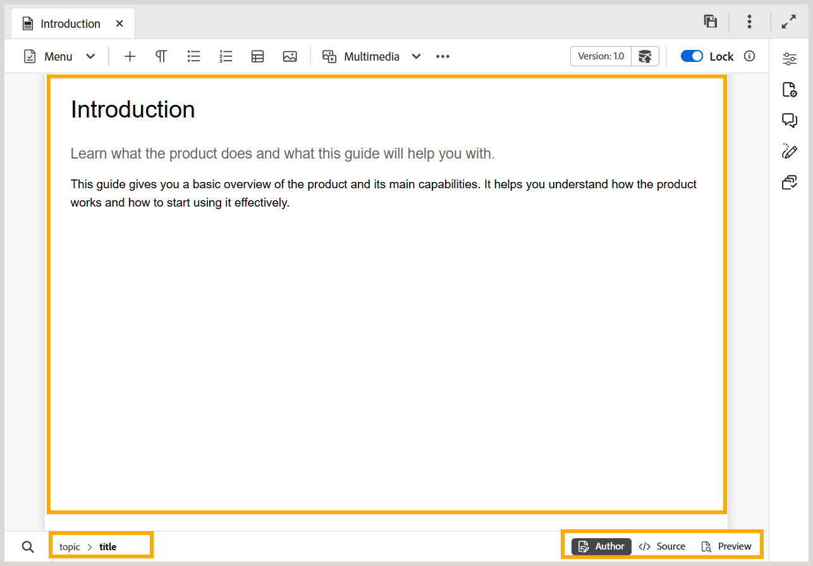

# 编辑器中的内容编辑区域

>[!INFO]
>
> 本主题适用于新编辑器和旧编辑器。 虽然核心功能保持一致，但内容中使用适用的选项卡和标注，指出用户界面、术语和交互中的差异。

内容编辑区域是显示主题或地图内容的地方。 在此区域中进行所有内容编辑。 它为您正在编辑的内容提供WYSIWYG视图。

在内容编辑区域的左下方，您有当前光标位置处的元素的痕迹导航。 在右下角，将显示可用的编辑器视图。

>[!BEGINTABS]

>[!TAB 新编辑器]

>[!TAB 旧编辑器]

>[!ENDTABS]

要了解有关内容编辑区域中主题文件可用的编辑器视图的详细信息，请查看[编辑器视图](./web-editor-views.md)。

>[!NOTE]
>
> 如果正在处理映射文件，则内容编辑区域将显示不同的选项或视图。 有关详细信息，请查看[映射编辑器功能](./map-editor-advanced-map-editor.md)。

**父主题：**&#x200B;[&#x200B;编辑器简介](web-editor.md)
