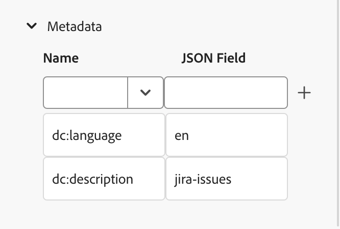

# 使用来自数据源的数据

**数据源**&#x200B;是您存储和管理组织数据的系统。 这些是您的记录系统，如JIRA、SQL数据库、PIM或PLM。 AEM Guides提供了与数据源连接并使用来自这些数据源的数据的功能。

您还可以使用文件连接器连接到JSON数据文件。 从您的计算机中上传JSON文件或从Adobe Experience Manager资源中浏览该文件。 然后，使用生成器创建内容片段或主题。

## “数据源”面板

在左侧面板中选择&#x200B;**数据源** 以查看连接的数据源。 “数据源”面板将打开，并显示所有连接的数据源。

根据您的设置，管理员可以配置数据源连接器：

 Cloud Service 

- 如果您使用的是2023年10月版或更高版本，请在《云服务安装和配置指南》中了解如何[从用户界面](../cs-install-guide/conf-data-source-connector-tools.md)配置数据源连接器。

- 如果您使用的是2023年7月或2023年9月版本，请在《云服务安装和配置指南》中了解如何[配置数据源连接器](../cs-install-guide/conf-data-source-connector.md)。

    

  内部部署软件 

- 如果您使用的是4.3.1版本或更高版本，请在On-premise Installation and Configuration Guide中了解如何[从用户界面](../cs-install-guide/conf-data-source-connector-tools.md)配置数据源连接器。

- 如果您使用的是4.3版本，请在On-premise Installation and Configuration Guide中了解如何[配置数据源连接器](../cs-install-guide/conf-data-source-connector.md)。

>[!NOTE]
>
> 您将查看管理员为其配置了连接器的数据源。

## 显示列表视图或平铺视图

您可以在列表视图或拼贴视图之间切换，以列表形式或拼贴形式查看各种数据源。

选择数据源以查看可用于所选数据源的内容片段生成器和主题生成器。

### 列表视图

{width="300" align="left"}

*已连接的数据源列表。*

### 平铺视图

{width="300" align="left"}

*以磁贴方式查看连接的数据源。*

您可以通过两种方式使用来自数据源的数据：
- 插入内容片段
- 创建主题

## 插入数据源中的内容片段

Adobe Experience Manager Guides提供了与数据源连接的功能。 您可以获取数据，将其插入主题并进行编辑。 您可以使用内容片段生成器轻松创建内容片段，并在主题中重复使用。

执行以下步骤，使用内容片段生成器创建内容片段并将其插入到主题中：

1. 在左侧面板中选择&#x200B;**数据源** 以查看连接的数据源。

1. 选择数据源以查看可用于所选数据源的内容片段生成器。

   {width="300" align="left"}

   *“数据源”面板列出了可用的内容片段生成器。*

1. 选择&#x200B;**添加**&#x200B;以添加新的内容片段生成器。 将打开&#x200B;**添加内容片段生成器**&#x200B;面板。

   {width="500" align="left"}

1. 在&#x200B;**数据查询**&#x200B;文本框中输入查询。  选择&#x200B;**复制示例查询**&#x200B;以快速复制数据查询。 您可以将示例查询复制并粘贴到&#x200B;**数据查询**&#x200B;文本框中，而不是手动创建查询。 然后，只需根据数据要求编辑查询即可。

   >[!NOTE]
   >
   > Experience Manager为各种数据源中的所有资源提供了各种示例查询。 这些映射到从中获取数据的数据源。

1. 如果您使用文件连接器，则可以从计算机上传JSON文件或从Adobe Experience Manager资源浏览JSON文件。

   >[!NOTE]
   >
   > 如果使用文件连接器，您将查看用于上载或浏览文件以代替数据查询的选项。

1. 从&#x200B;**数据映射模板**下拉列表中选择与数据源映射的模板。
所选数据源的现成模板将显示在下拉列表中。 例如，您可以查看名为“PostgreSQL”数据源的“sql-table”模板。

   >[!NOTE]
   >  
   > 如果管理员配置了自定义模板，则您也会在下拉列表中看到这些模板（基于管理员完成的模板路径配置）。
   >   
   >您还可以在模板中使用Velocity工具。 详细了解如何[使用Velocity工具](#use-velocity-tools)。

1. **Resource**&#x200B;下拉列表会显示一些连接器，如REST Client、Salsify、Akeneo和Microsoft ADO。  从下拉列表中选择任何资源，然后连接到该资源以创建内容片段或使用其生成器的主题。

   >[!NOTE]
   >
   > 在配置数据源连接器时，管理员可以为多个URL配置默认资源或添加资源。

1. 选择&#x200B;**提取**&#x200B;以从数据源提取数据，并将模板应用于从SQL查询生成的数据。

1. 您可以在预览或DITA源视图中查看数据。

   1. 预览显示插入内容时数据的显示方式。 预览以所选模板的格式显示一小部分数据。
例如：
      - 如果已选择sql-table模板，则可以使用表格格式查看SQL数据。
      - 如果您选择了jira排序列表模板，则可以查看Jira问题的排序列表。

   1. 源视图显示DITA源视图中的数据。

      {width="500" align="left"}
      *添加内容片段生成器。 在源或预览模式下查看数据。*

1. 若要保存查询的结果，请输入生成器的名称，然后选择&#x200B;**添加**。   新的内容片段生成器将添加到列表中。

   >[!NOTE]
   >
   > 新内容生成器的名称需要遵循文件命名约定。 内容片段生成器的名称中不能有空格。 此外，不能使用现有内容生成器的名称保存新的内容生成器。 出现错误。

### 内容片段生成器的选项

右键单击内容代码片段生成器以打开“选项”。 使用这些选项，您可以执行以下操作：

- **预览**：使用此选项可打开窗格，并查看输出中显示数据的一小部分。
- **插入**：使用此选项将选定的内容片段插入到在编辑器中打开进行编辑的主题中。 当数据作为代码片段插入时，您还可以在编辑器中编辑主题中的数据。

  >[!NOTE]
  > 
  > 插入选项仅在编辑主题时显示。

- **编辑**：使用此选项在内容代码片段生成器中更改并保存。
- **删除**：使用此选项可删除选定的内容片段生成器。
- **复制**：使用此选项可创建所选内容片段生成器的复制或副本。 缺省情况下，会创建带有后缀（如generator_1）的副本。

### 插入查询数据

您还可以使用工具栏中的&#x200B;**查询数据** 将数据片段插入到主题中。  您可以从下拉菜单中选择生成器，编辑查询，或更改模板并在主题中插入数据。

{width="800" align="left"}

*编辑并插入数据片段。*

## 使用主题生成器创建主题

主题生成器可帮助您创建包含来自您的源的数据的主题。 您可以快速创建主题生成器，然后使用该生成器生成主题。 每个主题都可以包含各种格式的数据，如表、列表和段落。   例如，在主题中，您可以添加一个表格，其中包含所有新产品的详细信息以及停止销售的所有产品的列表。

主题生成器可以为所有主题创建包含数据和DITA映射的主题。 您还可以在内容中`<conref>`这些主题。 这有助于使您的数据与数据源保持同步，并且您可以轻松更新它们。

### 创建主题

执行以下步骤以使用主题生成器创建主题：

1. 选择数据源以查看可用于所选数据源的内容片段生成器和主题生成器。

   {width="300" align="left"}

   *为连接的数据源添加主题生成器。*

1. 选择&#x200B;**添加** 并从下拉列表中选择&#x200B;**主题生成器**&#x200B;以添加新的主题生成器。 将打开&#x200B;**添加主题生成器**&#x200B;面板。

1. 在&#x200B;**添加主题生成器**&#x200B;面板的以下三个选项卡下的字段中输入值：

   **获取配置**

   {width="300" align="left"}

   *添加主题生成器的数据查询、数据映射模板和根节点详细信息，并在“获取配置”面板中为其指定唯一名称。*

   1. 在&#x200B;**数据查询**&#x200B;文本框中输入查询。 选择&#x200B;**复制示例查询**&#x200B;以快速复制数据查询。 您可以将示例查询复制并粘贴到&#x200B;**数据查询**&#x200B;文本框中，而不是手动创建查询。 然后，只需根据数据要求编辑查询即可。

      >[!NOTE]
      >
      >Experience Manager为各种数据源中的所有资源提供了各种示例查询。 这些映射到从中获取数据的数据源。

   1. 如果您使用文件连接器，则可以从计算机上传JSON文件或从Adobe Experience Manager资源浏览JSON文件。

      >[!NOTE]
      >
      > 如果使用文件连接器，您将查看用于上载或浏览文件以代替数据查询的选项。

   1. 从&#x200B;**数据映射模板**&#x200B;下拉列表中选择与数据源映射的模板。

      >[!NOTE]
      >
      > 如果管理员配置了自定义模板，则您也会在下拉列表中看到这些模板（基于管理员完成的模板路径配置）。 例如，您可以创建一个主题模板，其中包含排序列表、表、段落或其他DITA元素。

   1. 输入&#x200B;**根节点**。 这是您要访问数据的节点。 然后，主题生成器在根节点中定义的级别创建每个主题。 例如，您可以添加“issues”作为Jira中的根节点。 因此，如果查询返回13个问题，您将获得13个主题，每个问题一个主题。

   1. 选择&#x200B;**提取**&#x200B;以从数据源提取数据，并将模板应用于从SQL查询生成的数据。 预览以所选模板的格式显示主题的一小部分。 例如，您可以查看单个Jira问题，其中包含查询产生的所有字段。
   1. 输入主题生成器的名称。

      >[!NOTE]
      > 
      > 新主题生成器的名称需要遵循文件命名约定。 主题生成器的名称中不能有空格。 此外，不能以现有主题生成器的名称保存新的主题生成器。 出现错误。

   **输出配置**

   {width="300" align="left"}

   *在“输出配置”面板中输入输出路径和主题命名惯例详细信息。 生成DITA映射并将其命名为。*

   1. 输入要保存主题的&#x200B;**输出路径**&#x200B;详细信息。
   1. 在&#x200B;**主题命名约定**&#x200B;中，您可以输入值或具有velocity标记的变量。 新主题将遵循惯例。 例如，您可以输入`$key`以根据Jira键创建主题。
   1. 如果要创建包含所有已生成主题的映射，请启用选项&#x200B;**生成映射**。
   1. 输入新DITA映射的名称。

   >[!NOTE]
   >
   > 主题生成器在与主题相同的输出路径上生成DITA映射。

   **元数据**

   从下拉列表中选择元数据属性以传递到主题。 **Name**&#x200B;下拉列表同时列出了自定义属性和默认属性。

   例如，在以下屏幕截图中，`dc:description`、`dc:language`、`dc:title`和`docstate`是您可以为其定义值的默认属性。 您可以创建自定义属性（如author）并定义其值。

   {width="300" align="left"}

   *在元数据面板中添加元数据属性以传递到主题。*

1. 输入生成器的名称，然后选择&#x200B;**保存**&#x200B;以保存查询结果。 新的主题生成器将添加到列表中。

1. 选择&#x200B;**保存并生成**&#x200B;以保存主题生成器并从主题生成器中生成新主题。

   {width="800" align="left"}

   *从现有主题生成器生成新主题。*

   >[!NOTE]
   >
   > 如果主题已存在，则生成器会更新现有主题中的数据。

### 主题生成器的选项

右键单击主题生成器以打开&#x200B;**选项**。 使用这些选项，您可以执行以下操作：

- **生成**：此选项为所选主题生成器生成主题。 您还可以使用此选项更新现有主题。 它会连接到数据源并获取更新的数据。 在生成内容时，此选项处于禁用状态，您可以查看加载器。
  >[!NOTE]
  >
  >如果您的主题已存在，则可以覆盖主题中的数据，或将其另存为新版本。

  

  *生成主题，如果文件已存在，请将其另存为新版本或覆盖它。*
- **查看日志**：选择此选项可查看内容生成日志文件。 日志文件将在新选项卡中打开。 您可以在日志文件中查看错误、警告、信息消息和异常。 如果您已经为所选主题生成器生成了内容，则会启用此选项。

- **预览**：使用此选项可打开窗格，并查看输出中显示数据的一小部分。

- **编辑**：使用此选项更改并保存主题生成器。 在生成内容时，此选项处于禁用状态。
- **删除**：使用此选项可删除所选主题生成器。 在生成内容时，此选项处于禁用状态。
- **重复**：此选项创建所选主题生成器的重复或副本。 默认情况下将使用后缀（如`topic-sample_1`）创建副本。

## 在数据源模板中使用Velocity工具 {#use-velocity-tools}

Experience Manager模板还支持Velocity工具（版本2.0）。 这些工具可帮助您将各种功能应用于从数据源获取的数据。 了解有关[Velocity工具](https://velocity.apache.org/tools/2.0/generic.html)的使用以及可以应用的功能的详细信息。

执行以下步骤以在模板中使用Velocity工具：
1. 在编辑器中编辑Velocity模板。
1. 以`<tool.function>`格式添加工具及其函数。 例如：
   - 若要使用数学工具生成随机数，请使用`$mathTool.random`。
   - 若要使用数学工具生成数字总和，请使用`$mathTool.add(num1, num2)`。
1. 使用模板创建内容片段或主题。
1. 将模板应用于数据后，可在预览或DITA源视图中查看数据。

您可以在Velocity模板中使用以下工具，将各种功能应用到您从连接器获取的数据：
-`$alternatorTool`
- `$classTool`
- `$contextTool`
- `$conversionTool`
- `$dateTool`
- `$comparisonDateTool`
- `$displayTool`
- `$escapeTool`
- `$fieldTool`
- `$loopTool`
- `$linkTool`
- `$listTool`
- `$mathTool`
- `$numberTool`
- `$renderTool`
- `$resourceTool`
- `$sortTool`
