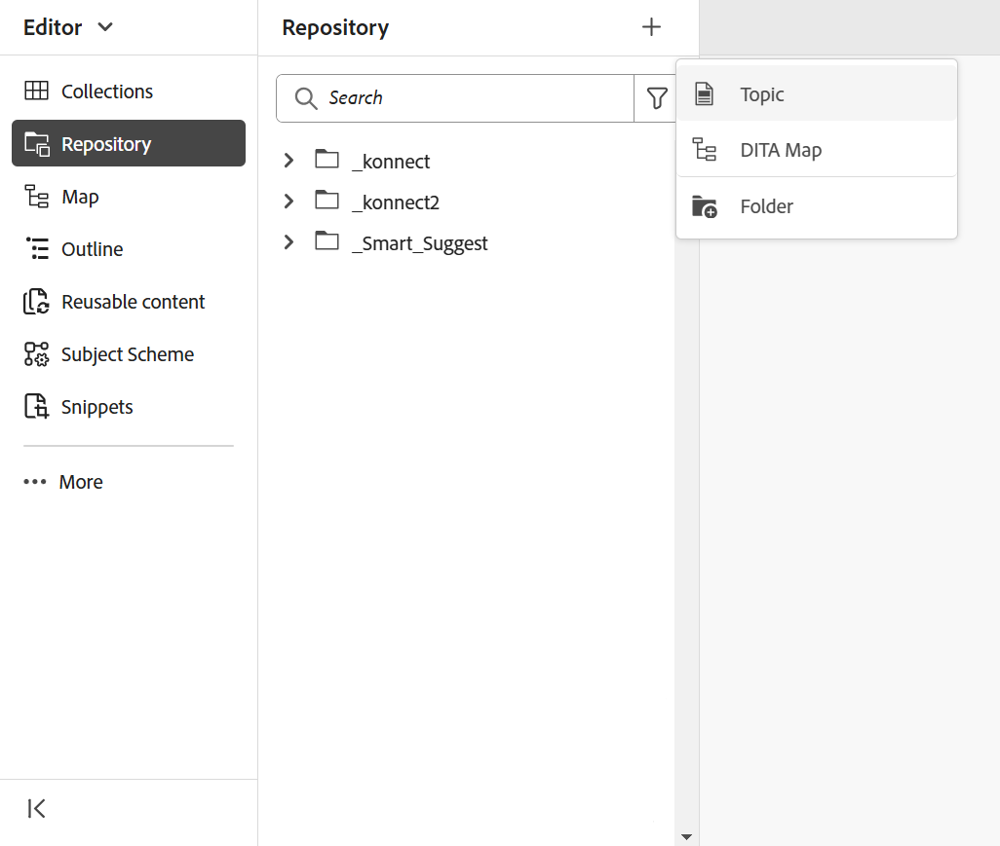
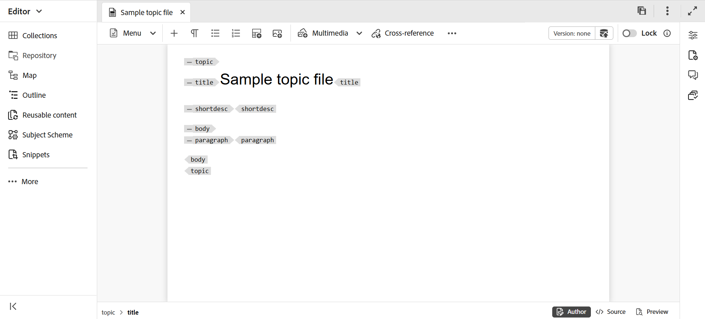

# 创建主题 {#id2056AL00O5Z}

Adobe Experience Manager Guides允许您创建以下类型的DITA主题：主题、任务、概念、引用、术语表、DITAVAL、Markdown等。 除了基于现成模板创建主题之外，您还可以定义自定义模板。 必须将这些模板添加到文件夹配置文件中，才能在模板选择Blueprint和编辑器中显示。

>[!NOTE]
>
> 全局和文件夹配置文件配置仅适用于文件夹级别的管理用户。 有关设置全局和文件夹级别配置文件的详细信息，请在“安装”中查看&#x200B;*配置创作模板*，并为您的设置配置Adobe Experience Manager Guides。

在Experience Manager Guides中创建主题的方法有两种：

- [从编辑器创建主题](#create-topics-from-the-editor)
- [从Assets UI创建主题](#create-topics-from-the-assets-ui)

## 从编辑器创建主题

执行以下步骤以从编辑器创建主题：

1. 在“存储库”面板中，选择&#x200B;**新建文件**&#x200B;图标，然后从下拉菜单中选择&#x200B;**主题**。

   {width="500" align="left"}

   您还可以从[Experience Manager Guides主页](./intro-home-page.md)以及存储库视图中文件夹的选项菜单访问此选项。

2. 显示&#x200B;**新建主题**&#x200B;对话框。

3. 在&#x200B;**新建主题**&#x200B;对话框中，提供以下详细信息：
   - 主题的标题。
   - \（可选\）*主题的文件名。 根据主题“标题”自动建议文件名。 如果管理员启用了基于UUID设置的自动文件名，则您将不会查看名称字段。
   - 主题所基于的模板。 例如，对于现成的设置，您可以从空白、概念、DITAVAL、引用、任务、主题、Markdown、术语表和故障排除模板中进行选择。 如果您的文件夹配置了文件夹配置文件，则您将仅查看在文件夹配置文件中配置的主题模板。
   - 要保存主题文件的路径。 默认情况下，存储库中当前选定文件夹的路径将显示在路径字段中。

4. 选择&#x200B;**创建**。

   {width="300" align="left"}

该主题在指定的路径中创建。 此外，该主题将在编辑器中打开以进行编辑。

{align="left"}

## 从Assets UI创建主题

执行以下步骤，从Assets UI创建主题：

1. 在Assets UI中，导航到要创建主题的位置。

1. 要创建新主题，请选择&#x200B;**创建** \> **DITA主题**。

1. 在Blueprint页面上，选择要创建的DITA文档类型，然后选择&#x200B;**下一步**。

   {align="left"}

   默认情况下，Experience Manager Guides提供最常用的DITA主题模板。 您可以根据组织要求配置更多主题模板，在“安装”中查看&#x200B;*配置创作模板*，并为您的设置配置Adobe Experience Manager Guides。

   >[!NOTE]
   >
   > 在Assets UI的列表视图中，DITA主题类型在“类型”列中显示为“主题”、“任务”、“概念”、“引用”、“Glossentry”、“Markdown”或“DITAVAL”。 DITA映射显示为“映射”。

1. 在“属性”页面上，指定文档&#x200B;**标题**。

1. \（可选\）指定文件&#x200B;**名称**。

   如果管理员已根据UUID设置配置了自动文件名，则您将不会查看用于指定文件名的选项。 基于UUID的文件名会自动指定给该文件。

   如果文件命名选项可用，则也会根据文档的&#x200B;**标题**&#x200B;自动建议该名称。 如果要手动指定文档名称，请确保&#x200B;**名称**&#x200B;不包含任何空格、撇号或大括号，且以.xml或.dita结尾。 默认情况下，Experience Manager Guides会将所有特殊字符替换为连字符。 查看最佳实践指南中的文件名部分，了解有关命名DITA文件的最佳实践。

1. 选择&#x200B;**创建**。此时将显示“创建的主题”消息。

   您可以选择在编辑器中打开主题进行编辑，或将主题文件保存在Adobe Experience Manager存储库中。

**其他信息**

1. 从Assets UI **创建** \> **DITA主题**&#x200B;或编辑器创建的每个新主题都分配了一个唯一的主题ID。 此ID的值是文件名本身。 此外，新文档将保存为DAM中主题的最新工作副本。 在保存新创建主题的修订版本之前，您不会在“版本历史记录”中查看任何版本号。 如果打开主题进行编辑，则工具栏右上角将显示版本信息：

   {width="550" align="left"}

2. 新创建的主题的版本信息显示为&#x200B;*none*。 保存新版本时，会为其分配一个版本号1.0。

3. 如果管理员已将编辑器配置为在编辑之前锁定文件，则在锁定文件之前，您将无法编辑文件。 同样，如果进行了配置，在关闭之前将要求您解锁任何锁定的文件。

4. 创建DITA主题后，继续保存对工作副本所做的更改，并在完成主题更新后创建新版本。

**父主题：**[&#x200B;创建和预览主题](create-preview-topics.md)
