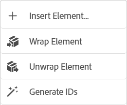
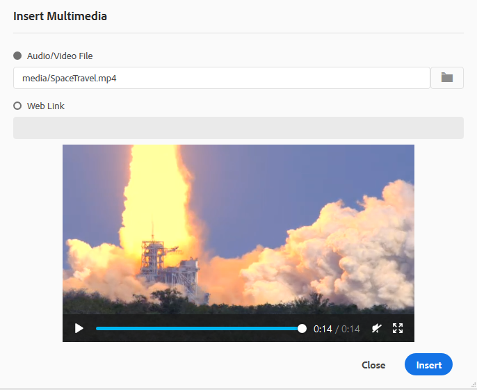
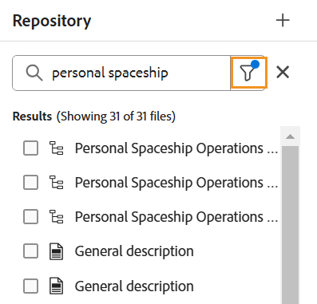
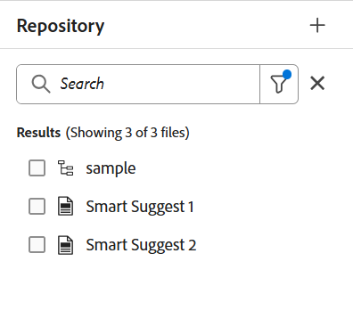
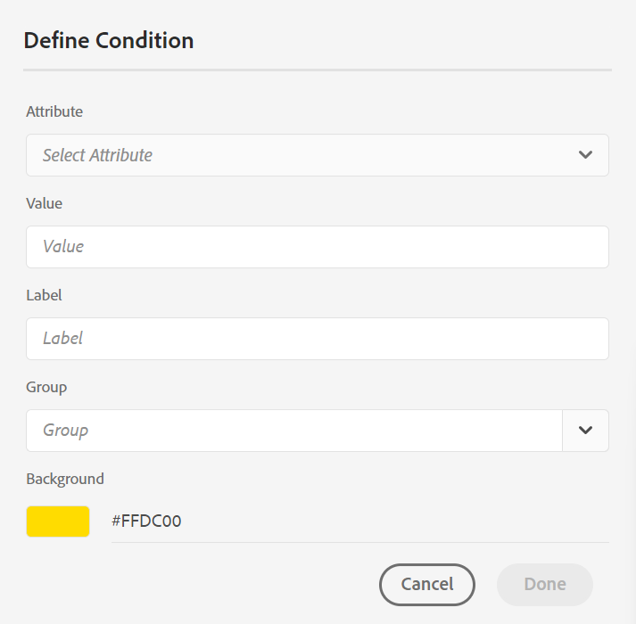

# 了解编辑器功能 {#id176NC500V5Z}

本节介绍编辑器中可用的各种功能。 我们可以将编辑器划分为以下部分或区域：

- [标题栏](#header-bar)
- [选项卡栏](#tab-bar)
- [工具栏](#toolbar)
- [左侧面板](#left-panel)
- [内容编辑区域](#content-editing-area)
- [右面板](#right-panel)

以下小节详细介绍该编辑器的各个部分。

## 标题栏

标题栏是显示Adobe Experience Manager徽标的编辑器的顶部栏(如果您将Unified Shell用作Experience Manager Guides UI，则为Unified Shell)。 当您选择徽标时，它会将您定向到Experience Manager导航页面。


使用工具栏中的&#x200B;**展开**&#x200B;图标隐藏标题栏并最大化内容区域。 要恢复标准视图，请选择&#x200B;**退出扩展视图**。


## 选项卡栏

选项卡栏位于编辑器界面的顶部，通过该栏可访问以下功能：


**选项卡**

在编辑器中将当前打开的主题显示为文件选项卡。 您可以同时打开多个主题，这些主题显示在选项卡栏中各自的选项卡中。 默认情况下，您可以在选项卡中查看文件标题。 当您将鼠标悬停在文件上时，您可以作为工具提示查看文件标题和文件路径。

>[!NOTE]
>
> 作为管理员，您还可以选择在选项卡中按文件名查看文件列表。 在[用户首选项](./intro-home-page.md#user-preferences)中选择&#x200B;**编辑器文件显示配置**&#x200B;节的&#x200B;**文件名**&#x200B;选项。

选择“文件”选项卡将打开一个上下文菜单，其中具有“另存为新版本”、“复制”、“查找位置”、“添加到”、“属性”、“拆分”、“下载为PDF”和“关闭”选项。

**全部保存**

保存在所有打开的主题中所做的更改。 如果在编辑器中打开了多个主题，请选择&#x200B;**全部保存**&#x200B;或使用&#x200B;**Ctrl**+**S**&#x200B;快捷键一次保存所有文档。 您不必单独保存每个文档。

>[!NOTE]
>
> **全部保存**&#x200B;操作不会创建主题的新版本。 要创建新版本，请使用&#x200B;**另存为新版本**&#x200B;选项。

**AI助手**

一款强大的AI驱动工具，旨在通过智能帮助和创作功能提高您的工作效率。 它将两项强大的AI功能（**创作**&#x200B;和&#x200B;**帮助**）整合到Experience Manager Guides界面中，使您能够更快、更高效地创作内容并访问Experience Manager Guides文档中的信息。

>[!NOTE]
>
>AI助手功能当前适用于Adobe Experience Manager Guides as a Cloud Service。

**展开视图**：允许您使用&#x200B;**展开**&#x200B;图标展开页面视图。 在此视图中，包含Adobe Experience Manager徽标的标题栏处于隐藏状态。 这样可最大化内容空间以供编辑。 要返回到标准视图，请使用&#x200B;**退出扩展视图**&#x200B;图标。

**更多操作**：允许您导航到&#x200B;**Assets**&#x200B;和&#x200B;**设置**。

**Assets**&#x200B;选项会根据您的设置将您转到目标：

- **Cloud Services**：如果您使用的是Cloud Services，则选择&#x200B;**Assets**&#x200B;选项会转到AEM导航页面。

- **内部部署软件**：如果您使用的是Adobe Experience Manager Guides（4.2.1及更高版本），则选择&#x200B;**Assets**&#x200B;选项会将您转到Assets UI中的当前文件路径。


**设置**&#x200B;选项仅适用于管理员和文件夹配置文件管理员，并允许配置以下设置：

>[!NOTE]
>
> 如果要更新任何默认设置，则应重新打开文档以使更改生效。

- **常规**：“常规”设置允许您配置字典以与编辑器一起使用。 此选项卡包含四个部分：**拼写检查**、**条件**、**创作**&#x200B;和&#x200B;**引用**。

  {width="650" align="left"}

   - **拼写检查**：有两个选项 — **AEM拼写检查**&#x200B;和&#x200B;**浏览器拼写检查**。 默认情况下，编辑器使用浏览器拼写检查功能，其中拼写检查使用浏览器的内置词典执行。 您可以切换到AEM拼写检查以使用Adobe Experience Manager的词典，也可以自定义该词典以添加自定义单词列表。 有关自定义AEM词典的详细信息，请在“安装和配置AEM as a Cloud Service”中查看[自定义Adobe Experience Manager Guides的默认词典](../cs-install-guide/customize-aem-custom-dictionary.md)部分。

   - **条件**

      - **在作者视图中高亮显示条件文本**：选择此项以在作者视图中高亮显示条件文本。 使用为条件定义的颜色突出显示条件内容。

      - **使用条件属性进行验证**：选择此项以允许验证为属性定义的值。 这样可防止您添加任何不正确的值。

      - **在“主题方案”面板中显示带有标题的键**：选择此项可显示主题方案中的键和标题。 如果不选择此选项，则只显示标题。 例如，此处“os”、“audience”和“other”键也会与标题一起显示。

        {width="550" align="left"}

      - **在条件面板中显示主题方案**：选择此项可在条件面板中查看主题方案。 如果取消选择此选项，则定义的条件将显示在条件面板中。

   - **创作**

      - **启用全部替换**：选择此项以查看&#x200B;**查找和替换**&#x200B;面板中的&#x200B;**全部替换**&#x200B;图标。

   - **引用**
更改引文样式。 从要在项目中使用的下拉列表中选择引用样式。 有关更多详细信息，请查看[更改引文样式](./web-editor-apply-citations.md#change-citation-style)。

   - **AI助手**
选择此项可在Experience Manager Guides中启用[AI助手](./ai-assistant.md)功能。 取消选择可禁用该功能。

**面板**：此设置控制编辑器和地图控制台的左右面板中显示的面板。 您可以切换按钮以显示或隐藏所需的面板。

{width="650" align="left"}

还可定义面板中特征的显示顺序。 要更改面板中可用功能的默认顺序，请选择虚线将功能选项卡拖放到所需位置。 功能也可以根据需要从&#x200B;**更多**&#x200B;部分移动到面板的主部分，反之亦然。 重新排序后，这些功能将以相同的顺序显示在相应的右侧面板和左侧面板中。

{width="650" align="left"}


一次最多可以显示8个面板。 对面板设置所做的任何更改都将立即应用。


>[!NOTE]
>
> 如果自定义面板已配置，则它也会出现在面板列表中。 您可以切换开关以显示或隐藏自定义面板。

- **元素列表**：作为管理员，您可以控制作者可以插入到文件中的元素列表，还可以定义元素的显示名称。 利用元素列表设置，可根据DITA规范指定元素名称以及要使用的标签而不是DITA定义的元素名称：

  {width="650" align="left"}

在上述屏幕快照中，`p`元素被赋予了Paragraph标签，`codeblock`被赋予了Code Block标签以及其他一些元素。 如果选择&#x200B;**仅使用以上元素**&#x200B;选项，则&#x200B;**插入元素**&#x200B;对话框中只会显示此列表中的有效元素\（在当前插入点\）。

在以下屏幕快照中，当前上下文中只显示前一个屏幕快照中4个已配置元素中的3个：

{width="300" align="left"}

- **属性列表**：与元素列表类似，您可以控制要在元素的属性列表中显示的属性列表及其显示名称。 在以下屏幕截图中，只有3个属性已配置为在元素的属性列表中显示：

  {width="650" align="left"}

  使用此设置，当尝试将属性添加到元素时，您只能查看列表中配置的属性列表。

  {width="300" align="left"}

- **颜色**：显示&#x200B;**条件**&#x200B;的预配置背景颜色列表。 将条件应用到主题时，用户可以选择背景颜色。 作为管理员，您还可以创建自定义背景颜色并将其添加到列表中。 若要添加新颜色，请在&#x200B;**颜色名称**&#x200B;字段中输入所需的名称，选择自定义颜色，然后选择&#x200B;**+**&#x200B;图标。 自定颜色将显示在颜色列表的末尾。

- **发布配置文件**：这包含可用于发布&#x200B;**知识库**&#x200B;输出的配置文件。 您可以为目标知识库创建新的用户档案。 例如，Salesforce或ServiceNow。

   - **创建Salesforce配置文件**

     **前提条件**

      - 为Salesforce创建连接的应用程序。 有关更多详细信息，请参阅[为API集成启用OAuth设置](https://help.salesforce.com/s/articleView?id=sf.connected_app_create_api_integration.htm&amp;type=5)。

      - 配置连接的应用程序时，请确保满足以下条件：

         - 指定回调。

           `URL: http://<server name>:<port>/bin/dxml/thirdparty/callback/salesforce`

         - 选择以下OAuth范围：
            - 完全访问（完全）
            - 选择通过API (api)管理用户数据

     配置应用程序后，Salesforce会提供&#x200B;**使用者密钥**&#x200B;和&#x200B;**使用者密钥**。 这些资源可用于创建Salesforce配置文件。


   - 要创建Salesforce配置文件，请从&#x200B;**服务器类型**&#x200B;下拉列表中选择&#x200B;**Salesforce**&#x200B;知识库。 输入配置文件名称。 在&#x200B;**站点URL**&#x200B;中，输入用于发布输出的使用者站点，然后添加由Salesforce使用者站点提供的&#x200B;**使用者密钥**&#x200B;和&#x200B;**使用者密钥**。 然后，**验证**&#x200B;和&#x200B;**保存**&#x200B;新创建的配置文件。

     在编辑器设置中{width="550" align="left"}

     >[!NOTE]
     >
     >要在Experience Manager Guides中配置Salesforce的代理，请使用AEM中的Apache HTTP组件代理配置。 了解如何[配置AEM Link Checker](https://helpx.adobe.com/experience-manager/kb/How-to-configure-proxy-for-the-AEM-Link-Checker-AEM.html)的代理。


   - **创建ServiceNow配置文件**

     **前提条件**

     配置ServiceNow服务器以上传资产。
      - 连接到&#x200B;**ServiceNow**&#x200B;服务器。
      - 导航到&#x200B;**系统属性** > **安全性**。
      - 取消选中以下选项：

        **必须设置此属性以激活用于上传的MIME类型检查（所有版本均为Eureka及更高版本）。 启用(true)或禁用(false)文件附件的mime类型验证。 上载期间将检查通过glide.attachment.extensions配置的文件扩展名是否为MIME类型。**

      - 选择&#x200B;**保存**。

     配置应用后，创建&#x200B;**ServiceNow**&#x200B;配置文件。

   - 要创建配置文件，请从&#x200B;**服务器类型**&#x200B;下拉列表中选择ServiceNow知识库。 输入配置文件&#x200B;**名称**。 在&#x200B;**ServiceNow URL**&#x200B;中，输入用于发布输出的使用者网站，然后添加由ServiceNow使用者网站提供的&#x200B;**用户名**&#x200B;和&#x200B;**密码**。 然后，**验证**&#x200B;和&#x200B;**保存**&#x200B;新创建的配置文件。

     {width="550" align="left"}

  验证后，您可以在DITA Map的输出预设中选择发布配置文件，并使用它生成到您选择的&#x200B;**Salesforce**&#x200B;或&#x200B;**ServiceNow**&#x200B;服务器的输出。

  了解有关[知识库](../user-guide/generate-output-knowledge-base.md)输出预设的更多信息。


- **验证**：此选项卡包含用于在编辑器中配置Schematron验证的选项。 您可以启用以下功能：

   - **在保存文件之前运行验证检查**：选择此项可在任何保存操作之前使用选定的架构文件运行架构验证。 您可以通过选择+图标来添加Schematron文件。 将列出选定的架构文件。

     >[!NOTE]
     >
     >选定的架构文件将在选定的文件夹配置文件中保留。

     在编辑器设置中验证{width="550" align="left"}

     这会阻止用户保存任何违反选定架构文件中定义的规则的文件。 如果未选择此选项，则在保存更改之前不会验证文件。

   - **允许所有用户在验证面板中添加架构文件**：选择此项可允许用户在编辑器的验证面板中添加任何架构文件。 这允许用户添加Schematron文件，然后针对Schematron文件验证主题。 如果未选择此选项，则编辑器&#x200B;**验证面板**&#x200B;中的用户无法使用添加模式文件&#x200B;**添加模式文件**&#x200B;按钮的选项。


- **显示属性**：与“属性”列表一样，您可以控制要在元素的属性列表中显示的属性列表。 默认情况下，四个&#x200B;**显示属性** — audience、platform、product和prop已配置为显示在元素的属性列表中。 您还可以使用顶部的&#x200B;**添加**&#x200B;图标添加显示属性。 您还可以使用&#x200B;**删除**&#x200B;图标删除任何显示属性。

  为元素定义的属性将显示在“布局”和“大纲”视图中。

  {width="550" align="left"}

- **翻译**：此选项卡包含用于创建语言组、将源标签传播到目标版本以及清理翻译项目的选项。

  {width="550" align="left"}

   - **语言组**：作为管理员，您可以创建一组语言，并将它们作为一组用于翻译内容。

     执行以下步骤以创建新语言组：

      1. 选择&#x200B;**添加**。
      1. 输入语言组名称。 每种语言都应该有一个唯一的名称。 如果名称字段为空或名称不唯一，则可以查看错误。
      1. 从下拉列表中选择语言。 您可以选择多种语言。

         键入语言的前几个字符或语言代码以筛选所需的语言。 例如，键入“en”可筛选名称或代码开头包含“en”的所有语言。

      1. 选择完成图标以将所选语言添加到组。 将显示语言。 添加三种或更多语言时，将显示&#x200B;**显示更多**&#x200B;选项。 您可以选择&#x200B;**显示更多**&#x200B;以查看该组中存在的所有语言。

         >[!TIP]
         >
         >将&#x200B;**显示更多**&#x200B;切换为&#x200B;**显示更少**&#x200B;并只查看几种语言。

      1. 将鼠标悬停在组中的语言上以编辑或删除语言组。
      1. 保存&#x200B;**设置**。

         >[!NOTE]
         >
         >作为用户，您可以查看为文件夹配置文件配置的语言组。

   - **将源版本标签传播到目标版本**：选择此选项可将源文件版本的标签传递到已翻译的文件。 默认情况下，该选项处于禁用状态。
   - **完成后的翻译项目清理**：选择此选项可将翻译项目配置为在翻译后自动禁用或删除。 默认情况下，选择&#x200B;**无**，这样项目在翻译后就会存在。

     如果要稍后使用翻译项目，可以禁用这些项目。 删除项目将永久删除该项目中存在的所有文件和文件夹。


- **元数据**：您可以控制主题的版本元数据及其值显示在&#x200B;**版本历史记录**&#x200B;对话框中。  在元数据路径中，指定要从中选取元数据的节点的位置。 您还可以将元数据的自定义名称定义为标签。 默认属性为“标题”、“文档状态”和“标记”。

  可以从资产的`/jcr:content`节点下的任何属性中选取元数据，因此您可以将属性的路径添加为元数据路径。


  如果元数据路径为空，则会显示错误。 如果将标签留空，则会选取最后一个元素作为标签。


  编辑器设置中的{width="550" align="left"}

  *为&#x200B;**版本历史记录**对话框配置元数据。*


  您还可以定义这些元数据标记的显示顺序。 要更改这些标记的默认顺序，请选择虚线将标记拖放到所需位置。
元数据标签在编辑器的**版本历史记录**&#x200B;对话框中以相同的顺序显示。

## 工具栏

在编辑器中打开主题或映射进行编辑时，将显示工具栏。 工具栏中可用的功能如下：

- [菜单下拉列表](#menu-dropdown)
- [内容插入选项](#content-insertion-options)
- [版本信息和另存为新版本按钮](#save-as-new-version)
- [锁定/解锁](#lockunlock)

>[!NOTE]
>
> 上面列出的功能仅适用于主题文件。 处理映射文件时，工具栏中会根据当前映射编辑器视图显示不同的选项。 了解[映射编辑器功能](./map-editor-advanced-map-editor.md)文档中的映射编辑器工具栏选项。

### 菜单下拉列表

菜单下拉菜单提供对编辑操作、查找和替换、版本历史记录、版本标签、合并、创建审核任务、跟踪更改和标记功能的访问权限。

这些功能的详细说明如下：

**正在编辑操作**

在编辑器中编辑主题时，访问各种编辑操作，如&#x200B;**剪切**&#x200B;或&#x200B;***Ctrl***+***X***、**复制**&#x200B;或&#x200B;***Ctrl***+***C***、**撤消**&#x200B;或&#x200B;***Ctrl***+***Z***、**重做**&#x200B;或&#x200B;***Ctrl***+***Y***&#x200B;和菜单下拉列表中存在&#x200B;**删除**。


**查找和替换**

**查找和替换**&#x200B;功能在创作和Source视图模式下可用。 启用后，“查找并替换”文本栏将显示在主题编辑区域的底部。 您可以使用快捷键&#x200B;**CTRL**+**F**&#x200B;调用查找和替换栏。

{align="left"}

使用设置图标\(\)，您可以切换&#x200B;**忽略大小写**&#x200B;和&#x200B;**仅限全字**&#x200B;搜索选项。 要执行不区分大小写的搜索，请打开（或选择）**忽略大小写**&#x200B;选项。 否则，如果要执行区分大小写的搜索，请关闭（或取消选择）**忽略大小写**&#x200B;选项。 您还可以选择搜索整个词。

搜索是即时的，这意味着当您在&#x200B;**查找**&#x200B;字段中键入搜索短语或单词时，将立即在主题中搜索和选择搜索词。 同样，要替换主题中的文本，请在相应的字段中输入搜索词及其替换词，然后选择&#x200B;**替换**&#x200B;或&#x200B;**全部替换**&#x200B;按钮。

在Source视图中，**查找和替换**&#x200B;功能对于搜索特定元素或属性非常有用。 例如，如果要替换`@product`属性的值，可以轻松地从Source视图中完成此操作。 “作者”视图不允许您根据属性或元素进行搜索。 但是，在使用&#x200B;**全部替换**&#x200B;功能时必须小心，因为它可能会覆盖XML代码。

**版本历史记录**

编辑器中的&#x200B;**版本历史记录**&#x200B;功能允许您检查DITA文件的可用版本、比较这些版本以及从编辑器本身还原到任何版本。 您可以将当前版本（也可以是工作副本）的内容和元数据与同一文件的任何先前版本进行比较。 您还可以查看比较版本的标签和注释。

>[!NOTE]
>
> 仅当对主题或映射的第一个版本进行了更改时，才会显示版本历史记录选项。

要访问版本历史记录并还原到主题的特定版本，请执行以下步骤：

1. 在编辑器中打开主题。
1. 从&#x200B;**菜单**&#x200B;下拉列表中选择&#x200B;**版本历史记录**。

   出现&#x200B;**版本历史记录**&#x200B;对话框。

   {width="550" align="left"}

   *预览不同版本主题中的更改。*

1. 在&#x200B;**比较对象**&#x200B;下拉列表中选择要比较或还原的主题版本。

   >[!NOTE]
   >
   > 如果某个版本应用了标签，则这些标签也会与版本号一起显示\（在括号中）。

1. 启用&#x200B;**查看标签和注释**&#x200B;选项以查看应用于当前版本和比较版本的标签和注释。
1. 您还可以在&#x200B;**版本历史记录**&#x200B;对话框中查看以下信息：

   **预览**&#x200B;选项卡：新添加的内容为绿色字体，已删除的内容为红色字体。

   **元数据**&#x200B;选项卡：新添加的元数据为绿色字体，已删除的元数据为红色字体。

   {width="550" align="left"}的元数据差异

   *在版本历史记录中比较不同版本的元数据。*

   >[!NOTE]
   >
   > 系统管理员可以从&#x200B;**设置**&#x200B;中的“元数据”选项卡更改要显示的元数据。 有关详细信息，请参阅[选项卡栏](#tab-bar)的&#x200B;**更多操作**&#x200B;部分。

   您还可以查看当前版本和比较版本的用户和时间详细信息。

   从下拉列表中选择版本后，**还原到所选版本**&#x200B;选项即可用。 预览窗口显示当前版本与所选版本的主题之间的差异。

1. 选择&#x200B;**还原到所选版本**，将工作副本还原为主题的所选版本。

   将显示“还原版本”对话框。

   {width="550" align="left"}

1. \（*可选*\）提供还原为早期版本的原因。 您也可以创建主题当前活动工作副本的新版本。

1. 选择&#x200B;**确认。**

   文件的工作副本将还原为所选版本。 如果选择创建当前活动工作副本的新版本，则也会创建包含所有工作更改的新版本的文件。

   在还原到早期版本时，将显示一个可视提示，指示您当前使用的版本不是最新版本。

   {align="left"}

**版本标签**

标签可帮助您确定特定主题在DDLC（文档开发生命周期）中的阶段。 例如，在处理主题时，可以将标签设置为“已批准”。 发布主题并提供给客户后，您可以为该主题分配“已发布”标签。

Experience Manager Guides允许您以自由格式文本格式指定标签或使用一组预定义标签。 自定义标签将允许系统中的任何作者根据其选择指定标签。 这提供了灵活性；但是，它会在系统中引入不一致的标签。 要解决此问题，管理员可以配置一组预定义标签。 有关配置预定义标签的详细信息，请在“安装和配置Adobe Experience Manager Guides as a Cloud Service”中查看&#x200B;*配置和自定义XML Web编辑器*。

这些标签会以下拉列表形式显示给需要指定标签的作者。 这可确保在系统中仅使用预定义、一致的标签。

您可以通过多种方法向主题应用标签 — Assets UI中的[版本历史记录](web-editor-use-label.md)面板、[基线](/help/product-guide/user-guide/generate-output-use-baseline-for-publishing.md) UI和编辑器。 编辑器中的版本标签功能为作者提供了一种快速、轻松的方法为其主题分配标签。

要从编辑器向主题添加标签，请执行以下步骤：

1. 在编辑器中打开主题。

1. 从“菜单”下拉列表中选择&#x200B;**版本标签**。

   此时将显示“版本标签管理”对话框。

   {width="650" align="left"}

   “版本标签管理”对话框分为两部分 — 左侧面板包含可用于主题的版本列表以及标签下拉列表\（或用于输入标签的文本框），右侧面板包含主题的预览。

1. 选择要应用标签的版本。

   从版本列表中选择其他版本的主题时，“预览”面板将显示当前版本与所选版本之间的更改

   >[!NOTE]
   >
   > 如果标签已应用于某个版本，则它将显示在下拉列表中的版本号旁边，以及“选择版本”列表的下方。 您可以通过选择标签旁边的\(**x**\)图标来移除现有标签。

1. 如果您的管理员定义了标签列表，则会显示一个标签下拉列表，您可以从中选择要应用的标签。 您可以从下拉列表中选择多个标签。

   否则，您会看到一个文本框，您可以在其中输入要添加到主题中的标签。

   >[!NOTE]
   >
   > 不能对主题的多个版本应用相同的标签。 如果尝试关联现有标签，则可以选择将其从现有版本中删除，并将其应用到主题的所选版本。

1. 选择&#x200B;**添加标签**。

1. 在“应用标签”确认消息中，选择&#x200B;**移动标签（如果用于其他版本）**&#x200B;选项，以将标签从现有版本移动到所选版本。 如果不选择此选项，并且有标签被分配给主题的不同版本，则它们不会移动到所选主题的版本。 在标签申请过程中会忽略此类标签。

**合并**

在多作者环境中工作时，很难跟踪其他作者在主题或地图中所做的更改。 “合并”功能不仅让您能够更好地控制变更的查看，而且还可以控制哪些变更保留在文档的最新版本中。

- **合并主题文件**

  要合并主题中的更改，请执行以下步骤：

   1. 在编辑器中打开主题。

   1. 选择&#x200B;**合并**。

      此时将显示“合并”对话框。

      {width="550" align="left"}

   1. *\（可选\）*&#x200B;您还可以浏览并从存储库中的其他位置选择新文件。

   1. 选择要与文件的当前版本进行比较的文件版本。

   1. 从“选项”中选择：

      - **跟踪选定版本中的更改**：此选项以跟踪的更改形式显示所有内容更新。 然后，您可以选择一次接受或拒绝文档中的更改，或者一次接受或拒绝全部更改。

      - **还原到所选版本**：此选项将文档的当前版本还原到所选版本。 此选项不会向您提供对接受或拒绝哪些内容的任何控制。

   1. 选择&#x200B;**完成**。

   1. 如果您选择了&#x200B;**跟踪来自所选版本**&#x200B;的更改选项，则来自所选版本的所有更改将显示在右侧面板的跟踪更改功能中。

      您可以从“跟踪的更改”面板中选择接受或拒绝所有注释，或者接受或拒绝单个注释。


- **合并映射文件**

  要合并映射文件中的更改，请执行以下步骤：

   1. 在编辑器中打开映射。

   1. 选择&#x200B;**合并**。

      将出现“合并”对话框。

      {width="550" align="left"}

   1. *\（可选\）*&#x200B;您还可以浏览并从存储库中的其他位置选择新文件。

   1. 选择要与文件的当前版本进行比较的文件版本。

   1. 从“选项”中选择：

      - **跟踪选定版本中的更改**：此选项以跟踪更改的形式显示所有内容更新。 然后，您可以选择一次接受或拒绝文档中的更改，或者一次接受或拒绝全部更改。

      - **还原到所选版本**：此选项将文档的当前版本还原到所选版本。 此选项不会向您提供对接受或拒绝哪些内容的任何控制。

   1. 选择&#x200B;**完成**。

   1. 如果您选择了&#x200B;**跟踪选定版本**&#x200B;中的更改选项，则选定版本中的所有更改将显示在“跟踪的更改”面板\（位于右侧\）中。

      您可以从“跟踪的更改”面板中选择接受或拒绝所有更改，或者接受或拒绝映射文件中的单个更改。


**创建审核任务**

您可以直接从编辑器[创建当前主题的审阅任务](./review-send-topics-for-review.md)或映射文件。 打开要为其创建审阅任务的文件，然后从“菜单”下拉列表中选择&#x200B;**创建审阅任务**&#x200B;以启动审阅创建流程。

**跟踪更改**

通过启用“跟踪更改”模式，您可以跟踪对文档所做的所有更新。 启用跟踪更改后，文档将捕获所有插入和删除。 使用删除线突出显示所有已删除的内容，并以绿色文本突出显示所有插入。 此外，您还可以在主题页面的边缘获得更改条。 再次重申，对于已删除的内容，将显示红色栏，对于添加的内容，将显示绿色栏。 如果在同一行上进行了添加和删除，则会同时显示绿色栏和红色栏。

以下屏幕截图突出显示删除和插入的内容以及更改条：

{width="650" align="left"}

跟踪文档中的更改的典型用例可以是进行同行审阅。 您可以启用跟踪更改并共享文档以供审阅，然后审阅者进行更改并启用跟踪更改。 当您收到文档时，您应该具有查看建议更新的机制，以及一种接受或拒绝更改的便捷方式。

Experience Manager Guides提供了跟踪的更改功能，该功能包含在文档中进行的更新的相关信息。 “跟踪的更改”功能提供有关已进行哪些更新、谁进行了这些更新以及何时进行这些更新的信息。 使用跟踪的更改功能，您还可以轻松地接受或拒绝文档中的建议更新。

要访问该功能，请选择右侧面板中的&#x200B;**跟踪更改**&#x200B;图标。

{width="300" align="left"}

选择跟踪的更改将选择文档中的已更改内容。 您可以通过选择“接受更改”图标来接受更改，或通过选择“拒绝更改”来拒绝更改。

如果要通过单击接受或拒绝所有更改，请选择&#x200B;**接受所有更改**&#x200B;或&#x200B;**拒绝所有更改**。

>[!NOTE]
>
> “预览”模式允许您查看文档，无论是否包含已更改内容的标记。 有关详细信息，请查看[预览](web-editor-views.md#preview-mode-id19AAGL00163)模式。

**标记**

编辑器中的&#x200B;**标记**&#x200B;功能是一个可控制DITA元素可见性的切换按钮。 启用后，它会在内容中显示结构标记，使您能够更有效地查看和管理底层DITA元素。 禁用后，编辑器将隐藏这些标记，从而提供更干净且更集中的创作环境。

以下屏幕截图显示了已启用“标记”视图的文档：

{width="650" align="left"}

下列操作可以在带有Tags的文档中执行：

- **选择元素**：选择元素的开始或结束标记以选择其内容。

- **展开或折叠标记**：选择标记中的+或 — 符号以展开或折叠标记。

- **使用上下文菜单**：上下文菜单提供剪切、复制或粘贴选定元素的选项。 您还可以在所选元素之前或之后插入元素。 其他选项允许您生成ID或打开选定元素的“属性”面板。

- **拖放元素**：选择元素的标记并将其轻松拖放到文档上。 如果放置位置是允许元素的有效位置，则元素将放置在放置的位置。


>[!NOTE]
>
> 如果用户从编辑器中启用“标记”视图，则即使跨会话，该视图也会保持启用状态。 这意味着您无需再次启用“标记”视图即可稍后访问它。 新用户会话的“标记”视图的默认值由`ui\_config.json`文件中的`tagsView`属性决定。 有关更多详细信息，请参阅安装和配置Adobe Experience Manager Guides as a Cloud Service中的[为标记视图配置默认值](../cs-install-guide/configure-default-value-tags-view.md)部分。

### 内容插入选项

**元素** - 

在当前或下一个有效位置插入有效元素。 也可以使用键盘快捷键&#x200B;***Alt***+***Enter***&#x200B;打开“元素”对话框。 例如，您正在编辑一个段落，然后在&#x200B;**元素**&#x200B;对话框中，将显示可插入段落中的元素列表。 选择要插入的元素。 您可以使用键盘滚动元素列表，然后按&#x200B;***Enter***&#x200B;插入所需的元素。

您可以查看两种类型的有效元素：

- **当前位置上的有效元素**：此列表显示可在当前光标位置本身插入的元素。

- **当前位置之外的有效元素**：列表显示可在元素层次结构中当前元素的任何父元素之后插入的元素。

例如，如果您在内联`<b>`元素中，则可以在当前位置插入诸如`<u>`、`<xref>`、`<i>`之类的元素。 相反，您可以在当前位置之外插入诸如`<table>`和`<topic>`之类的元素。

您还可以在搜索框中键入字符或字符串，并搜索以它开头的元素。

{width="300" align="left"}

*输入&#39;t&#39;以搜索所有以&#39;t&#39;开头的有效元素。*

如果您在块元素（如`note`）中工作，则使用插入元素图标在`note`元素之后插入新元素。 在以下屏幕快照中，注释元素已插入p \(paragraph\)元素中：

{align="left"}

如果在注释元素中按Enter键，则会在注释元素本身中创建一个新段落。 要在注释外部插入新元素，请在元素痕迹导航中选择p元素\（在屏幕快照中高亮显示\），然后选择“元素”图标或按&#x200B;***Alt***+***Enter***&#x200B;以打开“插入元素”对话框。 然后，选择所需的元素并按Enter键将所选元素插入到注释元素之后。

当出现闪烁的块光标时，您还可以在两个元素之间添加元素。


{width="300" align="left"}

例如，如果您正在处理DITA主题，并且块光标在简短描述和正文之间闪烁，则可以添加`prolog`元素，然后添加版权、作者和其他详细信息。

输入新元素的另一种方法是使用上下文菜单。 在文档中的任意位置单击鼠标右键以调用上下文菜单。 从该菜单中选择&#x200B;**插入元素**&#x200B;以显示&#x200B;**插入元素**&#x200B;对话框，然后选择要插入的元素。

{width="300" align="left"}

**段落** - 

在当前或下一个有效位置插入段落元素。

**项目符号列表** - 

在当前或下一个有效位置创建项目符号列表。 如果您位于项目符号列表上并选择此图标，该项目将转换为普通段落。

**编号列表** - 

在当前或下一个有效位置创建编号列表。 如果您在编号列表中并选择此图标，该项目将转换为普通段落。

>[!NOTE]
>
>您还可以从列表项的上下文菜单中选择&#x200B;**拆分列表**&#x200B;选项以拆分当前列表并在同一级别开始一个新列表。

**表** - 

在当前或下一个有效位置插入表。 选择“表”图标以打开“插入简单表”对话框。

{width="550" align="left"}

>[!NOTE]
>
> 您还可以从MS Word或Excel复制表并将其粘贴到Experience Manager Guides主题文件中。 复制的表将粘贴为`<simpletable>`或`<tgroup>`，具体取决于XML编辑器配置中配置的设置。 有关详细信息，请查看[配置粘贴表的显示](../cs-install-guide/conf-pasted-tables.md)。

您可以指定表中所需的行数和列数。 如果要将第一行保留为表标题，请选择&#x200B;**将第一行设置为标题**&#x200B;选项。 要向表格添加标题，请在标题字段中输入该标题。

插入表后，可以使用上下文菜单修改表。

{width="550" align="left"}


使用该表的上下文菜单，您可以：

- 插入单元格、行或列

- 在右侧和向下合并单元格

- 水平或垂直拆分单元格

- 删除单元格、行或列

- 生成Id


您还可以在表的多个单元格、整行或列上定义属性。 例如，要对齐表格单元格，请拖动并选择所需的单元格。 在右侧的“内容属性”面板中，属性&#x200B;**Type**&#x200B;更改为&#x200B;**entry**。

1. 在&#x200B;**属性**&#x200B;部分中，选择&#x200B;**+添加**。
1. 从&#x200B;**属性**&#x200B;下拉列表中选择`@valign`属性。
1. 从值下拉列表中，选择要应用于选定表单元格的所需文本对齐方式。
1. 选择&#x200B;**添加。**

{align="left"}

**图像** - 

在当前或下一个有效位置插入图像。 选择“图像”图标以打开“插入图像”对话框，然后搜索并选择要插入的图像。

>[!NOTE]
>
> 您也可以通过将图像从本地系统拖放到文章上来添加图像。 在本例中，使用&#x200B;**上传Assets**&#x200B;工作流添加图像文件。  有关更多详细信息，请在[左侧面板](#left-panel)部分中查看&#x200B;**上传Assets**&#x200B;工作流。


{width="650" align="left"}

可以在“插入图像”对话框中为图像添加图像/图形标题和替换文本。

>
>
> 插入图像并为该图像指定替换文本时，会按照最新的DITA标准将其添加到`<alt>`元素中。 不建议将`@alt`属性用于替换文本，但在以前的DITA版本中仍支持此属性。

使用&#x200B;**选择文件**&#x200B;选项，您可以按文件名搜索所需的图像文件。 您还可以按路径\（要在\）中搜索、收藏集、文件类型和标记筛选搜索结果。 找到所需的图像文件后，选择该文件并选择&#x200B;**选择**&#x200B;将图像插入到文档中。 您可以插入各种格式的图像文件，如`.png`、`.svg`、`.gif`、`.jpg`、`.eps`、`.ai`、`.psd`等。

插入图像后，您可以从“内容属性”面板中更改高度、宽度、版面和属性。 选择图像文件，然后在右侧面板的“内容属性”面板中进行更改。

{align="left"}

Source字段显示所插入图像文件的UUID。 通过将鼠标指针悬停在Source字段上，可以找到所插入图像文件的完整路径。 该路径将显示在工具提示中。

您可以通过提供图像文件的“高度”或“宽度”值来调整图像的大小。 图像的纵横比会自动得到保持。 如果需要，还可以选择不保持图像文件的长宽比，方法是选择\(属于“保持长宽比”(Maintain Aspect Ratio)的\)锁图标并提供“高度”(Height)和“宽度”(Width)值。

也可以将图像的“放置”设置指定为“内联”或“破断”。 如果选择使用“断点”放置选项，则可以选择对齐图像的位置（“左”、“中”或“右”）。

您还可以通过在&#x200B;**属性**&#x200B;字段中选择所需的属性来为图像文件添加其他属性。

>[!NOTE]
>
>您还可以在图像中定义可单击区域\（图像映射\）。 有关更多详细信息，请在[左侧面板](web-editor-features.md#left-panel)部分中查看&#x200B;**插入/编辑图像映射**&#x200B;功能说明。

图像或媒体文件的&#x200B;**上下文菜单**

也可以使用上下文菜单对图像和媒体文件执行一些常见操作。 在图像上的任意位置单击鼠标右键以调用上下文菜单。

上下文菜单提供剪切、复制或粘贴图像或媒体的选项。 可在所选元素之前或之后插入元素。 您还可以选择重命名或取消元素包装。 您可以在存储库中找到选定的图像或媒体，或在Assets UI中查看文件预览。

上下文菜单中的其他选项允许您复制路径、编辑图像映射、重命名元素、创建代码片段或为所选元素生成ID。

**插入/编辑图像映射**

在选定图像上插入图像映射。 具有链接到主题或网页的可单击区域的图像称为图像映射。

在当前主题中选择图像，然后选择插入/编辑图像映射图标，以打开插入图像映射对话框。

{width="650" align="left"}

选择首选形状矩形、圆形或多边形以定义要用作链接的图像的区域。 定义区域后，将出现“引用”对话框，您需要在其中指定指向内部或外部内容的链接：

{width="650" align="left"}

如果区域重叠，可以通过单击工具栏中相应的图标来将形状前移或后移。 您也可以通过选择某个区域并单击删除图标来删除该区域。 双击某个区域会打开“参照”对话框，您可以在其中更改目标链接。 在图像上标记所需的区域后，选择&#x200B;**完成**&#x200B;以保存更改。


**多媒体**

插入不同类型的多媒体文件。 选择“多媒体”下拉图标，然后选择要插入的文件类型。 支持的多媒体格式包括：

- 音频文件
- 视频文件
- YouTube
- Vimeo

选择“音频或视频文件”选项时，将显示存储库视图，以浏览并选择所需的文件。 如果选择YouTube或Vimeo，则会显示“插入多媒体”对话框。 将视频文件的链接粘贴到Web链接字段中，然后选择插入以在文档中的当前或下一个有效位置添加视频。

>[!NOTE]
>
> 添加YouTube视频链接时，您需要在URL中将字符串`watch?v=`替换为`embed`。 例如，要添加YouTube视频链接： `https://www.youtube.com/**watch?v**=WlIKQOrmZcs`，您需要将其添加为： `https://www.youtube.com/**embed/**WlIKQOrmZcs`。 此更改可确保在AEM Site和PDF输出中嵌入视频。

也可以从“插入多媒体”对话框添加音频或视频文件。 选择“音频/视频文件”选项，然后选择浏览图标以启动存储库视图。 从存储库中选择音频或视频文件，然后选择&#x200B;**选择**&#x200B;以在“音频/视频文件”字段中添加该文件的链接。 如果选择视频文件，则文件的预览也会显示在“预览”区域中。 您可以播放视频文件以查看其预览。

{width="650" align="left"}

**交叉引用**

插入以下类型的引用：内容引用、内容键引用、键引用、文件引用、Web链接或电子邮件链接。

选择&#x200B;**选择文件**&#x200B;图标\（用于内容引用和文件引用\）或&#x200B;**选择根映射**&#x200B;图标\（用于内容键引用和键引用\），然后选择要链接到的所需文件或内容。

{width="650" align="left"}

所选引用的链接即添加到文档中。 链接上的上下文菜单为您提供了以下选项：

- **插入元素**：显示可在给定上下文中插入的有效元素列表。
- **复制UUID**：复制插入引用的UUID。
- **复制路径**：复制插入引用的完整路径。
- **生成ID**：为插入的引用生成唯一ID。

您也可以使用要引用的文件的UUID进行搜索。 对于“内容”和“键引用”链接，输入要链接到的文件的UUID，将自动搜索该文件并在“预览”部分中显示该文件。 指定文件的UUID时，无需明确提及.xml文件的文件扩展名。 .xml扩展名会自动附加到UUID中。

{width="650" align="left"}

如果您的管理员在&#x200B;*XMLEditorConfig*&#x200B;中启用了UUID选项，则您将在&#x200B;**Link**&#x200B;属性中查看引用内容的UUID。

{align="left"}

>[!NOTE]
>
> 如果未启用&#x200B;**启用UUID**&#x200B;选项，则会显示引用内容的相对路径。

>[!IMPORTANT]
>
> 即使引用内容的相对路径显示在&#x200B;**Link**&#x200B;属性中，链接仍使用引用内容的UUID在内部创建。

>[!TIP]
>
> 查看最佳实践指南中的引用部分，了解有关引用内容的最佳实践。

**筛选搜索**

您可以在AEM存储库选定路径上的文件中搜索某些文本。 例如，“general”会在下面给定的屏幕快照中进行搜索。 您还可以使用增强型筛选器缩小搜索范围。 您可以查找选定路径中存在的所有DITA文件，如DITA主题和DITA映射。

您可以在所选路径中搜索非DITA文件，如图像文件、多媒体和文档。 您还可以在DITA元素的属性中搜索特定值。 您还可以查找由指定用户签出的文件。

{width="650" align="left"}

>[!NOTE]
>
> 系统管理员还可以配置文本过滤器，并显示或隐藏其他过滤器。 有关更多详细信息，请参阅安装和配置Adobe Experience Manager Guides as a Cloud Service中的&#x200B;*配置文本过滤器*&#x200B;部分。

将显示包含搜索文本的已过滤文件的列表。 例如，在上面的屏幕截图中，列出了包含文本“general”的文件。 您还可以预览文件的内容。


**可重复使用的内容** - 

重复使用项目中任何其他文档中存在的内容。 您可以插入内容，方法是直接链接到文件中的内容，或者使用键引用，查看[解析键引用](map-editor-other-features.md#id176GD01H05Z)。 当选择可重用内容图标时，您将看到重用内容对话框：

{width="650" align="left"}

在“重用内容”对话框中，为文件引用选择DITA文件，或选择包含键引用的DITA映射文件。 选中后，该主题或关键引用将显示在对话框中。 您可以选择要插入的主题的ID/键，然后选择&#x200B;**完成**&#x200B;以在主题中插入内容。

对于插入“内容引用”，您还可以输入文件的UUID，并且该文件中的可重用内容将在“预览”部分中列出。

根据插入链接的设置，您可以在“属性”面板或Source代码视图中查看插入内容的UUID或相对路径。 链接始终使用引用内容的UUID创建。 在“安装和配置Adobe Experience Manager Guides as a Cloud Service”中查看&#x200B;*配置基于UUID的链接*。

>[!NOTE]
>
> 若要在引用的内容之前或之后添加内容，请使用&#x200B;*Alt*+*Left*&#x200B;箭头键或Alt+*Right*&#x200B;箭头键将光标移动到所需位置。

您还可以将引用的内容嵌入主题中，方法是右键单击引用的内容，然后从上下文菜单中选择&#x200B;**将引用替换为内容**。

**符号** - 

在主题中插入特殊字符。 选择“符号”图标以打开“插入特殊字符”对话框。

>[!NOTE]
>
> Experience Manager Guides提供了可移动和可调整大小的对话框。 可以在右下角调整具有两条交叉线的对话框的大小。 “特殊字符”对话框中的交叉线如下所示。

{width="550" align="left"}

在“插入特殊字符”对话框中，可以使用特殊字符的名称搜索特殊字符。 所有特殊字符都存储在各种类别下。 使用选择类别下拉列表并选择类别。 将显示所选类别中可用的特殊字符。 您可以使用箭头键浏览特殊字符列表，或选择要插入的所需字符。 所选特殊字符的“名称”和“十六进制代码”显示在列表下方。 选择&#x200B;**插入**&#x200B;以在文档中插入选定的字符。

**关键字** - 

插入在DITA映射中定义的关键字。 选择“关键字”选项以打开“键参照”对话框。

{width="550" align="left"}

关键字按字母顺序列出，您还可以通过在“搜索”框中键入搜索字符串来搜索关键字。 搜索结果将返回包含ID或值中的字符串的关键字。 此对话框中列出了在DITA映射中定义的关键字。 选择要插入的关键字并选择&#x200B;**插入**。

也可以通过右键单击该关键字并选择“属性”选项来更改插入关键字的属性。 打开**关键字属性”对话框：

{width="550" align="left"}

您可以更改关键字的属性或向关键字添加新属性。

**代码片段** - 

在当前或下一个有效位置插入代码片段。 要使此功能正常工作，您必须在系统中定义代码片段。 有关添加代码片段的更多信息，请在[左侧面板](web-editor-features.md#left-panel)部分中查看&#x200B;**代码片段**&#x200B;功能说明。

选择“代码片段”选项时，您会看到插入代码片段目录。 目录是上下文相关的，这表示只有在当前位置允许显示代码片段时，才会显示代码片段。

以下示例显示了两个预先配置的代码片段 — Warning和Error ，它们可以插入文档中的当前位置。

{width="300" align="left"}

当从列表中选择一个代码片段时，它会插入到文档中的当前或下一个有效位置。 以下屏幕截图显示了文档中插入的错误片段：

{width="400" align="left"}

**引用次数** - 

创建引文并将它们添加到您的内容中。 了解如何[添加和管理内容中的引文](./web-editor-apply-citations.md)。

**查询数据** - 

与数据源连接并使用数据创建内容。 了解如何[使用数据源中的数据](./web-editor-content-snippet.md)。

### 版本信息并另存为新版本

**版本信息和另存为新版本**&#x200B;功能将版本跟踪和内容保存合并为单个功能。

- 版本信息显示主题或映射的当前版本。 版本号旁边会显示一个星号(*)，表示未保存的更改。

  版本号会随为主题或映射文件创建的每个新版本而更改。 如果您正在处理新创建的文档，则版本信息显示为&#x200B;**none**。

  {align="left"}


- **另存为新版本**&#x200B;是一个按钮，用于保存您在主题中所做的更改，并创建主题的新版本。

  {align="left"}


当您选择使用&#x200B;**另存为新版本**&#x200B;保存主题或映射时，将出现以下对话框：

{width="300" align="left"}

输入注释和版本标签以标识更改，并选择&#x200B;**保存**&#x200B;以创建文件的新版本。

当您选择&#x200B;**另存为新版本**&#x200B;选项时，该主题的第一版本将在DAM中创建，该版本也将成为您主题的当前活动版本。 之后，如果您还原到该主题的旧版本，则该版本将成为您当前的主题活动版本。

如果您的管理员具有预配置的版本标签，则您将在下拉列表中查看这些标签。 您可以从可用标签列表中选择标签并保存文档。

{width="300" align="left"}

在保存主题时，可以添加注释，以指定在主题中所做的更改。 此注释显示在主题的“版本历史记录”中。

如果您的主题正在审核中，您的审核者将收到通知，告知有较新版本的主题可用。 他们可以轻松访问文档的最新修订版，并继续查看您主题的最新版本。

将指针悬停在主题标题上时，会显示文件标题、文件路径和版本号。

{align="left"}

>[!NOTE]
>
> 在主题某个版本可用后，您还可以向主题添加标签。 然后，可以使用这些标签创建用于发布文档特定版本的基线。 有关在主题中使用标签的详细信息，请查看[使用标签](web-editor-use-label.md#)。

### 锁定/解锁

锁定或解锁当前文件。 锁定文件可为您提供对文件的独占写入权限。 这会限制其他用户编辑文件。 如果您希望其他人具有编辑权限，请解锁文件。 当文件被解锁时，更改将保存在文件的当前版本中。

{align="left"}

如果您在“映射视图”中并展开父映射，则只需单击一下即可锁定映射中的所有文件。 只需展开父映射文件并选择父文件即可，这将导致选择映射中的所有文件。 然后，您可以选择&#x200B;**锁定** 以获取映射中所有文件的锁定。

在“存储库”面板中，锁定的文件会显示锁定的图标。 当您将鼠标悬停在此锁定图标上时，“由您锁定”/“用户名”将显示为工具提示。

{width="350" align="left"}

如果某个文件被其他用户锁定，将鼠标悬停在存储库中的锁定图标上会显示锁定该文件的用户的名称。 在这种情况下，文件将以只读模式打开，版本信息旁边显示&#x200B;**只读访问权限**。

作为管理员，您还可以访问&#x200B;**强制解锁**&#x200B;功能，该功能允许您解锁其他用户锁定的文件。 使用此功能可以访问其他用户锁定的文件的编辑权限。

{width="350" align="left"}

## 左侧面板

通过左侧面板，可快速访问收藏集、存储库视图、映射视图等功能。 您可以通过选择位于界面左下角的&#x200B;**展开**&#x200B;图标来展开面板。 展开后，使用&#x200B;**折叠**&#x200B;图标折叠面板。 在展开视图中，它显示在折叠视图中作为工具提示显示的图标的名称。

>[!NOTE]
>
> 左侧面板可调整大小。 要调整面板的大小，将光标置于面板边界上，光标将变为双向箭头，选择并拖动以调整面板宽度。

通过左面板可访问以下功能：

- [收藏集](#collections)
- [存储库](#repository)
- [地图](#map)
- [可重用内容](#reusable-content)
- [大纲](#outline)

左侧面板中的某些功能在&#x200B;**更多**&#x200B;部分下可用。 选择“更多”图标以访问以下功能：

- [术语表](#glossary)
- [条件](#conditions)
- [主题方案](#subject-scheme)
- [代码片段](#snippets)
- [模板](#templates)
- [引用](#citations)
- [语言变量](#language-variables)
- [变量](#variables)
- [查找并替换](#find-and-replace)
- [PDF模板](#pdf-templates)
- [审查](#review)


如果配置了Adobe Workfront，则左侧面板中还会显示一个标记为&#x200B;**Workfront**&#x200B;的附加选项。

有关详细信息，请查看[Workfront集成](./workfront-integration.md)。

>[!NOTE]
>
> 左侧面板中可用的功能由您的管理员管理，允许他们启用或禁用左侧面板中存在的单个功能。 左侧面板中仅显示已启用的功能。 有关更多详细信息，请查看[选项卡栏](#tab-bar)的&#x200B;**面板**&#x200B;部分。

左侧面板功能的详细说明如下：

### 收藏集

如果您使用一组文件或文件夹，则可以将它们添加到收藏夹列表以快速访问它们。 **收藏集**&#x200B;显示您已添加的文档列表以及其他用户可公开访问的文档列表。

默认情况下，您可以按标题查看文件。 当您将鼠标悬停在文件上时，您可以作为工具提示查看文件标题和文件路径。

>[!NOTE]
>
> 作为管理员，您还可以选择在编辑器中按文件名查看文件列表。 在&#x200B;**用户首选项**&#x200B;中选择&#x200B;**编辑器文件显示配置**&#x200B;节的&#x200B;**文件名**&#x200B;选项。

要创建新收藏集，请选择“收藏集”面板旁边的+图标以显示&#x200B;**新建收藏集**&#x200B;对话框：

{width="300" align="left"}

为要创建的收藏集输入标题和描述。 如果选择&#x200B;**公共**，则其他用户可以看到此收藏夹。

>[!NOTE]
>
> 您还可以从Experience Manager Guides主页创建收藏集。 打开主页，导航到[概述部分](./intro-home-page.md#overview)中的&#x200B;**收藏集**&#x200B;构件，然后选择&#x200B;**新建收藏集**。

要将文件添加到收藏集，请使用以下任一方法：

- 导航到“存储库”视图中所需的文件或文件夹，选择&#x200B;*选项*&#x200B;图标以打开上下文菜单，然后选择&#x200B;**添加到** > **收藏集**。 在&#x200B;**添加到收藏集**&#x200B;对话框中，您可以选择将文件/文件夹添加到现有收藏夹或创建新收藏夹。

  {width="300" align="left"}

- 在编辑器中右键单击文件的选项卡以打开上下文菜单。 选择&#x200B;**添加到** > **收藏集**&#x200B;以将文件添加到收藏夹列表。

  {align="left"}


>[!NOTE]
>
> - 要从收藏夹列表中删除项目，请选择收藏夹收藏中该项目旁边的“选项”图标，然后选择&#x200B;**从收藏夹中删除**。
> - 要预览文件而不打开它，请选择一个文件，然后从“选项”菜单中选择“预览”****。

收藏集的&#x200B;**选项菜单**

您还可以使用可用于收藏集的“选项”菜单执行许多操作：

{width="650" align="left"}

- **重命名**：重命名选定的收藏集。
- **删除**：删除选定的收藏集。
- **刷新**：从存储库中获取新的文件和文件夹列表。
- **在Assets UI中查看**：在Assets UI中显示文件或文件夹内容。

>[!NOTE]
>
> 您还可以使用顶部的“刷新”图标刷新列表。


### 存储库

当您选择“存储库”图标时，您将获得DAM中可用的文件和文件夹的列表。 默认情况下，您可以按标题查看文件。 当您将鼠标悬停在文件上时，您可以作为工具提示查看文件标题和文件名。

>[!NOTE]
>
> 作为管理员，您还可以选择在编辑器中按文件名查看文件列表。 在&#x200B;**用户首选项**&#x200B;中选择&#x200B;**编辑器文件显示配置**&#x200B;节的&#x200B;**文件名**&#x200B;选项。

一次加载75个文件。 每次选择&#x200B;**加载更多**...将加载75个文件，并且列出所有文件后按钮将停止显示。 批量加载非常高效，与加载文件夹中存在的所有文件相比，您可以更快地访问文件。

您可以轻松地导航到DAM中所需的文件，并在编辑器中打开它。 如果您具有编辑文件所需的访问权限，则可以这样做。

您还可以在编辑器中选择和播放音频或视频文件。 您可以更改卷或
视频的视图。 在快捷菜单中，您还可以选择下载、更改播放
速度，或查看画中画。

选择一个映射，然后按Enter或双击以在&#x200B;**映射视图**&#x200B;中打开它。 有关更多详细信息，请在[左侧面板](#left-panel)部分中查看&#x200B;**映射视图**&#x200B;功能说明。 选择一个主题并按Enter键或双击以在[内容编辑区域](#content-editing-area)中将其打开。 能够直接从编辑器中导航和打开文件可节省时间并提高生产效率。

**在存储库中筛选搜索**

编辑器为搜索文本提供了增强的过滤器。 您可以搜索和筛选位于Adobe Experience Manager存储库选定路径上的文件中的文本。 它搜索文件中的标题、文件名和内容。


{width="300" align="left"}

*应用筛选器以搜索包含文本`personal spaceship.`*&#x200B;的文件

选择&#x200B;**筛选器搜索** \（\）图标以打开筛选器弹出窗口。

>[!NOTE]
>
> 当您搜索任何文本或筛选任何文件时，**筛选搜索** \（\）图标上会显示一个蓝色圆点，表示我们位于搜索面板上，并且已应用某些筛选器。


您可以使用以下选项来筛选文件，并在Adobe Experience Manager存储库中缩小搜索范围：

- **DITA文件**：您可以查找所选路径中存在的所有&#x200B;**DITA主题**&#x200B;和&#x200B;**DITA映射**。 默认情况下，将选择这些选项。
- **非DITA文件**：您可以在所选路径中搜索&#x200B;**Ditaval文件**、**图像文件**、**多媒体**、**文档**&#x200B;和&#x200B;**JSON**。

   {width="300" align="left"}

  *使用快速过滤器搜索 DITA 和非 DITA 文件。*

**高级筛选**

选择&#x200B;**高级筛选** 图标以查看&#x200B;**高级筛选**&#x200B;对话框。

您可以在&#x200B;**常规**&#x200B;和&#x200B;**高级**&#x200B;选项卡下查看以下选项。

 {width="650" align="left"}


**常规**

- **搜索结果，带有**：在Adobe Experience Manager存储库选定路径上的文件中搜索一些文本。 在文件的标题、文件名和内容中搜索文本。

这与存储库窗口中的搜索框同步。 例如，如果在存储库面板的搜索框中键入`general purpose`，则它也会出现在&#x200B;**高级筛选器**&#x200B;对话框中，反之亦然。

- **在**&#x200B;中搜索：选择要搜索Adobe Experience Manager存储库中文件的路径。

**高级**

- **DITA元素**：您还可以搜索指定DITA元素的属性中的特定值。
   - 选择&#x200B;**添加元素**&#x200B;以添加元素、属性和值。
   - 应用已选择的过滤器。

- 选择&#x200B;**全部清除**&#x200B;以清除所有应用的筛选器。


- 选择&#x200B;**关闭筛选器** 图标以关闭筛选器并返回到存储库的树视图。

  >[!NOTE]
  >
  >系统管理员还可以配置文本过滤器，并显示或隐藏其他过滤器。 有关更多详细信息，请参阅安装和配置Adobe Experience Manager Guides as a Cloud Service中的&#x200B;*配置文本过滤器*&#x200B;部分。
  >
  >将显示包含搜索文本的已过滤文件的列表。 例如，包含文本`personal spaceship`的文件将列在上一个屏幕快照中。 您可以从筛选列表中选择多个文件以将其拖放到打开进行编辑的映射中。

**选项菜单**

除了从左侧面板打开文件外，您还可以使用“存储库”视图中提供的“选项”菜单执行许多操作。 根据您选择的是文件夹、主题文件还是介质文件，您可以查看不同的选项。

文件夹的&#x200B;**选项**

您可以使用存储库视图中&#x200B;*文件夹*&#x200B;的“选项”菜单执行以下操作：

{width="550" align="left"}


- **新建**：创建新的DITA主题、DITA映射或文件夹。

  创建新主题的步骤：
   1. 选择&#x200B;**新建** > **主题**。
   2. 显示&#x200B;**新建主题**&#x200B;对话框。

      {width="300" align="left"}

   3. 在&#x200B;**新建主题**&#x200B;对话框中，提供以下详细信息：
      - 主题的标题。
      - \（可选\）*主题的文件名。 根据主题“标题”自动建议文件名。 如果管理员启用了基于UUID设置的自动文件名，则您将不会查看名称字段。
      - 主题所基于的模板。 例如，对于现成的设置，您可以从空白、概念、DITAVAL、引用、任务、主题、Markdown、术语表和故障排除模板中进行选择。 如果您的文件夹配置了文件夹配置文件，则您将仅查看在文件夹配置文件中配置的主题模板。

      - 要保存主题文件的路径。 默认情况下，存储库中当前选定文件夹的路径将显示在路径字段中。

   4. 选择&#x200B;**创建**。该主题在指定的路径中创建。 此外，该主题将在编辑器中打开以进行编辑。

  创建新DITA映射的步骤：

   1. 选择&#x200B;**新建** > **DITA映射**。
   2. 显示&#x200B;**新建映射**&#x200B;对话框。

      {width="300" align="left"}

   3. 在&#x200B;**新建映射**&#x200B;对话框中，提供以下详细信息：
      - 地图的标题。
      - *\（可选\）*&#x200B;映射的文件名。 根据地图标题自动建议文件名。 如果管理员启用了基于UUID设置的自动文件名，则您将不会查看名称字段。
      - 映射所基于的模板。 例如，对于现成的设置，您可以从Bookmap或DITA映射模板中进行选择。
      - 保存映射文件的路径。 默认情况下，存储库中当前选定文件夹的路径将显示在路径字段中。
   4. 选择&#x200B;**创建**。将在路径字段中指定的文件夹中创建并添加映射。 此外，该映射将在“映射”视图中打开。 可以在映射编辑器中打开映射文件并向其中添加主题。 有关将主题添加到映射文件的详细信息，请查看[创建映射](map-editor-create-map.md#)。 或者，选择&#x200B;**在地图控制台中打开**&#x200B;以在地图控制台中打开该地图。

  创建新文件夹的步骤：

   1. 选择&#x200B;**新建** > **文件夹**。
   2. 将显示&#x200B;**新文件夹**&#x200B;对话框。

      {width="300" align="left"}

   3. 在&#x200B;**新建文件夹**&#x200B;对话框中，提供以下详细信息：
      - 文件夹的标题，将自动转换为文件夹名称。
      - 要保存文件夹的路径。 默认情况下，存储库中当前选定文件夹的路径将显示在路径字段中。
   4. 选择&#x200B;**创建**。将在执行“创建文件夹”选项的文件夹中创建并添加文件夹。

- **上传Assets**：将文件从本地系统上传到Adobe Experience Manager存储库中的选定文件夹。 您还可以将文件从本地系统拖放到当前工作主题上。 如果要将本地系统中的图像插入主题，这非常有用。

  {width="300" align="left"}

  您可以选择要上载文件的文件夹，并且还会显示图像预览。 如果要重命名文件，可以在“文件名”文本框中执行此操作。 选择&#x200B;**上传**&#x200B;以完成文件上传过程。 如果您在某个主题上拖放了图像文件，则该图像文件会添加到文章中，并且也会上传。

  如果您的管理员在&#x200B;*XMLEditorConfig*&#x200B;中启用了UUID选项，则您将在&#x200B;**Source**&#x200B;属性中查看已上传图像的UUID。

  {align="left"}

- **在文件夹中查找文件**：将焦点转移到可在其中输入搜索词的存储库搜索。 搜索在存储库中的选定文件夹下执行。 也可以应用过滤器返回DITA文件和/或图像文件。

  {width="300" align="left"}

  您也可以使用文件的UUID进行搜索。 在这种情况下，搜索结果显示DITA/XML文件的标题，如果文件是图像文件，则显示文件的UUID。 在下面的搜索示例中，搜索图像文件的UUID，搜索结果显示原始图像文件的UUID和引用该图像的文件的主题标题。

  {width="300" align="left"}

- **折叠**：折叠存储库中的选定文件夹。

  >[!NOTE]
  >
  > 使用文件夹旁边的&#x200B;**\>**&#x200B;图标展开该文件夹。

- **添加到收藏集**：将选定的文件夹添加到收藏夹。 您可以选择将其添加到现有收藏集或新收藏集。

- **刷新**：从存储库中获取新的文件和文件夹列表。
- **在Assets UI中查看**：在Assets UI中显示文件夹内容。

**文件选项**

根据您选择的是介质文件还是DITA文件，获取对“选项”菜单中不同选项的访问权限。 一些可用于介质和DITA文件的常用选项包括：

- 编辑
- 在FrameMaker中打开
- 复制
- 锁定/解锁
- 预览
- 移到
- 重命名
- 删除
- 生成
- 下载为PDF
- 添加至
- 复制
- 在Assets UI中查看
- 属性


存储库视图中文件的{width="550" align="left"}

“选项”菜单中的各种选项说明如下：

- **编辑**：打开文件进行编辑。 对于.ditamap/.bookmap文件，将在[映射编辑器](map-editor-advanced-map-editor.md#)中打开该文件以进行编辑。

- **重复**：使用此选项创建所选文件的重复或副本。 您还可以选择在重复资产提示符下重命名重复的文件。 默认情况下，创建文件时使用的后缀\（如filename\_1.extension\）。 文件的标题与源文件相同，新文件从版本1.0开始。复制所有引用、标记和元数据，但基线不会复制到重复文件中。
- **锁定**：获取选定文件的锁定以进行编辑。 如果文件已锁定，将鼠标指针悬停在锁定图标上会显示锁定文件&#x200B;**。如果您已锁定文件，则显示锁定文件**；如果其他用户已锁定文件，则显示锁定文件&#x200B;**。锁定文件[用户名]**。

- **预览**：获取文件（.dita、.xml、音频、视频或图像）的快速预览而不打开它。 您可以调整预览窗格的大小。 如果内容包含任何`<xref>`或`<conref>`，您可以选择它以在新选项卡中打开它。 文件的标题将显示在窗口中。 如果不存在标题，则会显示文件名。 要关闭&#x200B;**预览**&#x200B;面板，您可以选择关闭图标，也可以选择窗格之外的任意位置。

  {align="left"}

- **重命名**：使用此选项重命名所选文件。 在&#x200B;**重命名资源**&#x200B;对话框中输入新文件的名称。
   - 您可以重命名任何类型的文件。
   - 无法更改文件的扩展名。
   - 两个文件的名称不能相同。 因此，不能将文件重命名为已存在的名称。 显示错误。

- **移动到**：使用此选项将所选文件移动到其他文件夹。
   - 您可以键入目标文件夹的名称，或选择&#x200B;**选择路径**&#x200B;以选择目标文件夹。
   - 您可以将任何类型的文件移动到“内容”文件夹中的任何目标。
   - 两个文件的名称不能相同。 因此，您不能将文件移动到具有相同名称的文件已存在的文件夹中。

  如果您尝试将文件移动到某个文件夹，而该文件夹中存在具有相同名称但标题不同的文件，则会显示“重命名和移动文件”对话框，并且您需要在移动文件之前重命名该文件。 目标文件夹中移动的文件具有新文件名。

  {width="550" align="left"}

  >[!NOTE]
  >
  > 您还可以将文件拖放到另一个目标文件夹中。

  **排除方案**

  在以下情况下，Experience Manager Guides不允许重命名或移动文件：

   - 如果文件是审阅或翻译工作流的一部分，则无法移动或重命名该文件。

   - 如果有任何其他用户锁定该文件，则无法重命名或移动该文件，则不会查看该文件的“重命名”或“移至”选项。

  >[!NOTE]
  >
  > 如果管理员已授予您文件夹权限，则仅显示&#x200B;**重命名**&#x200B;或&#x200B;**移至**&#x200B;选项。

  <details>
    <summary> Cloud Service </summary>

  重命名或移动任何文件不会中断对该文件的所有现有引用，因为每个文件都有一个唯一的UUID。
  </details>

- **删除**：使用此选项删除所选文件。 删除文件之前会显示确认提示。

   - 删除文件之前会显示确认提示。
   - 如果文件未从任何其他文件引用，则会将其删除，并显示一条成功消息。
   - 如果文件被锁定，则无法删除该文件，并会显示一条错误消息。

     >[!NOTE]
     >
     > 如果管理员阻止删除锁定的文件，则只会显示错误消息。 有关更多详细信息，请参阅安装和配置Adobe Experience Manager Guides as a Cloud Service中的&#x200B;*阻止删除签出的文件*&#x200B;部分。

   - 如果文件已添加到收藏集，则会显示&#x200B;**强制删除**&#x200B;对话框，您可以强制删除它。
   - 如果该文件是从任何其他文件引用的，则会显示带有确认消息的&#x200B;**强制删除**&#x200B;对话框，您可以强制删除该文件：

     {width="300" align="left"}

     >[!NOTE]
     >
     > 如果管理员已授予文件删除权限，则启用&#x200B;**强制删除**。 否则，**强制删除**&#x200B;已禁用，并显示一条消息，指出您无权删除引用的文件。 有关更多详细信息，请参阅安装和配置Adobe Experience Manager Guides as a Cloud Service中的&#x200B;*阻止删除引用的文件*&#x200B;部分。

   - 如果删除了引用的主题并且打开了包含要编辑的引用的文件，则将显示被引用文件的断开链接。

  >[!NOTE]
  >
  > 也可以使用键盘的Delete键以类似方式删除所选文件。

- **复制**：您可以选择以下选项：

   - **复制UUID**：将所选文件的UUID复制到剪贴板。

   - **复制路径**：将所选文件的完整路径复制到剪贴板。

- **添加到**：您可以从以下选项中进行选择：
   - **收藏集**：将选定的文件添加到收藏集。 您可以选择将其添加到现有收藏集或新收藏集。

   - **可重用内容**：将所选文件添加到左侧面板中的“可重用内容”列表。

- **属性**：使用此项可打开所选文件的属性页。 也可以从Assets UI访问此属性页面，方法是选择文件，然后选择工具栏中的属性图标。

- **在映射仪表板中打开**：如果所选文件是DITA映射，则此选项将打开映射仪表板。

- **在映射控制台中打开**：如果所选文件是DITA映射，则此选项将打开映射控制台。

- **在氧气中编辑**：选择此选项可在氧气连接器插件中编辑所选文件。 将打开文件以进行编辑。

  >[!NOTE]
  >
  >请联系您的客户成功团队以在环境中启用此功能。 这并非开箱即用支持的一部分。 有关更多详细信息，请查看《安装和配置指南》中的[在氧中配置要编辑的选项](../cs-install-guide/conf-edit-in-oxygen.md)部分。


- **在Assets UI中查看**：使用此项在Assets UI中显示.dita/.xml文件的预览。 对于.ditamap/.bookmap文件，映射中的所有主题文件都以单个统一的逐页视图显示。

- **下载为PDF**：使用选项生成并下载PDF输出。

- **生成**：使用选项将映射或映射中的主题发布到站点页面、内容片段或体验片段。

### 地图

选择映射视图图标时，将显示映射视图，其中显示了映射文件中的主题列表。 如果尚未打开任何映射文件，则“映射”视图将显示为空白。 双击任何映射文件将在此视图中打开映射文件。 您可以双击映射中的任意文件以在编辑器中打开它。

默认情况下，您可以按标题查看文件。 当您将鼠标悬停在文件上时，您可以作为工具提示查看文件标题和文件路径。

>[!NOTE]
>
>作为管理员，您还可以选择查看当前在映射视图中打开的父映射的文件名。 在&#x200B;**用户首选项**&#x200B;中选择&#x200B;**编辑器文件显示配置**&#x200B;节的&#x200B;**文件名**&#x200B;选项。


在地图视图中打开地图时，当前地图的标题显示在选项卡栏的中央。 如果标题太长，则会显示省略号，您还可以将鼠标悬停在标题上以查看工具提示中的完整标题。

为主题或映射引用定义键属性时，可在左侧面板中查看标题、相应图标和键。 键显示为`keys=<key-name>`。

映射视图中的{width="300" align="left"}

如果您对映射文件具有编辑权限，则也可以编辑这些文件。 有关通过DITA映射打开和编辑主题的详细信息，请查看[通过DITA映射编辑主题](map-editor-advanced-map-editor.md#id17ACJ0F0FHS)。

以下选项可用于映射视图中的映射文件：

- **在映射控制台中打开**：在映射控制台中打开映射文件。
- **编辑**：打开映射文件进行编辑。
- **选项**：打开所选映射文件的上下文菜单。

您可以使用映射文件的“选项”菜单执行以下操作：

地图视图中的{align="left"}

- **编辑**：打开映射文件以在映射编辑器中编辑。

- **全选**：选择映射中的所有文件。

- **清除选择**：取消选择映射中的选定文件。

- **锁定**：获取对映射中所选文件的锁定。

- **解锁**：解锁映射文件并使其可用于编辑。 它不会将更改还原到早期版本。

- **另存为新版本并解锁**：创建较新版本并解除对映射中所选文件的锁定。

- **预览**：打开映射文件的预览。 在此视图中，映射中的所有主题文件都以单个统一的逐页视图显示。

- **复制**：您可以选择以下选项：
   - **复制UUID**：将映射文件的UUID复制到剪贴板。
   - **复制路径**：将映射文件的完整路径复制到剪贴板。

- **在存储库中定位**：显示映射文件在存储库\（或DAM\）中的位置。

- **添加到**：您可以从以下选项中进行选择：
   - **收藏集**：将映射文件添加到收藏集。 您可以选择将其添加到现有收藏集或新收藏集。

   - **可重用内容**：将映射文件添加到左侧面板中的“可重用内容”列表。

- **属性**：使用此项打开映射文件的属性页。 您还可以从Assets UI访问此属性页面，方法是选择文件并选择工具栏中的属性图标。

- **打开地图仪表板**：打开地图仪表板。

- **在Assets UI中查看**：使用此项在Assets UI中显示映射文件的预览。 在此视图中，映射中的所有主题文件都以单个统一的逐页视图显示。
- **下载映射**：选择此选项可打开&#x200B;**下载映射**&#x200B;对话框。

  在&#x200B;**下载映射**&#x200B;对话框中，您可以选择以下选项：

  **使用基线**：选择此选项可获取为DITA映射创建的基线列表。 如果要根据特定基线下载映射文件及其内容，请从下拉列表中选择基线。 有关使用基线的更多详细信息，请查看[使用基线](./generate-output-use-baseline-for-publishing.md)。

  **平面化文件层次结构**：选择此选项可将所有引用的主题和媒体文件保存在单个文件夹中。

  您也可以在不选择任何选项的情况下下载映射文件。 在这种情况下，将下载引用的主题和媒体文件的最新保留版本。

  选择&#x200B;**下载**&#x200B;按钮后，映射导出包请求将排入队列。 如果包创建成功，将显示&#x200B;**Success**&#x200B;对话框。  您可以从&#x200B;**成功**&#x200B;对话框中选择&#x200B;**下载**&#x200B;按钮。

  如果地图可以下载，您将收到地图下载就绪通知。 如果下载失败，您将收到映射下载失败的通知。

  您可以从Adobe Experience Manager通知收件箱访问下载链接。 在收件箱中选择生成的映射通知，以.zip格式下载映射。

  >[!NOTE]
  >
  >  默认情况下，下载的地图会在Adobe Experience Manager通知收件箱中保留五天。

- **关闭映射上下文**：关闭映射文件。

以下屏幕截图显示了映射视图中文件的“选项”菜单：

{align="left"}

您可以使用“选项”菜单执行以下操作：

- **编辑**：打开文件进行编辑。 对于.ditamap/.bookmap文件，将在[映射编辑器](map-editor-advanced-map-editor.md#)中打开该文件以进行编辑。

- **锁定**：锁定所选文件。 对于锁定的文件，此选项将更改为&#x200B;**解锁**。


  >[!NOTE]
  >
  > - 如果用户锁定了文件，将鼠标指针悬停在锁定图标上会显示已锁定文件的用户\(name\)。
  > - 签入文件时，会提示您保存更改。 如果不保存更改，则它仅签入文件。

- **预览**：获取文件（.dita、.xml、音频、视频或图像）的快速预览而不打开它。 您可以调整预览窗格的大小。 如果内容包含任何`<xref>`或`<conref>`，您可以选择它以在新选项卡中打开它。  文件的标题将显示在窗口中。 如果不存在标题，则会显示文件名。 要关闭&#x200B;**预览**&#x200B;窗格，您可以选择关闭图标，也可以选择窗格之外的任意位置。
- **复制**：您可以选择以下选项：
   - **复制UUID**：将所选文件的UUID复制到剪贴板。
   - **复制路径**：将所选文件的完整路径复制到剪贴板。


- **在存储库中定位**：显示所选文件在存储库\（或DAM\）中的位置。
- **全部展开**：展开映射文件中的所有主题。

- **全部折叠**：折叠属于当前映射文件的所有主题。

- **添加到**：您可以从以下选项中进行选择：
   - **收藏集**：将选定的文件添加到收藏集。 您可以选择将其添加到现有收藏集或新收藏集。

   - **可重用内容**：将所选文件添加到左侧面板中的“可重用内容”列表。

- **属性**：使用此项可打开所选文件的属性页。 您还可以从Assets UI访问此属性页面，方法是选择文件并选择工具栏中的属性图标。

- **在Assets UI中查看**：使用此项在Assets UI中显示.dita/.xml文件的预览。 对于.ditamap/.bookmap文件，映射中的所有主题文件都以单个统一的逐页视图显示。

- **生成**：为站点页面、内容片段或体验片段上的选定文件生成输出。

>[!NOTE]
>
> 您还可以从“引用”下的&#x200B;**更多选项**&#x200B;菜单打开和编辑DITA映射中选定主题的属性。

### 可重用内容

DITA的主要功能之一是能够重用内容。 **可重用内容**&#x200B;面板可以存储您的DITA文件，通常可以从其中插入可重用内容。 添加后，DITA文件会保留在跨会话的可重用内容面板中。 这意味着您无需再次添加DITA文件即可稍后访问它们。

您只需将面板中的可重用内容拖放到当前主题上即可轻松快速地插入该主题。 您还可以在将内容插入文档之前获得该内容的预览。

默认情况下，您可以按标题查看文件。 当您将鼠标悬停在文件上时，您可以作为工具提示查看文件标题和文件路径。

>[!NOTE]
>
> 作为管理员，您还可以选择在编辑器中按文件名查看文件列表。 在&#x200B;**用户首选项**&#x200B;中选择&#x200B;**编辑器文件显示配置**&#x200B;节的&#x200B;**文件名**&#x200B;选项。

要将DITA文件添加到可重用内容面板，请使用以下任意方法：

- 选择可重用内容旁边的&#x200B;**+**&#x200B;图标以打开浏览文件对话框。 选择要添加的文件，然后选择&#x200B;**添加**&#x200B;以完成该过程。

- 在“存储库”视图中，选择所需文件的&#x200B;**选项**&#x200B;图标，然后从上下文菜单中选择&#x200B;**添加到** > **可重用内容**。

- 右键单击编辑器中的文件选项卡以打开上下文菜单，然后选择&#x200B;**添加到** > **可重用内容**。


添加文件后，您可以在可重用内容面板中查看文件中的所有可重用内容元素。 可重用内容及其ID和元素名称一起显示。

将文件添加到可重用内容列表时，将显示文件的标题而不是文件的UUID。 要检查文件的UUID，请将鼠标悬停在文件的标题上，文件的UUID将显示在工具提示中。

{width="400" align="left"}

>[!NOTE]
>
> 您可以将多个文件添加到可重用内容列表。 然后，您可以将可重用内容面板中的所需内容插入到文档中。

**刷新**：重新检查所有可重用内容，并显示可重用内容的新列表。

要从“可重用内容”面板插入内容，请使用以下任意方法：

- 将鼠标指针悬停在要插入的元素上，选择&#x200B;**选项**&#x200B;图标，然后从下拉列表中选择&#x200B;**插入可重用内容**。

  {width="400" align="left"}

  >[!NOTE]
  >
  > 选择一个文件，然后从&#x200B;**选项**&#x200B;菜单中选择&#x200B;**预览**&#x200B;以预览文件而不打开它。 也可以预览主题中显示的引用。 参照ID会显示在窗口中。
  >
  > **预览**&#x200B;选项也可在元素的&#x200B;**选项**&#x200B;菜单中使用，该选项可在插入元素之前快速预览该元素。

- 从面板中将可重用内容项拖放到文档中的所需位置。

### 大纲

当您选择&#x200B;**大纲**&#x200B;图标时，您将获得文档中所用元素的分层视图。

{width="300" align="left"}

“大纲”视图提供以下功能：

- 文档中使用的所有元素的树视图。

- 如果元素具有ID、属性和文本，则可以在查看元素的同时查看它们。

- 在创作视图和Source视图中访问“大纲”视图。

- 使用筛选器下拉列表显示所有元素或仅显示损坏的引用：

- 在“大纲”视图中选择元素时，会在“创作”或“Source”视图中选择该元素的内容。 “大纲”视图与“创作”视图和“Source”视图保持同步。 如果在任何视图中进行了任何更改，则可以在“大纲”视图中查看这些更改。 例如，如果在“创作”视图中添加段落或更新元素，则它将显示在“大纲”视图中。

  {width="650" align="left"}

- 拖放元素。 您可以通过将另一个元素拖放到元素上来轻松替换元素。 如果将元素拖放到另一个元素上，并查看元素周围的虚线矩形框，则表示元素将被替换。 它会替换元素被放置到的元素。

  {align="left"}

  如果拖放元素，则虚线矩形表示元素可以放置在当前位置。 如果拖放无效，则会显示一条错误消息，指示不允许执行该操作。

  {align="left"}

- *大纲*&#x200B;视图中的&#x200B;**选项**&#x200B;菜单允许您执行常规操作，例如，剪切、复制、删除、生成ID、在当前元素之前或之后插入元素、重命名或替换元素、包装元素、取消包装元素，以及从所选元素创建代码片段。

>[!NOTE]
>
>有关生成ID、在当前元素之前或之后插入元素以及取消元素包装的详细信息，请查看编辑器中的[其他功能](web-editor-other-features.md#)。

**查看配置**

使用&#x200B;**查看配置**&#x200B;选项，您可以选择查看以下内容：

- **显示ID**：显示元素的ID。
- **显示属性**：显示该属性及其值。
- **显示文本**：显示文本。 如果文本长度超过20个字符，则会显示省略号。

如果块元素具有其自身的文本，则该文本将与该块元素一起显示。 如果它没有自己的文本，则第一个子元素的文本将与该块元素一起显示。

{width="550" align="left"}

如果管理员为属性创建了配置文件，则您将获得这些属性及其配置的值。 您还可以在&#x200B;**设置**&#x200B;的&#x200B;**显示属性**&#x200B;选项卡下分配管理员配置的显示属性。 为元素定义的属性将显示在“布局”和“大纲”视图中。


有关更多详细信息，请在[左侧面板](#left-panel)部分中查看&#x200B;*设置*&#x200B;功能描述中的&#x200B;*显示属性*。

**搜索功能**

使用搜索功能，您可以按元素的名称、ID、文本或属性值搜索元素。

搜索不区分大小写，并完全匹配字符串。 搜索结果根据元素在文档中的位置排序。

如果字符串显示在&#x200B;**大纲**&#x200B;视图中，则可以搜索元素中的字符串。 例如，如果字符串“Adobe”出现在元素的文本中，并且显示在“大纲视图”面板中（因为您已从“视图选项”下拉列表中选择&#x200B;**显示文本**），则筛选包含的元素。 但是，如果“大纲视图”面板中未显示文本（因为您尚未从“视图选项”下拉列表中选择&#x200B;**显示文本**），则不会过滤包含的元素。 同样，如果您已选择ID或属性，则您将在ID或属性中找到字符串。

### 术语表

通过Experience Manager Guides，您可以轻松创建和使用术语表类型文档。 您可以创建术语表主题文件，然后将其包含在通用术语表映射中。 将此映射添加为根映射后，术语表条目将显示在“术语表”面板中。

{width="650" align="left"}

要从术语表中插入术语，只需将该条目从面板拖放到主题中的所需位置即可。 通过词汇表术语的“选项”菜单，您可以快速获取条目术语的&#x200B;**预览**、条目术语文件的&#x200B;**复制路径**&#x200B;或在存储库中查找条目术语文件。

执行以下步骤以搜索文本词并将其替换为术语表缩写：

1. 打开要在其中搜索和转换文本或术语的DITA主题或映射。
1. 选择术语表面板以查看根映射中存在的术语表。 您可以拖放这些术语以将其添加到打开的主题。
1. 在“术语表”面板中选择&#x200B;**热点**&#x200B;工具\(\)以搜索特定文本术语并将它们转换为链接的术语表缩写。 此外，您也可以使用它来搜索词汇表缩写并将它们转换为文本术语，反之亦然。


您可以配置“热点”工具的以下设置：

{width="300" align="left"}


- **词汇表键**：从选定主题中要用于搜索的DITA映射中选择词汇表键。 选定的键将显示如下。 您可以通过选择&#x200B;**删除**&#x200B;图标来删除选定的键。

- **主题**：选择在编辑器中打开的&#x200B;**当前主题**、当前映射中的所有&#x200B;**打开的主题**&#x200B;或在映射编辑器中编辑的&#x200B;**当前映射**&#x200B;以搜索术语。
- **按状态筛选主题**：您可以选择将搜索限制在具有选定文档状态的主题。 主题可以处于“草稿”、“编辑”、“正在审阅”、“已批准”、“已审阅”、“已完成”状态或组织配置的任何一种状态。
- **操作**：您可以选择手动搜索每个主题的词汇键&#x200B;**或**&#x200B;自动搜索所有主题&#x200B;**。**&#x200B;如果您为每个主题选择&#x200B;**手动**，它会提示您先确认，然后再转换每个主题中的每个术语。 如果您为所有主题选择&#x200B;**自动**，它将自动转换所有主题中的所有术语。
- **转换**：您可以将搜索的&#x200B;**文本转换为术语表**&#x200B;或&#x200B;**术语表转换为文本。**
- **选项**：您可以从以下选项中进行选择：
   - **区分大小写的匹配项**：搜索词以查找大小写相同的匹配项。 例如，“USB”与“usb”不匹配。
   - **仅转换第一个实例**：如果某个主题中存在搜索词的多个实例，则仅转换第一个实例。
   - **在转换之前锁定文件**：搜索的文件在转换术语之前被锁定。
   - **在转换后创建新版本**：在术语转换完成之后创建主题的新版本。
- 如果您为每个主题&#x200B;**选项选择**&#x200B;手动，则会显示&#x200B;**下一步**&#x200B;按钮。 选择&#x200B;**下一步**&#x200B;以根据所选设置转换每个主题的术语。 它会提示您转换每个主题中的术语并移到下一个文件。 您可以选择转换术语或跳过它并移到下一个术语。

  {width="300" align="left"}

- 如果选择&#x200B;**自动为所有主题**&#x200B;选项，将显示&#x200B;**转换**&#x200B;按钮。 选择&#x200B;**转换**&#x200B;以将文档中找到的所有术语转换为链接的术语缩写。

显示已更新的&#x200B;**主题**&#x200B;的列表，其中包含已转换的术语和&#x200B;**出错的主题**。 将鼠标悬停在有错误的主题旁边的信息图标上，以查看错误的详细信息。

>[!NOTE]
>
> 刷新主题以查看转换后的术语。

### 条件

“条件”面板显示管理员在全局或文件夹级别配置文件中定义的条件属性。 只需将所需条件拖放到内容中，即可将条件添加到内容中。 为便于识别，使用为条件定义的颜色突出显示条件内容。

您还可以通过在元素上拖放多个条件来对元素应用多个条件。 对一个元素应用多个条件时，“属性”面板显示应用的条件（以逗号分隔）。

{align="left"}

但是，在代码视图中，使用空格分隔符分隔条件。 在代码视图中添加或编辑条件时，请确保使用空格分隔多个条件。

>[!IMPORTANT]
>
> 以下屏幕截图显示具有管理权限的用户。 作为具有管理权限的用户，您可以添加、编辑和删除条件。 否则，作为普通作者，您将只能选择应用条件。

{align="left"}

要添加或定义条件，请选择“条件”面板旁边的+图标以显示“定义条件”对话框：

{width="400" align="left"}

从“属性”列表中，选择要定义的条件属性，输入条件的值，然后指定在“条件”面板中显示的标签。 为条件定义组。 您可以将多个条件添加到组。 您还可以定义条件的颜色。 此颜色将设置为应用条件的内容的背景颜色。

您可以将条件分组并在嵌套文件夹中对其进行结构。 群组可帮助您在多个级别创建条件，并更好地组织这些条件以用于内容。

例如，您可以创建产品的条件组，如&#x200B;*Acrobat*&#x200B;和&#x200B;*AEM Guides*。 可以为两个组选择条件属性。 在每个组下，您可以具有特定值，如&#x200B;*User*、*Admin*、*Reviewer*&#x200B;和&#x200B;*Author*。

>[!NOTE]
>
> 键入以创建新组，或为特定属性选择现有组。

您可以使用`/`并定义子组，如`AEM Guides/Cloud Service`。


以嵌套层次结构组织的{width="300" align="left"}


要编辑条件，请从“选项”菜单中选择&#x200B;**编辑**。 此时将显示“编辑条件”对话框：

{width="400" align="left"}

以定义新条件时配置的方式指定详细信息。

### 主题方案

主题方案映射是一种特殊形式的DITA映射，用于定义分类主题和控制值。 根据要求，您可以创建一个主题方案映射，并在根映射文件中引用它。 Experience Manager Guides允许您定义主题方案中主题定义的嵌套级别层次结构。

您可以轻松地创建主题方案，然后在主题方案图中使用主题方案。 将此映射添加为根映射后，主题方案将显示在“主题方案”面板中。 “主题方案”面板以嵌套或分层方式显示可用的主题方案。

Experience Manager Guides还支持嵌套级别主题方案映射，并且您可以在根主题方案映射下定义多个主题方案。

以下示例演示了如何在Experience Manager Guides中使用主题方案。

1. 在您选择的工具中创建主题方案文件。 以下XML代码创建绑定`platform`属性的值的主题方案。

```XML
<?xml version="1.0" encoding="UTF-8"?>
    <!DOCTYPE subjectScheme PUBLIC "-//OASIS//DTD DITA Subject Scheme Map//EN" "subjectScheme.dtd">
    <subjectScheme id="GUID-4f942f63-9a20-4355-999f-eab7c6273270">
        <title>rw</title>
        <!-- Define new OS values that are merged with those in the unixOS scheme -->
        <subjectdef keys="os">
            <subjectdef keys="linux">    </subjectdef>
            <subjectdef keys="mswin">    </subjectdef>
            <subjectdef keys="zos">    </subjectdef>
        </subjectdef>
        <!-- Define application values -->
        <subjectdef keys="app" navtitle="Applications">
            <subjectdef keys="apacheserv">    </subjectdef>
            <subjectdef keys="mysql">    </subjectdef>
        </subjectdef>
        <!-- Define an enumeration of the platform attribute, equal to       each value in the OS subject. This makes the following values       valid for the platform attribute: linux, mswin, zos -->
        <enumerationdef>
            <attributedef name="platform">    </attributedef>
            <subjectdef keyref="os">    </subjectdef>
        </enumerationdef>
        <!-- Define an enumeration of the otherprops attribute, equal to       each value in the application subjects.       This makes the following values valid for the otherprops attribute:       apacheserv, mysql -->
        <enumerationdef>
            <attributedef name="otherprops">    </attributedef>
            <subjectdef keyref="app">    </subjectdef>
        </enumerationdef>
    </subjectScheme>
```

{width="300" align="left"}

1. 保存扩展名为a.ditamap的文件，并将其上传到DAM中的任何文件夹。

   >[!NOTE]
   >
   > 可以在父DITA映射中添加对主题方案文件的引用。

   {width="550" align="left"}

1. 在&#x200B;**用户首选项**&#x200B;中将父映射设置为根映射。 将此映射添加为根映射后，主题方案将显示在“主题方案”面板中。

   {width="650" align="left"}


1. 在编辑器中，打开要使用主题方案定义的文件。
1. 只需将所需的主题方案拖放到内容上，即可将主题方案应用于您的内容。 然后，内容会以定义的颜色突出显示。


**处理主题定义和枚举的分层定义**

除了处理同一映射中存在的枚举和主题定义外，Experience Manager Guides还提供了在两个单独的映射中定义枚举和主题定义的功能。 您可以在映射中定义一个或多个主题定义，在另一个映射中定义枚举定义，然后添加映射引用。 例如，以下XML代码在两个单独的映射中创建主题定义和枚举定义。

在`subject_scheme_map_1.ditamap`中定义了主题定义


```XML
<?xml version="1.0" encoding="UTF-8"?> 
    <!DOCTYPE subjectScheme PUBLIC "-//OASIS//DTD DITA Subject Scheme Map//EN" "../dtd/libs/fmdita/dita_resources/DITA-1.3/dtd/subjectScheme/dtd/subjectScheme.dtd"> 
    <subjectScheme id="subject-scheme.ditamap_f0bfda58-377b-446f-bf49-e31bc87792b3"> 

    <title>subject_scheme_map_1</title> 
    
    <subjectdef keys="os" navtitle="Operating system">
        <subjectdef keys="linux" navtitle="Linux">
        <subjectdef keys="redhat" navtitle="RedHat Linux">
        </subjectdef>
        <subjectdef keys="suse" navtitle="SuSE Linux">
        </subjectdef>
        </subjectdef>
        <subjectdef keys="windows" navtitle="Windows">
        </subjectdef>
        <subjectdef keys="zos" navtitle="z/OS">
        </subjectdef>
        </subjectdef>
        <subjectdef keys="deliveryTargetValues">
        <subjectdef keys="print">
        </subjectdef>
        <subjectdef keys="online">
        </subjectdef>
    </subjectdef>
    <subjectdef keys="mobile" navtitle="Mobile">
        <subjectdef keys="android" navtitle="Android">
        </subjectdef>
        <subjectdef keys="ios" navtitle="iOS">
    </subjectdef>
    </subjectdef>
    <subjectdef keys="cloud" navtitle="Cloud">
        <subjectdef keys="aws" navtitle="Amazon Web Services">
        </subjectdef>
        <subjectdef keys="azure" navtitle="Microsoft Azure">
        </subjectdef>
        <subjectdef keys="gcp" navtitle="Google Cloud Platform">
        </subjectdef>
    </subjectdef>
    </subjectScheme>
```

枚举定义存在于中    subject_scheme_map_2.ditamap。

```XML
<?xml version="1.0" encoding="UTF-8"?> 
        <!DOCTYPE subjectScheme PUBLIC "-//OASIS//DTD DITA Subject Scheme Map//EN" "../dtd/libs/fmdita/dita_resources/DITA-1.3/dtd/subjectScheme/dtd/subjectScheme.dtd"> 
        <subjectScheme id="subject-scheme.ditamap_17c433d9-0558-44d4-826e-3a3373a4c5ae"> 
        <title>subject_scheme_map_2</title> 
        <mapref format="ditamap" href="subject_scheme_map_1.ditamap" type="subjectScheme"> 
        </mapref> 
        <enumerationdef>
        <attributedef name="platform">
        </attributedef>
        <subjectdef keyref="mobile">
        </subjectdef>
        <subjectdef keyref="cloud">
        </subjectdef>
        </enumerationdef>
        </subjectScheme>
```

此处主题定义是在`subject_scheme_map_1.ditamap`中定义的，而枚举定义则存在于`subject_scheme_map_2.ditamap`中。 对`subject_scheme_map_1.ditamap`的引用也已添加到`subject_scheme_map_2.ditamap`中。

>[!NOTE]
>
> 由于`subject_scheme_map_1.ditamap`和`subject_scheme_map_2.ditamap`相互引用，因此主题方案已解析。

主题枚举引用按以下优先级顺序解析：

1. 相同映射
1. 引用的映射


如果在同一映射和引用的映射中未找到枚举，则不会解析引用。

**将值限制为特定元素**

您也可以将条件限制为主题中的某些元素。 使用`<elementdef>`标记定义元素，使用`<attributedef>`标记定义可以应用于元素的条件。  如果不添加`<elementdef>`标记，则可以将条件应用于所有元素。
例如，使用以下枚举将`@platform`属性限制为`<shortdesc>`元素。  其他条件对于所有元素均可见。

```XML
<enumerationdef>
    <elementdef name="shortdesc">
    </elementdef>
    <attributedef name="platform">
    </attributedef>
    <subjectdef keyref="deliveryTargetValues">
    </subjectdef>
    <subjectdef keyref="os">
    </subjectdef>
  </enumerationdef>
```


**属性**&#x200B;下拉列表

您还可以使用&#x200B;**作者**&#x200B;视图中&#x200B;**内容属性**&#x200B;面板的&#x200B;**属性**&#x200B;下拉菜单更改主题方案的值。

执行以下步骤以更改值：

1. 从&#x200B;**属性**&#x200B;下拉列表中选择一个属性。
1. 选择&#x200B;**编辑**。
1. 从&#x200B;**值**&#x200B;下拉列表中选择所需的值。
1. 选择&#x200B;**更新**。

您还可以通过从下拉列表中选择多个值来应用属性的值。

**Source视图**

您还可以从Source视图中的属性下拉列表中更改值。 Source视图还可防止您添加任何不正确的值。

{width="550" align="left"}

**从条件面板查看并应用主题方案**

您还可以从“条件”面板查看和应用主题方案。

若要从“条件”面板查看主题方案，系统管理员必须在“设置”的“常规”选项卡下选择&#x200B;**在条件面板中显示主题方案**&#x200B;选项。 有关更多详细信息，请查看[选项卡栏](#tab-bar)中的&#x200B;**设置**&#x200B;部分。

“条件”面板显示主题方案中的主题定义的扁平垂直结构。

通过将所需条件拖放到内容中，可以向内容添加条件。 使用为条件定义的颜色突出显示条件内容。

### 代码片段

片段是小型内容片段，可在文档项目的各种主题中重复使用。 “代码片段”面板会显示您已创建的内容代码片段的集合。 要插入代码片段，请将面板中的代码片段拖放到主题中的所需位置。 “代码片段”面板允许您添加、编辑、删除、预览和插入代码片段。

>[!IMPORTANT]
>
> 以下屏幕截图显示具有管理权限的用户。 作为具有管理权限的用户，您可以添加、编辑和删除代码片段。 否则，作为普通作者，您将只获得预览和插入代码片段的选项。

{align="left"}

要添加代码片段，请使用以下任一方法：

- 选择代码片段旁边的&#x200B;**+**&#x200B;图标以打开&#x200B;**新建代码片段**&#x200B;对话框。

  {width="300" align="left"}

  在“新建代码片段”对话框中，提供显示在“代码片段”面板中的标题、说明以及要创建的代码片段内容的XML代码。 选择&#x200B;**创建**&#x200B;以保存并创建代码片段。

- 在内容编辑区域中，右键单击要用作代码片段的元素的痕迹导航，然后从上下文菜单中选择&#x200B;**创建代码片段**。 此时将显示“新建代码片段”对话框，并在&#x200B;**Content**&#x200B;字段中填充了选定元素的XML代码。 输入该代码片段的&#x200B;**Title**&#x200B;和&#x200B;**Description**，然后选择&#x200B;**Create**&#x200B;保存该代码片段。

- 在内容编辑区域中，右键单击要用作代码片段的内容的任意位置，然后从上下文菜单中选择&#x200B;**创建代码片段**。 此时将显示“新建代码片段”对话框，并在&#x200B;**Content**&#x200B;字段中填充了选定元素的XML代码。 输入该代码片段的&#x200B;**Title**&#x200B;和&#x200B;**Description**，然后选择&#x200B;**Create**&#x200B;保存该代码片段。

  以下屏幕截图突出显示痕迹导航和内容区域，您可以从中调用上下文菜单。

  {width="350" align="left"}


要插入代码片段，请使用以下任一方法：

- 从“代码片段”面板中选择一个代码片段，并将其拖放到主题中的所需位置。

- 将插入点放置在要插入代码片段的位置，从所需代码片段的“选项”菜单中选择“插入代码片段”。


>[!NOTE]
>
> 从代码片段条目的上下文菜单中，您还可以选择编辑、删除、获取预览或插入代码片段。

### 模板

“模板”面板仅对管理员可用。 使用此面板，管理员可以轻松创建和管理随后可供作者使用的模板。 默认情况下，模板在&#x200B;*映射*&#x200B;和&#x200B;*主题*&#x200B;类型模板下分类。

{width="300" align="left"}

默认情况下，您可以按标题查看文件。 当您将鼠标悬停在模板上时，可以像工具提示一样查看文件标题和文件名。

>[!NOTE]
>
> 作为管理员，您还可以选择在编辑器中查看文件列表。 在&#x200B;**用户首选项**&#x200B;中选择&#x200B;**编辑器文件显示配置**&#x200B;节的&#x200B;**文件名**&#x200B;选项。

要了解如何创建自定义模板，请查看[基于自定义模板创建映射](./create-maps-customized-templates.md)。

### 引用

在Experience Manager Guides中，您可以添加和导入引用，并将它们应用于您的内容。 您可以从任何书籍、网站和日记帐来源添加这些引文。

有关详细信息，请查看[添加和管理内容中的引文](./web-editor-apply-citations.md)。

### 语言变量

Experience Manager Guides提供了在本机PDF输出中使用语言变量的功能。 您可以使用语言变量在PDF输出中定义本地化字符串，或在输出模板中本地化任何静态文本。 您可以使用CSS样式将来自CSS的字符串本地化。

有关详细信息，请查看[对语言变量的支持](../native-pdf/native-pdf-language-variables.md)。

### 变量

Experience Manager Guides允许您创建和管理变量以供本机PDF发布。 有关详细信息，请在PDF输出](../native-pdf/native-pdf-variables.md)中查看[变量。


### 查找并替换

查找和替换图标位于左侧面板的底部。 “查找和替换”面板允许您在映射或存储库内的文件夹中的文件间搜索和替换文本。 您可以查找和替换地图的所有主题以及地图内子地图中存在的主题。

{align="left"}

默认情况下，您可以按标题查看文件。 当您将鼠标悬停在文件上时，您可以作为工具提示查看文件标题和文件路径。

>[!NOTE]
>
> 作为管理员，您还可以选择在编辑器中查看文件名列表。 在&#x200B;**用户首选项**&#x200B;中选择&#x200B;**编辑器文件显示配置**&#x200B;节的&#x200B;**文件名**&#x200B;选项。

要执行全局搜索和替换，请执行以下步骤：

1. 打开全局&#x200B;**查找和替换**&#x200B;面板。
1. 选择&#x200B;**查找**&#x200B;下拉列表并选择以下选项之一来执行搜索。

   - **当前映射**：要在当前打开的映射中搜索

     >[!NOTE]
     >
     > 如果已打开映射进行编辑，则会显示此选项。

   - **路径**：要在所选路径上搜索
   - **选择映射**：要在所选映射中搜索

1. 您可以使用&#x200B;**选项**&#x200B;下拉菜单并从以下选项中进行选择：

   - **在替换前锁定文件**：如果要在替换搜索词前自动锁定文件，请选择此选项。 如果您的管理员启用了配置以在编辑之前锁定文件，则此设置更相关。 启用后端设置后，您应该选择此选项。 它将阻止文件锁定对话框在做出任何更改之前提示您锁定每个文件。 如果不选择此选项，则在打开文件进行编辑之前将显示提示。
   - **仅限全字**：如果要搜索整个搜索字符串，请选择此选项。 例如，如果在搜索字符串中输入over，则搜索结果将返回包含单词（如over和overview）的所有文件。 如果要限制搜索以返回输入的确切搜索词，请选择此选项。
   - **在替换后创建新版本**：如果要创建主题的新版本，并且选择替换文本，请选择此选项。 您还可以提供版本注释，这些注释将随每个更新的文件一起添加。

     如果不选择此选项，则更改将保存在主题的当前版本中，并且不会创建新版本。

   - **包括间接引用**：如果要同时在DITA映射中搜索间接引用中的字符串，请选择此选项。 默认情况下，这是禁用的，因此仅对直接引用执行搜索。

1. 输入要查找的搜索词或文本。
1. 输入要替换搜索词的文本。
1. 按Enter或选择&#x200B;**搜索**&#x200B;图标\(\)以执行搜索。
1. 从搜索结果列表中选择文件。 文件在内容编辑区域中打开，搜索词在内容中突出显示。

1. 选择&#x200B;**替换单个匹配项** \( \)以替换主题中当前突出显示的搜索词，或者选择“下一个匹配项”或“上一个匹配项”以移动到文本的下一个或上一个匹配项。
1. 选择&#x200B;**全部替换** \(\)可在单击时使用替换项替换单个文件中搜索项的所有匹配项。 替换选定文件中的所有匹配项后，您将看到通知。

要启用&#x200B;**全部替换**&#x200B;图标，系统管理员必须在&#x200B;**设置**&#x200B;的&#x200B;**常规**&#x200B;选项卡下选择选项&#x200B;**启用全部替换**。

>[!NOTE]
>
> 将鼠标悬停在搜索结果列表中的文件上，可在文件右侧查看全部替换文件图标。 您还可以获得“忽略文件”图标以从搜索结果中删除文件。 您忽略的文件将从列表中删除，搜索词不会替换在其中。

在整个系统中，一次只能执行一项“全部替换”操作，并且在执行操作之前，您将看到“全部替换”状态。 您还可以中止之间的替换所有操作或查看日志报告。 如果中止该操作，您将在收件箱中收到关于该操作的通知。 替换选定文件中的所有匹配项后，您将看到成功通知。

{width="300" align="left"}

您还可以使用映射的&#x200B;**选项**&#x200B;菜单中的&#x200B;**在映射中查找**&#x200B;选项来查找和替换映射中的文本。 对于在存储库面板或映射视图中打开的映射，将显示此选项。

{width="550" align="left"}

### PDF模板

使您能够使用各种PDF模板。 有关详细信息，请查看[PDF模板](../native-pdf/pdf-template.md)。

### 审查

Experience Manager Guides提供用于显示项目中所有审阅任务的功能。 您可以在&#x200B;**审阅**&#x200B;面板中查看您所属的审阅项目中的所有审阅项目和活动审阅任务。  然后，可打开审阅任务以查看各种审阅人的注释。

审阅面板显示审阅任务。 默认情况下，您可以按标题查看文件。 当您将鼠标悬停在文件上时，您可以作为工具提示查看文件标题和文件路径。

>[!NOTE]
>
> 作为管理员，您还可以选择在编辑器中按文件名查看文件列表。 在&#x200B;**用户首选项**&#x200B;中选择&#x200B;**编辑器文件显示配置**&#x200B;节的&#x200B;**文件名**&#x200B;选项。

作为作者，您可以使用编辑器在主题中处理注释。

要在项目中存在的活动审阅任务中查看审阅注释，请执行以下步骤：

1. 在左侧面板中选择审阅。 将打开&#x200B;**审阅**&#x200B;面板。  系统将显示您所属的审阅项目中的所有审阅项目和活动审阅任务。

   {width="300" align="left"}
1. 选择一个审阅项目，然后从列表中选择一个审阅任务以将其打开。
1. 您还可以按以下方式筛选项目：

   - 在项目标题中输入要查找的搜索词或文本。 然后按Enter键执行搜索。 例如，您可以搜索标题中包含“空间”一词的所有项目。

   - 选择以打开&#x200B;**筛选器**&#x200B;对话框。 您可以选择所有项目，也可以仅选择特定项目。 选定的项目列在&#x200B;**审核**&#x200B;面板中。

     {width="300" align="left"}

     启用&#x200B;**由我启动的任务**&#x200B;选项以仅查看您已启动的任务。 即使在刷新页面后，此选项的切换状态也会保持不变。 启用&#x200B;**仅显示活动任务**&#x200B;选项以筛选项目列表以显示当前活动的任务。

1. 默认情况下，在审阅项目中，您将查看包含与其关联的注释的主题平面列表。 应用左边栏中的必需过滤器，以根据主题中显示的审核注释过滤主题：

   - **查看所有主题**：列出项目中存在的所有主题。
   - **查看包含评论的主题**：仅列出包含评论的主题。
1. 您还可以输入要在主题标题或文件路径中查找的搜索词或文本。 标题或文件路径中包含术语的主题将列出。
1. 双击任何主题以在创作视图中将其打开。 您可以在&#x200B;**注释**&#x200B;面板中查看注释。

   {align="left"}

   >[!NOTE]
   > 
   > **审阅**&#x200B;面板和&#x200B;**评论**面板始终同步。 在“注释”面板中，会根据“审阅”面板中加载的审阅任务来加载注释。
   >您可以在审核面板的左边栏中查看已关闭的审核任务以及活动的审核任务。
   >此外，对于已关闭的审阅任务，您可以在右侧的“注释”面板中查看审阅注释，但&#x200B;**导入注释**&#x200B;和&#x200B;**还原版本**按钮已禁用。
   >有关如何处理评论的详细信息，请查看[地址审核评论](review-address-review-comments.md#)。


## 内容编辑区域

内容编辑区域是显示主题或地图内容的地方。 在此区域中进行所有内容编辑。 它为您正在编辑的内容提供WYSIWYG视图。

在内容编辑区域的左下方，您有当前光标位置处的元素的痕迹导航。 在右下角，将显示可用的编辑器视图。

{align="left"}

要了解有关内容编辑区域中主题文件可用的编辑器视图的详细信息，请查看[编辑器视图](./web-editor-views.md)。

>[!NOTE]
>
> 如果您正在处理映射文件，则内容编辑区域将显示不同的选项或视图，包括映射文件的&#x200B;**布局**&#x200B;视图。 有关详细信息，请查看[映射编辑器功能](./map-editor-advanced-map-editor.md)。

## 右面板

右侧面板包含有关当前选定文档的信息。

>[!NOTE]
>
> 右侧面板的大小可调。 要调整面板的大小，将光标置于面板边界上，光标将变为双向箭头，选择并拖动以调整面板宽度。

通过右侧面板，可访问以下功能：

- [内容属性](#content-properties)
- [文件属性](#file-properties)
- [审查](#review-1)
- [跟踪更改](#track-changes)
- [模式管](#schematron)

### 内容属性

通过选择右侧面板中的&#x200B;**内容属性**&#x200B;图标，可以访问&#x200B;**内容属性**&#x200B;功能。 **内容属性**&#x200B;面板包含有关文档中当前选定元素的类型及其属性的信息。

**类型**：您可以查看并从下拉列表中为当前标记选择完整层次结构的标记。

**属性**： **属性**&#x200B;下拉面板在布局、创作和Source视图中可用。 您可以轻松地添加、编辑或删除属性。

1. 选择&#x200B;**添加**。

   内容属性中的{width="300" align="left"}

1. 在&#x200B;**属性**&#x200B;下拉面板中，从下拉列表中选择属性并指定属性的值。  然后选择&#x200B;**添加**。

   具有多个属性的{width="300" align="left"}

1. 要编辑属性，请将鼠标悬停在它上并选择&#x200B;**编辑** 。

1. 要删除属性，请将鼠标悬停在该属性上并选择&#x200B;**删除** 。


>[!NOTE]
>
> 即使您的主题包含引用的内容，也可以使用属性面板在主题中添加属性。

如果管理员为属性创建了配置文件，则您将获得这些属性及其配置值。 使用“内容属性”面板，您可以选择这些属性，并将它们分配给主题中的相关内容。 这样您也可以创建条件内容，然后将其用于创建条件输出。 有关使用条件预设生成输出的详细信息，请查看[使用条件预设](generate-output-use-condition-presets.md#)。

### 文件属性

选择右侧面板中的“文件属性”图标，查看所选文件的属性。 “文件属性”功能在所有四种模式或视图中均可用：“布局”、“创作”、“Source”和“预览”。

“文件”属性包含以下两个部分：

**常规**

通过“一般信息”部分可以访问以下功能：

{width="300" align="left"}

- **文件名**：显示所选主题的文件名。 文件名超链接至选定文件的属性页。
- **ID**：显示所选主题的ID。
- **标记**：这些是主题的元数据标记。 它们是从属性页面中的标记字段设置的。 您可以键入或从下拉菜单中选择它们。  标记显示在下拉列表下方。 要删除标记，请选择标记旁边的交叉图标。
- **编辑更多属性**：您可以从文件属性页面编辑更多属性。
- **语言**：显示主题的语言。 在属性页面的语言字段中设置。
- **创建日期**：显示创建主题的日期和时间。
- **修改日期**：显示修改主题的日期和时间。
- **锁定者**：显示锁定主题的用户。
- **文档状态**：您可以选择并更新当前已打开主题的文档状态。 有关详细信息，请查看[文档状态](web-editor-document-states.md#)。

>[!NOTE]
>
> 您可以将“文件”属性中各个字段的属性值复制到剪贴板。

**引用**

利用“参照”部分，可访问以下功能：

{width="300" align="left"}

- **用于**： Used in references列出引用或使用当前文件的文档。
- **传出链接：**&#x200B;传出链接列出当前文档中引用的文档。

默认情况下，您可以按标题查看文件。 当您将鼠标悬停在文件上时，您可以作为工具提示查看文件标题和文件路径。

>[!NOTE]
>
> 作为管理员，您还可以选择在编辑器中按文件名查看文件列表。 在&#x200B;**用户首选项**&#x200B;中选择&#x200B;**编辑器文件显示配置**&#x200B;节的&#x200B;**文件名**&#x200B;选项。

>[!NOTE]
>
> 所有“在中使用”和“传出”引用均超链接到文档。 您可以轻松打开和编辑链接的文档。

除了打开文件之外，您还可以使用“引用”部分中的&#x200B;**选项**&#x200B;菜单执行许多操作。 您可以执行的某些操作包括编辑、预览、复制UUID、复制路径、添加到收藏集、属性。

### 审查

选择“审阅”图标将打开审阅面板，您可以在其中为当前打开的文档选择审阅任务并查看注释。

{width="300" align="left"}

如果创建了多个“审阅”项目，则可以从下拉列表中选择一个项目并访问审阅注释。

使用“审阅”面板，您可以查看和发布对主题评论的回复。 您可以逐一接受或拒绝注释。

>[!NOTE]
>
> 注释框和回复框支持多行条目，允许用户根据需要扩展注释框，以提供全面的注释以及对注释的详细回复。 在撰写评论或回复时，您可以使用&#x200B;**Shift** + **Enter**&#x200B;转到下一行。

有关详细信息，请查看[地址审核注释](review-address-review-comments.md#)。

### 跟踪更改

使用右侧面板的跟踪更改功能，可以查看文档中所做所有更新的信息。 您还可以搜索对文档所做的任何特定更新。

>[!NOTE]
>
> 跟踪更改功能显示已使用[选项卡栏](#tab-bar)的启用/禁用跟踪更改功能跟踪的所有更新。

### 模式管

“架构”是指用于定义XML文件测试的基于规则的验证语言。 该编辑器支持Schematron文件。 您可以导入Schematron文件，也可以在编辑器中编辑它们。 使用Schematron文件，您可以定义某些规则，然后针对DITA主题或映射验证这些规则。

了解如何在Experience Manager Guides中使用Schematron文件，请参阅[支持Schematron文件](./support-schematron-file.md)。


**父主题**： [编辑器简介](web-editor.md)
