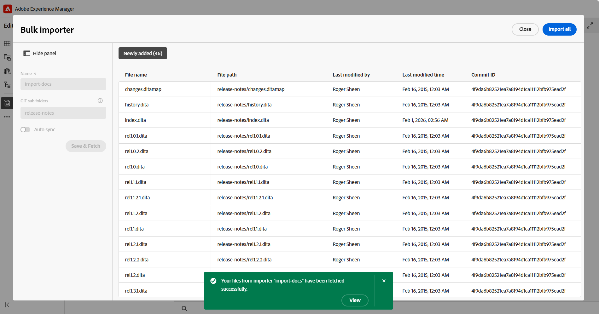
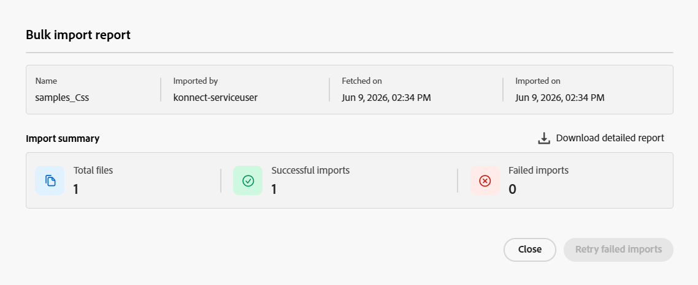
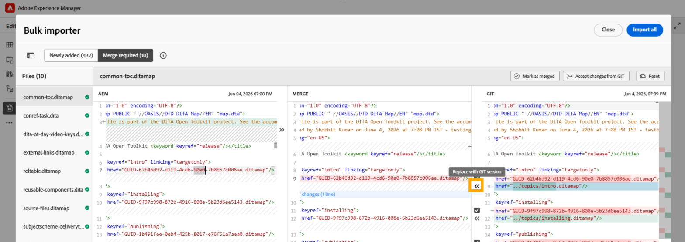

# 使用Git连接器(Beta)导入内容

>[!IMPORTANT]
>
> Git连接器当前作为Beta功能提供，默认情况下处于禁用状态。 要启用此功能，请联系客户成功团队。

Git Connector允许您将内容从连接的Git存储库导入Experience Manager Guides。 导入内容后，您可以使用Experience Manager Guides创作、审阅、翻译和发布功能来开发和交付文档。

当源存储库中的内容发生更改时，您可以重新获取更新、查看冲突并与Experience Manager Guides同步最新更改。

## 先决条件

在开始使用此功能之前，请确保：

- 必须为环境启用Git连接器功能。
- （*如果启用*）管理员已在您的环境中配置了Git连接器。 有关详细信息，请通过用户界面](../install-conf-guide/conf-git-connector.md)查看[创建和配置Git连接器。
- 您对包含要导入的内容的Git存储库具有&#x200B;*读取*&#x200B;访问权限。
- 您知道要导入哪个存储库分支和源文件夹。
- 您知道Experience Manager Guides中将存储导入内容的目标文件夹。

## 从连接的Git存储库导入内容

管理员配置Git Connector后，您可以从编辑器中使用它来开始从Git存储库导入内容。  执行以下步骤可从Git存储库导入内容：

1. 在编辑器中，打开左侧面板。
1. 选择&#x200B;**数据源**。

   将显示连接的数据源。

1. 选择&#x200B;**Git Connector**&#x200B;磁贴。

1. 选择+图标，然后选择&#x200B;**批量导入程序**。

   显示&#x200B;**批量导入程序**&#x200B;对话框。

   

1. 在&#x200B;**批量导入程序**&#x200B;对话框中，提供导入的名称，从配置的Git存储库中选择一个子文件夹，然后选择&#x200B;**保存并提取**。  可导入的文件列表显示在对话框中。 在继续之前，请查看列表并验证内容。

   

1. 查看文件后，选择&#x200B;**全部导入**&#x200B;以将内容导入Experience Manager Guides。

   >[!NOTE]
   >
   > 您可以启用&#x200B;**自动同步**&#x200B;以自动同步内容并将内容从Git存储库导入到Experience Manager Guides中。 如果检测到任何错误，则不会触发自动同步，作者必须通过选择&#x200B;**全部导入**&#x200B;来手动导入内容。 启用后，无法为导入程序禁用自动同步。

导入内容后，在设置Git Connector时，该内容存储在配置的&#x200B;**Target AEM根路径**&#x200B;下。

## 管理Git导入的内容

将内容导入Experience Manager Guides后，您可以使用可用的操作来管理内容并将其与源存储库中的更改保持同步。

{width="600"}

- **预览**：预览导入的内容。 如果源存储库包含更新，请查看差异，并使用&#x200B;**Refetch**&#x200B;选项导入最新更改。
- **删除**：删除不再需要的导入内容。
- **重命名**：重命名导入的内容以便于识别。
- **查看日志**：查看导入日志以查看导入操作的详细信息。
- **查看报告**：查看并下载&#x200B;**批量导入报告**，其中包括详细信息，例如：

   - 导入的文件总数
   - 成功导入的次数
   - 失败的导入数

  {width="600"}

  您还可以下载详细报告。 如果某些文件无法导入，请使用&#x200B;**重试失败的导入**&#x200B;以尝试再次导入它们。

## 查看并解决内容冲突

从Git存储库重新获取内容时，存储库版本与Experience Manager Guides中可用的相应内容之间的内容差异显示为冲突。 将数据导入Experience Manager Guides之前，必须解决并合并此类冲突。

执行以下步骤以解决和合并冲突：

1. 打开批量导入程序对话框，然后选择&#x200B;**重新获取**。
1. 如果检测到冲突，**需要合并**&#x200B;选项卡会出现，并列出包含冲突的文件。 选择&#x200B;**需要合并**&#x200B;选项卡，然后从列表中选择文件以查看和解决冲突。
1. 请在以下部分中查看内容：

   {width="600"}

   - 在&#x200B;**AEM**&#x200B;部分中，显示Experience Manager Guides中内容的当前版本。
   - 在&#x200B;**Git**&#x200B;部分中，将显示存储库中内容的最新版本。
   - 在&#x200B;**合并**&#x200B;部分中，将显示合并的内容。

1. 查看编辑器中突出显示的差异，并使用合并控件解决冲突：

   - 如果要使用Git存储库中的最新更改，请确保选中&#x200B;**Git**&#x200B;分区中冲突的复选框，然后选择相应的`<<<`控件。 选定的Git内容替换了&#x200B;**合并**&#x200B;分区中的冲突内容。

     {width="600"}

   - 如果要保留两个版本中的内容，请清除该冲突的复选框，然后使用`<<<`控件将所需内容添加到&#x200B;**合并**&#x200B;部分而不替换现有内容。

     {width="600"}

   - 同样，您可以使用AEM部分中的`>>>`控件以保持Experience Manager Guides中的当前版本可用。

     {width="600"}

1. 查看合并内容后，请执行下列操作之一：

   - 当存储库版本应替换冲突内容时，使用&#x200B;**接受来自Git**&#x200B;的更改。
   - 在审阅和更新合并版本后使用&#x200B;**标记为已合并**&#x200B;以确保它包含要保留的内容。
   - 使用&#x200B;**重置**&#x200B;放弃所有合并的更新并将内容恢复到其原始状态。

将包含冲突的所有文件标记为合并后，将启用&#x200B;**全部导入**&#x200B;按钮。 选择&#x200B;**全部导入**&#x200B;以完成解决冲突的过程。

如果存储库包含全新的内容，例如与现有内容不冲突的新主题、段落或行，则它会显示在&#x200B;**清除更新**&#x200B;下。 这些更新不需要冲突解决，可以直接导入。

{width="600"}

